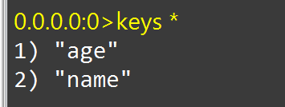

# 字符串

## 值的分类

依据字符串格式不同分为三类

-   string
    -   字符串(string) 作为值记得加单引号
-   int 可以自增自减
-   float 可以自增自减

都是用字节数组存的

## 基本指令与操作

### 基本增删改查

#### 设置键值对

```bash
set 键 值
```

#### 据键获取值

```bash
get 键名
```

#### 获取键

```bash
 keys 模板		## 知道符合模板的key
```



-   由于Radis是单线程,肯定阻塞啊,**不建议在生产中使用这种查法**

### 批量增删改查

#### 批量插入

```
mset k1 v1 k2 v2 ...............
```

-   返回OK

#### 批量获取

```
mget key1 k2 k3
```

### 自增自减

#### 对于整形

```bash
incr 整型值的key
```

-   返回结果,自增1

-   让一个整型值的key自增并指定步长

```bash
incrby 整型值的key 步长
```

-   也可以用这个指令实现自减,使用负数的步数

```bash
incrby 整型值的key -步长
```

-   虽然但是,有一个专门用来自减的指令(自减1)

    ```bash
    decr 整型值的key
    ```

-   当然也有

    ```bash
    decrby 整型值的key 步长
    ```

#### 对于浮点型

```bash
incrbyfloat 整型值的key -步长
```

-   步长可以为浮点数了
-   浮点数没有默认增长,必须指定步长
-   没有decr


-   产生问题:
    -   数据类型转换
        -   integer 转float可,float转integer ERR
    -   参数

### nx与ex

添加一个String类型的键值对,**前提是这个值不存在**,否则不执行(set 还有改变值的作用)

```bash
setnx 键 值
set 键 值 nx
```

指定有效期

```bash
setex 键 有效期 值 
set 键 值 ex 有效期
```

-   nx/ex是个参数,上下两种是等价的

