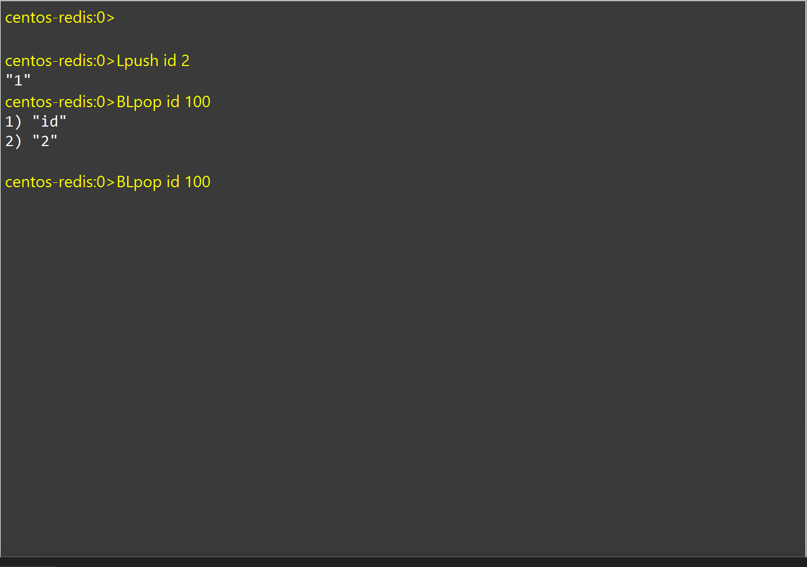

# List类型

## 介绍

大概是一个双向链表

-   **有序**
-   元素可重复
-   插入删除快
-   查询速度一般

## 指令

### 插入

key表右侧插入一个值element

```bash
RPush List element 
```

```bash
0.0.0.0:0>Rpush id 12
"1"
0.0.0.0:0>Rpush id 13
"2"
0.0.0.0:0>Rpush id 14
"3"
0.0.0.0:0>Rpush id 15
"4"
0.0.0.0:0>Rpush id 16
"5"
0.0.0.0:0>Rpush id 17
"6"
```

key表左侧插入一个值element

```bash
LPush List element
```

```bash
0.0.0.0:0>Lpush id 11
"7"
0.0.0.0:0>Lpush id 10
"8"
0.0.0.0:0>Lpush id 9
"9"
0.0.0.0:0>Lpush id 8
"10"
```

-   批量加入元素

```bash
0.0.0.0:0>Lpush id 1 2 3 4 5 6 7 8 9 0
"20"
```

### 删除

从右**移出**key表的一个元素, 没有则返回null

```bash
Rpop List 
```

```bash
0.0.0.0:0>Rpop id
"19"
```

从左**移出**key表的一个元素, 有则返回被删除的数,没有则返回null

```bash
Lpop List
```

```bash
0.0.0.0:0>Lpop id
"18"
0.0.0.0:0>Lpop id
"17"
0.0.0.0:0>Lpop id
"16"
```

指定个数删除

```bash
centos-redis:0>Rpop id 2
1) "1"
2) "2"
```

### 切片

```bash
LRange List startNum endNum
```

L是List的缩写,所以没有RRange

```bash
centos-redis:0>lRange id 0 2
1) "0"
2) "1"
3) "2"

centos-redis:0>lRange id 1 2
1) "1"
2) "2"
```

-   **是从0开始的 !**
-   左闭右闭合

```bash
centos-redis:0>LRANGE id -1 -3

centos-redis:0>LRANGE id -3 -1
1) "8"
2) "9"
3) "10"
```

-   支持负数, -1表示最后一个

```bash
centos-redis:0>LRANGE id 0 10 2
"ERR wrong number of arguments for 'lrange' command"
```

-   不支持指定步长

```bash
centos-redis:0>Lrange id 2 -1
1) "2"
2) "3"
3) "4"
4) "5"
5) "6"
6) "7"
7) "8"
8) "9"
9) "10"
```

是把负数转换成整数后再切片的解释或许比较合理

### 阻塞删除

```bash
Blpop List time
```

time单位s

在客户端A一使用

```bash
BLpop id 100
```

一般情况下没问题

```bash
centos-redis:0>BLpop id 100
1) "id"
2) "2"
```

如果id被删完了, 就会阻塞, 停在哪里了,卡死了



然后再一个客户端B

使用

```bash
LPush id 10
```

客户端A释放

```bash
centos-redis:0>BLpop id 100
1) "id"
2) "10"
```

## 用List做一个阻塞队列

-   出入口不在同一边
-   出队时用BLPOP和RLPop

