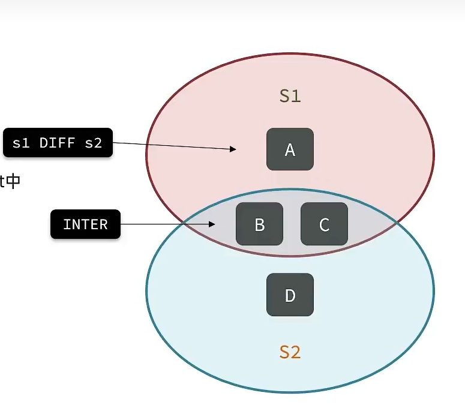

#Set

##介绍

-   无序(Hash)
-   元素不重复
-   查找快
-   支持交集并集差集


## 操作

###增

```bash
Sadd Set member
```

```bash
0.0.0.0:0>sAdd Set1 a b c
"3"
```


### 移除

```bash
SRem Set member
```

```bash
0.0.0.0:0>sRem Set1 a
"1"
```


### 获取

$$
集合A\\
集合个数 = CARD(A)
$$

```bash
SCARD Set 
```

返回set中元素个数


```bash
sMember Set
```

查看元素


```bash
SisMember Set member
```

判断一个成员是否存在于set中


```
0.0.0.0:0>sMembers Set1
1) "c"
2) "b"
3) "a"
0.0.0.0:0>sIsMember Set1 a
"0"
0.0.0.0:0>sCard Set1
"2"
```


## 集合关系




### 交

```bash
sInter Set1 Set2
```


###并

```bash
sUnion Set1 Set2
```


###差


```bash
sDiff Set1 Set2
```

