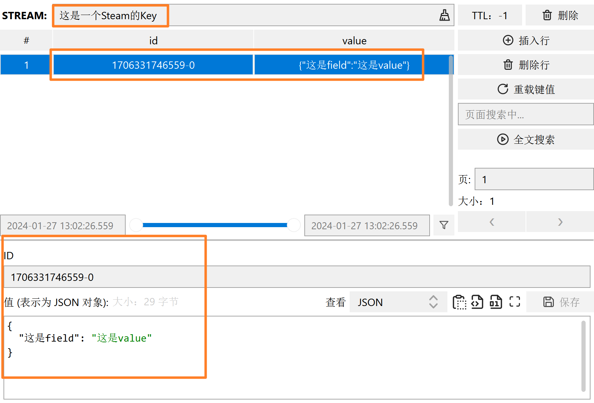
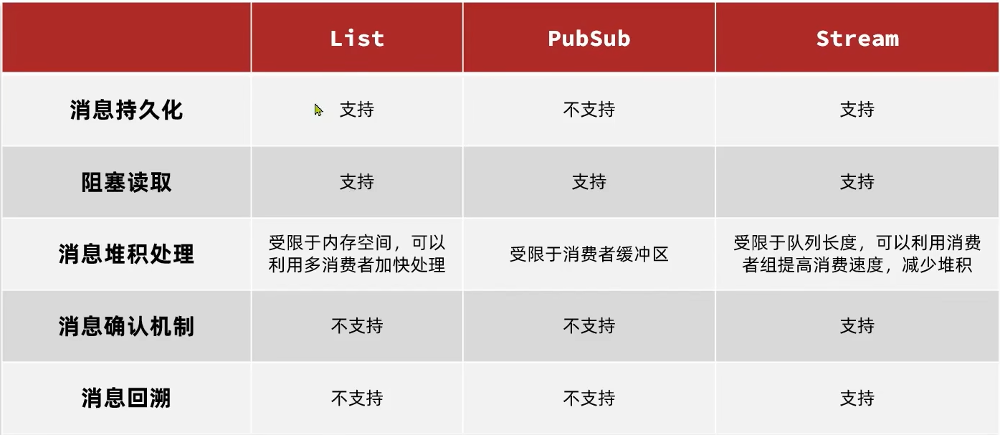

# Stream

## Redis的三种消息队列模型

-   List结构
    -   基于List结构模拟消息队列模型
-   RubSub
    -   发布订阅模型, 基本的点对点消息模型
-   Stream
    -   比较完善的消息队列模型

### List模拟阻塞队列

#### 命令

从左增

```bash
lPush 列表key 元素
```

从右阻塞式取

```bash
bRPop 列表key 阻塞时间
```

#### 实现

```bash
redis(pc2):1>brpop list 10
1) "list"
2) "e1"

redis(pc2):1>brpop list 10
1) "list"
2) "e2"
```


```bash
redis(pc2):1>lpush list e1
"1"
redis(pc2):1>lpush list e2
"1"
```

#### 特点

-   优点
    -   独立于JVM,不依赖于JVM内存, 不用担心存储上限
    -   数据安全, Redis支持数据持久化
    -   满足消息的有序性
-   缺点
    -   无法避免消息丢失. `brpop`是`remove & get`在remove之后宕机, 还没get就会有消息丢失
    -   只支持单消费者

### PubSub发布订阅模式

>   Publish & Subscribe

-   一个消费者可以订阅一个或多个channel(频道)
-   所有订阅者都能接收到订阅的channel的相关消息
-   天生就是阻塞式的

#### 命令

订阅一个或多个频道

```bash
Subscribe 频道 [多个频道...] 
```

向一个频道发送消息

```bash
Publish 频道 消息体
```

订阅于pattern格式匹配的所有频道

```bash
pSubscribe pattern [多个pattern]
```

pattern标识统配符

Redis支持的通配符有

-   `?` : 
    -   标识一个
    -   `h?llo` subscribes to `hello`, `hallo` and `hxllo`
-   `*` : 
    -   标识0个或多个
    -   `h*llo` subscribes to `hllo` and `heeeello`
-   `[]`: 
    -   表示可选项
    -   `h[ae]llo` subscribes to `hello` and `hallo,` but not `hillo`

-   闲的, 测试Pattern

    ```bash
    redis(pc2):1>keys *St*m*
    1) "这是一个Steam的Key"
    
    redis(pc2):1>keys *Ste?m*
    1) "这是一个Steam的Key"
    
    redis(pc2):1>keys *Ste[ae]m*
    1) "这是一个Steam的Key"
    
    redis(pc2):1>keys *Ste[o]m*
    
    redis(pc2):1>keys *Ste[oa]m*
    1) "这是一个Steam的Key"
    
    redis(pc2):1>keys *Ste[oa]m*
    1) "这是一个Steam的Key"
    
    redis(pc2):1>keys *Ste[oa]m*
    1) "这是一个Steam的Key"
    
    redis(pc2):1>keys *St[a-f]am*
    1) "这是一个Steam的Key"
    
    redis(pc2):1>keys *St[a-c,d-f]am*
    1) "这是一个Steam的Key"
    
    redis(pc2):1>keys *St[a-c,d-f]am*
    1) "这是一个Steam的Key"
    
    redis(pc2):1>keys *St[a-c,d-f]am*
    1) "这是一个Steam的Key"
    
    ```

    这支持的...应该是正则吧?

#### 实现

1.  订阅消息

    ```bash
    redis(pc2):1>subscribe order.q1 
    切换到推送/订阅模式，关闭标签页来停止接收信息。
    1) "subscribe"
    2) "order.q1"
    3) "1"
    ```

    ```bash
    redis(pc2):1>psubscribe order.*
    切换到推送/订阅模式，关闭标签页来停止接收信息。
    1) "psubscribe"
    2) "order.*"
    3) "1"
    ```

2.  发送消息

    ```bash
    redis(pc2):1>publish order.q1 "It's a message"
    "1"
    ```

3.  接收消息

    ```bash
    redis(pc2):1>subscribe order.q1 
    ...
    
    1) "message"
    2) "order.q1"
    3) "It's a message"
    ```

    

    ```bash
    redis(pc2):1>psubscribe order.*
    ...
    
    1) "pmessage"
    2) "order.*"
    3) "order.q1"
    4) "It's a message"
    
    ```

4.  接收patter channal的消息

    ```bash
    redis(pc2):1>publish order.q2 "It's a message to q2"
    "1"  # 返回接收到消息的订阅者的数量
    ```

    ```bash
    redis(pc2):1>psubscribe order.*
    ...
    
    1) "pmessage"
    2) "order.*"
    3) "order.q1"
    4) "It's a message"
    ```

    

#### 特点

-   优点

    -   支持多生产, 多消费

-   缺点

    -   不支持数据持久化

        生产者不保存数据, 没有消费者消费消息, 消息将被丢失

    -   无法避免消息丢失

    -   消息堆积有上限, 超出时数据丢失

        消费者处理消息如果超时, 下一条消息纷至沓来, 超出上限就会丢失

## 数据类型Stream

-   与`PubSub`**模式**不同, 是数据类型, 支持持久化
-   功能肥肠的完善

## 命令

### xAdd增

```bash
xadd 键 [NoMkStream] [MaxLen|MinId [=|~] threshold [Limit 数量]] 
	*|ID field value [field value ...]
```

-   `[NoMkStream] `可选,一般不用
    -   当Stream还未创建时, 不创建该Stream
    -   缺省时是会创建的
-   `[MaxLen|MinId [=|~] 阈值 [Limit 数量]]`可选, 一般不用
    -   `threshold` 阈值
    -   `Limit`表示上限. 可以不指定
-   `*|ID`
    -   消息的唯一标识, 用于查询
    -   `*`表示系统帮你创建一个ID, 由时间戳(ms)和瞬间产生的ID的序号组成
    -   要么自己决定ID是多少
    -   一般选择让系统生成

```bash
redis(pc2):1>xadd 这是一个Steam的Key  * 这是field 这是value
"1706331746559-0" # 返回ID
```



还拼错了😅

```bash
redis(pc2):1>xadd 这是一个Steam的Key 1706332759493-0 这是field 这是value3
"ERR The ID specified in XADD is equal or smaller than the target stream top item"
```


### xRead读

```bash
xRead [Count count] [Block milliseconds] Straems key1 [key2 ...] ID1 [ID2 ...]
```

-   `count`读取消息的数量
-   `millioseconds`阻塞的时常
-   `key` Stream 的Key
-   `ID`从ID为哪个的消息开始读
    -   `0`表示从第一个消息开始读
    -   `$`表示读取最新消息

```bash
redis(pc2):1>xread Count -1 Streams 这是一个Steam的Key 0
1) 1) "这是一个Steam的Key"
   2) 1) 1) "1706331746559-0"
         2) 1) "这是field"
            2) "这是value"


      2) 1) "1706332759493-0"
         2) 1) "这是field"
            2) "这是value2"


redis(pc2):1>xread Count 1 Streams 这是一个Steam的Key 0
1) 1) "这是一个Steam的Key"
   2) 1) 1) "1706331746559-0"
         2) 1) "这是field"
            2) "这是value"


redis(pc2):1>xread Count 2 Streams 这是一个Steam的Key 0
1) 1) "这是一个Steam的Key"
   2) 1) 1) "1706331746559-0"
         2) 1) "这是field"
            2) "这是value"


      2) 1) "1706332759493-0"
         2) 1) "这是field"
            2) "这是value2"


```


```bash
redis(pc2):1>xread block 10000 Streams 这是一个Steam的Key $ # 不阻塞不返回
1) 1) "这是一个Steam的Key"
   2) 1) 1) "1706333411065-0"
         2) 1) "这是field2"
            2) "这是value4"
```

```bash
redis(pc2):1>xadd 这是一个Steam的Key * 这是field2 这是value4
"1706333411065-0"
```

-   当起始ID为$时, 如果处理一条消息的过程中咔咔来了**很多消息**, 那么下次也只能拿到很多消息中最新的那条. 可能会出现**漏读消息**的情况

#### 特点

-   消息可回溯, 读过的消息不会丢失
-   一个消息可以被多个消费者读取
-   可以被阻塞读取
-   由消息漏读的风险

## Consumer Group消费者组

>将消息划分到一个组中, 监听同一个队列

### 特点

-   消息分流
    -   队列中的消息会分流给**组内的不同消费者**, 而不是重复消费, 从而加快消息处理的速度
    -   若想到一个消息被多次消费, 可以使用多个消费者组
-   消息标示
    -   确保每一个消息都会被消费
    -   消费者组会维护一个**标示**, 记录**最后一个被处理的消息**(区别最新消息)
    -   哪怕消费者宕机重启, 还会从标示之后读取消息
-   消息确认
    -   确保消息不会被丢失
    -   消费者获取消息后, 消息存储与`pending` (待处理) 状态, 并存入`pending-list`
    -   当处理完成后需要通过`XACK`来确认消息, 标记消息为已处理, 才会从`pending-list`移除

### 消费者写命令

#### 创建消费者组

```bash
XGroup Create StreamKey groupName Id [MkStream]
```

-   `StreamKey` 监听的Stream名称

-   `groupName` 消费者组名称

-   `Id` 起始ID标识, 

    -   $标识队列中最后一个消息(只消费最新的消息), 
    -   0表示队列中第一个消息(已经存在的消息也需要被消费)

-   `MkSream` Stream不存在时自动创建Stream

    缺省的情况:

    ```bash
    "ERR The XGROUP subcommand requires the key to exist. Note that for CREATE you may want to use the MKSTREAM option to create an empty stream automatically."
    ```


```bash
redis(pc2):1>XGroup Create 这是一个Steam的Key  myGroup 0
"OK"
```


#### 其他消费者和消费者组的写命令

```bash
# 删除指定消费者组
XGroup Destory streamKey  groupName 
# 给指定的消费者组添加消费者
XGroup CreateConsumer streamKey  groupName consumerName
# 删除消费者组中的指定消费者
XGroup DelConsumer streamKey  groupName consumerName
```

### 消费者读命令

```bash
XReadGroup Group groupName consumerName [Count count] [Block milliseconds] [NoACK] Streams streamKey1 [streamKey2...] ID1 [ID2 ...]
```

-   `groupName`消费组名称

-   `consumer`消费者名称, 消费者不存在就会自动创建

-   `count` 本次查询的最大数量

-   `[Block milliseconds]`阻塞时间, 缺省即为非阻塞

-   `[NoACK]` 缺省即为提交确认**"已成功消费消息"**,

    -   `NoAck`表示不用消费者确认, 消息投递给消费者会自动确认, 根本不会进入`pending-list`, 可能引发消息丢失

-   `ID`,起始ID,可选:

    -   `>` : 读取Stream中尚未被消费的消息

        从下一个未消费的消息开始, 确保所有的消息都会被消费

    -   否则, 其意义都将为 **从pending-list中获取以消费单未确认的消息**

        `0`: pending-list第一给消息

        `$`: pending-list最新消息

#### 使用测试

```bash
redis(pc2):1>XGroup Create 这是一个Steam的Key  myGroup 0
"OK"
redis(pc2):1>XReadGroup Group myGroup c1 Count 1 Block 99000 Streams 这是一个Steam的Key >
1) 1) "这是一个Steam的Key"
   2) 1) 1) "1706331746559-0"
         2) 1) "这是field"
            2) "这是value"


redis(pc2):1>XReadGroup Group myGroup c1 Count 1 Block 99000 Streams 这是一个Steam的Key >
1) 1) "这是一个Steam的Key"
   2) 1) 1) "1706332759493-0"
         2) 1) "这是field"
            2) "这是value2"


redis(pc2):1>
```

使用`NoACK`+`>`就会重复读一条消息

```bash
redis(pc2):1>XReadGroup Group myGroup c1 Count 1 Block 99000 NoACK Streams 这是一个Steam的Key >
1) 1) "这是一个Steam的Key"
   2) 1) 1) "1706333361568-0"
         2) 1) "这是field2"
            2) "这是value4"


redis(pc2):1>XReadGroup Group myGroup c1 Count 1 Block 99000 NoACK Streams 这是一个Steam的Key >
1) 1) "这是一个Steam的Key"
   2) 1) 1) "1706333411065-0"
         2) 1) "这是field2"
            2) "这是value4"


```

### 查看pending-list

```bash
XPending streamKey groupName [[Idle minIdleTime] startId endId count [consumer]]
```

-   `Idle minIdleTime` 空闲时间, `Idle 5000` 获取空闲时间超过5s的消息
-   `startId endId`
    -   `-`表示最小的
    -   `+`表示最大的

```bash
XPending 这是一个Steam的Key myGroup - + 100
```

-   获取Pending-list里所有的(范围内100个)消息

```bash
redis(pc2):1>Xadd 这是一个Steam的Key * field10 value9
"1706339962583-0"
redis(pc2):1>XReadGroup Group myGroup c1 Count 100 Streams 这是一个Steam的Key >
1) 1) "这是一个Steam的Key"
   2) 1) 1) "1706339962583-0"
         2) 1) "field10"
            2) "value9"


redis(pc2):1>XPending 这是一个Steam的Key myGroup - + 100
1) 1) "1706339962583-0"
   2) "c1"
   3) "6321"
   4) "1"


redis(pc2):1>XReadGroup Group myGroup c1 Count 100 Streams 这是一个Steam的Key 0
1) 1) "这是一个Steam的Key"
   2) 1) 1) "1706339962583-0" # 和Pending-list读出来的是同一条
         2) 1) "field10"
            2) "value9"


redis(pc2):1>
```


### 确认消息

消费一次, 确认一次

```bash
XAck streamKey groupName ID [ID....]
```

这里`ID`不再支持`>`,`0`,`$`

正常的

```bash
redis(pc2):1>XReadGroup Group myGroup c1 Count 1 Block 99000 Streams 这是一个Steam的Key >
1) 1) "这是一个Steam的Key"
   2) 1) 1) "1706332759493-0"
         2) 1) "这是field"
            2) "这是value2"


redis(pc2):1>XAck 这是一个Steam的Key myGroup 1706332759493-0
"1"
```


NoAck的

```bash
redis(pc2):1>XReadGroup Group myGroup c1 Count 1 Block 99000 NoACK Streams 这是一个Steam的Key >
1) 1) "这是一个Steam的Key"
   2) 1) 1) "1706333411065-0"
         2) 1) "这是field2"
            2) "这是value4"


redis(pc2):1>XAck 这是一个Steam的Key myGroup 1706333411065-0
"0"
```


消费

```bash
redis(pc2):1>XAck 这是一个Steam的Key myGroup 1706339962583-0
"1"
redis(pc2):1>XPending 这是一个Steam的Key myGroup - + 100

redis(pc2):1>XReadGroup Group myGroup c1 Count 100 Streams 这是一个Steam的Key 0
1) 1) "这是一个Steam的Key"
   2) null


```

## Java客户端

### 获取消息伪代码分析

```java
while(true){
    Object msg = redis.excute("XReadGroup Group g c Count 1 Block 2000 Streams s >");
    // 使用>,取得没有被消费的消息
    if(msg == null){
        // 阻塞两秒之后还是没有消息, 继续阻塞
        continue;
    }
    try{
        handleMsg(msg);// 处理消息
        Ack(msg);// 一定要ACK消息
    } catch(Exception e){
        // 产生异常, 消息没有被ACK
        while(true){
            // 处理未被确认消息的循环
            Object msg = redis.excute("XReadGroup Group g c Count 1 Block 2000 Streams s 0");
            // 使用0, 取得没有被确认的消息
            if(msg == null){
                // 没有未确认的消息,说明所有消息都被确认,可以跳出循环 
                break;
            }
            try{
                handleMsg(msg);// 处理未确认的消息
                Ack(msg);// 再次尝试ACK消息
            } catch(Exception e){
                // 产生异常, 消息再次没有被ACK
				// 记录日志
                continue;// 再次循环尝试ACK消息, 直到消息全部被ACK为止,否则一直记日志,等待人工的介入
            }
        }
    }
}
```

## 基于Group的Stream特点

-   独立有JVM之外, 不受JVM内存的限制
-   消息可回溯,消息被确认后不会被删除,**不同组的消费者**也可以获取
-   同一组的消费者可以多消费者地争抢消息, 加快消费速度
-   支持阻塞式读取,减少CPU负担
-   没有消息漏读的风险, 会标记上一次的消费记录
-   有消息确认机制, 保证消息至少被消费一次

### Redis消息队列



是否支持多消费者, 多生产者? 


-   Redis只支持消费者的确认机制,不能保证生产者在发消息的过程中丢失消息
-   缺少消息的事务机制
-   在多消费者下的消息有序性

