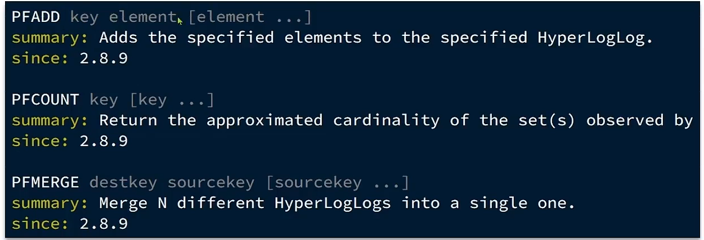

# HyperLogLog

## UV和PV

-   `UV`
    -   `Unique Visitor`
    -   独立访客量
    -   通过互联网访问,浏览这个网站的自然人
    -   一天内, 同一个用户多次访问该网站,只记录一次
-   `PV`
    -   `Page View`
    -   页面访问量或点击量
    -   用户内访问网站的一个页面, 记录一次PV; 用户多次打开页面, 则记录多次PV
    -   往往用来衡量网站的流量

## HyperLogLog算法

- 从LogLog算法派生的概率算法, 用于确定非常大的集合的基数
- 不需要存储其所有值
- 存在0.81%的误差
- Redis的HyperLogLog基于string

## 命令



### PfAdd

```bash
redis(pc2):0>pfAdd logLogKey 1
"1"
redis(pc2):0>pfAdd logLogKey 2
"1"
redis(pc2):0>pfAdd logLogKey a
"1"
redis(pc2):0>pfAdd logLogKey 1
"0"
redis(pc2):0>pfAdd logLogKey 2
"0"
redis(pc2):0>pfAdd logLogKey a
"0"
redis(pc2):0>pfAdd logLogKey dad
"1"
redis(pc2):0>pfAdd logLogKey dafaasd
"1"
redis(pc2):0>pfAdd logLogKey dafa
"1"
```

### PfCount

```bash
redis(pc2):0>pfCount logLogKey
"6"
```

-   误差马上就出现了

    ```bash
    redis(pc2):0>pfAdd logLogKey 1
    "1"
    redis(pc2):0>pfAdd logLogKey 2
    "1"
    redis(pc2):0>pfAdd logLogKey a
    "1"
    redis(pc2):0>pfAdd logLogKey dad
    "1"
    redis(pc2):0>pfAdd logLogKey dafaasd
    "1"
    redis(pc2):0>pfAdd logLogKey dafa
    "1"
    redis(pc2):0>pfCount logLogKey
    "6"
    redis(pc2):0>pfAdd logLogKey 你好吖
    "1"
    redis(pc2):0>pfAdd logLogKey 你好呀
    "1"
    redis(pc2):0>pfAdd logLogKey 你好爱神的箭
    "1"
    redis(pc2):0>pfAdd logLogKey 你好爱神地箭
    "1"
    redis(pc2):0>pfCount logLogKey
    "11"
    ```

    10条记录, 确返回了11条

-   ```java
    public void logLog(){
        String key = "logLog";
        for (int i = 0; i < 20; i++) {
            String[] uuids = new String[1000];
            for (int j = 0; j < 1000; j++) {
                uuids[j] = UUID.randomUUID().toString();
            }
            stringRedisTemplate.opsForHyperLogLog().add(key,uuids);
        }
        System.out.println(stringRedisTemplate.opsForHyperLogLog().size(key));
        // 20013
    }
    ```

    

-   初步判断为: 不擅长中文

    而且很奇妙的是, count只会偏大....==多次测试后发现不是只会偏大==

### PfMerge

-   合并key1和key2和...

