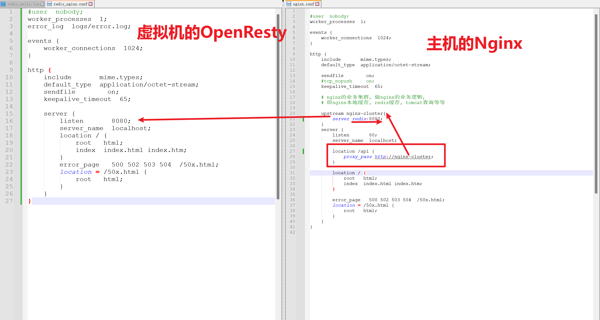
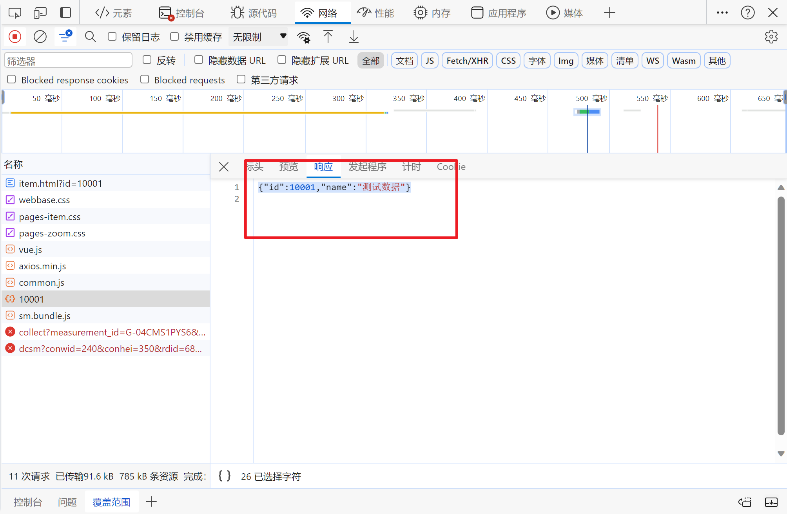
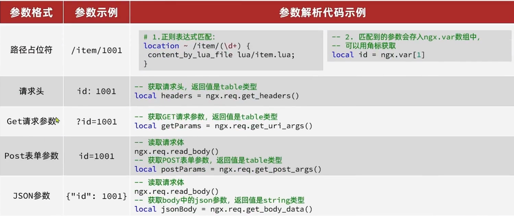
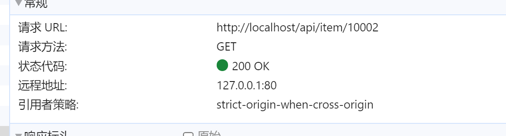

# OpenResty

>   基于Nginx的组件,高性能的Web平台, 开源

-   具备Nginx的完整功能
-   基于LUa语言进行拓展, 继承大量精良的Lua库, 第三方模块
-   允许使用Lua自定义业务逻辑, 自定义库
-   [官方](https://openresty.org/cn/)

## 下载安装

[帮助文档](安装OpenResty.md)

## 接收请求



1.  接收请求

2.  用lua拓展完成业务逻辑

    1.  在`nginx.conf`的`http`下, 添加对OpenResty的Lua模块加载

        ```nginx
        # 加载lua 模块
        lua_package_path "/usr/local/openresty/lualib/?.lua;;";
        # 加载c模块     
        lua_package_cpath "/usr/local/openresty/lualib/?.so;;";  
        ```

    2.  OpenResty`nginx.conf`的`server`下, 需要添加对`/api/item`的监听

        ```nginx
        location /api/item{
        	# 响应数据,这里返回json
        	default_type application/json;
        	# 使用lua/item.lua这个文件来处理业务逻辑
        	content_by_lua_file lua/item.lua;
        }
        ```

    3.  写lua文件

## Lua完成业务逻辑

### 创建Lua文件

```shell
mkdir /usr/local/openresty/nginx/lua
touch /usr/local/openresty/nginx/lua/item.lua
```

### 返回假数据测试

```lua
-- 返回假数据
ngx.say('{"id":10001,"name":"SALSA AIR"}')
-- ngx.say()就是写数据到Response中
```



## 获取请求参数

### 获取不同形式的参数



-   正则表达式匹配, `()`表示分组, 一个`()`内是一个正则表达式

### 分析案例




### 编写OpenResty配置

```nginx
location ~ /api/item/(\d+){
	default_type application/json;
	content_by_lua_file lua/item.lua;
}
```
### Lua接收数据

```lua
local id = ngx.var[1]
local respBody = '{"id":'..id..',"name":"测试数据"}'
-- 返回假数据
ngx.say(respBody)
-- ngx.say()就是写数据到Response中
```

## 向Tomcat发起请求

### 向Tomcat发起请求

```lua
local resp = ngx.location.capture(
    -- 请求路径,不包含IP和端口, 将被Nginx自己捕获(需要Nginx对这个路径再做反向代理)
    "/path",
    {
        method = ngx.HTTP_GET, --请求方式
        args = {a=1,b=2}, -- get方式传递的参数
        body = "c=3&d=4" -- POST方式传递参数,不要和args同时出现
})
```

响应内容`resp`包括:

-   `resp.status`: 响应状态码
-   `resp.header`:响应头
-   `resp.body`: 响应体, 就是响应数据

### 将http查询封装成函数

-   创建文件

    ```shell
    touch /usr/local/openresty/lualib/xxx.lua
    ```

-   函数逻辑

    ```lua
    -- 封装函数，发送http请求，并解析响应
    local function read_http(path, params)
        -- 没鸟用
        local resp = ngx.location.capture(path,{
            method = ngx.HTTP_GET,
            args = params,
        })
        -- 有用
        if not resp then
            -- 记录错误信息，返回404
            ngx.log(ngx.ERR, "http not found, path: ", path , ", args: ", args)
            ngx.exit(404)
        end
        return resp.body
    end
    -- 将方法封装成table,使其能以`_M.read_http`的类似于面向对象形式使用
    local _M = {  
        read_http = read_http
    }
    -- 返回的是_M
    return _M
    ```

-   导包, 使用工具函数

    ```lua
    local common = require('common') -- 文件名导入文件
    local body = common.read_http(...)
    ```

-   鸟用没有, 还啥默认Get请求, 傻逼

-   没有一个合适的Lua环境, 根本不能写出大项目来

### 从Tomcat获取商品和库存信息

### 组装数据并响应

-   Json字符串与table的转换

    ```lua
    -- 导入依赖
    local cjson = require("cjson")
    ```

    ```lua
    -- 序列化
    local result = {
        msg = "你好",
        code = "200",
        data = nil
    }
    local json = cjson.encode(obj)
    ```

    ```lua
    -- 反序列化
    local json = '{"msg"="找不到页面","code"=404,data=nil}'
    local result = cjson.decode(json)
    ```

-   lua逻辑

    ```lua
    -- 获取请求参数
    local id = ngx.var[1]

    local function read_http(path, params)
        -- 没鸟用
        local resp = ngx.location.capture(path,{
            method = ngx.HTTP_GET,
            args = params,
        })
        -- 有用
        if not resp then
            -- 记录错误信息，返回404
            ngx.log(ngx.ERR, "http not found, path: ", path , ", args: ", args)
            ngx.exit(404)
        end
        return resp.body
    end

    local itemJson = read_http("/item/"..id,nil)
    local itemStockJson = read_http("/item/stock/"..id,nil)

    -- 组装数据
    local cjson = require("cjson")
    local item = cjson.decode(itemJson)
    local itemStock = cjson.decode(itemStockJson)
    item.stock = itemStock.stock
    item.sold = itemStock.sold
    local respBody = cjson.encode(item)

    -- 响应数据
    ngx.say(respBody)
    ```

### Tomcat集群负载均衡

OpenResty需要:

-   对Tomcat进行负载均衡

    ```nginx
    location /item {
        proxy_pass http://tomcat-cluster;
    }
    ```
    在`http`下配置`upstream`

    ```nginx
    # 负载均衡
    upstream tomcat-cluster{
    	server 192.168.1.106:8081;
    	# server 192.168.1.106:8082;
    }
    ```

-   应对Tomcat节点间本地缓存不互通问题

    对请求参数的id进行处理, 使其永远指向同一台节点

    换句话说, 需要**改变Nginx负载均衡算法**, 对请求的**URI**进行区分

    ```nginx
    upstream tomcat-cluster{
    	hash $request_uri;
    	server 192.168.1.106:8081;
    	# server 192.168.1.106:8082;
    }
    ```

## 向Redis发起请求

### 缓存预热

先向Redis发起请求查询数据, 如果没有数据, 再向Tomcat缓存查询数据

-   冷启动

    服务刚启动时, Redis没有缓存, 如果所有的商品数据都在第一次查询时添加缓存, 可能造成数据库压力

-   缓存预热

    利用大数据用统计户访问的热点数据, 在项目启动时将这些热点数据提前查询并保存到Redis中

    ```java
    @Resource
    private StringRedisTemplate stringRedisTemplate;

    @GetMapping("/2redis")
    public void addRedis(){
        List<Item> items = itemService.query().ne("status", 3).list();
        for (Item item : items) {
            ItemStock stock = stockService.getById(item.getId());
            item.setStock(stock.getStock());
            item.setSold(stock.getSold());
            try {
                stringRedisTemplate.opsForValue()
                        .set("item:id:"+item.getId(), 
                             new ObjectMapper().writeValueAsString(item));
            } catch (JsonProcessingException e) {
                e.printStackTrace();
            }
        }
    }
    ```

### 查询Redis缓存

OpenResty提供了操作Redis的模块

```lua
-- 引入redis模块, resty目录下的redis函数库
local redisLib = request("resty.redis")
-- 初始化Redis对象,`:`是Lua的面向对象
local redis = redisLib:new()
-- 设置Redis超时时间
redis:set_timeout(
    1000, -- 建立连接的超时时间
    1000, -- 发送请求的超时时间
    1000  -- 的响应结果的超时时间
)
```

```lua
local function keep_alive(redis)
    local pool_max_idle_time = 10000 -- 连接的空闲时间，单位是毫秒, 10s不用将关闭连接池
    local pool_size = 100 --连接池大小
    local ok, err = redis:set_keepalive(pool_max_idle_time, pool_size) -- 保持连接redis
    -- 实际是放入连接池
    if not ok then
        ngx.log(ngx.ERR, "放入redis连接池失败: ", err)
    end
end
```

读取Redis数据的API：

```lua
-- 查询redis的方法 ip和port是redis地址，key是查询的key
local function read_redis(ip, port, key)
    -- 获取一个连接
    local ok, err = redis:connect(ip, port)
    if not ok then
        ngx.log(ngx.ERR, "连接redis失败 : ", err)
        return nil
    end
    redis:auth(password)
    -- 查询redis
    local resp, err = redis:get(key)
    -- 查询失败处理
    if not resp then
        ngx.log(ngx.ERR, "查询Redis失败: ", err, ", key = " , key)
    end
    --得到的数据为空处理
    if resp == ngx.null then
        resp = nil
        ngx.log(ngx.ERR, "查询Redis数据为空, key = ", key)
    end
    keep_alive(redis)
    return resp
end
```

完整逻辑

```lua
local id = ngx.var[1]

-- 引入redis模块, resty目录下的redis函数库
local redisLib = require("resty.redis")
-- 初始化Redis对象,`:`是Lua的面向对象
local redis = redisLib:new()
-- 设置Redis超时时间
redis:set_timeout(
    1000, -- 建立连接的超时时间
    1000, -- 发送请求的超时时间
    1000  -- 的响应结果的超时时间
)

-- 查询redis的方法 ip和port是redis地址，key是查询的key
local function read_redis(ip, port, password, key, redis)

	-- 获取一个连接
    local ok, err = redis:connect(ip, port)
    if not ok then
        ngx.log(ngx.ERR, "连接redis失败 : ", err)
        return nil
    end
	redis:auth(password)
    -- 查询redis
    local resp, err = redis:get(key)
    -- 查询失败处理
    if not resp then
        ngx.log(ngx.ERR, "查询Redis失败: ", err, ", key = " , key)
    end
    --得到的数据为空处理
    if resp == ngx.null then
        resp = nil

        ngx.log(ngx.ERR, "查询Redis数据为空, key = ", key)
    end
	local function keep_alive(redis)
		local pool_max_idle_time = 10000 -- 连接的空闲时间，单位是毫秒, 10s不用将关闭连接池
		local pool_size = 100 --连接池大小
		local ok, err = redis:set_keepalive(pool_max_idle_time, pool_size) -- 保持连接redis
		-- 实际是放入连接池
		if not ok then
			ngx.log(ngx.ERR, "放入redis连接池失败: ", err)
		end
	end

    keep_alive(redis)

    return resp
end

local resp = read_redis("127.0.0.1",6379,123456,"item:id:"..id,redis)

if(not resp) then
	resp = ""
	local function read_http(path, params)
		-- 没鸟用
		local response = ngx.location.capture(path,{
			method = ngx.HTTP_GET,
			args = params,
		})
		-- 有用
		if not response then
			-- 记录错误信息，返回404
			ngx.log(ngx.ERR, "http not found, path: ", path , ", args: ", args)
			ngx.exit(404)
		end
		return response.body
	end

	local itemJson = read_http("/item/"..id,nil)
	local itemStockJson = read_http("/item/stock/"..id,nil)

	-- 组装数据
	local cjson = require("cjson")
	local item = cjson.decode(itemJson)
	local itemStock = cjson.decode(itemStockJson)
	item.stock = itemStock.stock
	item.sold = itemStock.sold
	resp = cjson.encode(item)
end

-- 响应数据
ngx.say(resp)
```

## 本地缓存

>   OpenResty为Nginx提供了shard dict的功能, 可以在**一个Nginx**的**多个worker**之间共享数据, 实现缓存功能

### 开启共享词典

在`nginx.conf`的`http`下配置：

```nginx
# 共享字典，也就是本地缓存，名称叫做：item_cache，大小150m
lua_shared_dict item_cache 150m; 
```

### 操作共享词典

```lua
-- 获取本地缓存对象
local item_cache = ngx.shared.item_cache
-- 存储, 指定key,value,过期时间,单位s,默认为0表示永不过期
item_cache:set('key','value',1000)
-- 读取
local val = item_cache:get('key')
```

