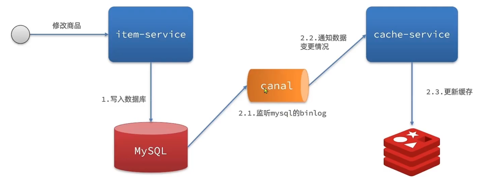
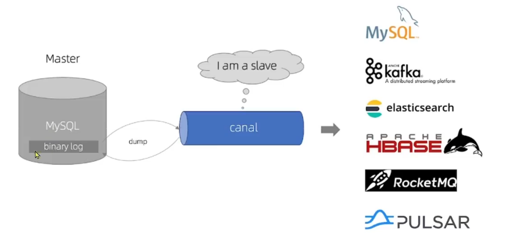

# 缓存同步

## 缓存同步策略

### 设置有效期

>   到期后自动删除, 再次查询时更新

-   优势
    -   简单
    -   方便
-   缺点
    -   失效性差
    -   缓存过期前可能不一致
    -   被动
-   场景
    -   更新频率低, 时效性要求低的业务

### 同步双写

>   在修改数据库的同时, 直接修改缓存

-   优势
    -   时效性强, 
    -   缓存与数据库强一致
-   缺点
    -   代码入侵
    -   耦合度高
-   场景
    -   对一致性, 时效性要求较高的缓存数据

### 异步通知

>   修改数据库时发送时间通知, 相关服务监听到通知后修改缓存数据

-   优点
    -   低耦合
    -   可以同时通知多个缓存服务
-   缺点
    -   时效性一般
    -   可能存在中间不一致的状态
-   场景
    -   时效性要求一般
    -   有多个服务需要同步

## Canel

>   Canel 水道, 管道, 沟渠

监听Mysql, 实现数据同步




Canel是阿里巴巴基于Java开发, 基于数据库**增量日志**解析, 提供增量数据订阅和消费

Canel会伪装成Mysql数据库的Slave节点, 从而监听master的binary log的变化, 再把消息通知给Canel客户端,进而完成对其他数据库的同步




## 安装Canel

[安装Canel](安装Canal.md)


## 使用Canel

### Canal客户端

原生API比较复杂, 使用第三方API`canal-starter`

### 引入依赖

```xml
<dependency>
    <groupId>top.javatool</groupId>
    <artifactId>canal-spring-boot-starter</artifactId>
    <version>1.2.1-RELEASE</version>
</dependency>
```

### 配置

```yaml
canal:
  destination: cache # canal实例名称, 要更canal-server运行时设置的destination一致
  server: redis:11111
```

然后会进行自动装配

```yaml
logging:
  level:
    top.javatool.canal.client: warn
```

可以调增一下日志级别

### 表和实体类的映射

```java
import org.springframework.data.annotation.Id;
import org.springframework.data.annotation.Transient;

@Data
@TableName("tb_item")
public class Item {
    @TableId(type = IdType.AUTO)
    @Id // 区分主键
    private Long id;
    
    // 若驼峰不能识别, 就用@Column注解
    @Column(name = "name")
    private String name;
    
    // 驼峰可以识别
    private Date createTime;

    @TableField(exist = false)
    @Transient
    private Integer sold;
}
```


### 监听Canal

```java
package com.harvey.item.canal;

import ...

/**
 * 监听Canal, 然后做出响应逻辑
 *
 * @author <a href="mailto:harvey.blocks@outlook.com">Harvey Blocks</a>
 * @version 1.0
 * @date 2024-02-19 21:33
 */
@CanalTable("tb_item")
@Component
public class ItemHandler implements EntryHandler<Item> {
    @Override
    public void insert(Item item) {
        // 新增Redis和本地缓存数据
    }

    @Override
    public void update(Item before, Item after) {
        // 更新Redis和本地缓存数据
    }

    @Override
    public void delete(Item item) {
        // 删除Redis和本地缓存数据
    }
}
```


```java
@CanalTable("tb_item")
@Component
public class ItemHandler implements EntryHandler<Item> {
    @Resource
    private StringRedisTemplate stringRedisTemplate;
    @Resource
    private Cache<Long, Item> itemCache;

    @Override
    public void insert(Item item) {
        // 新增Redis和本地缓存数据
        itemCache.put(item.getId(), item);
        try {
            stringRedisTemplate.opsForValue()
                    .set("item:id:" + item.getId(),
                            new ObjectMapper().writeValueAsString(item));
        } catch (JsonProcessingException e) {
            throw new RuntimeException(e);
        }
    }

    @Override
    public void update(Item before, Item after) {
        // 更新Redis和本地缓存数据
        itemCache.put(after.getId(), after);
        try {
            stringRedisTemplate.opsForValue()
                    .set("item:id:" + after.getId(),
                            new ObjectMapper().writeValueAsString(after));
        } catch (JsonProcessingException e) {
            throw new RuntimeException(e);
        }
    }

    @Override
    public void delete(Item item) {
        // 删除Redis和本地缓存数据
        itemCache.invalidate(item.getId());
        stringRedisTemplate.delete("item:id:" + item.getId());
    }
}
```

