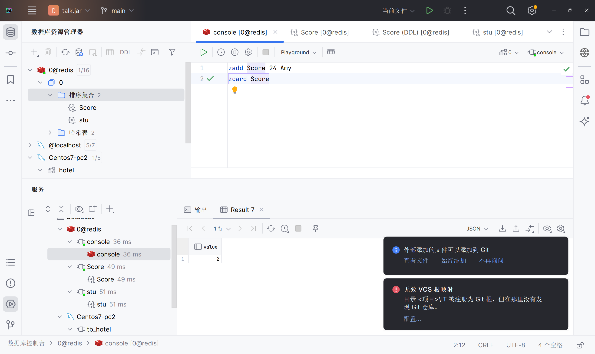

# Redis

-   字典,无序的知道吧

## 特性

-   键值型,value支持多种不同的数据结构
-   多线程,命令具备原子性
-   低延迟速度快,基于内存
-   **单线程**
-   支持数据持久化
-   支持主从集群,分片集群
-   支持多语言客户端

```mysql
mount  -t  vboxsf  VBshare  /mnt
```

-   看不懂上面这句话干嘛用的


设置下IP 0.0.0.0

设置下密码 protected 123456


-   不要用中文,会有奇怪的事情发生
-   命令不区分大小写,键值区分大小写是吧

##安装

使用docker部署了,直接安装没学

下载redis最新版本镜像

```bash
docker pull Redis
```

运行Redis容器

```bash
docker run --name redis -p 6379:6379 -id redis --requirepass "yourPassword"
```


```bash
redis-cli [-h 127.0.0.1 -p 6379] -a 123456
```

`-a 123456`显示登录, 不好

登录的另一种方式

```bash
centos-redis:0>auth 123456
"OK"
centos-redis:0>auth 12345
"WRONGPASS invalid username-password pair or user is disabled."
```

设置了用户名就

```bash
auth username 123456
```

退出Redis

```bash
redis-cli  [-h 127.0.0.1 -p 6379] shutdown
```


## 图形化界面



懂?

