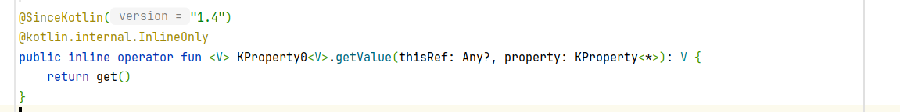

# 委托

## 声明

将部分实现方法交由外部

```kotlin
package org.harvey.kotlin.learn

interface Service {
    fun hello()
    fun greet()
}

class ServiceImpl() : Service {
    override fun hello() {
        println("hello!")
    }

    override fun greet() {
        println("greet!")
    }
}

class MyService(service: Service) : Service by service {
    override fun hello() {
        println("hello?")
        this.greet()
        println("hello?")
    }
}

fun main() {
    val myService = MyService(ServiceImpl())
    myService.hello()
    myService.greet()
}
```

输出

```console
hello?
greet!
hello?
greet!

```

也可以全部交给外界, 没啥意义

```kotlin
interface Service {
    fun hello()
    fun greet()
}

class MyService(service: Service) : Service by service

```

## 属性委托

-   延迟属性（*lazy* properties）: 其值只在首次访问时计算。
-   可观察属性（*observable* properties）: 监听器会收到有关此属性变更的通知。
-   把多个属性储存在一个映射（*map*）中，而不是每个存在单独的字段中。

```kotlin
class MyClass {
    val|var <props>: <type> by <DelegateEpression>
}
```

DelegateEpression 是对应委托

属性的`Getter|Setter`委托给`getValue()`和`setValue()`方法

属性的委托不必实现接口, 但必须要有上述两个方法, 于是, 自定义一个接口, 用于规范

```kotlin
interface Delegate<T : Any, P : Any> { // T其实是Any?也OK, P一定要是字段类型
    operator fun getValue(obj: T, property: KProperty<*>): P

    // 对于只读属性来说, setValue没有也OK, 有也没事(不生效)
    operator fun setValue(obj: T, property: KProperty<*>, value: P) 
}
```

-   obj 是生成对象的super
-   property 的类型是 ` KProperty<*>` 的 super
-   getValue 的返回值 必须是字段类型的 lower
-   setValue 的参数value 必须是字段类型的 super
-   Consumer in, Provider out

这样子实现接口就会方便很多

```kotlin
class Example {
    var p: String by object : Delegate<Example, String> {
        override fun getValue(
            obj: Example,
            property: KProperty<*>,
        ): String {
            return "";
        }

        override fun setValue(
            obj: Example,
            property: KProperty<*>,
            value: String,
        ) {
            println()
        }

    }
}
```

只要delegate的部分实现需要的`getValue`和`setValue`(val 不需要 `setValue`), 就行(返回值类型也要对应...)

```kotlin
class A {
    operator fun getValue(thisRef: Any?, property: KProperty<*>) ...

    val s by this
}
```

## 库实现

使用 getter 和 setter 可以自定义属性的行为

一些特定而又常见的行为, 在委托的库中实现

例如：惰性值、 通过键值从映射（map）读取、访问数据库、访问时通知侦听器

### lazy

```kotlin
val lazyValue: String by lazy { // 默认上同步锁进行初始化
    println("computed!")
    "Hello"
}
val lazyValue0: String by lazy(LazyThreadSafetyMode.SYNCHRONIZED) { // 默认
    println("computed!")
    "Hello"
}
val lazyValue1: String by lazy(LazyThreadSafetyMode.PUBLICATION) {
    // 多个线程可以进入此initializer, 但只有第一个返回的值会作为初始化的值
    "Hello"
}
val lazyValue2: String by lazy(LazyThreadSafetyMode.NONE) { // 没有任何线程安全保证和开销
    "Hello"
}
```

### observable

```kotlin
var name: String by Delegates.observable("initial name") {
        prop, old, new ->
    println("$old -> $new")
}
```

### vetoable

在赋值之前否决

```kotlin
var name: String by Delegates.vetoable("initial name") { property, oldValue, newValue ->
    if (newValue.length > 0) {
        true
    } else {
        // throw IllegalArgumentException("Empty is not allowed")
        println("Empty is not allowed") // 以在控制台打印为例子
        false
    }
}
```

## 委托给另一属性

-   顶层变量
-   同类属性
-   同类拓展属性
-   异类属性
-   异类拓展属性

之间可以互相委托

委托表达式使用引用, 且两者的Getter/Setter都会走`topLevelInt`的Getter/Setter

属性的引用都有实现`getValue`和`setValue`

```kotlin
var topLevelInt: Int = 0
    get() {
        println("Getter")
        return field
    }
    set(value) {
        println("Setter")
        field = value
    }

class MyClass {
    var delegatedToTopLevel: Int by ::topLevelInt
}

fun main() {
    val c = MyClass()
    println(c.delegatedToTopLevel) // 0
    println(topLevelInt) // 0
    topLevelInt = 1
    println(c.delegatedToTopLevel) // 1
    println(topLevelInt) // 1
    c.delegatedToTopLevel = 2
    println(c.delegatedToTopLevel) // 2
    println(topLevelInt) // 2
}
```

引用实现`getValue`的源码是



top变量/成员属性/扩展属性之间可以互相委托

```kotlin
val x: X = X()
val y: Y = Y()

var a: Int = 0
var b: Int by ::a // top by top
var j: Int by x::i // top by 扩展
var n: Int by x::m // top by 属性

class X {
    var c: Int by ::b  // 属性 by top
    var f: Int by y::e // 属性 by 不同对象的扩展
    var l: Int by x::k // 属性 by 同一对象的扩展
    var m: Int by x::l // 属性 by 同一对象的属性
}

class Y {
    var d: Int by x::c // 属性 by 不同对象的属性
}

var Y.e: Int by y::d // 扩展 by 同一对象的属性
var Y.g: Int by x::f // 扩展 by 不同对象的属性
var Y.h: Int by y::g // 扩展 by 同一对象的扩展
var X.i: Int by y::h // 扩展 by 不同对象的扩展
var X.k: Int by ::j // 扩展 by top
```

如果委托不当可能造成栈溢出但是不会编译异常

```kotlin
var a: Int by ::a // 完全OK
```

可用于废弃一个属性, 而后用另一个属性覆盖

```kotlin
class MyClass {
    var newName: Int = 0

    @Deprecated("Use 'newName' instead", ReplaceWith("newName"))
    var oldName: Int by this::newName
}
```

## 属性委托到映射

```kotlin
class User(val map: Map<String, Any?>) {
    val name: String by map
    val age: Int     by map
}

class WritableUser(val map: MutableMap<String, Any?>) {
    val name: String by map
    var age: Int     by map
}

fun main() {
    val user = WritableUser(mutableMapOf(
        "name" to "John Doe",
        "age"  to 23
    ))
    println(user.name) // Prints "John Doe"
    println(user.age)  // Prints 25
}
```

-   Map多出的字段会忽略, 
-   Map 缺少的字段会在第一次使用时抛出`java.util.NoSuchElementException`
-   Value 类型不匹配的字段会在第一次使用时抛出`java.util.ClassCastException`

## 局部委托

局部变量使用委托

```kotlin
fun example(computeFoo: () -> Foo) {
    val memoizedFoo by lazy(computeFoo)

    if (someCondition && memoizedFoo.isValid()) {
        memoizedFoo.doSomething()
    }
}
```

局部变量可以委托别人, 但不能成为别人的委托, 也不能成为局部变量的委托

## 重载 by 运算符

使用`provideDelegate`函数重载

不重要, 即使重载了译器也将delegate转成调用`getValue`和`setValue`方法

