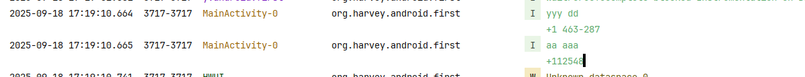

# ContentResolver

- 使用现有的ContentProvider读取和操作相应程序中的数据
- 创建自己的ContentProvider，给程序的数据提供外部访问接口
- 如果一个应用程序通过ContentProvider对其数据提供了外部访问接口，那么任何其他的应用程序都可以对这部分数据进行访问。

## 基本用法

通过Context中的getContentResolver()方法获取ContentResolver的实例

ContentResolver 提供了insert()，update()，delete()，query()方法用于对数据进行增删改查操作

其中, 使用URI作为统一资源标识, 代替了表名, 其余和SQL一样

query参数如下

- URI, 协议是`content`
  - 例如`content://org.harvey.android.first/table1 `, 其中的用包命名是为了避免冲突, 其实随便
  - 通讯录的URI是`ContactsContract.CommonDataKinds.Phone.CONTENT_URI`
- columns
- where 语句, 无where关键字
- where 实参, 和`?` 占位符一一对应
- order by 语句, 无order by关键字

返回值依然是Cursor

对于Insert和Update, 依旧可以使用ContentValue构建

## 获取通讯录实例

以下是对通讯录信息的获取, 其中, `ContactsContract.CommonDataKinds.Phone`类对通讯录信息进行了封装

```kotlin
private fun readContact() {
    // 查询联系人数据
    contentResolver.query(
        ContactsContract.CommonDataKinds.Phone.CONTENT_URI,
        null, null, null, null
    )?.use { // kotlin.io.use 
        while (moveToNext()) {
            // 获取联系人姓名
            val displayName =
                getString(requireColumnIndex(ContactsContract.CommonDataKinds.Phone.DISPLAY_NAME))
            // 获取联系人手机号
            val number = getString(
                requireColumnIndex(ContactsContract.CommonDataKinds.Phone.NUMBER)
            )
            Log.i(this@MainActivity.logTag, "$displayName\n$number")
        }
    }
}


/**
 * @return @IntRange(from = 0)
 */
private fun Cursor.requireColumnIndex(columnName: String): Int {
    val columnIndex = getColumnIndex(columnName);
    require(columnIndex > 0) { "$columnName is not exist" };
    return columnIndex;
}
```

注册通讯录的权限

```xml
 <uses-permission android:name="android.permission.READ_CONTACTS" /> 
```


在Activity中动态获取权限`Manifest.permission.READ_CONTACTS`

```kotlin
override fun onCreate(savedInstanceState: Bundle?) {
    super.onCreate(savedInstanceState)
    val safelyReadContacts =
        safeWrapper(arrayOf(Manifest.permission.READ_CONTACTS), "call", ::readContact)
    safelyReadContacts()
}
```




