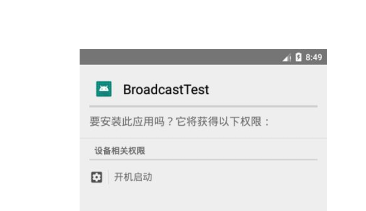
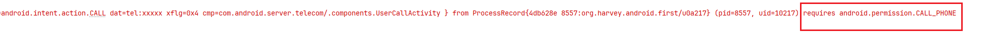
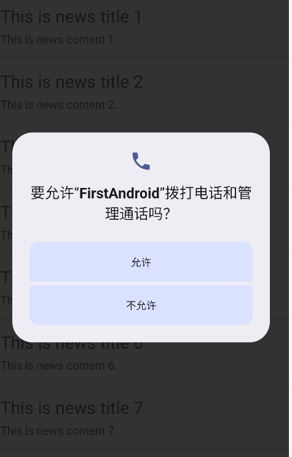
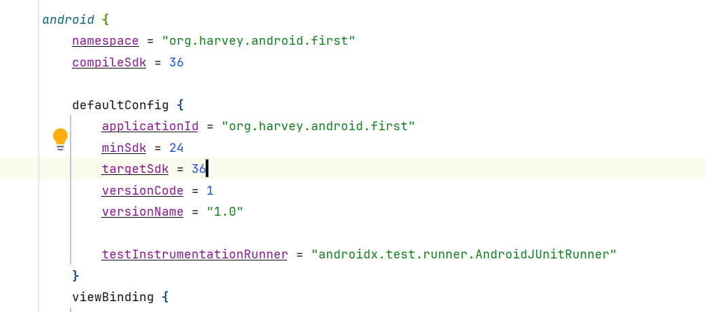

# 跨程序共享数据

从Android 6.0开始, 提供了比文件IO更安全的ContentProvider技术

## ContentProvider

ContentProvider 主要用于在不同的应用程序之间实现**数据共享**的功能

它允许一个程序访问另一个程序中的数据，同时还能保证被访问数据的安全性

ContentProvider 可以选择只对哪一部分数据进行共享，从而保证程序中的隐私数据不会有泄漏的风险


## 运行时权限

在限定了权限之后, Android会对Android 6.0 以下的用户**建议升级系统**, 同时会在安装应用的时候**提示用户**本应用可能对系统申请了哪些权限

例如Broadcast的监听开机完成, 需要在`AndroidManifest`注册权限

```xml
<uses-permission android:name="android.permission.RECEIVE_BOOT_COMPLETED" />
```





Android6.0之后也支持运行时权限

用户不需要在安装软件的时候一次性授权所有申请的权限，可以在软件的使用过程中再对某一项权限申请进行授权


### 普通权限和危险权限

- 普通权限
  - 系统直接通过, 不需要用户确认
- 危险权限
  - 涉及用户隐私/安全, 必须用户手动确认

Android 10以下所有危险权限


| 权限组               | 权限                                                         |
| -------------------- | ------------------------------------------------------------ |
| CALENDAR             | READ_CALENDAR<br/>WRITE_CALENDAR                             |
| CALL_LOG             | READ_CALL_LOG<br/>WRITE_CALL_LOG<br/>PROCESS_OUTGOING_CALLS  |
| CAMERA               | CAMERA                                                       |
| CONTACTS             | READ_CONTACTS<br/>WRITE_CONTACTS<br/>GET_ACCOUNTS            |
| LOCATION             | ACCESS_FINE_LOCATION<br/>ACCESS_COARSE_LOCATION<br/>ACCESS_BACKGROUND_LOCATION |
| MICROPHONE           | RECORD_AUDIO                                                 |
| PHONE                | READ_PHONE_STATE<br/>READ_PHONE_NUMBERS<br/>CALL_PHONE<br/>ANSWER_PHONE_CALLS<br/>ADD_VOICEMAIL<br/>USE_SIP<br/>ACCEPT_HANDOVER |
| SENSORS              | BODY_SENSORS                                                 |
| ACTIVITY_RECOGNITION | ACTIVITY_RECOGNITION                                         |
| SMS RECEIVE_SMS      | SEND_SMS<br/>READ_SMS<br/>RECEIVE_WAP_PUSH<br/>RECEIVE_MMS   |
| STORAGE              | READ_EXTERNAL_STORAGE<br/>WRITE_EXTERNAL_STORAGE<br/>ACCESS_MEDIA_LOCATIO |

### 开启权限

```kotlin
val intent = Intent(Intent.ACTION_CALL)
intent.data = "tel:10086".toUri()
startActivity(intent)
```

之前使用Intent时, 使用`Intent.ACTION_DIAL`, 表示打开电话应用, 而后拨号, 是不需要申请权限的

而此处的Action, `Intent.ACTION_CALL`, 表示在应用内直接拨打电话, 这需要申请权限

如果不申请, 就会报异常

```log
Caused by: java.lang.SecurityException: Permission Denial: starting Intent { act=android.intent.action.CALL dat=tel:xxxxx xflg=0x4 cmp=com.android.server.telecom/.components.UserCallActivity } from ProcessRecord{4db628e 8557:org.harvey.android.first/u0a217} (pid=8557, uid=10217) requires android.permission.CALL_PHONE
```

会提示需要什么权限



接下来在Manifest

在Manifest编写用于开启ACTION_CALL的权限

```xml
<uses-permission android:name="android.permission.CALL_PHONE" /> 
```

在代码中动态申请语言

```kotlin
private fun safeCall() {
    val permissionOn = ContextCompat.checkSelfPermission(
        /* context = */ this,
        /* permission = */ Manifest.permission.CALL_PHONE
    ) // 检查是否有权限
    if (permissionOn != PackageManager.PERMISSION_GRANTED) {
        // 没有权限, 就申请权限
        ActivityCompat.requestPermissions(
            /* activity = */ this,
            /* permissions = */ arrayOf(Manifest.permission.CALL_PHONE),
            /* requestCode = */ 1
        )
    } else {
        // 有权限, 直接使用
        call()
    }
}


/**
 * @param requestCode 和ActivityCompat.requestPermissions的参数requestCode对应
 * @param grantResults 响应, 和ActivityCompat.requestPermissions的参数permissions的元素请求一一对应
 */
override fun onRequestPermissionsResult(
    requestCode: Int, permissions: Array<String>, grantResults: IntArray
) {
    super.onRequestPermissionsResult(requestCode, permissions, grantResults)
    if (grantResults.isEmpty()) {
        return
    }
    when (requestCode) {
        1 -> {
            if (grantResults[0] == PackageManager.PERMISSION_GRANTED) {
                call()
            } else {
                toastShow(this, "You denied the permission")
            }
        }
    }
}

private fun call() {
    val intent = Intent(Intent.ACTION_CALL)
    intent.data = "tel:10086".toUri()
    startActivity(intent)
}
```





## 动态权限申请的代码封装

```kotlin

open class BaseActivity<T : ViewBinding>(val bindingInflate: BindingInflater1<T>) :
    AppCompatActivity() {
    // region Request Permission
    private var requestCodeIterator: IntIterator = (0..Int.MAX_VALUE step 1).iterator()

    /**
     * @param ungrantedPermissions 未申请到的权限
     * @param executableHint 对executable的提示, 用于在无法申请到权限时提示
     * @param executable 用于在完成权限申请后的回调函数
     */
    protected data class UnsafeExecutable(
        val executableHint: String?,
        val ungrantedPermissions: List<String>,
        val executable: () -> Unit
    )

    private val unsafeExecutableMap = mutableMapOf<Int, UnsafeExecutable>()

    /**
     * @param permissions 需要用到的权限
     * @param executableHint 对executable的提示, 用于在无法申请到权限时提示
     * @param executable 用于在完成权限申请后的回调函数(如果此时所有权限都已经获取, 则当场执行)
     */
    protected fun safeWrapper(
        permissions: Array<String>, executableHint: String? = null, executable: () -> Unit
    ): () -> Unit {
        return {
            val ungrantedPermissions = permissions.asSequence().filter {
                ContextCompat.checkSelfPermission(this, it) != PackageManager.PERMISSION_GRANTED
            }.toList()
            if (ungrantedPermissions.isNotEmpty()) {
                check(requestCodeIterator.hasNext()) { "request code iterator has no next" }
                val requestCode = requestCodeIterator.nextInt()
                ActivityCompat.requestPermissions(
                    this, ungrantedPermissions.toTypedArray(), requestCode
                )
                unsafeExecutableMap[requestCode] =
                    UnsafeExecutable(executableHint, ungrantedPermissions, executable)
            } else {
                // 有权限, 直接使用
                executable()
            }
        }
    }

    /**
     * 钩子函数, 可以用于权限被拒绝后的调用
     * @param executable [ungrantedPermissions][UnsafeExecutable.ungrantedPermissions] 表示动态申请后依旧没有获取到的权限
     */
    protected open fun onPermissionsUngranted(executable: UnsafeExecutable) {
        val joiner = StringJoiner(", ")
        executable.ungrantedPermissions.forEach(joiner::add)
        val hintOnExecutable =
            if (executable.executableHint == null) "" else " so that you can't perform ${executable.executableHint}"
        toastShow(
            this, "You denied the permission to open the $joiner$hintOnExecutable"
        )
    }

    override fun onRequestPermissionsResult(
        requestCode: Int, permissions: Array<out String?>, grantResults: IntArray, deviceId: Int
    ) {
        super.onRequestPermissionsResult(requestCode, permissions, grantResults, deviceId)
        if (grantResults.isEmpty()) {
            return
        }
        val executable = this.unsafeExecutableMap[requestCode]
        checkNotNull(executable) { "unknown request code: $requestCode" }
        val ungrantedPermissions = (0..grantResults.size).asSequence()
            .filter { grantResults[it] != PackageManager.PERMISSION_GRANTED }
            .map(executable.ungrantedPermissions::get).toList()
        if (ungrantedPermissions.isEmpty()) {
            executable.executable()
        } else {
            val unsafeExecutable = executable.copy(ungrantedPermissions = ungrantedPermissions)
            // 交给用户了, 还是没同意
            onPermissionsUngranted(unsafeExecutable)
        }
    }
    // endregion
}
```

使用增强

```kotlin
class MainActivity : BaseActivity<ActivityMainBinding>(ActivityMainBinding::inflate) {

    override fun onCreate(savedInstanceState: Bundle?) {
        super.onCreate(savedInstanceState)
        val safeCall = safeWrapper(arrayOf(Manifest.permission.CALL_PHONE), "call phone", ::call)
        safeCall()
    }


    private fun call() {
        // ...
    }
}
```


## Permission封装(提取)

将Permission的有关代码拿出来, 另外封装, 使其与Activity解耦, 申请权限依旧在Activity, 但是检查权限就可以任何Context都可以使用

```kotlin
package org.harvey.android.first.common.util

import org.harvey.android.first.common.IntIdGenerator


/**
 * UnsafeExecutable 表示动态申请后依旧没有获取到的权限
 */
typealias PermissionsUngranted = (UnsafeExecutable) -> Unit


/**
 * @param ungrantedPermissions 未申请到的权限
 * @param executableHint 对executable的提示, 用于在无法申请到权限时提示
 * @param executable 用于在完成权限申请后的回调函数
 */
data class UnsafeExecutable(
    val executableHint: String?, val ungrantedPermissions: List<String>, val executable: () -> Unit
)

private val unsafeExecutableMap = mutableMapOf<Int, UnsafeExecutable>()

private val permissionRequestCodeIterator: IntIdGenerator = IntIdGenerator()
@SuppressLint("InlinedApi")
enum class Permission(val permission: String, val versionRange: IntRange) {
    READ_MEDIA_IMAGES(
        Manifest.permission.READ_MEDIA_IMAGES, 33..ApiVersion.SUPPORT_UPPER
    ),
    READ_EXTERNAL_STORAGE(
        Manifest.permission.READ_EXTERNAL_STORAGE, ApiVersion.SUPPORT_LOWER..14
    ),
    POST_NOTIFICATIONS(
        Manifest.permission.POST_NOTIFICATIONS, 33..ApiVersion.SUPPORT_UPPER
    )
}

/**
 * 如果没有权限, 就动态请求权限
 *
 * @param permissions 需要用到的权限
 * @param executableHint 对executable的提示, 用于在无法申请到权限时提示
 * @param executable 用于在完成权限申请后的回调函数(如果此时所有权限都已经获取, 则当场执行)
 */
fun Activity.safeWrapper(
    permissions: Array<Permission>, executableHint: String? = null, executable: () -> Unit
): () -> Unit = {
    val ungrantedPermissions = filterUngrantPermissions(permissions)
    if (ungrantedPermissions.isNotEmpty()) {
        val requestCode = permissionRequestCodeIterator.next()
        ActivityCompat.requestPermissions(
            this, ungrantedPermissions.toTypedArray(), requestCode
        )
        unsafeExecutableMap[requestCode] =
            UnsafeExecutable(executableHint, ungrantedPermissions, executable)
    } else {
        // 有权限, 直接使用
        executable()
    }
}

private fun Context.filterUngrantPermissions(permissions: Array<Permission>): List<String> =
    permissions.asSequence().filter {
        if (ApiVersion.support(it.versionRange)) {
            ContextCompat.checkSelfPermission(
                this, it.permission
            ) != PackageManager.PERMISSION_GRANTED
        } else {
            true
        }
    }.map { it.permission }.toList()

/**
 * 检查权限, 但是不会申请, 如果没有权限, 则不执行
 */
fun Context.checkWrapper(
    permissions: Array<Permission>, executable: () -> Unit
): () -> Unit {
    return {
        val ungrantedPermissions = filterUngrantPermissions(permissions)
        if (ungrantedPermissions.isEmpty()) {
            // 有权限, 直接使用
            executable()
        }
    }
}

fun afterRequestPermission(
    requestCode: Int, grantResults: IntArray, onPermissionsUngranted: PermissionsUngranted
) {
    if (grantResults.isEmpty()) {
        return
    }
    val executable = unsafeExecutableMap[requestCode]
    checkNotNull(executable) { "unknown request code: $requestCode" }
    val ungrantedPermissions = (0..grantResults.size - 1).asSequence()
        .filter { grantResults[it] != PackageManager.PERMISSION_GRANTED }
        .map(executable.ungrantedPermissions::get).toList()
    if (ungrantedPermissions.isEmpty()) {
        executable.executable()
    } else {
        val unsafeExecutable = executable.copy(ungrantedPermissions = ungrantedPermissions)
        // 交给用户了, 还是没同意
        onPermissionsUngranted(unsafeExecutable)
    }
}
```

###

## XXPermissions

由于Android的权限功能非常多变, 不稳定, 于是有一个XXPermissions库 [XXPermissions](https://github.com/getActivity/XXPermissions?tab=readme-ov-file), 对Android所有版本的有关权限进行封装, 然后依据本版本取判断

此文档使用原生的Android进行封装, 不使用XXPermissions

### version

在model的gradle 配置文件中查看版本信息



minSdk 表示版本其之下的系统禁止安装本应用

targetSdk表示本应用最高支持到版本36


```kotlin
object ApiVersion {
    const val SUPPORT_LOWER = 24
    const val SUPPORT_UPPER = 36
    fun sdk2api(sdk: Int): Int = sdk + 20
    fun api2sdk(api: Int): Int = api - 20
    fun support(lower: Int): Boolean {
        return Build.VERSION.SDK_INT >= lower
    }

    fun support(range: IntRange): Boolean {
        return Build.VERSION.SDK_INT in range
    }
}
```

### 封装优化(部分)


```kotlin
@SuppressLint("InlinedApi")
enum class Permission(val permission: String, val versionRange: IntRange) {

    POST_NOTIFICATIONS(
        Manifest.permission.POST_NOTIFICATIONS, 33..ApiVersion.SUPPORT_UPPER
    )
}

/**
 * 如果没有权限, 就动态请求权限
 *
 * @param permissions 需要用到的权限
 * @param executableHint 对executable的提示, 用于在无法申请到权限时提示
 * @param executable 用于在完成权限申请后的回调函数(如果此时所有权限都已经获取, 则当场执行)
 */
fun Activity.safeWrapper(
    permissions: Array<Permission>, executableHint: String? = null, executable: () -> Unit
): () -> Unit = {
    val ungrantedPermissions = filterUngrantPermissions(permissions)
    if (ungrantedPermissions.isNotEmpty()) {
        val requestCode = permissionRequestCodeIterator.next()
        ActivityCompat.requestPermissions(
            this, ungrantedPermissions.toTypedArray(), requestCode
        )
        unsafeExecutableMap[requestCode] =
            UnsafeExecutable(executableHint, ungrantedPermissions, executable)
    } else {
        // 有权限, 直接使用
        executable()
    }
}

private fun Context.filterUngrantPermissions(permissions: Array<Permission>): List<String> =
    permissions.asSequence().filter {
        if (ApiVersion.support(it.versionRange)) {
            ContextCompat.checkSelfPermission(
                this, it.permission
            ) != PackageManager.PERMISSION_GRANTED
        } else {
            false // 过时的权限不被过滤给下一层
        }
    }.map { it.permission }.toList()
```

