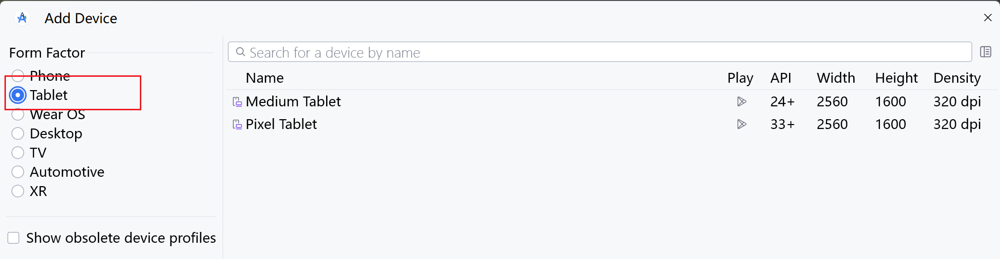
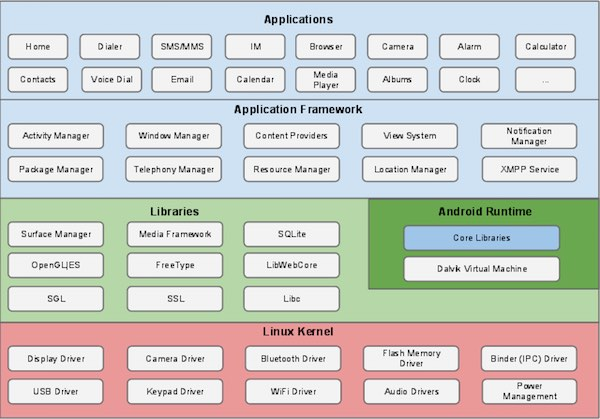
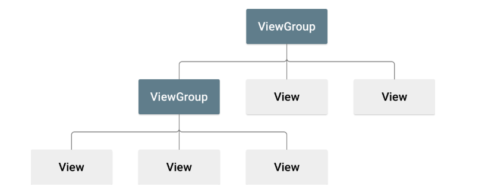
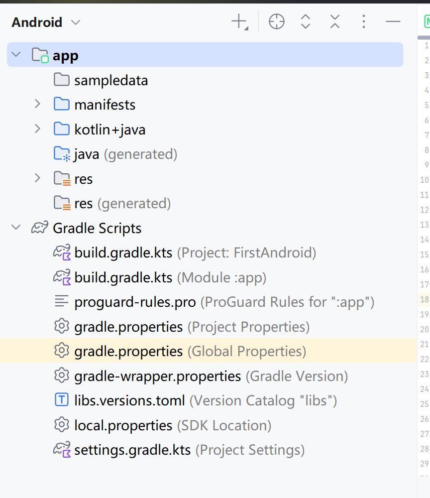
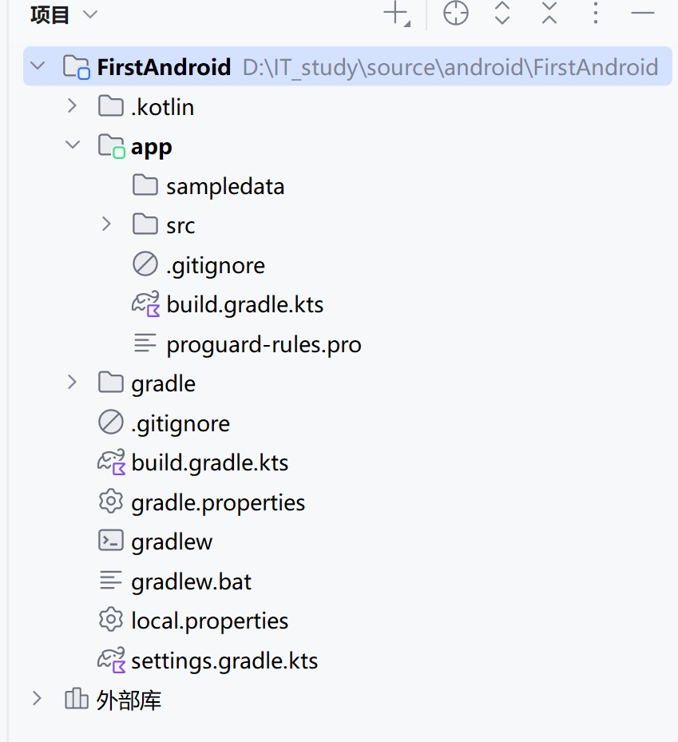
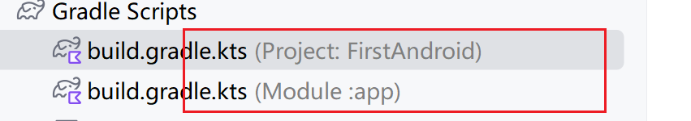
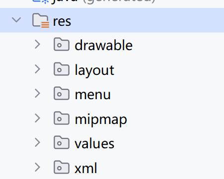
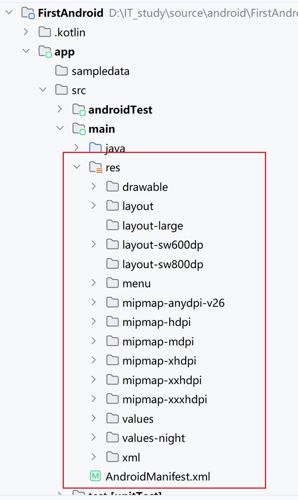
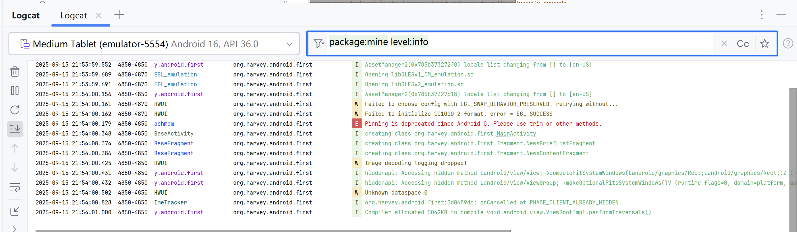
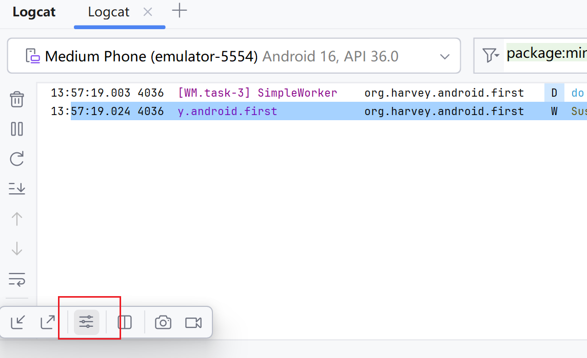

# 简介

## 虚拟设备

此乃平板



## Android 系统

### 架构



-   Linux 内核

    -   为Android设备的各种硬件提供了底层的驱动， 如显示驱动、音频驱动、照相机驱动、蓝牙驱动、Wi-Fi驱动、电源管理等

-   系统运行库

    -   通过一些C/C++库为Android系统提供了主要的特性支持

        -   SQLite库提供数据库的支持
        -   OpenGL|ES库提供3D绘图的支持
        -   Webkit库提供浏览器内核的支持

    -   Android运行时库

        -   提供一些核心库，允许开发者使用Java语言来编写Android应用。
        -   Dalvik虚拟机（5.0系统之后为 ART）让每一个Android应用都能运行在拥有自己的虚拟机实例的独立进程中

        -   相较于Java虚拟机，Dalvik和ART都是专门为移动设备定制的，它针对手 机内存、CPU性能有限等情况做了优化处理

-   应用框架层

    -   构建应用程序时可能用到的各种API
    -   Android自带的一些核心应用实现

-   应用层

    -   运行安装在手机上的应用程序
    -   包括安卓自带的基础应用和第三方开发的应用

### 四大组件

-   Activity
    -   所有Android应用程序的门面
    -   在应用中看得到的元素，都是放在Activity中的
-   Service
    -   在后台默默地运行
    -   用户退出应用依然运行
-   BroadcastReceiver
    -   允许应用接收来自各处的广播消息，比如电话、短信等
    -   应用也可以向外发出广播消息
-   ContentProvider
    -   用于应用程序之间共享数据
    -   例如读取系统通讯录中的联系人

## 支持

-   系统空间
    -   例如 Button/Text 这种
-   SQLite 数据库
-   多媒体

## 应用的界面结构



-   `ViewGroup` 不可见的容器，定义 `View` 和其他 `ViewGroup` 的布局结构 对象
-   `View`  绘制用户可见的内容, `View` 对象通常称为*微件*，可以是诸多组件, `Button`, `TextView`等

## 布局声明

-   **XML中声明界面元素**
-   **运行时实例化布局元素**

## 编写XML

创建文件`res/layout/layout.xml`

编写XML文件

```xml
<LinearLayout xmlns:android="http://schemas.android.com/apk/res/android"
              android:layout_width="match_parent"
              android:layout_height="match_parent"
              android:orientation="vertical" >
    <TextView android:id="@+id/text"
              android:layout_width="wrap_content"
              android:layout_height="wrap_content"
              android:text="Hello, I am a TextView" />
    <Button android:id="@+id/button"
            android:layout_width="wrap_content"
            android:layout_height="wrap_content"
            android:text="Hello, I am a Button" />
</LinearLayout>
```

-   每个布局文件都必须只包含一个根元素, 必须是View 或者 ViewGroup对象
-   其他布局对象或微件作为子元素添加到更元素下
-   上例是一个垂直 `LinearLayout` 来 同时持有一个 `TextView` 和一个 `Button`

## 加载XML

系统将XML布局文件编译成View资源

在`Activity.onCreate()`回调实现

```kotlin
class MainActivity : AppCompatActivity() {
    override fun onCreate(savedInstanceState: Bundle?) {
        super.onCreate(savedInstanceState)
        setContentView(R.layout.activity_main)
    }
}
```

## 注册Activity类

在`manifest\AndroidManifest.xml`

```xml
<?xml version="1.0" encoding="utf-8"?>
<manifest xmlns:android="http://schemas.android.com/apk/res/android"
        xmlns:tools="http://schemas.android.com/tools">

    <application
            android:allowBackup="true"
            android:dataExtractionRules="@xml/data_extraction_rules"
            android:fullBackupContent="@xml/backup_rules"
            android:icon="@mipmap/ic_launcher"
            android:label="@string/app_name"
            android:roundIcon="@mipmap/ic_launcher_round"
            android:supportsRtl="true"
            android:theme="@style/Theme.FirstAndroid">
        <activity
                android:name=".MainActivity"
                android:exported="true">
            <intent-filter>
                <action android:name="android.intent.action.MAIN" />

                <category android:name="android.intent.category.LAUNCHER" />
            </intent-filter>
        </activity>
    </application>

</manifest>
```

## 一般Views-Android项目结构

Android Studio依照一般的项目结构整理后的展示样式



下面的展示的是物理结构



### 有关配置文件

- `gradle.properties`  全局的gradle配置文件

  -   配置的影响到项目中所有的gradle编译脚本的属性

  ```properties
  # Project-wide Gradle settings.
  # IDE (e.g. Android Studio) users:
  # Gradle settings configured through the IDE *will override*
  # any settings specified in this file.
  # For more details on how to configure your build environment visit
  # http://www.gradle.org/docs/current/userguide/build_environment.html
  # Specifies the JVM arguments used for the daemon process.
  # The setting is particularly useful for tweaking memory settings.
  org.gradle.jvmargs=-Xmx2048m -Dfile.encoding=UTF-8
  # When configured, Gradle will run in incubating parallel mode.
  # This option should only be used with decoupled projects. For more details, visit
  # https://developer.android.com/r/tools/gradle-multi-project-decoupled-projects
  # org.gradle.parallel=true
  # AndroidX package structure to make it clearer which packages are bundled with the
  # Android operating system, and which are packaged with your app's APK
  # https://developer.android.com/topic/libraries/support-library/androidx-rn
  android.useAndroidX=true
  # Kotlin code style for this project: "official" or "obsolete":
  kotlin.code.style=official
  # Enables namespacing of each library's R class so that its R class includes only the
  # resources declared in the library itself and none from the library's dependencies,
  # thereby reducing the size of the R class for that library
  android.nonTransitiveRClass=true
  ```

  `gradlew` 和 `gradlew.bat` 

  -   执行gradle命令的脚本
  -   `gradlew` 在`Linux`或Mac系统中使用
  -   ``gradlew.bat`是在`Windows`系统中使用

- `local.properties` 

  -   指定本机中的Android SDK路径
  -   本机中的Android SDK位置发生了变化，在此文件中修改路径

  ```properties
  ## This file is automatically generated by Android Studio.
  # Do not modify this file -- YOUR CHANGES WILL BE ERASED!
  #
  # This file should *NOT* be checked into Version Control Systems,
  # as it contains information specific to your local configuration.
  #
  # Location of the SDK. This is only used by Gradle.
  # For customization when using a Version Control System, please read the
  # header note.
  sdk.dir=D\:\\IT_study\\android
  ```

-   `settings.gradle`

    -    这个文件用于指定项目中所有引入的模块
    -   由于一般项目中只有一个app模块，因此该文件中也就只引入了app这一个模块

    ```properties
    // 顶层gradle配置文件, 影响所有子模块
    plugins {
        alias(libs.plugins.android.application) apply false
        alias(libs.plugins.kotlin.android) apply false
        alias(libs.plugins.kotlin.compose) apply false
    }
    ```

### AndroidManifest.xml

```xml
<?xml version="1.0" encoding="utf-8"?>
<manifest xmlns:android="http://schemas.android.com/apk/res/android">

    <application
            android:allowBackup="true"
            android:dataExtractionRules="@xml/data_extraction_rules"
            android:fullBackupContent="@xml/backup_rules"
            android:icon="@mipmap/ic_launcher"
            android:label="@string/app_name"
            android:roundIcon="@mipmap/ic_launcher_round"
            android:supportsRtl="true"
            android:theme="@style/Theme.FirstAndroid">
        <activity
                android:name=".MainActivity"
                android:exported="true">
            <intent-filter>
                <action android:name="android.intent.action.MAIN" />
                <category android:name="android.intent.category.LAUNCHER" />
            </intent-filter>
        </activity>
    </application>

</manifest>
```

整个Android项目的配置文件

在程序中定义的所有四大组件都需要在这个文件里注册

可以在这个文件中给应用程序添加权限声明

```xml
<activity
        android:name=".MainActivity"
        android:exported="true">
    <intent-filter>
        <!--指明.MainActivity是项目的主activity, 启动应用图标, 就是启动此activity-->
        <action android:name="android.intent.action.MAIN" />
        <category android:name="android.intent.category.LAUNCHER" />
    </intent-filter>
</activity>
```

### build.gradle

gradle构建脚本

指定项目构建相关的配置

有两个build.gradle, 一个是project目录下的, 一个是app目录下的



其实gradle的语法都是Kotlin的构建器语法模式

### proguard-rules.pro

规定代码混淆规则, 避免被反编译后窃取源码

### res



下面是物理的项目结构



-   `drawable` 图像

-   `layout` 布局/元素

-   `mipmap` 应用图标, 多个后缀表示应当考虑不同设备的分辨率

-   `values` 简单的值, 常量等

    常量定义方法`es/values/strings.xml`

    ```xml
    <resources>
        <!--标签表示的类型 标识符 值-->
        <string name="app_name">FirstAndroid</string>
    </resources>
    ```

    获得该字符串的引用的方式

    -   在**代码**中通过`R.string.app_name`, *string指标签而不是文件名*
    -   在**XML**中通过`@string/app_name`

    可选标签非常多样

    -   color 颜色
    -   string
    -   integer
    -   layout
    -   drawable

-   `xml` 

## 工具

### 日志

`android.util.Log`

-   `Log.v()` verbose
-   `Log.d()` debug
-   `Log.i()` info
-   `Log.w()` warn
-   `Log.e()` error

两个参数, tag, 和message, tag用于对日志进行一定分类



自定义日志样式



