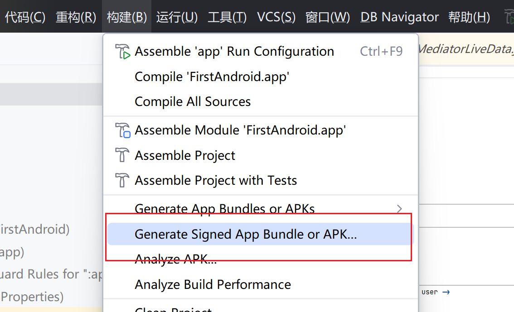
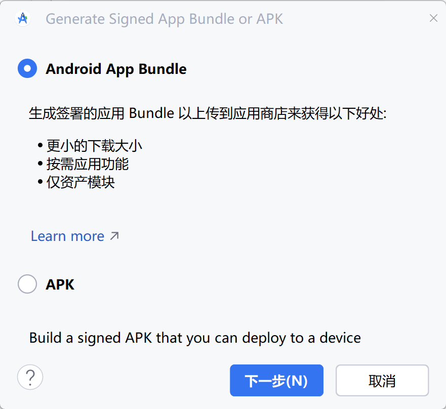
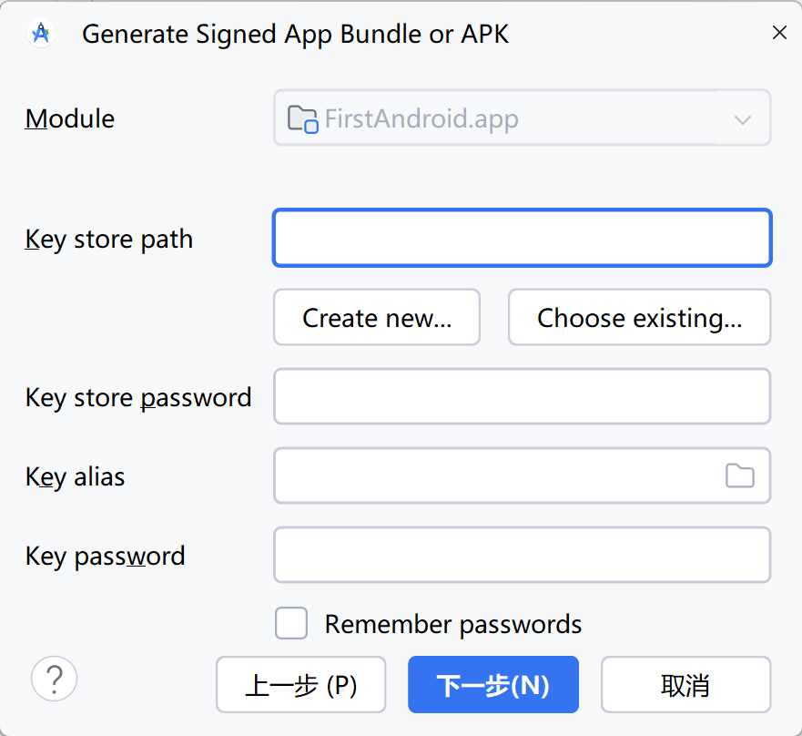
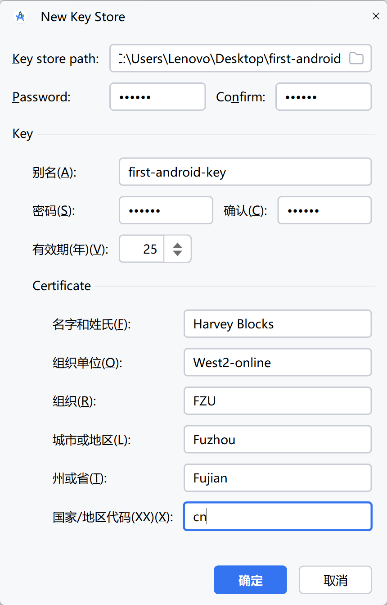
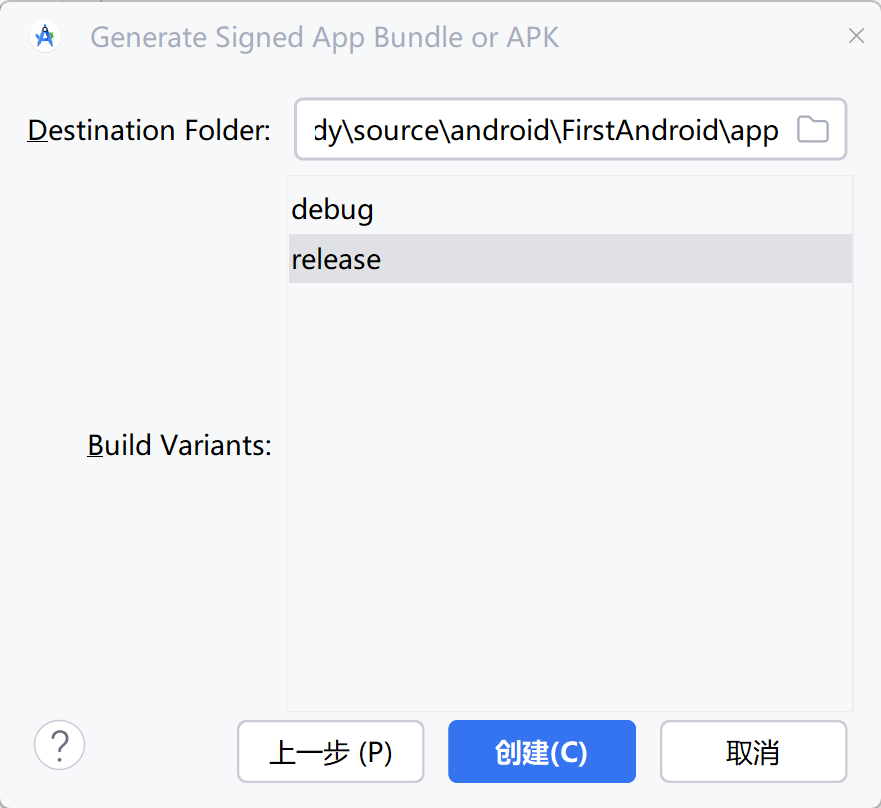

# APK文件

Android系统要求只有**签名**后的APK文件才可以安装

## 生成

页面

- Android App Bundle 用于商家Google Play(不适用于其他应用商店), 可以根据用户的手机, 只下载一部分资源
- APK 能直接安装

点击Create New... , 弹出下面窗口

填写信息(就是JKS), 以下略

选择构建类型release, 因为是正式版

apk文件就在目标目录下了

## Gradle 生成

略

