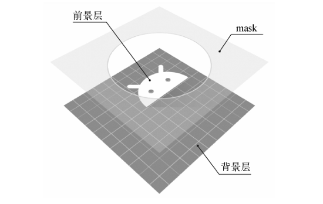
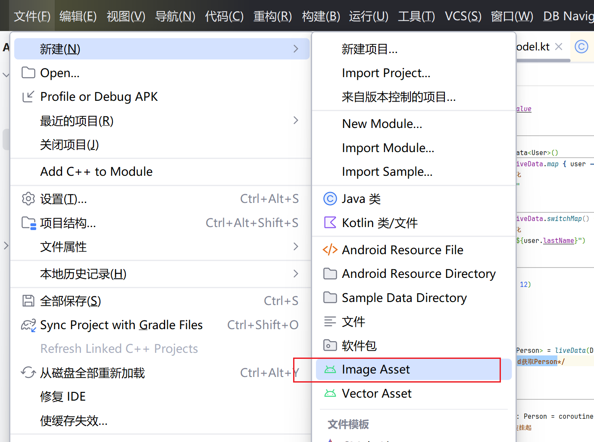
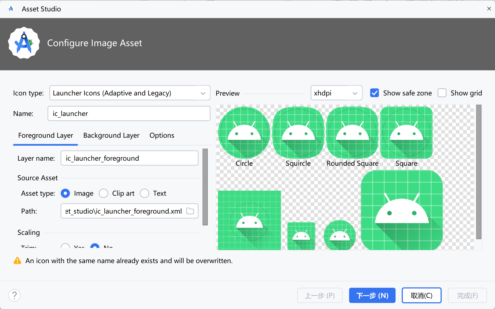

# App 图标

从Android 8.0系统开始，不建议使用单一的图片作为应用程序的图标，而是应该使用前景和背景分离的图标设计方式

- 前景层用来展示应用图标的Logo
- 背景层用来衬托应用图标的Logo
- mask 来定义图标的形状, 视具体手机厂商而定

## 制作

页面

操作部分

- Icon Type, Launcher Icons (Adaptive and Legacy) 表示兼容老版本和8.0
- Name 应用图标名称
- Foreground layer 前景层
- Background Layer 背景层

预览部分

- 安全区域(圆形细线)，必须保证图标的前景层完全处于安全区域中