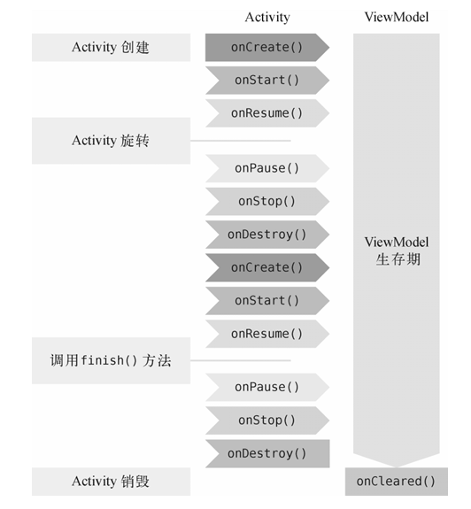
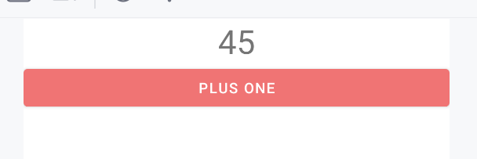
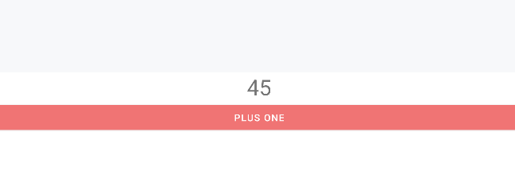
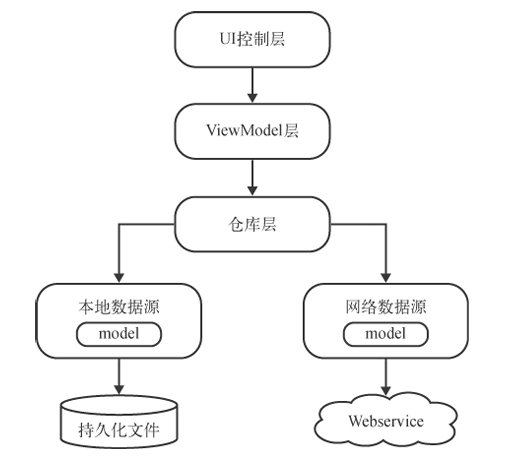

# ViewModel

专门用于存放与界面相关的数据

只要是界面上能看得到的数据，它的相关变量都应该存放在ViewModel中，而不是Activity中

用以在一定程度上减少Activity中的逻辑

比较好的编程规范是给**每一个Activity和Fragment都创建一个对应的ViewModel**

## 生命周期

ViewModel的生命周期和Activity不同，它可以保证在手机屏幕发生旋转的时候不会被重新创建

**只有当Activity退出的时候ViewModel才会跟着Activity一起销毁**





## 基本用法

### 引入依赖

```kotlin
dependencies { 
    ... 
    implementation("androidx.lifecycle:lifecycle-extensions:2.2.0")
} 
```

### 布局准备

使用一个计数器来展现ViewModule的用法

```xml
<LinearLayout xmlns:android="http://schemas.android.com/apk/res/android"
        android:orientation="vertical"
        android:layout_width="match_parent"
        android:layout_height="match_parent">
    <TextView
            android:id="@+id/infoText"
            android:layout_width="wrap_content"
            android:layout_height="wrap_content"
            android:layout_gravity="center_horizontal"
            android:textSize="32sp"/>

    <Button
            android:id="@+id/plusOneBtn"
            android:layout_width="match_parent"
            android:layout_height="wrap_content"
            android:layout_gravity="center_horizontal"
            android:text="Plus One"/>
</LinearLayout>
```


### ViewModule声明

```kotlin
class MainViewModel : ViewModel() {
    var counter = 0;
}
```


### MainActivity使用

`ViewModelProvider(this)[T::class.java]`创建ViewModule

```kotlin
class MainActivity : BaseActivity<ActivityMainBinding>(ActivityMainBinding::inflate) {
    lateinit var viewModel: MainViewModel

    override fun onCreate(savedInstanceState: Bundle?) {
        super.onCreate(savedInstanceState)
        viewModel = getViewModel<MainViewModel>()
        binding.plusOneBtn.setOnClickListener {
            viewModel.counter++
            refreshCounter()
        }
        refreshCounter()
    }

    private fun refreshCounter() {
        binding.infoText.text = viewModel.counter.toString()
    }

    inline fun <reified T : ViewModel> ViewModelStoreOwner.getViewModel(): T {
        return ViewModelProvider(this@getViewModel)[T::class.java]
    }
}
```

### 效果

翻转屏幕也不会丢失点击的数据



翻转



## 工厂

如果需要需要走ViewModule构造的情况

就创建一个工厂


```kotlin
open class MainViewModel(start: Int) : ViewModel() {
    var counter = start;
    class Factory(private val start: Int) : ViewModelProvider.Factory {

        override fun <T : ViewModel> create(modelClass: Class<T>): T {
            val model = MainViewModel(start)
            if (modelClass.isAssignableFrom(model.javaClass)) {
                return model as T
            }
            throw TypeCastException("from ${model.javaClass.name} to ${modelClass.name}")
        }

    }
}
```

使用工厂创建

```kotlin
viewModel =
    ViewModelProvider(this, MainViewModel.Factory(111)).get(MainViewModel::class.java)
```

## MVVM

Model-View-ViewModel 架构




### 实践

1. 检查引入的依赖
2. 如果引入Material, AppTheme的parent主题, 从AppCompat换成MaterialComponents模式
3. 自定义Application, 并注册Manifest
4. 定义网络层Model
5. 定义网络层ServiceApi, 用于给Retrofit代理
6. 定义本地数据源Entity/Database
7. 定义本地数据源Dao, 用于给Room代理
8. 对Model进行LiveView封装, 让方法的调用者, 无论是调用本地数据, 还是网络数据, 拿到的都是LiveView
9. 设计Layout局部工件
10. 设计Fragment及其Layout
11. 设计Activity及其Layout
12. 返回4
