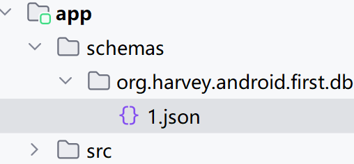

# Room

一个ORM框架


## 概念

- Entity 实体, 一个实体对应一个表
- Dao 数据访问对象, 逻辑层与之进行交互吗, 而不是直接访问数据库
- DAtabase 定义数据库中的信息
  - 版本号
  - 包含的实体类
  - Dao层的访问实例

## 依赖

在项目gradle里注册plugin

KSP (Kotlin Symbol Processing), 是Kotlin注解处理工具, 比kapt效率更高

KSP 版本需要和Kotlin版本对应, [兼容性对应关系](https://developer.android.google.cn/jetpack/androidx/releases/compose-kotlin?hl=zh-cn)

```kotlin
plugins {
    ...
    id("com.google.devtools.ksp") version "2.2.20-2.0.3" apply false
}
```

在模块gradle里注册plugin

```kotlin
plugins {
    ...
    id("com.google.devtools.ksp")
}
```

在模块gradle里注册依赖

```kotlin
dependencies {
    // room
    implementation ("androidx.room:room-runtime:2.6.1")
    ksp("androidx.room:room-compiler:2.6.1")
    ...
}
```

## 使用

### Entity

```kotlin
@Entity
data class User(
    val firstName: String,
    val lastName: String,
    val age: Int,
    // autoGenerate 在insert时生效, 算法是递增
    @PrimaryKey(autoGenerate = true) var id: Long = 0,
)
```

- `@ColumnInfo(name = "row_id")`, 标注在构造器参数上, 表示自定义数据库字段的映射方式
- `@Ignore` , 构造器参数注解
- `@Entity(indices = [Index(value = ["first_name", "last_name"],unique = true)])` 定义索引
- 

### Dao

```kotlin
@Dao
interface UserDao {
    @Insert
    fun insertUser(user: User): Long

    @Update
    fun updateUser(newUser: User)

    @Query("select * from User")
    fun loadAllUsers(): List<User>

    @Query("select * from User where age > :age")
    fun loadUsersOlderThan(age: Int): List<User>

    @Query("select * from User where id = :id")
    fun getById(id: Long): User

    /**
     * @Delete 修饰的方法参数必须是Entity类型的, 如果不是, 则报错
     * 其实就是remove by id, 其他字段不予理会
     * 返回删除的个数
     */
    @Delete
    fun deleteUser(user: User): Int
    
    fun deleteById(id: Long): Int {
        return deleteUser(User("", "", 0, id))
    }

    // 复杂的写操作也要用Query
    @Query("delete from User where lastName = :lastName")
    fun deleteUserByLastName(lastName: String): Int
}
```

`@insert`.`@delete`,`@update`, 参数可以使用`vararg`, 使用批量写的操作

返回指可以是Entity子集

```kotlin
data class NameTuple(
    @ColumnInfo(name = "first_name") val firstName: String?,
    @ColumnInfo(name = "last_name") val lastName: String?
)
@Dao
interface UserDao{
    @Query("SELECT first_name, last_name FROM user")
	fun loadFullName(): List<NameTuple>
}
```

### 返回多重映射

```kotlin
@Query(
    "SELECT * FROM user" +
    "JOIN book ON user.id = book.user_id"
)
fun loadUserAndBookNames(): Map<User, List<Book>>
```

### 分页

```kotlin
@Dao
interface UserDao {
  @Query("SELECT * FROM users WHERE label LIKE :query")
  fun pagingSource(query: String): PagingSource<Int, User>
}
```

### 异步

- 添加suspend修饰
- 返回值使用`Flow`

```kotlin
@Dao
interface UserDao {
    @Query("SELECT * FROM user WHERE id = :id")
    fun loadUserById(id: Int): Flow<User>

    @Query("SELECT * from user WHERE region IN (:regions)")
    suspend fun loadUsersByRegion(regions: List<String>): List<User>
}
```


### Database

```kotlin
// 必须是抽象的
@Database(version = 1, entities = [User::class])
abstract class AppDatabase : RoomDatabase() {

    abstract fun userDao(): UserDao

    companion object {

        private var instance: AppDatabase? = null

        @Synchronized
        fun Context.getAppDatabase(): AppDatabase {
            instance?.let {
                return it
            }
            return Room.databaseBuilder(
                // 必须是Context.applicationContext
                applicationContext, AppDatabase::class.java, "app_database"
            )/*.allowMainThreadQueries() 默认不允许在主线程进行操作*/.build().apply {
                instance = this@apply
            }
        }
    }

}
```


## 导出数据库架构

在Model的gradle里设置

```kotlin
android {
    // ...
    ksp {
        arg("room.schemaLocation", "$projectDir/schemas")
    }
}
```



## 升级

### 删除旧版本数据库

```kotlin
Room.databaseBuilder(context.applicationContext, AppDatabase::class.java,"app_database") 
    .fallbackToDestructiveMigration() 
    .build() 
```

`fallbackToDestructiveMigration` 在版本升级时删除旧版本的数据库, 然后重新创建

可以在开发测试阶段使用

### Migration

以增加一个Book表为例

```kotlin
@Database(version = 2, entities = [User::class,Book::class])
abstract class AppDatabase : RoomDatabase() {

    abstract fun userDao(): UserDao
    abstract fun bookDao(): BookDao // 新的Dao, 当然还有新的Entity

    companion object {

        // Book表的建表语句必须和Book实体类中声明的结构完全一致，否则Room就会抛出异常
        private const val SQL_1_2 =
            "create table Book (id integer primary key autoincrement not null,"+
        	" name text not null, pages integer not null)"

        // 描述版本变化时需要执行的操作
        val MIGRATION_1_2: Migration = object : Migration(1, 2) {
            override fun migrate(db: SupportSQLiteDatabase) {
                db.execSQL(SQL_1_2)
            }
        }


        private var instance: AppDatabase? = null
        
        @Synchronized
        fun Context.getAppDatabase(): AppDatabase {
            instance?.let {
                return it
            }
            return Room.databaseBuilder(
                applicationContext, AppDatabase::class.java, "app_database"
            ).addMigrations(MIGRATION_1_2) // 把版本升级的操作添加到数据库
            .build().apply {
                instance = this@apply
            }
        }
    }

}
```

