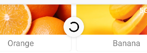

# 下拉刷新

> SwipeRefreshLayout

```kotlin
implementation("androidx.swiperefreshlayout:swiperefreshlayout:1.1.0" )
```


## 简单使用

将RecyclerView放到SwipeRefreshLayout之下, 成为SwipeRefreshLayout的子控件

注意`app:layout_behavior="@string/appbar_scrolling_view_behavior"`的布局声明要在SwipeRefreshLayout上, 这样才能依旧对有AppBarLayout有效

```xml
<androidx.drawerlayout.widget.DrawerLayout...>
    <androidx.coordinatorlayout.widget.CoordinatorLayout
            android:layout_width="match_parent"
            android:layout_height="match_parent">

        <!--AppBarLayout...-->
        <!--下拉RecyclerView刷新-->
        <androidx.swiperefreshlayout.widget.SwipeRefreshLayout
                android:id="@+id/swipeRefresh"
                android:layout_width="match_parent"
                android:layout_height="match_parent"
                app:layout_behavior="@string/appbar_scrolling_view_behavior">
            <!--主界面内容-->
            <androidx.recyclerview.widget.RecyclerView
                    android:id="@+id/fruitRecyclerView"
                    android:layout_width="match_parent"
                    android:layout_height="match_parent"/>
        </androidx.swiperefreshlayout.widget.SwipeRefreshLayout>
    </androidx.coordinatorlayout.widget.CoordinatorLayout>
</androidx.drawerlayout.widget.DrawerLayout>
```



## 注册刷新事件


```kotlin
class MainActivity : BaseActivity<ActivityMainBinding>(ActivityMainBinding::inflate) {
    val fruitList = ArrayList<Fruit>()

    override fun onCreate(savedInstanceState: Bundle?) {
        super.onCreate(savedInstanceState)
        // ...
        val adapter = initRecycler()
        binding.swipeRefresh.run {
            setColorSchemeResources(R.color.my_light_primary)
            setOnRefreshListener {
                thread {
                    refreshFruitList()
                    Thread.sleep(500) // 延时一段时间
                    runOnUiThread {
                        // 刷新position=3的item
                        // adapter.notifyItemChanged(3)
                        // 刷新从position=0开始, 50个item
                        adapter.notifyItemRangeChanged(0,50)
                        // 刷新所有item, 由于效率, 不建议
                        // adapter.notifyDataSetChanged()
                        isRefreshing = false
                    }
                }
            }
        }
    }

}
```