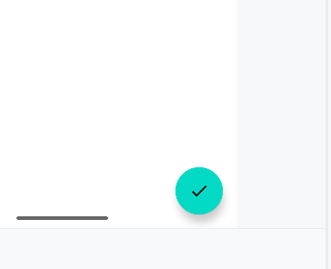
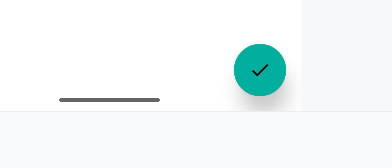

# 悬浮按钮

立面设计的一种, 悬浮按钮已经不与其他控件属于同一个平面了

## FloatingActionButton

Material库中提供的一个控件, 方便实现悬浮按钮的效果, 默认使用style的colorAccent(Material 1.0 之前)/colorSecondary(Material 1.1之后)作为颜色

### 简单使用

```xml
<?xml version="1.0" encoding="utf-8"?>

<androidx.drawerlayout.widget.DrawerLayout ...>

    <FrameLayout
            android:layout_width="match_parent"
            android:layout_height="match_parent">
        <!--Toolbar...-->

        <!--主界面内容-->
        
        
        <!--设置在右下角-->
        <com.google.android.material.floatingactionbutton.FloatingActionButton
                android:id="@+id/fab"
                android:layout_width="wrap_content"
                android:layout_height="wrap_content"
                android:layout_gravity="bottom|end"
                android:layout_margin="16dp"
                android:contentDescription="simply toast"
                android:src="@drawable/ic_done" />
    </FrameLayout>
    <!--Navigation, 用户滑动菜单...-->
    
</androidx.drawerlayout.widget.DrawerLayout>
```



下面的阴影就是对立面的设计, 实现悬浮的效果



按下之后阴影扩大, 好像在按一个立体的按钮一样

### 悬浮高度

使用属性`app:elevation="8dp" `设置, 高度越高, 阴影越大, 颜色深度越小

```xml
<com.google.android.material.floatingactionbutton.FloatingActionButton
        ...
        app:elevation="8dp"/>
```


### 如何处理点击事件

调用`setOnClickListener`方法


```kotlin
override fun onCreate(savedInstanceState: Bundle?) {
    super.onCreate(savedInstanceState)
    setSupportActionBar(binding.toolbar)
    setHomeButton()
    // navigation create
    setNavigationMenu()
    binding.floatingActionButton.setOnClickListener {
        toast("it is floating!")
    }
}
```

