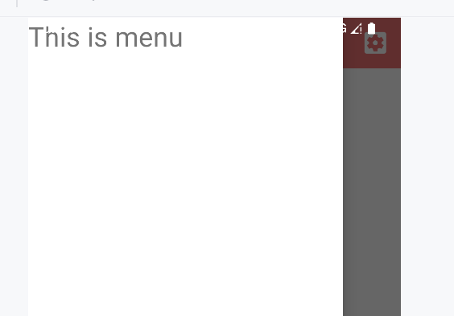
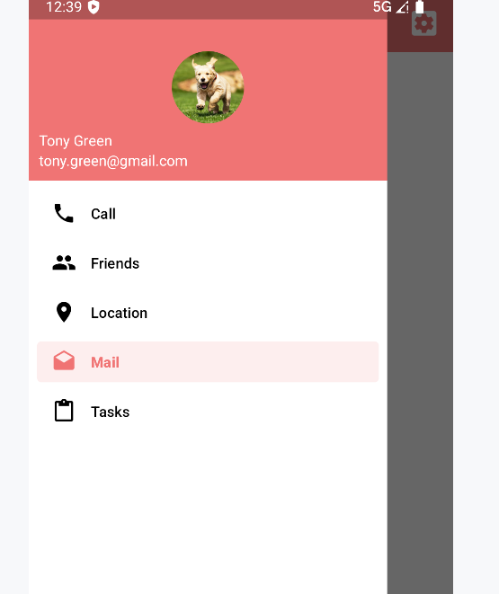

# 滑动菜单

将一些菜单选项隐藏起来，而不是放置在主屏幕上，通过滑动的方式将菜单显示

节省了屏幕空间

## DrawerLayout

布局组件, 允许在布局中放入两个直接的子控件

- DrawerLayout布局第二个内部组件作为滑动窗口的layout
- 第一, 第二个内部组件的类型不做限制
- 第二个内部组件的属性 **android:layout_gravity** 是必须指定的, 用于表示滑动菜单应该在左侧还是右侧
  - left 从左往右出现
  - right  从右往左出现
  - start 依照所在地区的语言习惯, 例如中文从左往右阅读, 就从左往右出现

```xml
<androidx.drawerlayout.widget.DrawerLayout
        xmlns:android="http://schemas.android.com/apk/res/android"
        xmlns:app="http://schemas.android.com/apk/res-auto"
        android:id="@+id/drawerLayout"
        android:layout_width="match_parent"
        android:layout_height="match_parent">
    <FrameLayout
            android:layout_width="match_parent"
            android:layout_height="match_parent">
        <!--主页面的组件...-->
    </FrameLayout>
    <TextView
            android:layout_width="match_parent"
            android:layout_height="match_parent"
            android:layout_gravity="start"
            android:background="#FFF"
            android:text="This is menu"
            android:textSize="30sp" />
</androidx.drawerlayout.widget.DrawerLayout>
```



## Home

用于引导用户使用滑动菜单

例如, 在ToolBar左侧引入导航按钮, 可以划开菜单, 也可以按下打开菜单

### 创建Home键

用原来的**Home**键的, 拿来做进入导航栏的键

```kotlin
override fun onCreate(savedInstanceState: Bundle?) {
    super.onCreate(savedInstanceState)
    setSupportActionBar(binding.toolbar)
    supportActionBar?.run {
        setDisplayHomeAsUpEnabled(true) // 让导航按钮显示出来
        setHomeAsUpIndicator(R.drawable.ic_menu) // 设置导航图标
    }
}
```

### 事件注册

Home键是`android.R.id.home`, 注册其按下的事件

```kotlin
override fun onOptionsItemSelected(item: MenuItem): Boolean {
    when (item.itemId) {
        // ... 
        android.R.id.home -> binding.drawerLayout.openDrawer(GravityCompat.START)
    }
    return true
}
```

顺带一提, 关闭drawer, api如下

```kotlin
binding.drawerLayout.closeDrawers()
```

### 效果


## NavigationView

用于在滑动窗口展示用户信息

### 引入Material依赖

```kotlin
dependencies {
    // Material 依赖
    implementation("de.hdodenhof:circleimageview:3.1.0")
	// 实现图片圆形化的功能的开源库(Apache), 最近一次更新在2020年qwq
    implementation("com.google.android.material:material:1.12.0")
}
```

引入了Material库之后，需要将styles.xml文件中AppTheme的parent改成`Theme.MaterialComponents.Light.NoActionBar`

### headerLayout 布局

放用户头像之类、用户名、邮箱地址之类的

`layout/navigation_header.xml`

```xml
<?xml version="1.0" encoding="utf-8"?>
<RelativeLayout xmlns:android="http://schemas.android.com/apk/res/android"
        android:layout_width="match_parent"
        android:layout_height="180dp"
        android:padding="10dp"
        android:background="@color/my_light_primary">

    <!--用户图像, 使用了CircleImageView将图片圆形化控件-->
    <de.hdodenhof.circleimageview.CircleImageView
            android:id="@+id/iconImage"
            android:layout_width="70dp"
            android:layout_height="70dp"
            android:src="@drawable/nav_icon"
            android:layout_centerInParent="true" /><!--居中显示-->
    <!--用户名-->
    <!--位于mailText组件之上-->
    <TextView
            android:id="@+id/usernameText"
            android:layout_width="wrap_content"
            android:layout_height="wrap_content"
            android:layout_above="@id/mailText"
            android:text="Tony Green"
            android:textColor="#FFFFFF"
            android:textSize="14sp" />
    <!--用户邮箱-->
    <!--位于父组件的底部-->
    <TextView
            android:id="@+id/mailText"
            android:layout_width="wrap_content"
            android:layout_height="wrap_content"
            android:layout_alignParentBottom="true"
            android:text="tony.green@gmail.com"
            android:textColor="#FFFFFF"
            android:textSize="14sp" />

</RelativeLayout>
```


### navigation Menu布局

构建用户信息下面的菜单布局

创建文件`menu/navigation.xml`

menu是用来在NavigationView中显示具体的菜单项的，headerLayout则是用来在 NavigationView中显示头部布局的

```xml
<menu xmlns:android="http://schemas.android.com/apk/res/android">
    <!--group用于给一组有关联的组件的组合, 可以在group上加id属性-->
    <group android:checkableBehavior="single">
        <item
                android:id="@+id/navMenuCall"
                android:icon="@drawable/nav_call"
                android:title="Call" />
        <item
                android:id="@+id/navMenuFriends"
                android:icon="@drawable/nav_friends"
                android:title="Friends" />

        <item
                android:id="@+id/navMenuLocation"
                android:icon="@drawable/nav_location"
                android:title="Location" />
        <item
                android:id="@+id/navMenuMail"
                android:icon="@drawable/nav_mail"
                android:title="Mail" />
        <item
                android:id="@+id/navMenuTask"
                android:icon="@drawable/nav_task"
                android:title="Tasks" />
    </group>
</menu>
```


`group`的属性`checkableBehavior`指定为`single`表示组中的**所有菜单项只能单选**

选中, 即讲话一个被点击的item的背景颜色变成`colorPrimary` , 然后在放手后依然保持"选中"的状态

- `single` 组中只有一个菜单项可以选中，因此会显示单选按钮。
- `all`  所有菜单项均可选中，因此会显示复选框。[不知道如何启动](TODO)
- `none` 所有菜单项均无法选中 (可以点击, 但是无法选中)

### Main 布局

使用NavigationView布局, 将headerLayout的布局和navigation的menu布局注册在activity_main上

```xml
<androidx.drawerlayout.widget.DrawerLayout
        xmlns:android="http://schemas.android.com/apk/res/android"
        xmlns:app="http://schemas.android.com/apk/res-auto"
        android:id="@+id/drawerLayout"
        android:layout_width="match_parent"
        android:layout_height="match_parent">

    <FrameLayout ... /><!--...-->
    </FrameLayout>
    <com.google.android.material.navigation.NavigationView
            android:id="@+id/navView"
            android:layout_width="match_parent"
            android:layout_height="match_parent"
            android:layout_gravity="start"
            app:headerLayout="@layout/navigation_header"
            app:menu="@menu/navigation"/>

</androidx.drawerlayout.widget.DrawerLayout>
```

### 注册Navigation Menu上的点击事件

```kotlin
override fun onCreate(savedInstanceState: Bundle?) {
    super.onCreate(savedInstanceState)
    // ...
    // setCheckedItem 让 Call 菜单项设置被选中
    binding.navigationView.setCheckedItem(R.id.navMenuCall) // 效果就是默认选中
    binding.navigationView.setNavigationItemSelectedListener listener@{ item: MenuItem ->
        // 监听menu item
        when (item.itemId) {
            R.id.navMenuCall -> toast("navigation menu call")
            R.id.navMenuFriends -> toast("navigation menu friends")
            R.id.navMenuLocation -> toast("navigation menu location")
            R.id.navMenuMail -> toast("navigation menu mail")
            R.id.navMenuTask -> toast("navigation menu task")
        }
        return@listener true // 返回true表示此事件已被处理
    }
}
```


### 效果



