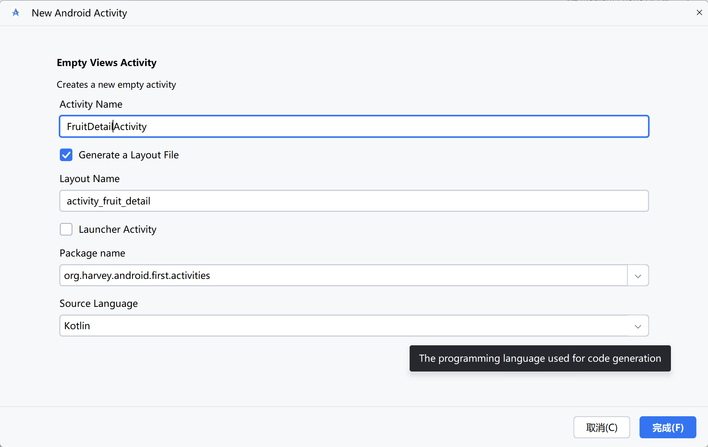
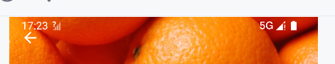

# 可折叠式标题栏

> CollapsingToolbarLayout

限定只能作为AppBarLayout的**直接子布局**来使用

## 创建详情页



### CoordinatorLayout

```xml
<androidx.coordinatorlayout.widget.CoordinatorLayout
        xmlns:android="http://schemas.android.com/apk/res/android"
        xmlns:app="http://schemas.android.com/apk/res-auto"
        android:layout_width="match_parent"
        android:layout_height="match_parent">

</androidx.coordinatorlayout.widget.CoordinatorLayout>
```

### AppBarLayout

CoordinatorLayout内部嵌套AppBarLayout

```xml
<androidx.coordinatorlayout.widget.CoordinatorLayout ...>

    <com.google.android.material.appbar.AppBarLayout
            android:id="@+id/appBar"
            android:layout_width="match_parent"
            android:layout_height="250dp">

    </com.google.android.material.appbar.AppBarLayout>
</androidx.coordinatorlayout.widget.CoordinatorLayout>
```

### CollapsingToolbarLayout

AppBarLayout内部嵌套CollapsingToolbarLayout

```xml
<com.google.android.material.appbar.AppBarLayout ...>

    <com.google.android.material.appbar.CollapsingToolbarLayout
            android:id="@+id/collapsingToolbar"
            android:layout_width="match_parent"
            android:layout_height="match_parent"
            android:theme="@style/ThemeOverlay.AppCompat.Dark.ActionBar"
            app:contentScrim="@color/my_light_primary"
            app:layout_scrollFlags="scroll|exitUntilCollapsed">
    </com.google.android.material.appbar.CollapsingToolbarLayout>

</com.google.android.material.appbar.AppBarLayout>
```

- `app:contentScrim`  指定CollapsingToolbarLayout在趋于折叠状态以及折叠之后的背景色
  - CollapsingToolbarLayout在折叠之后就是一个普通的Toolbar
- `app:layout_scrollFlags`
  - `scroll` CollapsingToolbarLayout会随着内容详情的滚动一起滚动
  - `exitUntilCollapsed`  CollapsingToolbarLayout随着滚动完成折叠之后就保留在界面上，不再移出屏幕

### CollapsingToolbarLayout内部布局

```xml
<com.google.android.material.appbar.CollapsingToolbarLayout ...>
    <ImageView
            android:id="@+id/fruitImageView"
            android:layout_width="match_parent"
            android:layout_height="match_parent"
            android:contentDescription="fruit main..."
            android:scaleType="centerCrop"
            app:layout_collapseMode="parallax" />

    <androidx.appcompat.widget.Toolbar
            android:id="@+id/toolbar"
            android:layout_width="match_parent"
            android:layout_height="?attr/actionBarSize"
            app:layout_collapseMode="pin" />
</com.google.android.material.appbar.CollapsingToolbarLayout>
```

`app:layout_collapseMode`  指定当前控件在CollapsingToolbarLayout折叠过程中的折叠模式

- `pin`  Toolbar指定成pin，在折叠的过程中位置始终保持不变
- `parallax` ImageView指定成parallax，在折叠的过程中产生一定的错位偏移，产生比较好的视觉效果

### NestedScrollView

在详情布局上使用NestedScrollView. 

一般的TextView, 即使文本过长了, 也不会滚动, 只有外面包围ScrollView或者RecyclerView这样的布局才能滚动

NestedScrollView需要和 CollapsingToolbarLayout 平级

也需要像Toolbar一样通过app:layout_behavior属性指定了一个布局行为"@string/appbar_scrolling_view_behavior"

```xml
<androidx.coordinatorlayout.widget.CoordinatorLayout ...>

    <com.google.android.material.appbar.AppBarLayout ...>
		<!--...-->
    </com.google.android.material.appbar.AppBarLayout>

    <androidx.core.widget.NestedScrollView
            android:layout_width="match_parent"
            android:layout_height="match_parent"
            app:layout_behavior="@string/appbar_scrolling_view_behavior">

    </androidx.core.widget.NestedScrollView>
</androidx.coordinatorlayout.widget.CoordinatorLayout>
```

NestedScrollView在ScrollView的基础之上还增加了发送嵌套响应滚动事件通知

用CoordinatorLayout监听到NestedScrollView的响应事件, 然后将Bar和ScrollView两部分共同协作, 实现折叠Bar的效果

### 详情信息布局

在NestedScrollView里嵌套LinearLayout, 在LinearLayout里面进行详情布局

```xml
<androidx.core.widget.NestedScrollView ...>
    <LinearLayout
            android:orientation="vertical"
            android:layout_width="match_parent"
            android:layout_height="wrap_content">

        <com.google.android.material.card.MaterialCardView
                android:layout_width="match_parent"
                android:layout_height="wrap_content"
                android:layout_marginBottom="15dp"
                android:layout_marginLeft="15dp"
                android:layout_marginRight="15dp"
                android:layout_marginTop="35dp"
                app:cardCornerRadius="4dp">

            <TextView
                    android:id="@+id/fruitContentText"
                    android:layout_width="wrap_content"
                    android:layout_height="wrap_content"
                    android:layout_margin="10dp" />

        </com.google.android.material.card.MaterialCardView>

    </LinearLayout>
</androidx.core.widget.NestedScrollView>
```

### 悬浮按钮

```xml
<androidx.coordinatorlayout.widget.CoordinatorLayout >

    <com.google.android.material.appbar.AppBarLayout ...>
        ...
    </com.google.android.material.appbar.AppBarLayout>

    <androidx.core.widget.NestedScrollView ...>
        ...
    </androidx.core.widget.NestedScrollView>

    <com.google.android.material.floatingactionbutton.FloatingActionButton
            android:layout_width="wrap_content"
            android:layout_height="wrap_content"
            android:layout_margin="16dp"
            android:src="@drawable/ic_comment"
            app:layout_anchor="@id/appBar"
            app:layout_anchorGravity="bottom|end"
            android:contentDescription="TODO" />
</androidx.coordinatorlayout.widget.CoordinatorLayout>
```

设置`app:layout_anchor` 锚点为 `"@id/appBar"`, 将悬浮按钮设置在水果标题栏的区域内

设置`app:layout_anchorGravity="bottom|end"` 设置位置

### 详情页Activity逻辑

```kotlin
class FruitDetailActivity :
    BaseActivity<ActivityFruitDetailBinding>(ActivityFruitDetailBinding::inflate) {
    companion object {
        const val FRUIT_NAME = "fruit_name"
        const val FRUIT_IMAGE_ID = "fruit_image_id"

        fun putExtra(intent: Intent, fruit: Fruit) {
            intent.putExtra(FRUIT_NAME, fruit.name)
            intent.putExtra(FRUIT_IMAGE_ID, fruit.imageId)
        }
    }

    override fun onCreate(savedInstanceState: Bundle?) {
        super.onCreate(savedInstanceState)
        val fruitName = intent.getStringExtra(FRUIT_NAME) ?: ""
        val fruitImageId = intent.getIntExtra(FRUIT_IMAGE_ID, 0)
        setSupportActionBar(binding.toolbar)
        supportActionBar?.setDisplayHomeAsUpEnabled(true)
        binding.collapsingToolbar.title = fruitName
        Glide.with(this).load(fruitImageId).into(binding.fruitImageView)
        binding.fruitContentText.text = generateFruitContent(fruitName)
    }

    override fun onOptionsItemSelected(item: MenuItem): Boolean {
        when (item.itemId) {
            android.R.id.home -> {
                // home键就是关闭此页面
                finish()
                return true
            }
        }
        return super.onOptionsItemSelected(item)
    }

    /**
     * 构造假数据
     */
    private fun generateFruitContent(fruitName: String) = fruitName.repeat(500)
}
```

### 注册RecyclerView的item点击事件

```kotlin
class FruitRecyclerAdapter(val context: Context, data: List<Fruit>) :
    BaseAdapter<Fruit, FruitItemLayoutBinding>(data, FruitItemLayoutBinding::inflate) {

    override fun onItemClicked(
        view: View, position: Int, item: Fruit, holder: ViewHolder<FruitItemLayoutBinding>
    ) {
        // 转变Activity
        val intent = Intent(context, FruitDetailActivity::class.java).apply {
            FruitDetailActivity.putExtra(this, item)
        }
        context.startActivity(intent)
    }

    /**
     * 初始化ItemView
     */
    override fun onBindViewHolder(holder: FruitViewHolder, position: Int) {
        // ...
    }
}
```

### 效果展示

<video src="../../assets/Day13-可折叠式标题栏/折叠式标题栏演示.mp4"></video>

标题栏上的演示可以更加丰富, 然后可以根据滚动进行折叠

## 充分利用系统状态栏空间

将背景图和系统状态栏(就是显示时间信号,电量通知那一栏)融合到一起

Android 16在不进行下面配置的情况下已经是很好地融合了, 但是Android 13 还不会进行这种配置

### 应用页面匹配系统视窗

使用**`android:fitsSystemWindows`**属性来实现

将该属性设置为`true`, 也就是将应用的显示范围, 从系统状态栏之下的部分, 扩展到整个包括系统的窗口

也就是说, 加属性`android:fitsSystemWindows`, 需要从ImageView开始, **一直往外加, 加到最外层布局才行**

设置activity的布局xml, 在ImageView外的各层添加属性`android:fitsSystemWindows="true"`

```xml
<?xml version="1.0" encoding="utf-8"?>
<androidx.coordinatorlayout.widget.CoordinatorLayout xmlns:android="http://schemas.android.com/apk/res/android"
        xmlns:app="http://schemas.android.com/apk/res-auto"
        android:fitsSystemWindows="true"...>

    <com.google.android.material.appbar.AppBarLayout
            android:fitsSystemWindows="true"...>
        <!--折叠式Toolbar-->
        <com.google.android.material.appbar.CollapsingToolbarLayout
                android:fitsSystemWindows="true"...>

            <ImageView
                    android:fitsSystemWindows="true".../>
			<!--Toolbar-->
        </com.google.android.material.appbar.CollapsingToolbarLayout>

    </com.google.android.material.appbar.AppBarLayout>
    <!--滚动-->
    <!--悬浮按钮-->
</androidx.coordinatorlayout.widget.CoordinatorLayout>
```

### 自定义主题

自定义一个详情页的theme, 把系统栏的颜色改成透明`@android:color/transparent`

```xml
<resources>
    <!-- Base application theme. -->
    <style name="Base.Theme.FirstAndroid" parent="Theme.MaterialComponents.Light.NoActionBar">
        <!-- Customize your light theme here. -->
        <item name="colorPrimary">@color/my_light_primary</item>
        <item name="colorPrimaryDark">@color/my_dark_primary</item>
        <item name="colorSecondary">@color/accent</item>
        <item name="android:windowBackground">#FFFFFF</item>
    </style>

    <style name="Theme.FirstAndroid" parent="Base.Theme.FirstAndroid" />

    <!--给Fruit详情页的theme-->
    <style name="Theme.FruitDetail" parent="Base.Theme.FirstAndroid">
        <item name="android:statusBarColor">@android:color/transparent</item>
    </style>
</resources>
```

### 注册theme

在Manifest注册theme

```xml
<activity
        android:name=".activities.FruitDetailActivity"
        android:exported="false"
        android:theme="@style/Theme.FruitDetail"/>
```

### 效果演示



