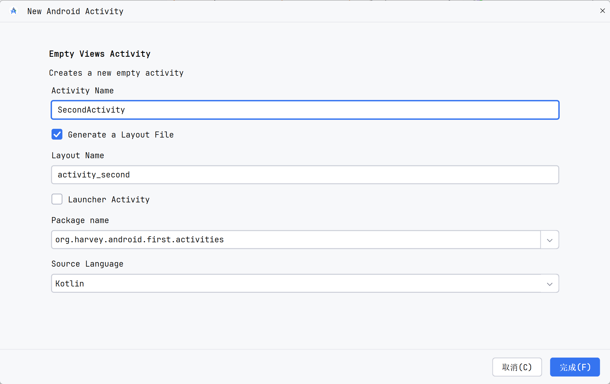

# Intent

多个Activity之间的跳转

Intent用于Android程序中各组件之间的交互

指明当前组件想要执行的动作

在不同组件之间传递数据

可用于启动Activity, 启动Service, 发送广播等场景

-   显式Intent
-   隐式Intent

## 准备

创建一个新的Activity




注册Manifest

```xml
<activity
        android:name=".activities.SecondActivity"
        android:label="Second Activity"
        android:exported="false" />
```


## 显式Intent

用构造器构建

```java
public Intent(Context packageContext, Class<?> cls)
```

-   Context要求提供一个启动Activity的上下文
-   Class用于指定想要启动的目标Activity

修改Button的点击事件回调逻辑

```kotlin
binding.button1.setOnClickListener {
    val go2ndIntent = Intent(this, SecondActivity::class.java)
    super.startActivity(go2ndIntent)
}
```

写一个工具方法

```kotlin
inline fun <reified T:Any> Context.newIntent(): Intent {
    return Intent(this, T::class.java)
}
```


## 隐式Intent

不明确指出启动的目标Activity, 而是指定一些里action和category

交由系统分析Intent, 找出合适的Activity启动

合适的Activity指的是响应这个隐式Intent的Activity

在manifest的activity中配置intent-fileter

```xml
<activity
        android:name=".activities.SecondActivity"
        android:label="Second Activity"
        android:exported="true" >
    <intent-filter>
        <action android:name="org.harvey.android.first.activities.ACTION_START" />
        <category android:name="android.intent.category.DEFAULT" />
    </intent-filter>
</activity>
```

-   `<action>` 标签指明当前Activity可以响应`ACTION_START`这一action
-   `<action>` 的值`....activities.ACTION_START`是一种**规范**, 防止和全局的ACTION重复, 没有强制的要求
-   `<category>` 标签包含附加信息, 更精确地指明了当前Activity能够响应的Intenet中还可能带有category

使用的构造器的声明

```java
public Intent(String action)
```

-   action的值叮当和配置的`<action>`标签值匹配
-   由于`<category>`中使用的是`DEFAULT`的选项, 有关的`<category>`的匹配发生在调用``startActivity()`方法的时候, `startActivity()`方法会自动将这个category添加到Intent中

使用隐式的Intent

```kotlin
binding.button1.setOnClickListener {
    val go2ndIntent = Intent("org.harvey.android.first.activities.ACTION_START")
    super.startActivity(go2ndIntent)
}
```


Intent只允许拥有一个Action, 但是允许拥有多个Category

允许使用`Intent#addCategory()`方法在Intent中指定多个category

在manifest的配置中也同步多个Category

```xml
<activity
        android:name=".activities.SecondActivity"
        android:label="Second Activity"
        android:exported="true">
    <intent-filter>
        <action android:name="org.harvey.android.first.activities.ACTION_START" />
        <category android:name="android.intent.category.DEFAULT" />
        <category android:name="org.harvey.android.first.MY_CATEGORY" />
    </intent-filter>
</activity>
```

在Kotlin的配置

```kotlin
binding.button1.setOnClickListener {
    val go2ndIntent = Intent("org.harvey.android.first.activities.ACTION_START")
    go2ndIntent.addCategory("org.harvey.android.first.MY_CATEGORY")
    super.startActivity(go2ndIntent)
}
```


如果能用[配置解耦CATEGORY和ACTION这两常量, 同时能在xml和kotlin中获取就好了](TODO)


## 依据隐式Intent跳转其他应用

例如跳转系统浏览器展示网页

```kotlin
binding.button1.setOnClickListener {
    val intent = Intent(Intent.ACTION_VIEW)
    intent.data = "https://www.baidu.com".toUri()
    super.startActivity(intent)
}
```

跳转电话应用, 进行拨号

```kotlin
binding.button1.setOnClickListener {
    val intent = Intent(Intent.ACTION_DIAL)
    intent.data = "tel:10086".toUri() // String.toUri 是 KTX 的扩展
    startActivity(intent)
}
```


## 传递数据

### 从上游发送给下游

上游Activity发送数据

```kotlin
binding.button1.setOnClickListener {
    val intent = Intent(this, SecondActivity::class.java)
    // 放入 key-value
    val key = "extra_data"
    val data = "Hello SecondActivity"
    intent.putExtra(key, data)
    startActivity(intent)
}
```

在下游的Activity的`onCreate`接收数据

```kotlin
class SecondActivity : AppCompatActivity() {
    override fun onCreate(savedInstanceState: Bundle?) {
        super.onCreate(savedInstanceState)
        setContentView(R.layout.activity_second)
        val extraData = super.intent.getStringExtra("extra_data")
        toastShow(this, "extra data is $extraData") // 自己写的工具方法
    }
}
fun toastShow(context: Context, text: String) {
    Toast.makeText(
        context, text, Toast.LENGTH_SHORT
    ).show()
}

```

### 从下游返回数据给上游

在上游准备好接收到下游传回数据的回调

```kotlin
val launcher = registerForActivityResult(StartActivityForResult()) { result ->
    if (result.resultCode == RESULT_OK) {
        val data = result.data?.getStringExtra("return_data")
        toastShow(this@MainActivity, "get it! $data")
    }
}

override fun onCreate(savedInstanceState: Bundle?) {
    super.onCreate(savedInstanceState)
    binding = ActivityMainBinding.inflate(super.layoutInflater)
    val view: View = binding.getRoot()
    setContentView(view)
    binding.button1.setOnClickListener {
        // 往下游发送
        val intent = Intent(this, SecondActivity::class.java)
        // 同时, launcher也定义了接收到返回后的逻辑
        // 由于在intent上定义了发送到下游的路径, 那么也就不需要RequestCode
        launcher.launch(intent)
    }
}
```


在下游发送数据

使用成员`onBackPressedDispatcher`, 用`addCallback`增加回调函数

可以添加多个回调，并且这些回调会按照它们添加的相反顺序执行

OnBackPressedCallback的参数`enable`, 用于决定是否启用

`OnBackPressedCallback`的实例对象也可以设置`isEnabled`来决定是否可用

```kotlin
class SecondActivity : AppCompatActivity() {
    private var binding: ActivitySecondBinding by LazyConstant()
    override fun onCreate(savedInstanceState: Bundle?) {
        super.onCreate(savedInstanceState)
        binding = ActivitySecondBinding.inflate(super.layoutInflater)
        val view: View = binding.getRoot()
        setContentView(view)
        // 可以添加多个回调，并且这些回调会按照它们添加的相反顺序执行
        // enable = true, 用OnBackPressedCallback.isEnabled属性可以动态配置
        onBackPressedDispatcher.addCallback(object : OnBackPressedCallback(true) {
            override fun handleOnBackPressed() {
                Log.d("SecondActivity", "call 2")
                finish()
            }
        })
        onBackPressedDispatcher.addCallback(object : OnBackPressedCallback(true) {
            override fun handleOnBackPressed() {
                Log.d("SecondActivity", "call 1")
                val intent = Intent()
                intent.putExtra("return_data", "Hello MainActivity")
                setResult(RESULT_OK, intent)
                isEnabled = false // 当前回调失效
                onBackPressedDispatcher.onBackPressed()// 再次触发, 此时触发call 2
            }
        })
    }
}
```

## 传递对象

- Serializable 
- Parcelable 将对象进行分解封装

### Serializable

类实现java.io.Serializable

```kotlin
class Person(val name: String = "", val age: Int = 0) : Serializable
```


发送

```kotlin
intent.putExtra("person_data", person)
```

接收

```kotlin
if (support(Build.VERSION_CODES.TIRAMISU)) {
    val person = intent.getSerializableExtra("person_data", Person::class.java)
}
```

### Parcelable

```kotlin
class Person(val name: String = "", val age: Int = 0) : Parcelable {
    override fun describeContents(): Int {
        TODO(
            """
            return 0, 表示是一个普通的Parcelable; 
            返回CONTENTS_FILE_DESCRIPTOR=1, 表示是给的ParcelFileDescriptor预留的
        """.trimIndent()
        )

    }

    override fun writeToParcel(dest: Parcel, flags: Int) {
        TODO("将本对象的数据写到parcel里面去")
    }

    companion object CREATOR : Parcelable.Creator<Person> {
        override fun createFromParcel(source: Parcel?): Person? {
            TODO("从Parcelable读取数据, 用这些数据创建对象")
        }

        override fun newArray(size: Int): Array<out Person?>? {
            TODO("初始化数组")
        }
    }
}
```

实现

```kotlin
class Person(val name: String = "", val age: Int = 0) : Parcelable {
    override fun describeContents(): Int {
        return 0
    }

    override fun writeToParcel(dest: Parcel, flags: Int) {
        dest.writeString(name)
        dest.writeInt(age)
    }

    companion object CREATOR : Parcelable.Creator<Person> {
        override fun createFromParcel(source: Parcel): Person? {
            val name = source.readString() ?: ""
            val age = source.readInt()
            return Person(name, age)
        }

        override fun newArray(size: Int): Array<out Person?>? {
            return arrayOfNulls(size)
        }
    }
}
```

发送

```kotlin
intent.putExtra("person_data", person)
```

接收

```kotlin
if (support(Build.VERSION_CODES.TIRAMISU)) {
    val person = intent.getParcelableExtra("person_data", Person::class.java)
}
```

### @Parcelize

另一种写法, 需要在**模块 Model**里安装插件

```kotlin
plugins {
    // ...
    id("kotlin-parcelize")
}
```

使用注解

```kotlin
import kotlinx.parcelize.Parcelize

@Parcelize
class Person(val name: String = "", var age: Int = 0) : Parcelable
```

需要扩展, 可以使用下面的写法

```kotlin
@Parcelize
data class User(val firstName: String, val lastName: String, val age: Int) : Parcelable {
    private companion object : Parceler<User> {
        override fun User.write(parcel: Parcel, flags: Int) {
            // Custom write implementation
        }

        override fun create(parcel: Parcel): User {
            // Custom read implementation
        }
    }
}
```

这种伴随的写法, 也能在类外进行扩展(当类内部无法写入时)

```kotlin
class ExternalClass(val value: Int)

object ExternalClassParceler : Parceler<ExternalClass> {
    override fun create(parcel: Parcel) = ExternalClass(parcel.readInt())

    override fun ExternalClass.write(parcel: Parcel, flags: Int) {
        parcel.writeInt(value)
    }
}
```

对于成员也是对象的, 嵌套的比较复杂的类型, 可以使用`@WriteWith`和`@TypeParceler`注解

```kotlin
// Class-local parceler
@Parcelize
@TypeParceler<ExternalClass, ExternalClassParceler>()
class MyClass(val external: ExternalClass) : Parcelable

// Property-local parceler
@Parcelize
class MyClass(@TypeParceler<ExternalClass, ExternalClassParceler>() val external: ExternalClass) : Parcelable

// Type-local parceler
@Parcelize
class MyClass(val external: @WriteWith<ExternalClassParceler>() ExternalClass) : Parcelable
```

### @IgnoredOnParcel

可以跳过序列化
