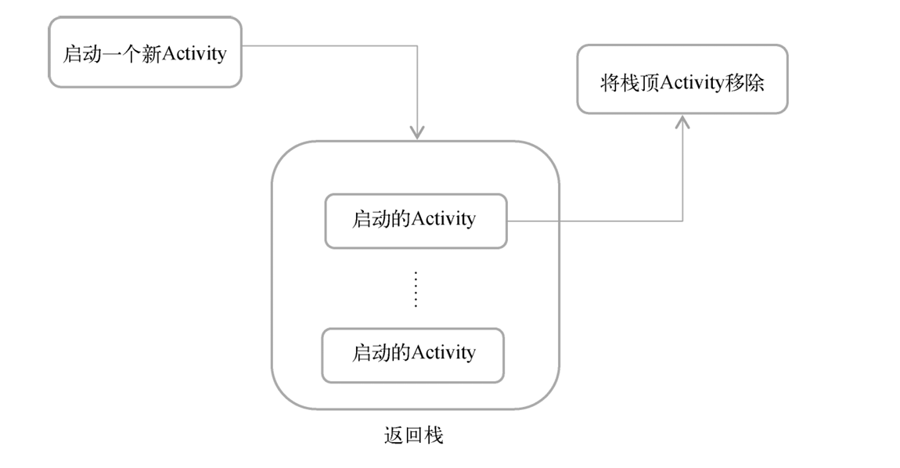
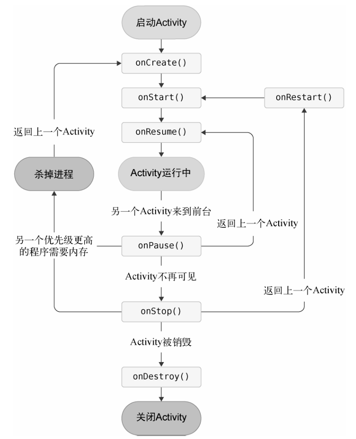

# 生命周期

## 返回栈

每启动一个 新的Activity，就会覆盖在原Activity之上

点击Back键(or finish())会销毁最上面的Activity，下面的 一个Activity就会重新显示出来

Android 使用任务（task）来管理Activity

一个任务就是一组存放在栈里的 Activity 的集合，这个栈也被称作返回栈（back stack）



## 状态

### 运行状态

一个Activity**位于返回栈的栈顶**时处于的状态

处于运行状态的Activity系统不会回收

### 暂停状态

一个Activity**不再处于栈顶**位置，但**仍然可见**时处于的状态

并不是每一个Activity都会占满整个屏幕，比如对话框形式的Activity只会占用屏幕中间的部分区域

处于暂停状态的 Activity仍然是**完全存活**着的，系统也不回收

只有在**内存极低**的情况下，系统才会去考虑**回收**这种Activity

### 停止状态

一个Activity**不再处于栈顶**位置，但**完全不可见**时处于的状态

系统仍然会为这种Activity保存相应的状态和成员变量，但是这并**不是完全可靠的**

当**其他地方需要内存**时，处于停止状态的Activity有**可能会被系统回收**


### 销毁状态

一个Activity**从返回栈中移除**后就变成了销毁状态

系统最倾向于回收处于这种状态的 Activity，以保证手机的内存充足

## 生存期

### 生命周期方法

-   onCreate()。

    -   Activity第一次被创建的时候调用
    -   在这个方法中完成Activity的初始化操作，比如**加载布局**、**绑定事件**等

-   onStart()

    -   Activity由不可见变为可见的时候调用

-   onResume()

    -   Activity准备好和用户进行交互的时候调用
    -   此时的Activity一定位于返回栈的栈顶，并且处于运行状态

-   onPause()

    -   系统准备去启动或者恢复(无论是否完全遮盖, 都调用)另一个Activity的时候调用
    -   通常会这个方法中将一些消耗CPU的资源释放掉，以及保存一些关键数据
    -   *这个方法的执行速度一定要快，不然会影响到新的栈顶Activity的使用*

-   onStop()

    -   Activity完全不可见的时候调用

    -   和onPause()方法的主要区别

        如果启动的新Activity是一个**对话框式的Activity**，那么onPause()方法会得到执行，而onStop()方法并不会执行

-   onDestroy()

    -   Activity被销毁之前调用，之后Activity的状态将变为销毁状态

-   onRestart()

    -   Activity由**停止状态**变为**运行状态**之前调用，也就是Activity被重新启动了




### 完整生存期

Activity在onCreate()方法和onDestroy()方法之间所经历的就是**完整生存期**

在`onCreate()`方法中**完成各种初始化**操作

在`onDestroy()`方法中**完成释放内存**的操作


### 可见生存期

Activity在onStart()方法和onStop()方法之间所经历的就是**可见生存期**

在可见生存期内，Activity对于用户总是可见的，即便有可能无法和用户进行交互

通过这两个方法合理地**管理**那些**对用户可见的资源**, 从而保证处于停止状态的Activity不会占用过多内存

在`onStart()`方法中**加载资源**

而在`onStop()`方法中**释放资源**


### 前期生存期

Activity在onResume()方法和onPause()方法之间所经历的就是**前台生存期**

Activity总是处于运行状态，此时的Activity是可以和用户进行交互的

平时看到和接触最多的就是这个状态下的Activity


## 被回收

从栈顶的`Activity` **Back**到**被回收**的`Activity`时候, 这时并不会执行 `onRestart()` 方法，而是会**执行被回收 `Activity` 的`onCreate()`方法**

被回收的`Activity` 可能存在临时数据和状态(例如输入的数据), 这些数据可能会被回收而消失

### Bundle

**`onSaveInstanceState()`**回调方法，可以保证在 Activity**被回收之前一定会被调用**

回调方法提供 **参数Bundle** 基于**键值对**用于**保存数据**

```kotlin
override fun onSaveInstanceState(outState: Bundle) {
    super.onSaveInstanceState(outState)
    outState.putString("data_key", "temp data")
}
```

`onCreate`上的Bundle, 在正常创建的时候, 此实例为**null**

从回收后恢复的情况下, Bundle将具有从`onSaveInstanceState`设置的值

```kotlin
override fun onCreate(savedInstanceState: Bundle?) {
    super.onCreate(savedInstanceState)
    // ...
    if (savedInstanceState != null) {
        val data = savedInstanceState.getString("data_key")
        toastShow(this, data!!)
    }
    // ...
}
```

Intent 和 Bundle 十分类似, Bundle 也可以依凭 Intent 传递数据

1.  需要传递的数据都保存在Bundle对象中
2.  将Bundle对象存放在 Intent里
3.  到了目标Activity之后，从Intent中取出Bundle
4.  从Bundle中取出数据

### 屏幕旋转

屏幕发生旋转的时候，**Activity**也会经历一个**重新创建**的过程，因而在这种情况 下，Activity中的数据也会丢失。

同样可以通过`onSaveInstanceState()`方法 来解决，但是一般不建议

对于横竖屏旋转造成的重新创建问题，使用 ViewModel 解决, 此处略

## 实践与使用

### 准备

创建NormalActivity和DialogActivity, 

```kotlin
class NormalActivity : AppCompatActivity() {
    private var binding: ActivityNormalBinding by LazyConstant()

    override fun onCreate(savedInstanceState: Bundle?) {
        super.onCreate(savedInstanceState);
        binding = ActivityNormalBinding.inflate(super.layoutInflater);
        val view: View = binding.getRoot();
        setContentView(view); // 替换传统的setContentView
    }
}
```

和

```kotlin
class DialogActivity : AppCompatActivity() {
    private var binding: ActivityDialogBinding by LazyConstant()

    override fun onCreate(savedInstanceState: Bundle?) {
        super.onCreate(savedInstanceState);
        binding = ActivityDialogBinding.inflate(super.layoutInflater);
        val view: View = binding.getRoot();
        setContentView(view); // 替换传统的setContentView
    }
}
```

加上layout的相关提示文本

编辑 activity_dialog.xml

```xml
<LinearLayout xmlns:android="http://schemas.android.com/apk/res/android"
        android:orientation="vertical"
        android:layout_width="match_parent"
        android:layout_height="match_parent">
    <TextView
            android:layout_width="match_parent"
            android:layout_height="wrap_content"
            android:text="This is a dialog activity"
            />
</LinearLayout> 
```

编辑 activity_normal.xml

```xml
<LinearLayout xmlns:android="http://schemas.android.com/apk/res/android"
        android:orientation="vertical"
        android:layout_width="match_parent"
        android:layout_height="match_parent">
    <TextView
            android:layout_width="match_parent"
            android:layout_height="wrap_content"
            android:text="This is a normal activity"
            />
</LinearLayout>
```

编辑manifest

```xml
<activity
        android:name=".activities.DialogActivity"
        android:label="Dialog"
        android:exported="true" />
<activity
        android:name=".activities.NormalActivity"
        android:label="Normal"
        android:exported="true" />
```

设置两个Main的layout, activity_main.xml, 两个按钮

```xml
<Button
        android:id="@+id/button1"
        android:layout_width="match_parent"
        android:layout_height="wrap_content"
        android:layout_marginTop="100dp"
        android:text="Button to Normal" />
<Button
        android:id="@+id/button2"
        android:layout_width="match_parent"
        android:layout_height="wrap_content"
        android:layout_marginTop="0dp"
        android:text="Button to Dialog" />
```

这两个按钮分别跳转到两个Activity

```kotlin
class MainActivity : AppCompatActivity() {
    private var binding: ActivityMainBinding by LazyConstant()

    override fun onCreate(savedInstanceState: Bundle?) {
        super.onCreate(savedInstanceState);
        binding = ActivityMainBinding.inflate(super.layoutInflater);
        val view: View = binding.getRoot();
        setContentView(view); // 替换传统的setContentView

        binding.button1.setOnClickListener {
            val intent = Intent(this, NormalActivity::class.java)
            startActivity(intent)
        }
        binding.button2.setOnClickListener {
            val intent = Intent(this, DialogActivity::class.java)
            startActivity(intent)
        }
    }
}
```

在manifest将DialogActivity设置Theme成Dialog

```xml
<activity
        android:name=".activities.DialogActivity"
        android:label="Dialog"
        android:theme="@style/Theme.AppCompat.Dialog"
        android:exported="true" />
```

### 在生命周期钩子Log

```kotlin
class MainActivity : AppCompatActivity() {
    private var binding: ActivityMainBinding by LazyConstant()
    companion object{
        const val TAG = "MainActivity"
    }

    override fun onCreate(savedInstanceState: Bundle?) {
        Log.d(TAG, "onCreate")
        super.onCreate(savedInstanceState);
        // ...
    }


    override fun onStart() {
        Log.d(TAG, "onStart")
        super.onStart()
    }

    override fun onResume() {
        Log.d(TAG, "onResume")
        super.onResume()
    }

    override fun onPause() {
        Log.d(TAG, "onPause")
        super.onPause()
    }

    override fun onStop() {
        Log.d(TAG, "onStop")
        super.onStop()
    }

    override fun onDestroy() {
        Log.d(TAG, "onDestroy")
        super.onDestroy()
    }

    override fun onRestart() {
        Log.d(TAG, "onRestart")
        super.onRestart()
    }
}
```

### 日志观察

1.  打开应用

    

2.  打开 Normal Activity

    

3.  返回 Normal Activity 到Main Activity

    

4.  打开Dialog Activity

    

5.  此时返回Dialog Activity 到 Main Activity

    

6.  退出程序

    

