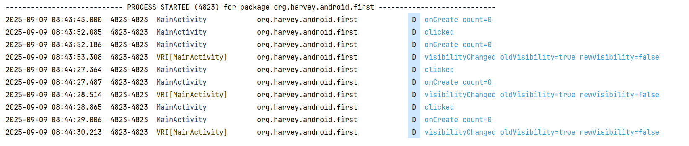

# 启动模式

-   standard 默认
-   singleTop
-   singleTask
-   singleInstance

在`AndroidManifest.xml`中通过给标签指定` android:launchMode`属性来选择启动模式

```xml
<activity
        android:name=".MainActivity"
        android:launchMode="standard"
        ...>
    <!--...-->
</activity>
```

## standard

每当启动一个新的Activity，它就会在返回栈中入栈，并处于栈顶的位置

系统不会在乎这个Activity是否已经在返回栈中存在，**每次启动都会创建一个该 Activity的新实例**

例如, 在MainActivity启动MainActivity, 依旧会创建新的Activity, 而不会复用旧的Activity

```kotlin
class MainActivity : AppCompatActivity() {
    private var count = 0
    override fun onCreate(savedInstanceState: Bundle?) {
        Log.d(TAG, "onCreate count=${count++}")
        // ...
        binding.button1.setOnClickListener {
            val intent = Intent(this, MainActivity::class.java)
            startActivity(intent)
        }
    }

}
```



每次都是新的实例

## singleTop

栈顶是目标Activity, 则不会重新创建, 而是直接复用

不过如果不是栈顶, 则依旧创建新的实例


## singleTask

让某个Activity在整个应用程序的上下文中只存在一个实例

-   系统首先会在返回栈中检查是否存在该Activity的实例
    -   如果发现已经存在则直接使用该实例， 并把在这个Activity之上的所有其他Activity统统**出栈**
    -   如果没有发现就会创建一个新的 Activity实例


## singleInstance

指定为singleInstance模式的Activity会启用一个新的返回栈来管理这个Activity

用于将这个Activity开放给外界App使用

如果Activity和开放该外界App, 但是这个Activity没有独立的返回栈, 和本App的其他Activity共用一个返回栈, 那么外界App访问到这个App后返回的时候, 就会返回到这个Activity在这个App的返回栈

1.  A->B(设置为singleInstance)->C
2.  A和C会在一个栈, B单独一个栈
3.  从C 返回(BACK), 直接进入A
4.  从A 返回(BACK), A 的所在的返回栈为空, 则进入B所在的栈, 也就是显示B

```kotlin
Log.d(TAG, "onCreate taskId=${super.taskId}")
```

可以观察处于哪个返回栈


