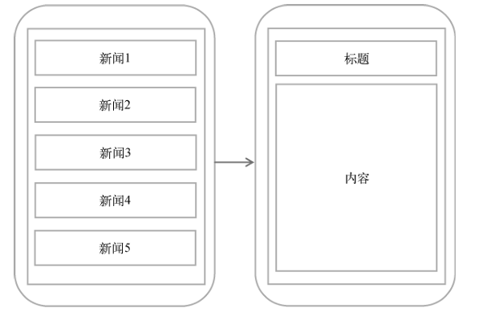
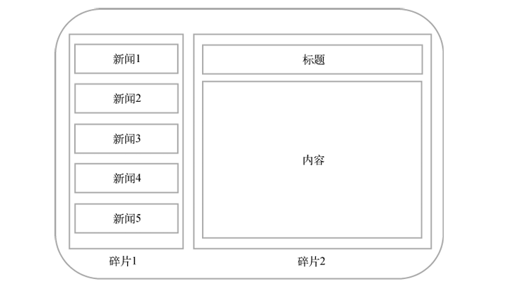

# 简介

兼顾手机和平板的开发, 防止尺寸不同导致界面在视觉效果上有较大的差异

Fragment是一种可以嵌入在Activity当中的UI片段，它能让程序更加合理和充分地利用大屏幕的空间

和Activity一样，都能包含布局，有自己的生命周期

例如, 在新闻软件的设计中, 如果在手机上，可以将新闻标题列表放在一个Activity中，将新闻的详细内容放在另一个Activity中

在平板上, 不应该简单地拉长, 而是将新闻和详情放在一个界面

当前版本似乎没有平板的模拟器, 那么久用桌面举例子吧...

