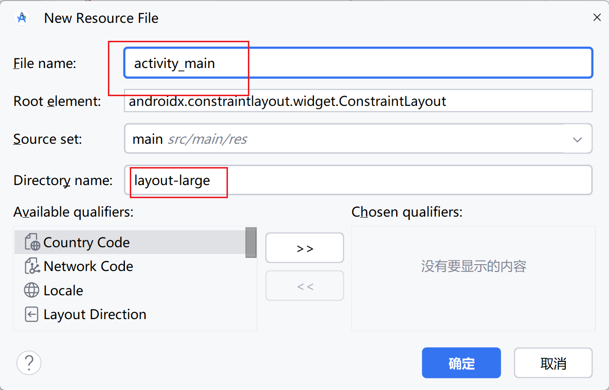
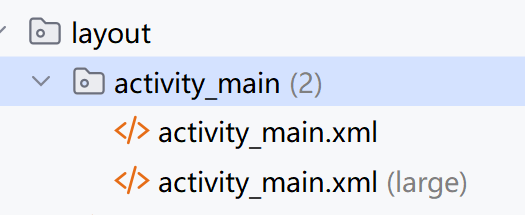
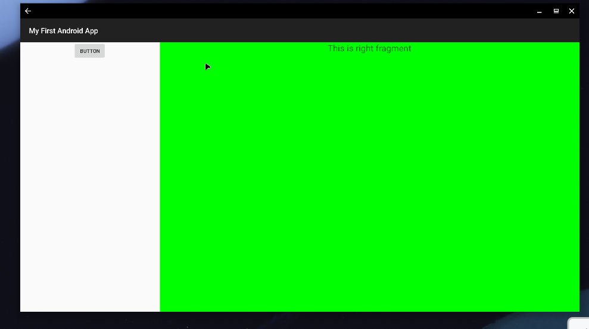
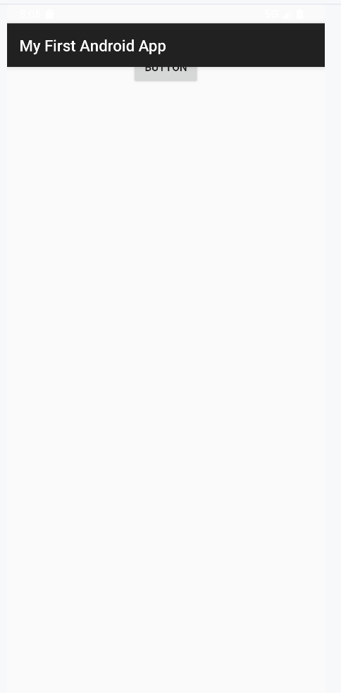
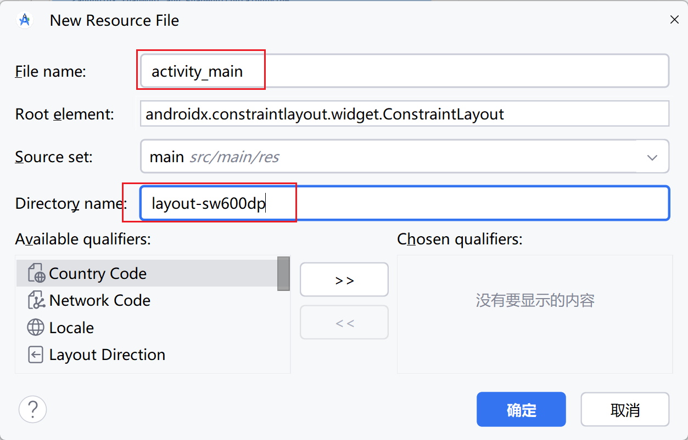
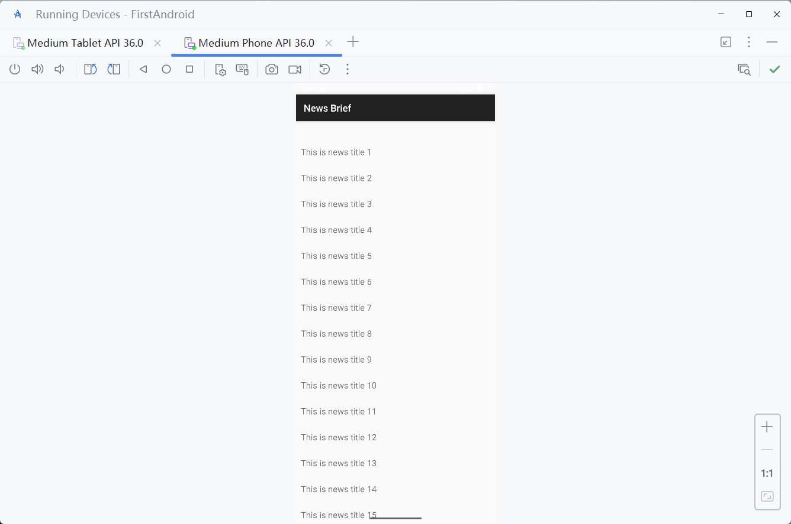
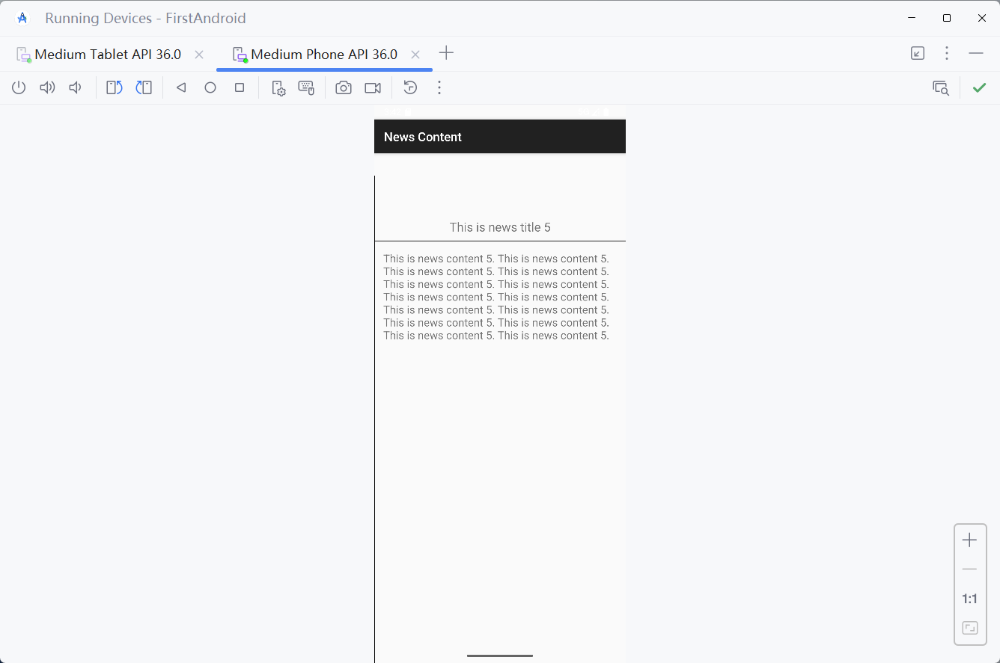
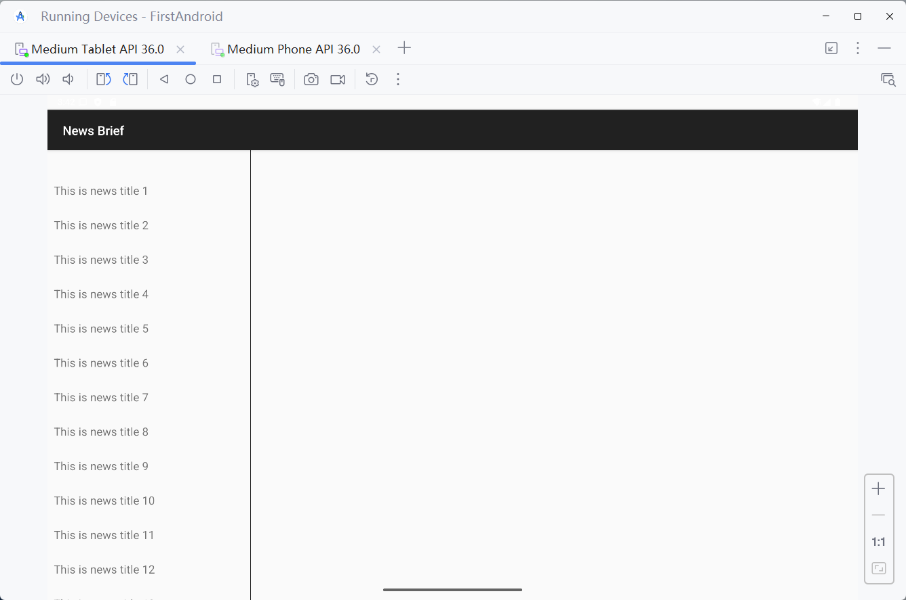
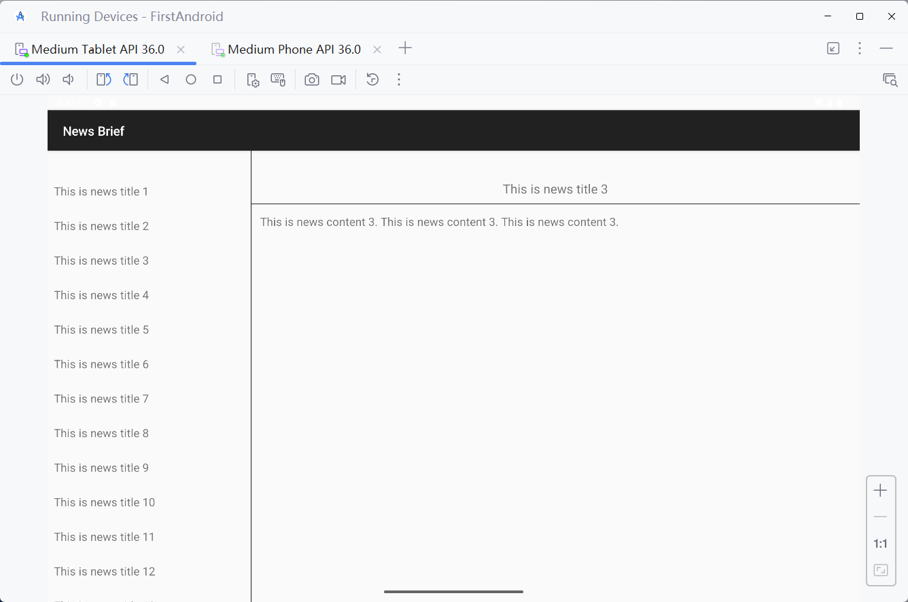

# 动态加载布局

程序能够根据设备的分辨率或屏幕大小，在运行时决定加载哪个布局

使用动态加载布局, binding对于其布局的控件, 从原来的空安全, 到需要空判断了

## 限定符

借助限定符 （qualifier）在运行时判断程序应该是使用双页模式还是单页模式


| 屏幕特征 | 限定符 | 描述                                        |
| -------- | ------ | ------------------------------------------- |
| 大小     | small  | 提供给小屏幕的资源                          |
| -        | normal | 提供给中屏幕的资源                          |
| -        | large  | 提供给大屏幕的资源                          |
| -        | xlarge | 提供给超大屏幕的资源                        |
| 分辨率   | ldpi   | 提供给低分辨率设备的资源（120dpi以下）      |
| -        | mdpi   | 提供给中等分辨率设备的资源（120～160dpi）   |
| -        | hdpi   | 提供给高分辨率设备的资源（160～240dpi）     |
| -        | xhdpi  | 提供给超高分辨率设备的资源（240～320dpi）   |
| -        | xxhdpi | 提供给超超高分辨率设备的资源（320～480dpi） |
| 方向     | land   | 提供给横屏设备的资源                        |
| -        | port   | 提供给竖屏设备的资源                        |

## 使用

修改项目中的activity_main.xml文件, 只保留一个fragment

```xml
<LinearLayout xmlns:android="http://schemas.android.com/apk/res/android"
        android:orientation="horizontal"
        android:layout_width="match_parent"
        android:layout_height="match_parent" >

    <androidx.fragment.app.FragmentContainerView
            android:id="@+id/leftLayout"
            android:name="org.harvey.android.first.fragment.LeftFragment"

            android:layout_width="match_parent"
            android:layout_height="match_parent" />
</LinearLayout>
```

在res目录下**新建`layout-large`文件夹**，在这个文件夹下新建一个布局，也叫作`activity_main.xml`, 用于在大屏幕使用



文件显示(Android Studio)



代码如下

```xml
<LinearLayout xmlns:android="http://schemas.android.com/apk/res/android"
        android:orientation="horizontal"
        android:layout_width="match_parent"
        android:layout_height="match_parent">

    <androidx.fragment.app.FragmentContainerView
            android:id="@+id/leftFrag"
            android:name="org.harvey.android.first.fragment.LeftFragment"
            android:layout_width="0dp"
            android:layout_height="match_parent"
            android:layout_weight="1" />

    <androidx.fragment.app.FragmentContainerView
            android:id="@+id/rightFrag"
            android:name="org.harvey.android.first.fragment.RightFragment"
            android:layout_width="0dp"
            android:layout_height="match_parent"
            android:layout_weight="3" />

</LinearLayout>
```

MainActivity不需要特殊设置

```kotlin
class MainActivity : BaseActivity<ActivityMainBinding>(ActivityMainBinding::inflate)
```

在大屏幕上显示



在小屏幕上显示




顺带一提, 把Desktop上横向移动界面, 会从large布局变为一般布局

但是, 如果有多个不同阶段的不同布局存在, Desktop上的布局**并不会像预想的一样到一个阶段就变成对应阶段的布局**

经测试, 其一般只会有两种布局, 默认布局+另一种布局

另一个布局是哪个取决于App打开时的布局, App打开时的布局取决于上次关闭时的布局....

正确的更换布局的操作应该还得看多平台...

## 最小宽度限定符

> smallest-width qualifier

更加灵活地为不同设备加载布局，不管它们是不是被系统认定为large

以最小宽度限定大小为临界点，屏幕宽度大于这个值的设备就加载一个布局，屏幕宽度小于这个值的设备就加载另一个布局

新建layout-sw600dp文件夹，然后在这个文件夹下新建activity_main.xml布局



编写布局

```xml
<LinearLayout xmlns:android="http://schemas.android.com/apk/res/android"
        android:orientation="horizontal"
        android:layout_width="match_parent"
        android:layout_height="match_parent">

    <androidx.fragment.app.FragmentContainerView
            android:id="@+id/leftFrag"
            android:name="org.harvey.android.first.fragment.LeftFragment"
            android:layout_width="0dp"
            android:layout_height="match_parent"
            android:layout_weight="1" />

    <androidx.fragment.app.FragmentContainerView
            android:id="@+id/rightFrag"
            android:name="org.harvey.android.first.fragment.RightFragment"
            android:layout_width="0dp"
            android:layout_height="match_parent"
            android:layout_weight="3" />

</LinearLayout>
```

当程序运行在屏幕宽度**大于等于600 dp**的设备上时，会加载`layout-sw600dp/activity_main`布局，当程序运行在屏幕**宽度小于600 dp**的设备上时，则加载**默认**的`layout/activity_main`布局。


## 提高复用性

两个不同的布局, 使用同一套逻辑

以一个新闻界面示例

### 新闻详情

#### Fragment的布局

`news_content_frag.xml`, 可以同时做新Activity的详情页面的布局和右半边页面的布局

```xml
<RelativeLayout xmlns:android="http://schemas.android.com/apk/res/android"
        android:layout_width="match_parent"
        android:layout_height="match_parent">

    <LinearLayout
            android:id="@+id/contentLayout"
            android:layout_width="match_parent"
            android:layout_height="match_parent"
            android:orientation="vertical"
            android:visibility="invisible">

        <TextView
                android:id="@+id/newsTitle"
                android:layout_width="match_parent"
                android:layout_height="wrap_content"
                android:gravity="center"
                android:padding="10dp"
                android:textSize="20sp" />

        <View
                android:layout_width="match_parent"
                android:layout_height="1dp"
                android:background="#000" />

        <TextView
                android:id="@+id/newsContent"
                android:layout_width="match_parent"
                android:layout_height="0dp"
                android:layout_weight="1"
                android:padding="15dp"
                android:textSize="18sp" />
    </LinearLayout>

    <View
            android:layout_width="1dp"
            android:layout_height="match_parent"
            android:layout_alignParentLeft="true"
            android:background="#000" />
</RelativeLayout>
```

细线是利用View来实现的，横细线风格标题和文本, 竖细线分割两个布局页

将新闻内容的布局`contentLayout`设置成不可见。因为在双页模式下，如果还没有选中新闻，是不应该显示新闻内容布局的


#### Fragment

编写Fragment, 大页面的右半边or小页面的详情页

```kotlin
class NewsContentFragment : BaseFragment<NewsContentFragBinding>(NewsContentFragBinding::inflate) {
    fun refresh(news: News) {
        if (!::binding.isInitialized) {
            this.news = news
        } else {
            refresh0(news)
        }
    }

    private fun refresh0(news: News) {
        if (news == News.EMPTY) {
            return
        }
        binding.run {
            contentLayout.visibility = View.VISIBLE
            newsTitle.text = news.title // 刷新新闻的标题
            newsContent.text = news.content // 刷新新闻的内容
        }
    }
}
```


#### 使用Fragment 的布局

编写fragment的activity_news_content.xml

```xml
<LinearLayout xmlns:android="http://schemas.android.com/apk/res/android"
        android:orientation="vertical"
        android:layout_width="match_parent"
        android:layout_height="match_parent">

    <androidx.fragment.app.FragmentContainerView
            android:id="@+id/newsContentFrag"
            android:name="org.harvey.android.first.fragment.NewsContentFragment"
            android:layout_width="match_parent"
            android:layout_height="match_parent"
            />

</LinearLayout>
```

#### entity

```kotlin
data class News(val title: String, val content: String) {
    companion object {
        val EMPTY: News = News("","")
    }
}
```

#### 详情页Activity

activity代码

```kotlin
class NewsContentActivity :
    BaseActivity<ActivityNewsContentBinding>(ActivityNewsContentBinding::inflate) {
        
    companion object {
        /**
         * 将activityStart暴露给类外
         */
        fun activityStart(context: Context, news: News) {
            val intent = Intent(context, NewsContentActivity::class.java).apply {
                putExtra("news_title", news.title)
                putExtra("news_content", news.content)
            }
            context.startActivity(intent)
        }
    }

    private fun newsFromIntent(): News? {
        val title = intent.getStringExtra("news_title") // 获取传入的新闻标题
        val content = intent.getStringExtra("news_content") // 获取传入的新闻内容
        return if (title == null || content == null) null else News(title, content)
    }

    override fun onCreate(savedInstanceState: Bundle?) {
        super.onCreate(savedInstanceState)
        val news = newsFromIntent()
        if (news == null) {
            return
        }
        val fragment = binding.newsContentFrag.findFragment<NewsContentFragment>()
        fragment.refresh(news) //刷新NewsContentFragment界面
    }
}
```


### 选择列表

再创建一个用于显示新闻列表的布局

#### entity

显示新闻列表需要数据类NewsBreif

```kotlin
data class NewsBrief(val title: String, val contentBrief: String)
```

#### Fragment的布局RecyclerView

`news_brief_list_frag.xml`

```xml
<LinearLayout xmlns:android="http://schemas.android.com/apk/res/android"
        android:orientation="vertical"
        android:layout_width="match_parent"
        android:layout_height="match_parent">

    <androidx.recyclerview.widget.RecyclerView
            android:id="@+id/newsTitleRecyclerView"
            android:layout_width="match_parent"
            android:layout_height="match_parent"
            />

</LinearLayout>
```

#### 列表子项布局

新建`news_brief_item.xml`作为RecyclerView子项的布局

```xml
<TextView xmlns:android="http://schemas.android.com/apk/res/android"
        android:id="@+id/newsTitle"
        android:layout_width="match_parent"
        android:layout_height="wrap_content"
        android:maxLines="1"
        android:ellipsize="end"
        android:textSize="18sp"
        android:paddingLeft="10dp"
        android:paddingRight="10dp"
        android:paddingTop="15dp"
        android:paddingBottom="15dp" />
```

- `android:maxLines="1"`   本TextView只能单行显示
- `android:ellipsize`   用于设定当文本内容超出控件宽度时文本的缩略方式
  - `"end"`  表示在尾部进行缩略


#### Fragment类

NewsBriefListFragment作为展示新闻为列表的Fragment

```kotlin
class NewsBriefListFragment: BaseFragment<NewsBriefListFragBinding>(NewsBriefListFragBinding::inflate)
```


### MainActivity

MainActivty需要展示两种不同的界面, 大于600dp的和默认的

#### 默认布局

编写 **默认** 的 activity_main.xml 的 layout

```xml
<FrameLayout xmlns:android="http://schemas.android.com/apk/res/android"
        android:layout_width="match_parent"
        android:layout_height="match_parent" >

    <androidx.fragment.app.FragmentContainerView
            android:id="@+id/newsBriefListFragment"
            android:name="org.harvey.android.first.fragment.NewsBriefListFragment"
            android:layout_width="match_parent"
            android:layout_height="match_parent"
            />

</FrameLayout>
```

#### 较大布局

编写 **大于600dp** 的 activity_main.xml 的 layout

```xml
<LinearLayout xmlns:android="http://schemas.android.com/apk/res/android"
        android:orientation="horizontal"
        android:layout_width="match_parent"
        android:layout_height="match_parent" >

    <androidx.fragment.app.FragmentContainerView
            android:id="@+id/newsBriefListFragment"
            android:name="org.harvey.android.first.fragment.NewsBriefListFragment"
            android:layout_width="0dp"
            android:layout_height="match_parent"
            android:layout_weight="1" />

    <FrameLayout
            android:id="@+id/newsContentLayout"
            android:layout_width="0dp"
            android:layout_height="match_parent"
            android:layout_weight="3" >

        <androidx.fragment.app.FragmentContainerView
                android:id="@+id/newsContentFragment"
                android:name="org.harvey.android.first.fragment.NewsContentFragment"
                android:layout_width="match_parent"
                android:layout_height="match_parent" />
    </FrameLayout>
</LinearLayout>
```

#### 类代码

编写MainActivity

```kotlin
class MainActivity : BaseActivity<ActivityMainBinding>(ActivityMainBinding::inflate)
```


### 制造假数据

#### NewsBrief

```kotlin
data class NewsBrief(val title: String, val contentBrief: String)

fun getNewsBrief(): List<NewsBrief> {
    val newsList = ArrayList<NewsBrief>()
    for (i in 1..50) {
        val news = NewsBrief("This is news title $i", "This is news content $i. ")
        newsList.add(news)
    }
    return newsList
}
```


#### News

```kotlin
data class News(val title: String, val content: String)

fun NewsBrief.toDetail( ): News{
    return News(this.title,getRandomLengthString(this.contentBrief))
}

private fun getRandomLengthString(str: String): String {
    val n = (1..20).random()
    val builder = StringBuilder()
    repeat(n) {
        builder.append(str)
    }
    return builder.toString()
}

```

### RecyclerView的Adapter

#### 从选择列表的Fragment中获取详情页的Fragment

```kotlin
class NewsBriefListFragment :
    BaseFragment<NewsBriefListFragBinding>(NewsBriefListFragBinding::inflate) {

    /**
     * @throws  IllegalStateException
     */
    fun requireNewsContentFragment(): NewsContentFragment {
        val fragmentActivity = activity
        check(fragmentActivity is MainActivity) { "activity `${activity?.javaClass}` is not allowed" }
        val newsContentFragmentView = fragmentActivity.binding.newsContentFragment
        checkNotNull(newsContentFragmentView) { "newsContentFragmentView `null` is not allowed" }
        return newsContentFragmentView.getFragment()
    }
}
```


#### Adapter

```kotlin
typealias NewsBriefItem = ViewHolder<NewsBriefItemBinding>

class NewsBriefListAdapter(
    val briefListFragment: NewsBriefListFragment,
    data: List<NewsBrief>,
) : BaseAdapter<NewsBrief, NewsBriefItemBinding>(data, NewsBriefItemBinding::inflate) {

    override fun onCreateViewHolder(
        parent: ViewGroup,
        viewType: Int,
    ): NewsBriefItem {
        val holder = super.onCreateViewHolder(parent, viewType)
        holder.itemBinding.root.setOnClickListener { toItemDetail(holder, parent) }
        return holder
    }

    private fun toItemDetail(holder: NewsBriefItem, parent: ViewGroup) {
        val newsBrief = data[holder.adapterPosition]
        val news = newsBrief.toDetail()
        try {
            val newsContentFragment = briefListFragment.requireNewsContentFragment()
            // 如果是双页模式，则刷新NewsContentFragment中的内容
            newsContentFragment.refresh(news)
        } catch (_: IllegalStateException) {
            // 如果是单页模式，则直接启动NewsContentActivity
            NewsContentActivity.activityStart(parent.context, news)
        }
    }

    override fun onBindViewHolder(holder: NewsBriefItem, position: Int) {
        val item = data[position]
        holder.itemBinding.newsTitle.text = item.title
    }

}

```

#### 在选择列表的Fragment注册

```kotlin
class NewsBriefListFragment :
    BaseFragment<NewsBriefListFragBinding>(NewsBriefListFragBinding::inflate) {

    override fun onViewCreated(view: View, savedInstanceState: Bundle?) {
        super.onViewCreated(view, savedInstanceState)
        binding.newsTitleRecyclerView.run {
            this.layoutManager = LinearLayoutManager(activity)
            this.adapter = NewsBriefListAdapter(this@NewsBriefListFragment, getNewsBrief())
        }
    }

    // ...
}
```

### 效果演示


#### 小屏

选择列表



详情页面




#### 大屏

未选中



选中



