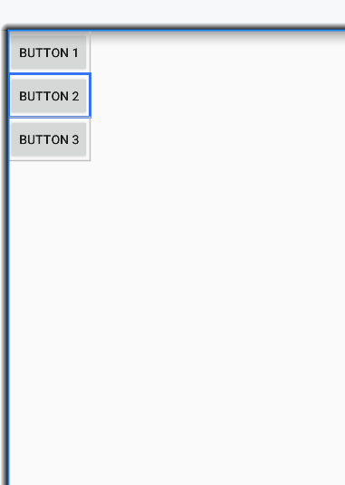
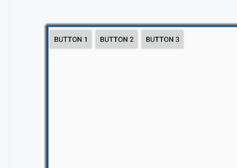
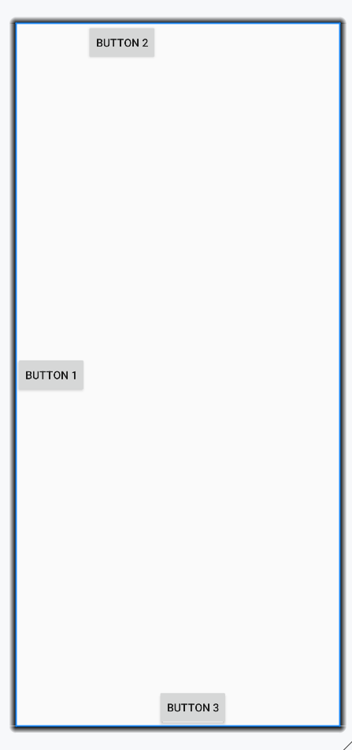
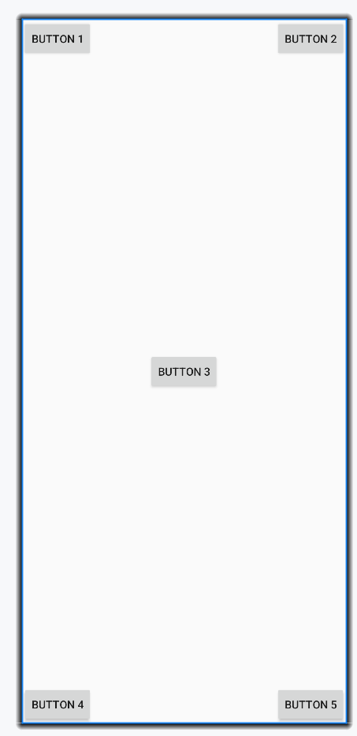

## 布局

布局是一种可用于放置很多控件的**容器**

可以按照一定的规律调整内部控件的位置，从而编写出精美的界面

布局的内部除了放置控件外，也可以放置布局

通过多层布局的嵌套，完成一些比较复杂的界面实现


## LinearLayout

将它所包含的控件在线性方向上依次排列

### android:orientation 排列方向

通过属性`android:orientation`指定了排列方向是`vertical`or`horizontal`

同时, 设置某一方向时, 这一对应方向上的长度是不固定的

```xml
<LinearLayout xmlns:android="http://schemas.android.com/apk/res/android"
        android:orientation="vertical"
        android:layout_width="match_parent"
        android:layout_height="match_parent">
    <!--android:orientation="vertical"控制排布方向vertical垂直-->
    <Button
            android:id="@+id/button1"
            android:layout_width="wrap_content"
            android:layout_height="wrap_content"
            android:text="Button 1" />
    <Button
            android:id="@+id/button2"
            android:layout_width="wrap_content"
            android:layout_height="wrap_content"
            android:text="Button 2" />
    <Button
            android:id="@+id/button3"
            android:layout_width="wrap_content"
            android:layout_height="wrap_content"
            android:text="Button 3" />
</LinearLayout>
```




设置成`horizontal`水平



如果LinearLayout的排列方向是horizontal，内部的控件就绝对不能将宽度指定为match_parent

如果LinearLayout的排列方向是vertical，内部的控件就不能将高度指定为match_parent

否则, 单独一个控件就会将整个水平方向占满，其他的控件就没有可放置的位置了

### android:layout_gravity 对齐方式

指定控件在布局中的 对齐方式

因为设置成某一方向排布时, 该方向上的长度是不固定的，每添加一个控件，水平方向上的长度都会改变，**因而无法指定该方向上的对齐方式**

水平的排列方式, 则只有垂直方向上的对齐方式才会生效

垂直的排列方式, 则只有水平方向上的对齐方式才会生效

`android:orientation="horizontal"`时的情况

```xml
<LinearLayout xmlns:android="http://schemas.android.com/apk/res/android"
        android:orientation="horizontal"
        android:layout_width="match_parent"
        android:layout_height="match_parent">

    <Button
            android:id="@+id/button1"
            android:layout_width="wrap_content"
            android:layout_height="wrap_content"
            android:layout_gravity="center"
            android:text="Button 1" />

    <Button
            android:id="@+id/button2"
            android:layout_width="wrap_content"
            android:layout_height="wrap_content"
            android:layout_gravity="top"
            android:text="Button 2" />

    <Button
            android:id="@+id/button3"
            android:layout_width="wrap_content"
            android:layout_height="wrap_content"
            android:layout_gravity="bottom"
            android:text="Button 3" />
</LinearLayout>
```




`android:orientation="vertical"`时的情况

```xml
<LinearLayout xmlns:android="http://schemas.android.com/apk/res/android"
        android:orientation="vertical"
        android:layout_width="match_parent"
        android:layout_height="match_parent">

    <Button
            android:id="@+id/button1"
            android:layout_width="wrap_content"
            android:layout_height="wrap_content"
            android:layout_gravity="center"
            android:text="Button 1" />

    <Button
            android:id="@+id/button2"
            android:layout_width="wrap_content"
            android:layout_height="wrap_content"
            android:layout_gravity="left"
            android:text="Button 2" />

    <Button
            android:id="@+id/button3"
            android:layout_width="wrap_content"
            android:layout_height="wrap_content"
            android:layout_gravity="right"
            android:text="Button 3" />
</LinearLayout>
```


### android:layout_weight 排列比重

允许使用比例的方式来指定控件的大小

由于使用了`android:layout_weight`，此时控件的宽度就不应由`android:layout_width`决定，指定成`0 dp`是一种比较规范的写法

在EditText和Button里将`android:layout_weight`属性的值指定在**水平方向比例**，表示两组件将在水平方向**2:1 分宽度**

```xml
<LinearLayout xmlns:android="http://schemas.android.com/apk/res/android"
        android:orientation="horizontal"
        android:layout_width="match_parent"
        android:layout_height="match_parent">

    <EditText
            android:id="@+id/input_message"
            android:layout_width="0dp"
            android:layout_height="wrap_content"
            android:layout_weight="2"
            android:hint="Type something" />

    <Button
            android:id="@+id/send"
            android:layout_width="0dp"
            android:layout_height="wrap_content"
            android:layout_weight="1"
            android:text="Send" />
</LinearLayout>
```


当只指明一个元素指定为`android:layout_weight="1"`, 同时, 另一个**不设置** `android:layout_weight`, `android:layout_weight="wrap_content"`, 两个元素依旧放在同一行

这样往往有合适的样式

```xml
<LinearLayout xmlns:android="http://schemas.android.com/apk/res/android"
        android:orientation="horizontal"
        android:layout_width="match_parent"
        android:layout_height="match_parent">

    <EditText
            android:id="@+id/input_message"
            android:layout_width="0dp"
            android:layout_height="wrap_content"
            android:layout_weight="1"
            android:hint="Type something" />

    <Button
            android:id="@+id/send"
            android:layout_width="wrap_content"
            android:layout_height="wrap_content"
            android:text="Send" />
</LinearLayout>
```


## RelativeLayout

通过相对定位的方式让控件出现在布局的任何位置

### 相对父布局

```xml
<RelativeLayout xmlns:android="http://schemas.android.com/apk/res/android"
        android:layout_width="match_parent"
        android:layout_height="match_parent">

    <Button
            android:id="@+id/button1"
            android:layout_width="wrap_content"
            android:layout_height="wrap_content"
            android:layout_alignParentStart="true"
            android:layout_alignParentTop="true"
            android:text="Button 1" />

    <Button
            android:id="@+id/button2"
            android:layout_width="wrap_content"
            android:layout_height="wrap_content"
            android:layout_alignParentEnd="true"
            android:layout_alignParentTop="true"
            android:text="Button 2" />

    <Button
            android:id="@+id/button3"
            android:layout_width="wrap_content"
            android:layout_height="wrap_content"
            android:layout_centerInParent="true"
            android:text="Button 3" />

    <Button
            android:id="@+id/button4"
            android:layout_width="wrap_content"
            android:layout_height="wrap_content"
            android:layout_alignParentBottom="true"
            android:layout_alignParentStart="true"
            android:text="Button 4" />

    <Button
            android:id="@+id/button5"
            android:layout_width="wrap_content"
            android:layout_height="wrap_content"
            android:layout_alignParentBottom="true"
            android:layout_alignParentEnd="true"
            android:text="Button 5" />

</RelativeLayout>
```

-   ` android:layout_alignParentStart`
-   ` android:layout_alignParentEnd`
-   ` android:layout_alignParentTop`
-   `android:layout_alignParentBottom`




### 相对组件

都相对于Center按钮

```xml
<RelativeLayout xmlns:android="http://schemas.android.com/apk/res/android"
        android:layout_width="match_parent"
        android:layout_height="match_parent">
	<!--依旧相对父布局-->
    <Button
            android:id="@+id/button0"
            android:layout_width="wrap_content"
            android:layout_height="wrap_content"
            android:layout_centerInParent="true"
            android:text="Center" />
	<!--相对于组件@id/button0-->
    <Button
            android:id="@+id/button1"
            android:layout_width="wrap_content"
            android:layout_height="wrap_content"
            android:layout_above="@id/button0"
            android:layout_toStartOf="@id/button0"
            android:text="start-above" />

    <Button
            android:id="@+id/button2"
            android:layout_width="wrap_content"
            android:layout_height="wrap_content"
            android:layout_above="@id/button0"
            android:layout_toEndOf="@id/button0"
            android:text="end-above" />

    <Button
            android:id="@+id/button3"
            android:layout_width="wrap_content"
            android:layout_height="wrap_content"
            android:layout_below="@id/button0"
            android:layout_toStartOf="@id/button0"
            android:text="left-below" />

    <Button
            android:id="@+id/button4"
            android:layout_width="wrap_content"
            android:layout_height="wrap_content"
            android:layout_below="@id/button0"
            android:layout_toEndOf="@id/button0"
            android:text="end-below" />

</RelativeLayout>
```

-   `android:layout_above="@id/button0"` 让一个控件位于另一 个控件的上面
-   `android:layout_toStartOf="@id/button0"` 让一个控件位于另一 个控件的开始(左侧)
-   `android:layout_below="@id/button0"` 让一个控件位于另一 个控件的下面
-   `android:layout_toStartOf="@id/button0"` 让一个控件位于另一 个控件的结束 (右侧)

当一个控件去引用另一个控件的id时，该控件**一定要定义在引用控件的后面**，不然会出现找不到id的情况。


## FrameLayout

所有的控件都会默认摆放在布局的左上角

设置两个组件

```xml
<FrameLayout xmlns:android="http://schemas.android.com/apk/res/android"
        android:layout_width="match_parent"
        android:layout_height="match_parent">
    <TextView
            android:id="@+id/textView"
            android:layout_width="wrap_content"
            android:layout_height="wrap_content"
            android:text="This is TextView"
            />
    <Button
            android:id="@+id/button"
            android:layout_width="wrap_content"
            android:layout_height="wrap_content"
            android:text="Button"
            />
</FrameLayout>
```

两个组件都在左上角, 重叠展示


除非使用各种对齐方式等等进行控制

