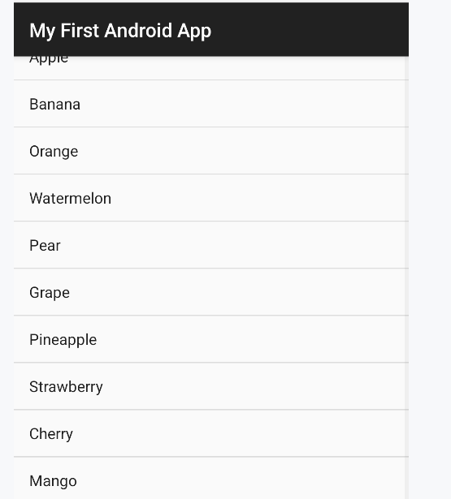

# ListView

用户通过手指上下滑动的方式将屏幕外的数据滚动到屏幕内，同时屏幕上原有的数据会滚动出屏幕

```kotlin
class MainActivity : BaseActivity<ActivityMainBinding>(ActivityMainBinding::inflate) {
    private val data = listOf(
        "Apple", "Banana", "Orange", "Watermelon",
        "Pear", "Grape", "Pineapple", "Strawberry", "Cherry", "Mango",
        "Apple", "Banana", "Orange", "Watermelon", "Pear", "Grape",
        "Pineapple", "Strawberry", "Cherry", "Mango"
    )

    override fun onCreate(savedInstanceState: Bundle?) {
        super.onCreate(savedInstanceState)
        // android.R.layout.simple_list_item_1作为ListView子项布局的id，这是一个Android内置的布局文件，
        // 里面只有一个TextView，可用于简单地显示一段文本
        binding.listView.adapter = ArrayAdapter(this, android.R.layout.simple_list_item_1, data)
    }
}
```




## 定制Item

### 创建Item的Layout

```xml
<?xml version="1.0" encoding="utf-8"?>
<LinearLayout xmlns:android="http://schemas.android.com/apk/res/android"
        android:layout_width="match_parent"
        android:layout_height="70dp"
        android:orientation="horizontal">

    <ImageView
            android:id="@+id/fruitImage"
            android:layout_width="40dp"
            android:layout_height="40dp"
            android:layout_gravity="center_vertical"
            android:layout_marginStart="10dp"
            android:contentDescription="Fruit Image..." />

    <TextView
            android:id="@+id/fruitName"
            android:layout_width="wrap_content"
            android:layout_height="wrap_content"
            android:layout_gravity="center_vertical"
            android:layout_marginStart="10dp" />
</LinearLayout>
```


### Item的Adapter

```kotlin
class ViewHolder(val fruitImage: ImageView, val fruitName: TextView)

class FruitArrayAdapter(
    activity: Activity,val itemLayout: Int, data: List<Fruit>
) : ArrayAdapter<Fruit>(activity, itemLayout, data) {
    /**
     * @param parent 在这里, 总是和listView相等(===)
     * @param position 即index, 在android开发中, 似乎index都被称作position
     * @return 需要一个不被parent(list_view)包裹的item_view
     */
    override fun getView(
        position: Int,
        convertView: View?,
        parent: ViewGroup
    ): View {
        /*对加载的视图进行重用, 初始化时convertView 总是null, 快速滚动时convertView就不再是null*/
        val view: View = convertView ?: initView(parent)
        if (convertView == null) {
            // 将已经加载信息保存在tag中,而不是findViewById, 下次调用时快速获取
            view.tag = ViewHolder(
                view.findViewById(R.id.fruitImage),
                view.findViewById(R.id.fruitName)
            )
        }
        val viewHolder = view.tag as ViewHolder
        val fruit = getItem(position) // 获取当前项的Fruit实例
        if (fruit != null) {
            viewHolder.fruitImage.setImageResource(fruit.image)
            viewHolder.fruitName.text = fruit.name
        }
        return view
    }

    private fun initView(listView: ViewGroup): View =
        LayoutInflater.from(context).inflate(itemLayout, listView, false)
}
```

1. 继承`ArrayAdapter`

2. 重载`getView`方法

3. **返回值**是该position上item的view

4. 参数`position`, 就是listView上的item的索引, 由listView来供给

5. 参数`convertView` 对应position上的view, 依据`getView`的返回值决定

   - position上的view已经存在, 其值就是这个position上的view

   - 经过测试, position上的view, 参数`convertView`和返回值, 是相等的, 引用也是相等的

     也就是说, 下列断言不会被出发

     ```kotlin
     require(convertView == null || convertView === binding.root) {
         "no"
     }
     ```

   - 否则, 就是null

6. 参数`parent`, 就是目标的listView

7. 利用`convertVIew`, + if 表达式, 避免**多次`inflate`造成性能的损耗**

   - 在**滚动**的环境下, 就会多次调用getView这个函数
   - 如果快速**滚动**, 而getView较为复杂, 就会对机器造成较大负担
   - 快速滚动时, `convertVIew`都是已经完成了加载的view, 会作为参数传入, 避免多次加载

8. `initView` 中attachParent是**false**, 因为不希望返回的view, root被listView包装, 返回view就是一个不被包装的item

9.  使用`view.tag`保存已经加载的数据

   - 避免反复`findViewById` (一次调用复杂度 $O(n)$, n 是子组件的个数)

   - ViewBinding能使用bind方法链接view, 然后直接拿取字段.

     拿取字段的的时间复杂度是$O(1)$, 但是`bind`注册字段的复杂度是$O(n^2)$

此处不使用ViewBinding, 是因为需要FruitAdapter和Layout解耦

相同的Fruit的数据, 可以有多个不同的布局, 由构造器的参数决定

但是, 事实上`R.id.fruitImage` 和`R.id.fruitName`写死了, 也没有完成解耦...

再看ViewBIndings, 实质上就是有ViewHolder效果的, 下面给出一个用ViewBindings完全替代ViewHolder的版本, 同时Adapter完全不和Layout解耦

```kotlin
class FruitArrayAdapter(
    activity: Activity, itemLayout: Int, data: List<Fruit>
) : ArrayAdapter<Fruit>(activity, itemLayout, data) {

    override fun getView(
        position: Int, convertView: View?, parent: ViewGroup
    ): View {
        val binding: FruitItemLayoutBinding = if (convertView == null) {
            val binding = initBinding(parent)
            binding.root.tag = binding
            binding
        } else {
            convertView.tag as FruitItemLayoutBinding
        }
        val fruit = getItem(position)
        if (fruit != null) {
            binding.fruitImage.setImageResource(fruit.image)
            binding.fruitName.text = fruit.name
        }
        return binding.root
    }

    private fun initBinding(listView: ViewGroup): FruitItemLayoutBinding =
        FruitItemLayoutBinding.inflate(
            LayoutInflater.from(context), listView, false
        )
}
```

### 注册数据

在MainActivity里往list中注册数据

```kotlin
class MainActivity : BaseActivity<ActivityMainBinding>(ActivityMainBinding::inflate) {
    private val fruitList = ArrayList<Fruit>()

    init {
        repeat(8) {/*次数多一些, 方便测试滚动*/
            fruitList.add(Fruit("Apple", R.drawable.fruit_apple_pic))
            fruitList.add(Fruit("Banana", R.drawable.fruit_banana_pic))
            fruitList.add(Fruit("Orange", R.drawable.fruit_orange_pic))
            fruitList.add(Fruit("Watermelon", R.drawable.fruit_watermelon_pic))
            fruitList.add(Fruit("Pear", R.drawable.fruit_pear_pic))
            fruitList.add(Fruit("Grape", R.drawable.fruit_grape_pic))
            fruitList.add(Fruit("Pineapple", R.drawable.fruit_pineapple_pic))
            fruitList.add(Fruit("Strawberry", R.drawable.fruit_strawberry_pic))
            fruitList.add(Fruit("Cherry", R.drawable.fruit_cherry_pic))
            fruitList.add(Fruit("Mango", R.drawable.fruit_mango_pic))
        }
    }

    override fun onCreate(savedInstanceState: Bundle?) {
        super.onCreate(savedInstanceState)
        binding.listView.adapter = FruitArrayAdapter(
            this, R.layout.fruit_item_layout, fruitList
        )

    }


}
```

## 注册Item上的点击事件

有一般的Click和LongClick之分, 下面是两种不同的lambda写法, 可互换使用

```kotlin
override fun onCreate(savedInstanceState: Bundle?) {
    super.onCreate(savedInstanceState)
    binding.listView.adapter = FruitArrayAdapter(
        this, R.layout.fruit_item_layout, fruitList
    )
    // 函数 + lambda移出参数列表外
    binding.listView.setOnItemClickListener { parent, view, position, id ->
        toastShow(this@MainActivity, "${fruitList[position].name} is clicked")
    }
    // setter+内部类lambda
    // 不加AdapterView.OnItemLongClickListener, 则类型不合
    binding.listView.onItemLongClickListener =
        AdapterView.OnItemLongClickListener { parent, view, position, id ->
            toastShow(this@MainActivity, "${fruitList[position].name} is long clicked")
            true
        }
    // 加在 as AdapterView.OnItemLongClickListener, 则lambda参数无法识别
}
```

