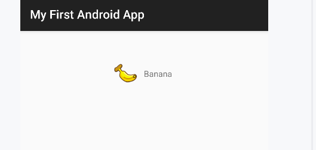
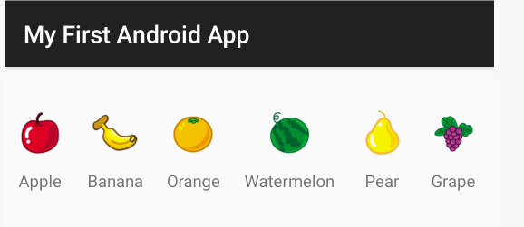
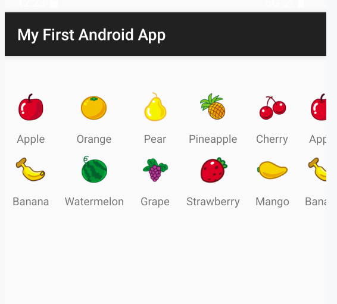
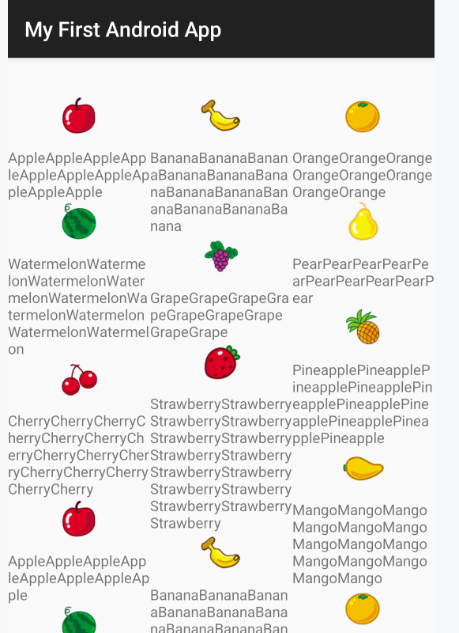
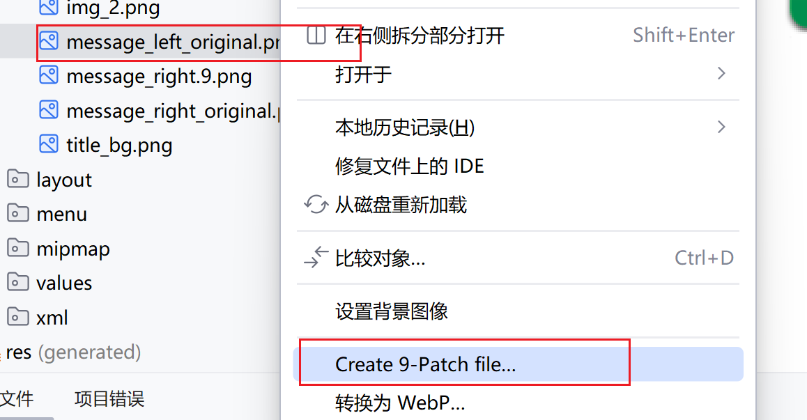
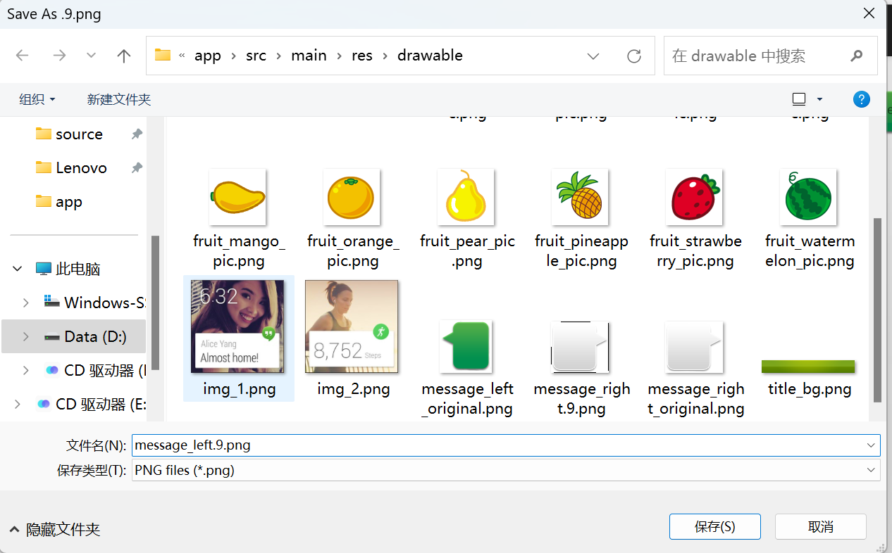
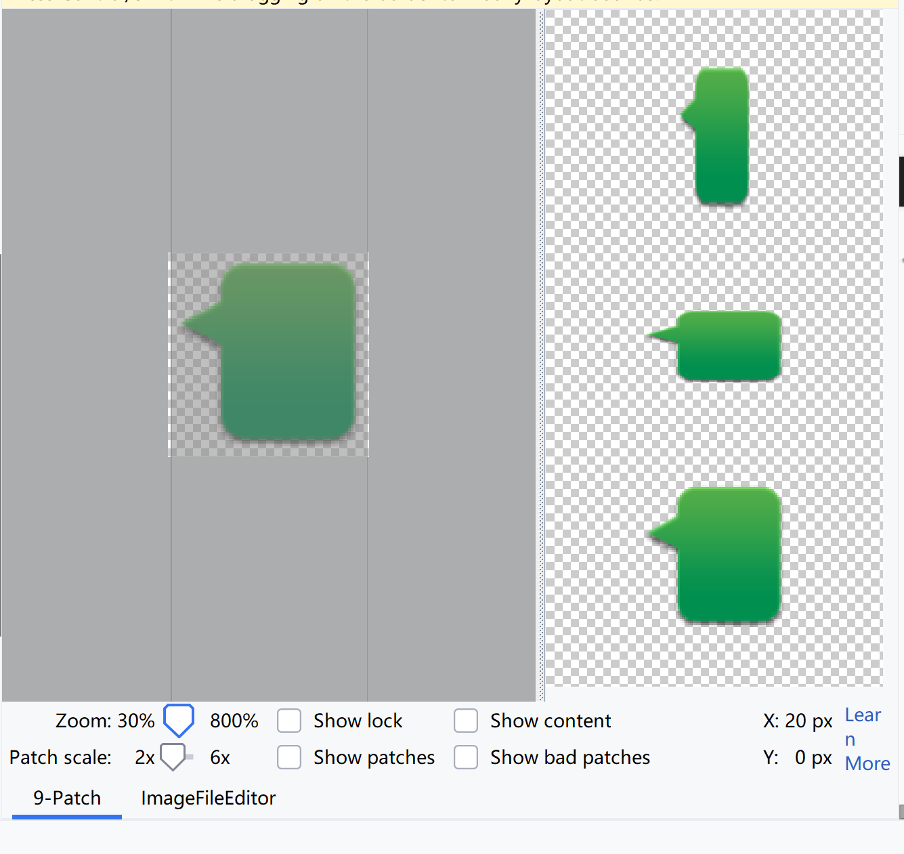
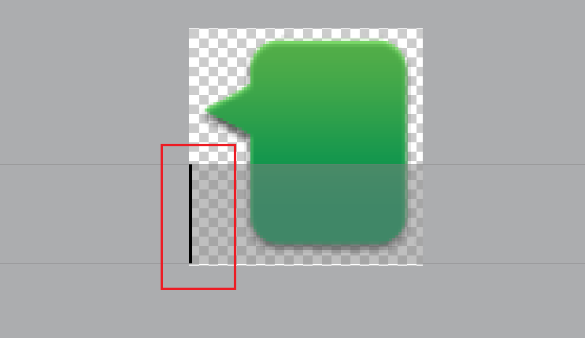
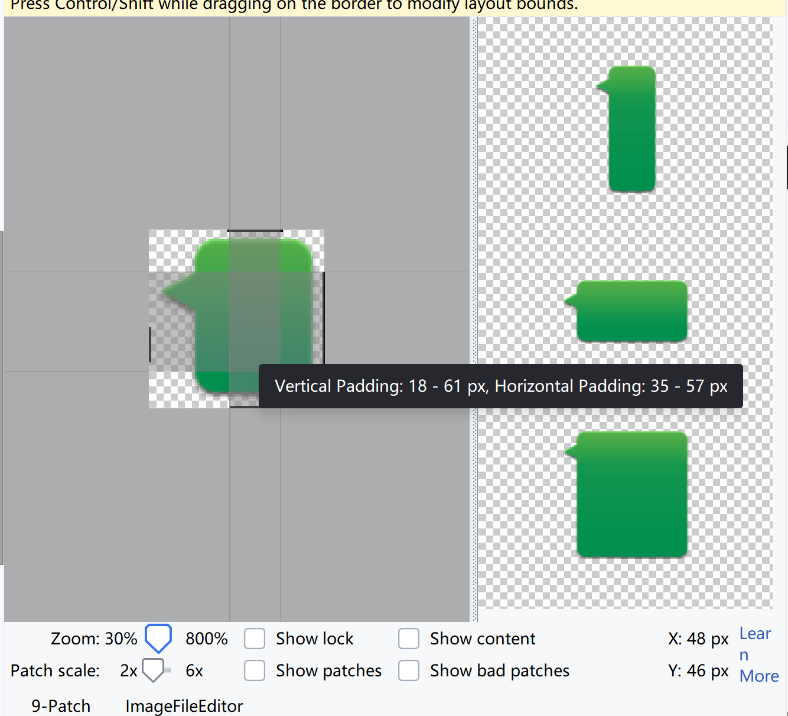
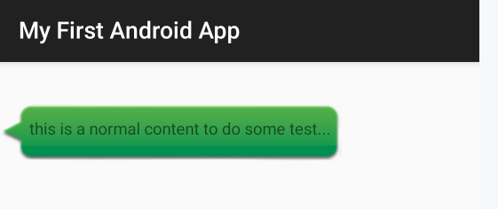

# RecyclerView 滚动控件

ListView无法实现横向滚动(扩展性弱), RecyclerView可以完成ListView的全部功能, 还进一步增加了可扩展性

RecyclerView将其排布方式交给了LayoutManager, 将排布这一工作从自身解耦

目前Android官方更加推荐使用RecyclerView

## 引入

将RecyclerView控件定义在了AndroidX 当中


## 基本使用

### 布局

在activity_main中添加RecyclerView

```xml
<androidx.recyclerview.widget.RecyclerView
        android:id="@+id/recyclerView"
        android:layout_width="match_parent"
        android:layout_height="match_parent" />
```


### 重构Adapter

继承抽象类`RecyclerView.Adapter`并完成对三个方法的实现

```kotlin
// root 将作为父类的itemView对象, 可以直接viewHolder.itemView获取
class FruitViewHolder(val binding: FruitItemLayoutBinding) : RecyclerView.ViewHolder(binding.root)

class FruitRecyclerAdapter(val data: List<Fruit>) : RecyclerView.Adapter<FruitViewHolder>() {


    /**
     * 创建ItemView的ViewHolder的方法
     */
    override fun onCreateViewHolder(parent: ViewGroup, viewType: Int): FruitViewHolder {
        val binding = FruitItemLayoutBinding.inflate(
            LayoutInflater.from(parent.context), parent, false
        )
        return FruitViewHolder(binding)
    }

    /**
     * 初始化ItemView
     */
    override fun onBindViewHolder(holder: FruitViewHolder, position: Int) {
        val item = data[position]
        holder.binding.fruitImage.setImageResource(item.image)
        holder.binding.fruitName.text = item.name
    }

    override fun getItemCount() = data.size

}
```

- `onCreateViewHolder()` 加载布局, 创建ViewHolder实例后返回
- `onBindViewHolder()` 对RecyclerView子项的数据进行赋值，**会在每个子项被滚动到屏幕内的时候调用**
- `getItemCount()` 用于告诉RecyclerView一共有多少子项

抽象一个Adapter的父类

```kotlin
class ViewHolder<VB : ViewBinding>(val itemBinding: VB) : RecyclerView.ViewHolder(itemBinding.root)

abstract class BaseAdapter<E, VB : ViewBinding>(
    val data: List<E>, val itemBindingInflater: BindingInflater0<VB>
) : RecyclerView.Adapter<ViewHolder<VB>>() {

    override fun getItemCount(): Int = data.size

    override fun onCreateViewHolder(
        parent: ViewGroup,
        viewType: Int,
    ): ViewHolder<VB> {
        val binding = itemBindingInflater(
            LayoutInflater.from(parent.context), parent, false
        )
        val holder = ViewHolder(binding)
        holder.itemView.setOnClickListener {
            val position = holder.adapterPosition
            val item = data[position]
            onItemClicked(it, position, item, holder)
        }
        return holder
    }

    /**
     * 可以用空方法, 但不能不实现
     */
    abstract fun onItemClicked(view: View, position: Int, item: E, holder: ViewHolder<VB>);

}
```

子类改进

```kotlin
typealias FruitViewHolder = ViewHolder<FruitItemLayoutBinding>

class FruitRecyclerAdapter(data: List<Fruit>) :
    BaseAdapter<Fruit, FruitItemLayoutBinding>(data, FruitItemLayoutBinding::inflate) {

    override fun onBindViewHolder(holder: FruitViewHolder, position: Int) {
        val item = data[position]
        holder.itemBinding.fruitImage.setImageResource(item.image)
        holder.itemBinding.fruitName.text = item.name
    }
        
    override fun onItemClicked(
        view: View, position: Int, item: Fruit, holder: ViewHolder<FruitItemLayoutBinding>
    ) {
        // 点击事件
        Log.i("Adapter", "item $item clicked")
    }
}

```


### 在Activity设置RecyclerView

与ListView不同的是, 需要另外设置layoutManager布局方式

```kotlin
override fun onCreate(savedInstanceState: Bundle?) {
    super.onCreate(savedInstanceState)
    binding.recyclerView.layoutManager = LinearLayoutManager(this)
    binding.recyclerView.adapter = FruitRecyclerAdapter(fruitList)
    // binding.root.setBackgroundColor(resources.getColor(R.color.gray, null))
}
```

LayoutManager用于指定布局方式

这里布局方式设置成 `LinearLayoutManager `对象，可以实现和ListView类似的效果。

## LayoutManager

### 横向滚动

设置LayoutManager即可

```kotlin
val layoutManager = LinearLayoutManager(this)
layoutManager.orientation = LinearLayoutManager.HORIZONTAL
binding.recyclerView.layoutManager = layoutManager
```



横向布局后, 如果还保留原先的一个item占据一行, 就会很丑, 故重新设计item的布局

```xml
<LinearLayout xmlns:android="http://schemas.android.com/apk/res/android"
        android:layout_width="wrap_content"
        android:layout_height="70dp"
        android:layout_marginEnd="10dp"
        android:layout_marginStart="10dp"
        android:orientation="vertical">

    <ImageView
            android:id="@+id/fruitImage"
            android:layout_width="40dp"
            android:layout_height="40dp"
            android:layout_gravity="center_horizontal"
            android:contentDescription="Fruit Image..." />

    <TextView
            android:id="@+id/fruitName"
            android:layout_width="wrap_content"
            android:layout_height="wrap_content"
            android:layout_gravity="center_horizontal"
            android:layout_marginTop="10dp"/>
</LinearLayout>
```

- 改orientation 为垂直
- 改 layout_width 为依据内容
- 改 layout_height 为固定大小
- 改 layout_marginEnd 和 layout_marginStart 为固定大小, item之间保持一定间距
- 改 layout_gravity 为水平



### 网格布局

> GridLayoutManager

```kotlin
val layoutManager = GridLayoutManager(this, /* spanCount = */ 2)
layoutManager.orientation = GridLayoutManager.VERTICAL
// 若 orientation==HORIZONTAL, 则
//		spanCount = 2 表示有两行, 可以横向滚动
//		list 的item的渲染位置顺序是先上下, 再上下, 此时data=[Apple,Banana,Orange,Watermelon,Pear,...]
// 若 orientation==VERTICAL, 则 spanCount = 2 表示有两列, 可以上下滚动
//		list 的item的渲染位置顺序是先左右, 再上下
binding.recyclerView.layoutManager = layoutManager
binding.recyclerView.adapter = FruitRecyclerAdapter(fruitList)
```




```xml
<androidx.recyclerview.widget.RecyclerView
        android:id="@+id/recyclerView"
        android:layout_width="match_parent"
        android:layout_height="wrap_content" /> <!--wrap_content更美观-->
```

微调item布局margin, 此处略


### 瀑布流布局

> StaggeredGridLayoutManager


一个个元素之间高度不对齐, 依据内容分别排列, 这就是瀑布布局

在MainActivity中设置

```kotlin
val layoutManager =
    StaggeredGridLayoutManager(
        /* spanCount = */ 3,
        /* orientation = */ StaggeredGridLayoutManager.VERTICAL
    )

binding.recyclerView.layoutManager = layoutManager
binding.recyclerView.adapter = FruitRecyclerAdapter(fruitList)
```

为了测试瀑布布局, 将Fruit的名字长度设计为随机

```kotlin
init {
    val random = Random(System.currentTimeMillis())
    repeat(4) {
        fruitList.add(Fruit("Apple".repeat(random.nextInt(8,16)), R.drawable.fruit_apple_pic))
        // ...
    }
}
```

调整布局

activity_main中的RecyclerView的布局, layout_height要match_parent

```xml
<androidx.recyclerview.widget.RecyclerView
        android:id="@+id/recyclerView"
        android:layout_marginTop="60dp"
        android:layout_width="match_parent"
        android:layout_height="match_parent" />
```

item的layout, height要是warp_content, 才符合瀑布的样子, width是match_parent, 列表才会分成三格

```xml
<LinearLayout xmlns:android="http://schemas.android.com/apk/res/android"
        android:layout_width="match_parent"
        android:layout_height="wrap_content"
        android:orientation="vertical">

    <!--...-->
</LinearLayout>
```

测试运行



## 点击事件

如果注册了ListView的Item上的事件, 同时要点击ListView的Item内的一个Button, 为止奈何?

RecyclerView直接摒弃了子项点击事件的监听器，让所有的点击事件都由具体的View去注册

在Adapter中注册事件

```kotlin
class FruitRecyclerAdapter(val data: List<Fruit>) : RecyclerView.Adapter<FruitViewHolder>() {


    /**
     * 创建ItemView的ViewHolder的方法
     * 同时注册事件
     */
    override fun onCreateViewHolder(parent: ViewGroup, viewType: Int): FruitViewHolder {
        val binding = FruitItemLayoutBinding.inflate(
            LayoutInflater.from(parent.context), parent, false
        )

        val viewHolder = FruitViewHolder(binding)
        // val adapterPosition = viewHolder.adapterPosition 此时是NO_POSITION(-1)
        binding.root.setOnClickListener {
            val position = viewHolder.adapterPosition
            val fruit = data[position]
            toastShow(parent.context, "you clicked item ${fruit.name}")
        }
        binding.fruitImage.setOnClickListener {
            val position = viewHolder.adapterPosition
            val fruit = data[position]
            toastShow(parent.context, "you clicked image ${fruit.name}")
        }
        return viewHolder
    }

    // ...

}
```


## 实践

### 9-Patch 图片

被特殊处理过的png图片，能够指定哪些区域可以被拉伸、哪些区域不可以

例如对话框气泡


#### 制作

选中原图片后右击



设置文件名后保存(原图在创建9-Patch之后可以删除)



其操作界面如下




长按鼠标在图片的边缘拖动进行绘制

绘制的部分表示内容允许被扩展的区域

右边是假设进行了一些扩展后的预览



长按Shift键拖动可以进行擦除

最终的结果



最终可以延长的部分是指所有黑线重叠的部分(交集)


#### 使用

将这张图片设置为LinearLayout的背景图片, 并进行设置

```xml
    <LinearLayout
            android:layout_width="wrap_content"
            android:layout_height="wrap_content"
            android:layout_marginTop="60dp"
            android:background="@drawable/message_left">

        <TextView
                android:layout_width="match_parent"
                android:layout_height="match_parent"
                android:text="this is a normal content to do some test...this is a normal content to do some test..." />
    </LinearLayout>
```



### RecyclerView不同的ViewHolder类型创建不同的页面

1. Item的布局上, 有LeftMessageBlock, 左对齐, 和RightMessageBlock, 右对齐

2. 创建基类MessageBlockViewHandler, 标注成sealed, 便于编译器检查

3. MessageBlockViewHandler的两个子类, LeftMessageBlockViewHandler, RightMessageBlockViewHandler

4. 创建RecyclerView.Adapter的实现类, 其中父类的方向参数列表填写基类MessageBlockViewHandler

5. **实现方法`getItemViewType`**, 参数是position, 返回值是**`viewType: Int`**, 就是`onCreateViewHolder`的第二个参数

   ```kotlin
   override fun getItemViewType(position: Int): Int { 
       val msg = msgList[position] 
       return msg.type 
   } 
   ```

6. **实现方法`onCreateViewHolder`**, 先用**`viewType`** 进行类型的需求判断, 然后在创建不同的`MessageBlockViewHandler`返回

7. **实现方法`onBindViewHolder`**, 用when+is表达式, 判断`MessageBlockViewHandler`的类型, 然后进行各自的逻辑

8. 方法`getItemCount`的实现不变


### 通知RecyclerView刷新

在MainActivity的布局中, 有button:  `send`, 有inputText

```kotlin
binding.send.setOnClickListener{
    val content = binding.inputText.text.toString() 
    if (content.isEmpty()) { 
    	return;
    }
    val msg = Msg(content, Msg.TYPE_SENT) 
    msgList.add(msg)
    // adapter 是给 RecyclerView 的 adapter
    adapter.notifyItemInserted(msgList.size - 1) // 当用户发送了新消息时
    
    刷新RecyclerView中的显示 
    binding.recyclerView.scrollToPosition(msgList.size - 1)  // 将RecyclerView滚动到最后一行 
    binding.inputText.setText("") // 清空输入框中的内容 
}
```

