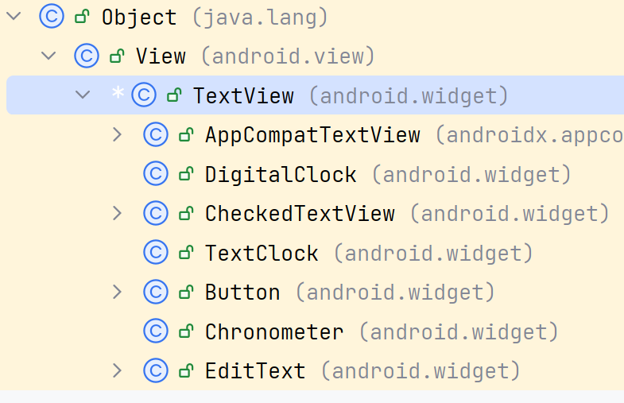
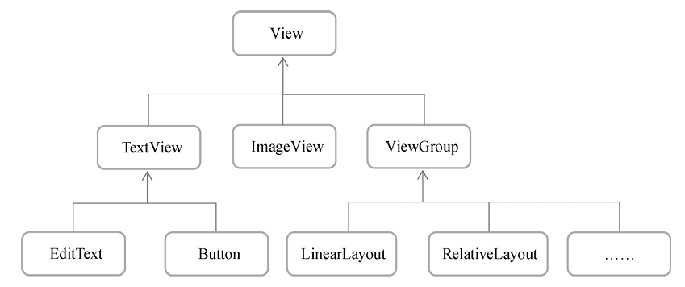

# 自定义控件

> 以标题栏为例

## 组件继承结构







所用的所有布局都是直接或间接继承自ViewGroup

View是Android中最基本的一种UI组件

其在屏幕上绘制一块矩形区域，并能响应这块区域的各种事件

各种控件实际上在View的基础上又添加了各自特有的功能


## 创建自定义控件布局

编写布局XML, 设置返回键, Title, 和编辑键

```xml
<LinearLayout xmlns:android="http://schemas.android.com/apk/res/android"
        android:layout_width="match_parent"
        android:layout_height="wrap_content"
        android:background="@drawable/title_bg">

    <Button
            android:id="@+id/titleBack"
            android:layout_width="wrap_content"
            android:layout_height="wrap_content"
            android:layout_gravity="center"
            android:layout_margin="5dp"
            android:background="@drawable/back_bg"
            android:text="Back"
            android:textColor="#fff" />

    <TextView
            android:id="@+id/titleText"
            android:layout_width="0dp"
            android:layout_height="wrap_content"
            android:layout_gravity="center"
            android:layout_weight="1"
            android:gravity="center"
            android:text="Title Text"
            android:textColor="#fff"
            android:textSize="24sp" />

    <Button
            android:id="@+id/titleEdit"
            android:layout_width="wrap_content"
            android:layout_height="wrap_content"
            android:layout_gravity="center"
            android:layout_margin="5dp"
            android:background="@drawable/edit_bg"
            android:text="Edit"
            android:textColor="#fff" />

</LinearLayout>
```

-   `android:background`用于为布局或控件指定一个背景，可以使用颜色或图片来进行填充
    -   可以给Layout设置
    -   可以给组件设置
-   `android:layout_margin` ，可以指定控件在上下左右方向上的间距
    -   `layout_marginStart`
    -   `layout_marginTop`


## 引入控件

在Activity里引入组件

```xml
<LinearLayout xmlns:android="http://schemas.android.com/apk/res/android"
        android:orientation="vertical"
        android:layout_width="match_parent"
        android:layout_height="match_parent">

    <include
            layout="@layout/title_bar"
            android:id="@+id/bar" />

    <!--...-->
</LinearLayout>
```

由于theme设置了有Bar的, 因此要想把theme的bar关掉, 才能是自己的bar

在代码中hide

```kotlin
override fun onCreate(savedInstanceState: Bundle?) {
    super.onCreate(savedInstanceState)
    supportActionBar?.hide(); // hide
}
```

或者修改theme.xml

```xml
<resources>
    <!-- 换成NoActionBar -->
    <style name="Base.Theme.FirstAndroid" parent="Theme.AppCompat.Light.NoActionBar">
    </style>

    <style name="Theme.FirstAndroid" parent="Base.Theme.FirstAndroid" />
</resources>
```

以下是运行效果


在代码中调用目标控件

```kotlin
class MainActivity : BaseActivity<ActivityMainBinding>(ActivityMainBinding::inflate) {
    override fun onCreate(savedInstanceState: Bundle?) {
        super.onCreate(savedInstanceState)
        binding.bar// ...
    }
}
```

## 编写自定义控件逻辑

三种注册Layout布局到Layout代码的方式有三种, 选一种皆可

```kotlin
class TitleBarLayout(context: Context, attrs: AttributeSet) : LinearLayout(context, attrs) {
    /**
     * 最传统的做法
     *
     * @see LayoutInflater.from
     * @see LayoutInflater.inflate
     * @see View.findViewById
     */
    init {
        val layoutInflater = LayoutInflater.from(super.context)
         // this 会包装 这个title_bar的view
        layoutInflater.inflate(R.layout.title_bar, this /*, this!= null */)
        findViewById<Button>(R.id.titleBack).setOnClickListener {
            Log.i("Title", "BACK")
        }
    }
    /**
     * 为何this要作为parent传入, 在内部作为layoutInflater.inflate的第二个参数root传入
     *
     * @see LayoutInflater.from
     * @see TitleBarBinding.inflate 
     */
    init {
        val layoutInflater = LayoutInflater.from(context)
        // this 也会包装这个title_bar的view, 但是binding的root不会包装this
        val binding = TitleBarBinding.inflate(layoutInflater, this, true)
        binding.titleBack.setOnClickListener {
            Log.i("Title", "BACK")
        }
    }


    /**
     * 缺点在于, 依旧要显式地 R.layout.title_bar
     *
     * @see View.inflate
     * @see TitleBarBinding.bind
     */
    init {
        val root: View = View.inflate(context, R.layout.title_bar, this)
        val binding = TitleBarBinding.bind(root)
        binding.titleBack.setOnClickListener {
            Log.i("Title", "BACK");
        }
    }

}
```

查看ViewBinding中inflate的源码

```java  @NonNull
public static TitleBarBinding inflate(@NonNull LayoutInflater inflater,
      @Nullable ViewGroup parent, boolean attachToParent) {
    // 不把parent加到root, 此时root没有被包装parent
    View root = inflater.inflate(R.layout.title_bar, parent, false);
    if (attachToParent) { // 此时才决定
      parent.addView(root); // parent 里面加 root, root 外面包 parent 了
    }
    // 从binding获取, 直接获取内部结构, 总是不会增加parent
    return bind(root);
}
```

关于`LayoutInflater.inflate`

- 第二个参数是root, 表示为加载的布局文件外面套一层root布局, 可以null, null时, 第三个参数失效
- 第三个参数attachToRoot, 为false时, 参数的root失效, 为true时, parent包住原来的root

在xml中**引入控件, 而不是引入布局**

```xml
<LinearLayout xmlns:android="http://schemas.android.com/apk/res/android"
        android:orientation="vertical"
        android:layout_width="match_parent"
        android:layout_height="match_parent">

    <!--引入控件, 有有代码逻辑的封装-->
    <org.harvey.android.first.layout.TitleBarLayout
            android:layout_width="match_parent"
            android:layout_height="wrap_content"/>
    <!--引入布局, 没有代码逻辑进行封装-->
    <!--<include
            layout="@layout/title_bar"
            android:id="@+id/bar" />-->

    <!--...-->
</LinearLayout>
```

包名在这里是不可以省略的


对Layout进行简单抽象

父类提纯

```kotlin
open class BaseLayout<T : ViewBinding>(
    bindingInflate: (LayoutInflater, ViewGroup?, Boolean) -> T,
    context: Context,
    attrs: AttributeSet
) : LinearLayout(context, attrs) {
    protected var binding: T by LazyConstant()

    init {
        val layoutInflater = LayoutInflater.from(context)
        binding = bindingInflate(layoutInflater, this, true)
    }
}
```

子类使用

```kotlin
class TitleBarLayout(context: Context, attrs: AttributeSet) :
    BaseLayout<TitleBarBinding>(TitleBarBinding::inflate, context, attrs) {

    init {
        binding.titleBack.setOnClickListener {
            Log.i("Title", "IN")
        }
    }

}
```

