# SQLite

关系型数据库, 非常清凉, 对用户鉴权方面进行了一些削弱, 不需要用户名密码即可使用

## 数据库简单使用

### SQLiteOpenHelper


SQLiteOpenHelper构造器有四个参数

1. Context
2. 数据库名，创建数据库时使用的就是这里指定的名称；
3. 允许我们在查询数据的时候返回一个自定义的Cursor，这个参数是null时表示不使用cursor
4. 表示当前数据库的版本号，可用于对数据库进行升级操作

有两个抽象方法：onCreate()和 onUpgrade() 需要实现

```kotlin
class MyDatabaseHelper(val context: Context, name: String, version: Int) :
    SQLiteOpenHelper(context, name, null, version) {

    private val createBook = "create table Book (" +
            " id integer primary key autoincrement," +
            "author text," +
            "price real," +
            "pages integer," +
            "name text" +
            ")"

    override fun onCreate(db: SQLiteDatabase) {
        db.execSQL(createBook)
        Log.i(logTag,"build db successful")
    }

    override fun onUpgrade(db: SQLiteDatabase, oldVersion: Int, newVersion: Int) = Unit

}
```

SQLite的SQL, 没有复杂完整的类型系统, 建表语句也简单许多

### 创建数据库

getReadableDatabase()和 getWritableDatabase() 

- **创建**或**打开**一个现有的数据库
- 返回一个可对数据库进行读写操作的对象
- 当数据库不可写入的时候（如磁盘空间已满）
  - getReadableDatabase()  返回的对象将以只读的方式打开数据库
  - getWritableDatabase() 抛出异常异常

```kotlin
class MainActivity : BaseActivity<ActivityMainBinding>(ActivityMainBinding::inflate) {

    override fun onCreate(savedInstanceState: Bundle?) {
        super.onCreate(savedInstanceState)
        val dbHelper = MyDatabaseHelper(this, "first_database.db", 1)
        dbHelper.writableDatabase // 触发onCreate, 成功创建
        dbHelper.writableDatabase // 并不会触发onCreate
    }
}
```

数据库文件会存放在`/data/data/<package name>/databases/`目录下

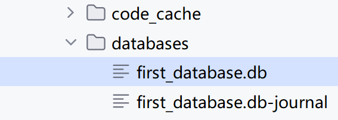

BookStore.db 就是数据库文件

BookStore.db-journal文件，是一个为了让数据库能够支持事务而产生的临时日志文件

## Database Navigator

插件Database Navigator, 用于在UI上查看数据库数据

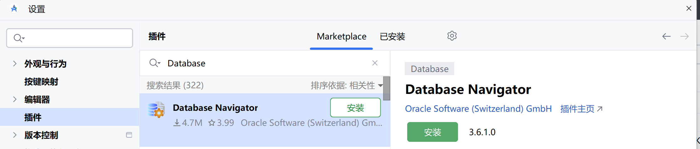


将Virtual Device 上的db文件到出到物理机上

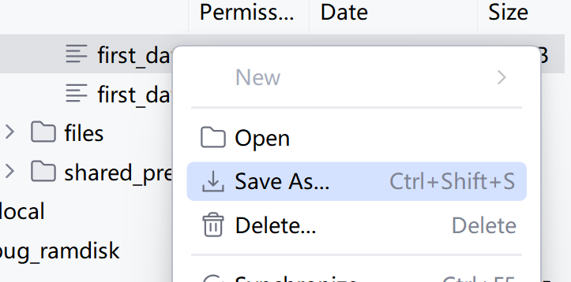


使用DB Browser

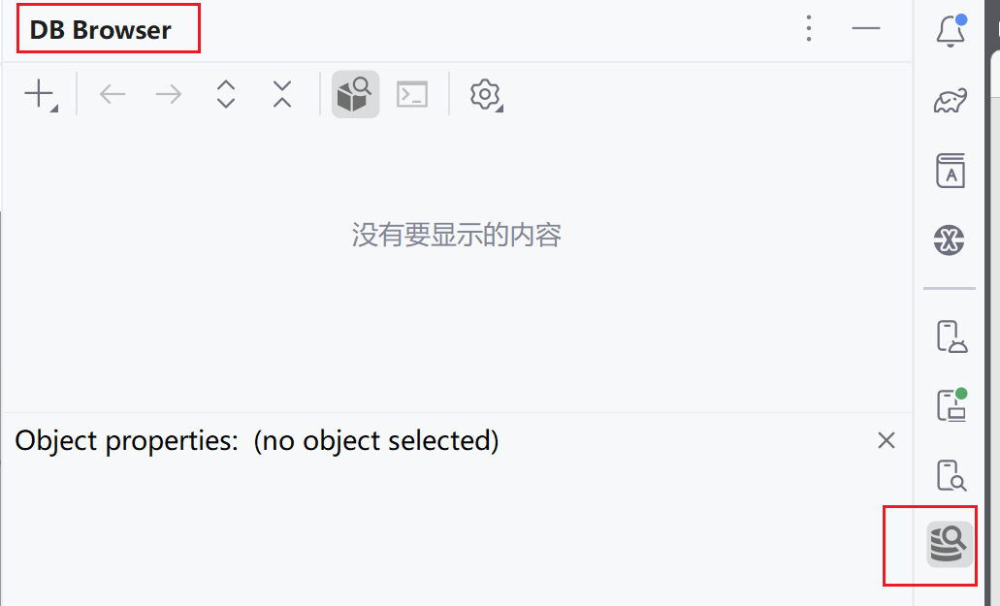


选择SQL方言

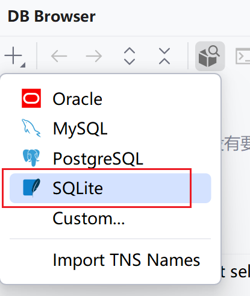

选择导出的文件

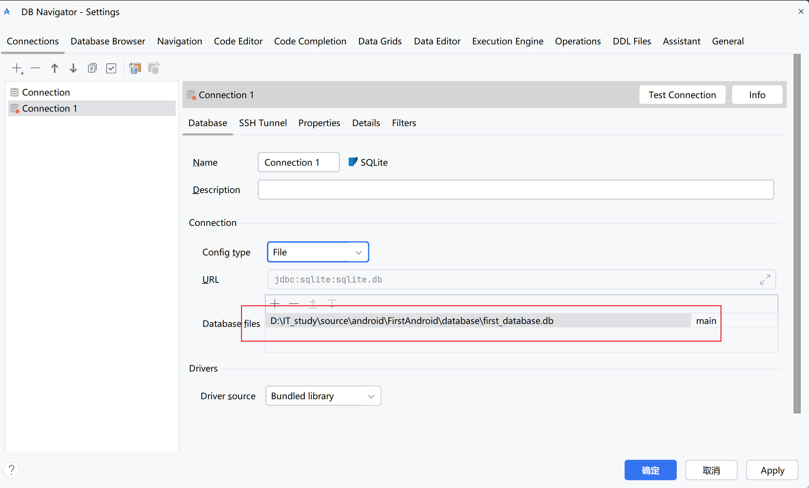

查看数据库信息, or使用Consoles(但是Consoles没有实质作用, 因为实际上是对生产环境上数据库的修改, 并不是对Android应用的数据库的修改)

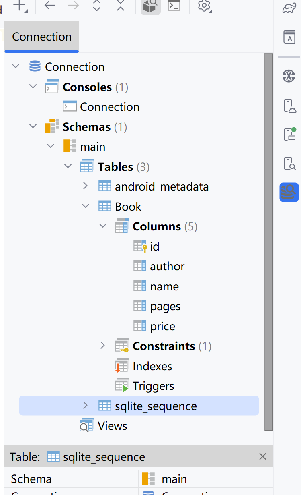

## version 与 升级

### 简单使用

`onUpgrade`在升级时调用

例如在数据库创建Book之后, 希望加上数据库Categories, 或者需要修改Book的建表语句, 则为之奈何? 

由于数据库已经存在, onCreate不会被调用, 如果在onCreate中进行操作, 则无法成功

在onUpgrade进行一些升级的操作

```kotlin
class MyDatabaseHelper(val context: Context, name: String, version: Int) :
    SQLiteOpenHelper(context, name, null, version) {

    private val createBook = "create table Book (" +
            " id integer primary key autoincrement," +
            "author text," +
            "price real," +
            "pages integer," +
            "name text" +
            ")"
    private val createCategory = "create table Category (" +
            "id integer primary key autoincrement," +
            "category_name text," +
            "category_code integer)"
    override fun onCreate(db: SQLiteDatabase) {
        db.execSQL(createBook)
        db.execSQL(createCategory)
        Log.i(logTag,"build db successful")
    }

    override fun onUpgrade(db: SQLiteDatabase, oldVersion: Int, newVersion: Int) {
        db.execSQL("drop table if exists Book")
        db.execSQL("drop table if exists Category")
        onCreate(db)
    }
}
```

将数据库版本跟进

```kotlin
class MainActivity : BaseActivity<ActivityMainBinding>(ActivityMainBinding::inflate) {

    override fun onCreate(savedInstanceState: Bundle?) {
        super.onCreate(savedInstanceState)
        val dbHelper = MyDatabaseHelper(this, "first_database.db", 2)
        dbHelper.writableDatabase
    }


}
```

将Virtual Device导出, 覆盖原来的数据库文件, 用以查看

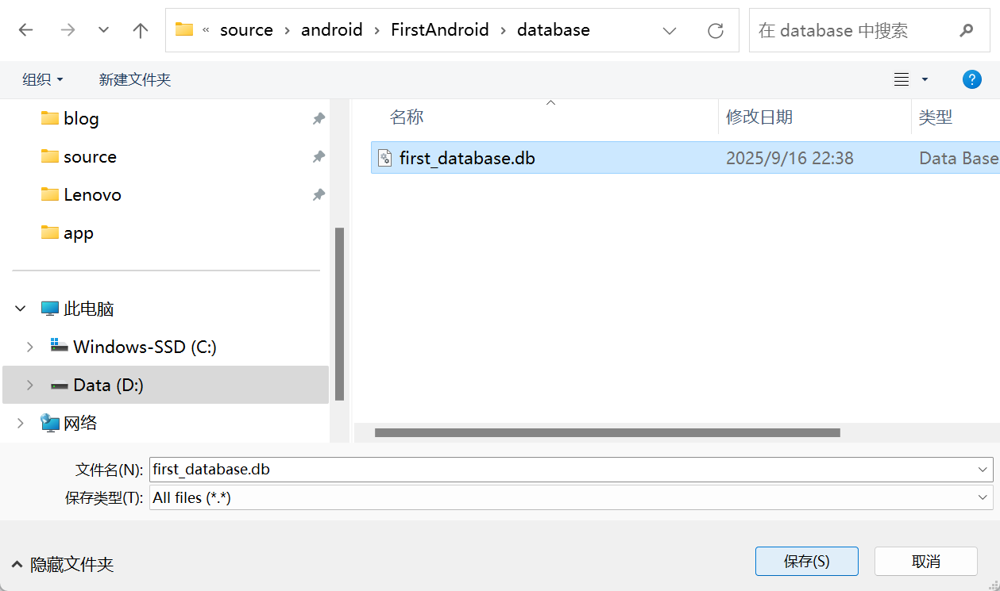

刷新一下

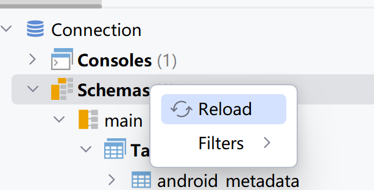

成功创建

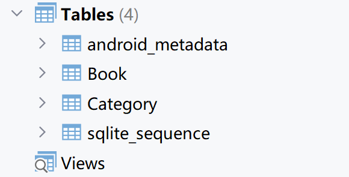


此时版本回退会异常

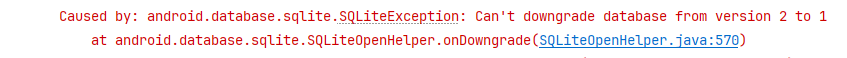

### 最佳实践

简单地在onUpgrade()方法中删除掉了当前所有的表，然后强制重新执行了一遍onCreate()方法并不合适

这里需要为每一个版本号赋予其所对应的数据库变动，然后在onUpgrade()方法中对当前数据库的版本号进行判断，再执行相应的改变就可以了

```kotlin
class MyDatabaseHelper(val context: Context, name: String, version: Int) :
    SQLiteOpenHelper(context, name, null, version) {
    private val createBook =
        """create table Book (
            | id integer primary key autoincrement,
            | author text,
            | price real,
            | pages integer,
            | name text,
            | category_id integer
            | )""".trimMargin() // category_id字段来自版本3的更新
    private val createCategory =
        """create table Category (
            |id integer primary key autoincrement,
            |category_name text,
            |category_code integer
            |)""".trimMargin()

    override fun onCreate(db: SQLiteDatabase) {
        // 对于新安装的用户
        db.execSQL(createBook)
        db.execSQL(createCategory)
    }

    override fun onUpgrade(db: SQLiteDatabase, oldVersion: Int, newVersion: Int) {
        if (oldVersion <= 1) {
            // 对于老版本低于1的用户, 进行到版本2的更新
            db.execSQL(createCategory)
        }
        if (oldVersion <= 2) {
            // 对于老版本低于2的用户, 进行到版本3的更新
            db.execSQL("alter table Book add column category_id integer")
        }
    }
}
```


## CRUD

`SQLiteDatabase `提供了一些不写SQL语句也能执行CRUD的方法

### `insert()`

参数有三

1. 表名
2. 在未指定添加数据的情况下给某些可为空的列自动赋值NULL
   - 可以直接传入null, 表示不启用这个功能
3. ContentValues对象, 含有一系列put方法


```kotlin
fun SQLiteDatabase.addBook() {
    val values1 = ContentValues().apply {
        // 开始组装第一条数据
        put("name", "The Da Vinci Code")
        put("author", "Dan Brown")
        put("pages", 454)
        put("price", 16.96)
    }
    insert("Book", null, values1) // 插入第一条数据
    val values2 = ContentValues().apply {
        // 开始组装第二条数据
        put("name", "The Lost Symbol")
        put("author", "Dan Brown")
        put("pages", 510)
        put("price", 19.95)
    }
    insert("Book", null, values2) // 插入第二条数据
}
```

查看一下

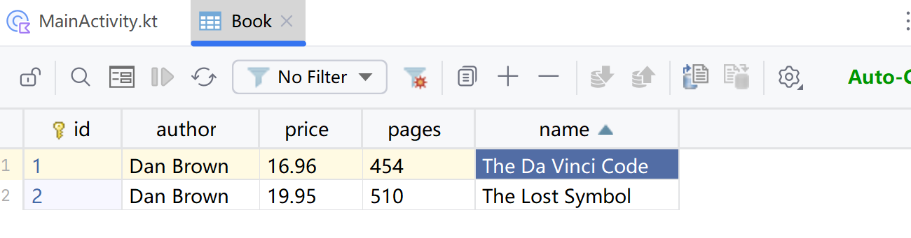

ContentValue对象的创建, 进行封装

```kotlin
fun contentValuesOf(vararg pairs: Pair<String, Any?>): ContentValues = ContentValues().apply {
    pairs.forEach { (key, value) -> putPair(key, value) }
}

fun ContentValues.putPair(key: String, value: Any?) {
    when (value) {
        is Int -> put(key, value) // 利用了类型判断和自动转换
        is Long -> put(key, value)
        is Short -> put(key, value)
        is Float -> put(key, value)
        is Double -> put(key, value)
        is Boolean -> put(key, value)
        is String -> put(key, value)
        is Byte -> put(key, value)
        is ByteArray -> put(key, value)
        null -> putNull(key)
        else -> error("not a database type `${value::class.qualifiedName}` with column: `$key`")
    }
}
```


### `update()`

参数有四

1. 表名
2. ContentValues对象，要把更新数据在这里组装进去
3. 约束, 自定义的SQL-where语句
4. 约束, 填入SQL-where中的参数列表

第三, 四个参数不指定, 则默认更新所有行

```kotlin
fun SQLiteDatabase.updateBook(){
    val values = ContentValues()
    values.put("price", 10.99)
    update("Book", values, "name = ?", arrayOf("The Da Vinci Code"))
}
```

如果不指定范围, 则全部更新

```kotlin
fun SQLiteDatabase.updateBook() {
    val values = ContentValues()
    values.put("price", 10.00)
    val update = update("Book", values, "", emptyArray<String>())
    Log.i(logTag, "updated $update") // 返回值是发生更新的数量
}
```

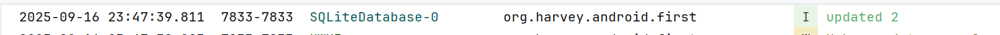

### `delete()`

1. 表名
2. 约束, 自定义的SQL-where语句
3. 约束, 填入SQL-where中的参数列表

第二, 三个参数不指定, 则默认更新所有行

### `query()`

参数

1. table
2. columns, 如果为null, 则使用`*`
3. selection , where 语句(不包括`where`), 为null则不使用
4. 填入selection的参数列表, 为null则不使用
5. groupBy, `group by`语句(不包括`group by`), 为null则不使用
6. having, having语句(不包括`having`), 为null则不使用
7. orderBy, `order by`语句(不包括`order by`), 为null则不使用
8. limit, 分页语句, 可选, 不包括`limit`
   - 一个数字的字符串, 就是单纯的`limit`
   - 如果包括OFFSET, 可以是`"$pageSize OFFSET $offset"`, 也可以是`$pageSize, $offset`

返回curosr对象

```kotlin
private fun Cursor.requireColumnIndex(columnName: String): Int {
    val columnIndex = getColumnIndex(columnName)
    require(columnIndex >= 0) { "no column named $columnName" }
    return columnIndex
}

fun SQLiteDatabase.queryBookAll() {
    // 查询Book表中所有的数据
    val cursor = query("Book", null, null, null, null, null, null)
    cursor.run {
        if (!moveToFirst()) {
            close()
        }
        do {
            // 遍历Cursor对象，取出数据并打印
            val name = getString(requireColumnIndex("name"))
            val author = getString(requireColumnIndex("author"))
            val pages = getInt(requireColumnIndex("pages"))
            val price = getDouble(requireColumnIndex("price"))
            Log.d(logTag, "book name is $name")
            Log.d(logTag, "book author is $author")
            Log.d(logTag, "book pages is $pages")
            Log.d(logTag, "book price is $price")
        } while (cursor.moveToNext())
        close()
    }
}
```

结果日志查看

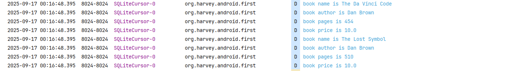

## 事务

- `beginTransaction()`  开启事务
- `setTransactionSuccessful()`  事务已经执行成功
- `endTransaction()` 结束事务

```kotlin
fun SQLiteDatabase.testTransition() {
    beginTransaction() // 开启事务
    try {
        delete("Book", null, null)
        val errorOfCourse = 1 / 0 // 一个异常
        val values = ContentValues().apply {
            put("name", "Game of Thrones")
            put("author", "George Martin")
            put("pages", 720)
            put("price", 20.85)
        }
        insert("Book", null, values)
        setTransactionSuccessful() // 事务已经执行成功
    } catch (e: Exception) {
        e.printStackTrace()
    } finally {
        endTransaction() // 结束事务
    }
}
```

下面是另一种Kotlin风格的写法

```kotlin
fun testTransition(db: SQLiteDatabase) {
    val result = db.transaction {
        delete("Book", null, null)
        val errorOfCourse = 1 / 0 // 一个异常
        val values = ContentValues().apply {
            put("name", "Game of Thrones")
            put("author", "George Martin")
            put("pages", 720)
            put("price", 20.85)
        }
        insert("Book", null, values)
        return@transaction 111 // 可选择
    }
}
```