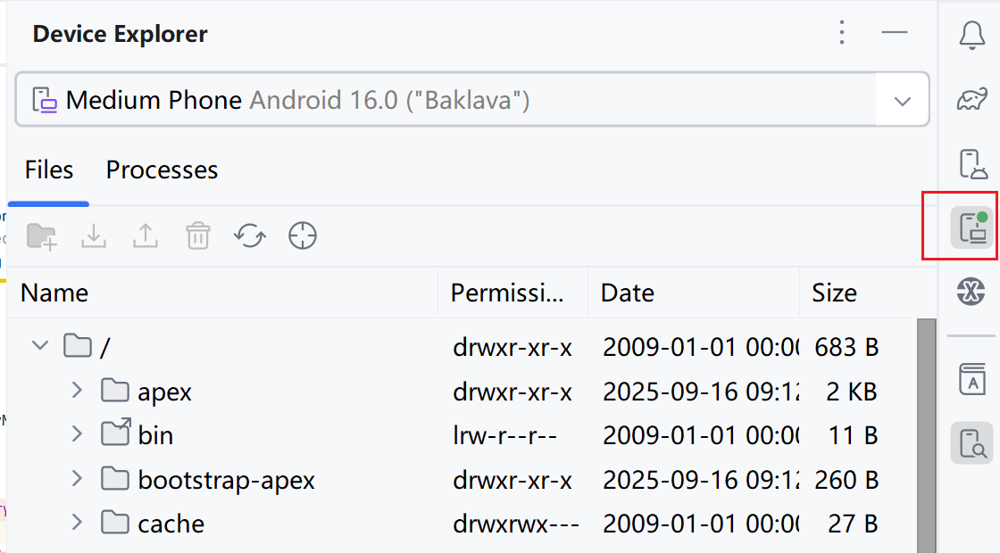
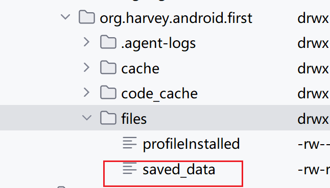
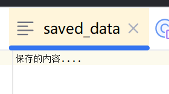

# 文件

### 查看设备文件

使用Studio的DeviceExplorer
 

## 写入数据

Context类中提供openFileOutput方法

- 参数 文件名，在文件创建的时候使用
  - **文件名不可以包含路径**
  - 所有的文件都默认存储到`/data/data/<package name>/files/`目录下
- 参数 文件的操作模式
  - `MODE_PRIVATE` 默认, 覆盖文件内容
  - `MODE_APPEND` 如果文件已经存在, 则追加内容, 否则创建文件
  - `MODE_WORLD_READABLE` 废弃
  - `MODE_WORLD_WRITEABLE` 废弃

方法返回的是一个`FileOutputStream`对象，然后就可以使用Java流的方式将数据写入文件

```kotlin
fun save(inputText: String) {
    try {
        val output = openFileOutput("saved_data", Context.MODE_PRIVATE)
        val writer = BufferedWriter(OutputStreamWriter(output))
        writer.use {
            // 此use函数避免了最终需要用户关闭流
            it.write(inputText) 
        }
    } catch (e: IOException) {
        e.printStackTrace()
    }
}
```







## 读取数据

方法`openFileInput`, 只有一个参数, 是文件名

```kotlin
fun read(): String {
    val content: StringBuilder = StringBuilder()
    try {
        val input = openFileInput("saved_data")
        val reader = BufferedReader(InputStreamReader(input))
        reader.use {
            reader.forEachLine {
                content.append(it)
            }
        }
    } catch (e: IOException) {
        e.printStackTrace()
    }
    return content.toString()
}
```


