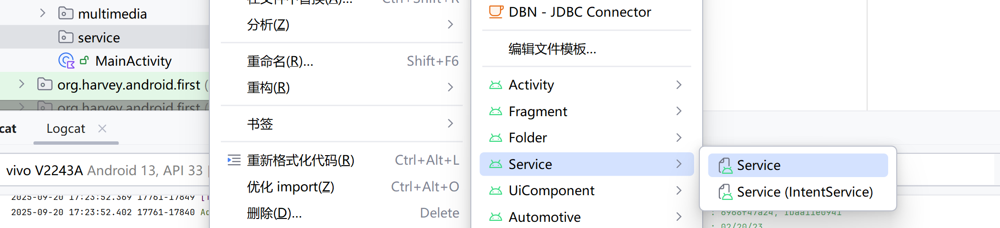
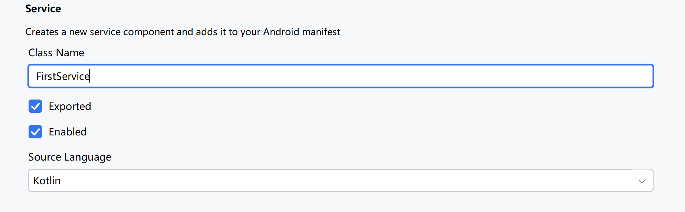
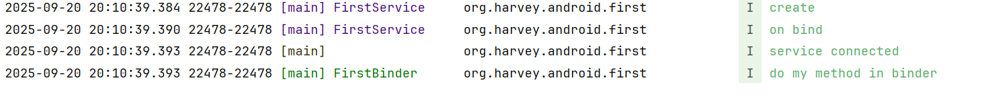
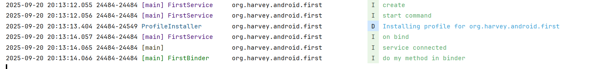
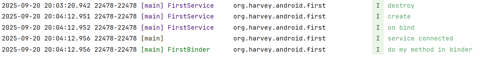
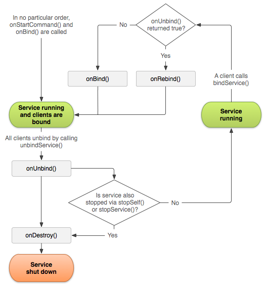

# Service

程序后台运行的解决方案

Service的运行不依赖于任何用户界面，即使程序被切换到后台，或者用户打开了另外一个应用程序，Service仍然保持运行

Service依赖于创建Service所在的应用程序进程。当应用程序进程被杀掉时，所有依赖于该进程的Service也会停止运行

Service默认运行在主线程, 必须手动开启线程才能实现"在后台运行"这一点. 否则, Service依旧可能阻塞主线程


## 创建



进入创建页面



kotlin代码

```kotlin
import android.app.Service
import android.content.Intent
import android.os.IBinder

class FirstService : Service() {

    override fun onBind(intent: Intent): IBinder {
        TODO("Return the communication channel to the service.")
    }
}
```

Manifest注册

```xml
<manifest xmlns:android="http://schemas.android.com/apk/res/android"
        package="org.harvey.android.first">

    <application
            android:allowBackup="true"
            android:dataExtractionRules="@xml/data_extraction_rules"
            android:fullBackupContent="@xml/backup_rules"
            android:icon="@mipmap/ic_launcher"
            android:label="@string/app_name"
            android:roundIcon="@mipmap/ic_launcher_round"
            android:supportsRtl="true"
            android:theme="@style/Theme.FirstAndroid">
        <service
                android:name=".service.FirstService"
                android:enabled="true"
                android:exported="true"></service>

       	<!--...-->
    </application>
	<!--...-->
</manifest>
```

### Service

在Service里简单写一些逻辑

```kotlin
class FirstService : Service() {

    override fun onBind(intent: Intent): IBinder {
        TODO("Return the communication channel to the service.")
    }

    override fun onCreate() {
        super.onCreate()
        logInfo("create");
    }

    override fun onDestroy() {
        super.onDestroy()
        logInfo("destroy")
    }

    /**
     * 每次Service启动的时候调用
     */
    override fun onStartCommand(
        intent: Intent?, flags: Int, startId: Int
    ): Int {
        val onStartCommand = super.onStartCommand(intent, flags, startId)
        logInfo("start command")
        return onStartCommand
    }
}
```

## 启停

借助Intent来实现

### 布局

在布局里写一个启动按钮和停止按钮

```xml
<LinearLayout xmlns:android="http://schemas.android.com/apk/res/android"
        android:layout_width="match_parent"
        android:layout_height="match_parent"
        android:orientation="horizontal">

    <Button
            android:id="@+id/start"
            android:layout_width="0dp"
            android:layout_weight="1"
            android:layout_height="wrap_content"
            android:text="Start Service" />

    <Button
            android:id="@+id/stop"
            android:layout_width="0dp"
            android:layout_weight="1"
            android:layout_height="wrap_content"
            android:text="Stop Service" />
</LinearLayout>
```


### MainActivity

```kotlin
class MainActivity : BaseActivity<ActivityMainBinding>(ActivityMainBinding::inflate) {
    override fun onCreate(savedInstanceState: Bundle?) {
        super.onCreate(savedInstanceState)
        binding.start.setOnClickListener { startService(newIntent<FirstService>()) }
        binding.stop.setOnClickListener { stopService(newIntent<FirstService>()) }
    }
}
```

### 查看日志打印

按下Start


再次按下Start, `onStart()`方法没有反复执行, 只执行了`onStartCommand()`方法


按下Stop


再次start


默认情况下, 这些Service都是在主线程执行的

修改MainActivity的点击回调逻辑

```kotlin
binding.start.setOnClickListener {
    startService(Intent(this, FirstService::class.java))
    logInfo("after start")
}
```


看来是将Service的执行任务放入Queue, 然后本回调函数执行完毕后才会执行Service


## Activity 和Service的通信

使用onBind方法, *返回与这个 service 的交流通道*

```kotlin
override fun onBind(intent: Intent): IBinder {
    TODO("Return the communication channel to the service.")
}
```

### 布局

增加两个按钮, bind和unbind

```xml
<LinearLayout xmlns:android="http://schemas.android.com/apk/res/android"
        android:layout_width="match_parent"
        android:layout_height="match_parent"
        android:orientation="vertical">

    <LinearLayout
            android:orientation="horizontal"
            android:layout_width="match_parent"
            android:layout_height="wrap_content"><!--...--></LinearLayout>

    <LinearLayout
            android:orientation="horizontal"
            android:layout_width="match_parent"
            android:layout_height="wrap_content">

        <Button
                android:id="@+id/bind"
                android:layout_width="0dp"
                android:layout_weight="1"
                android:layout_height="wrap_content"
                android:text="Bind Service" />

        <Button
                android:id="@+id/unbind"
                android:layout_width="0dp"
                android:layout_weight="1"
                android:layout_height="wrap_content"
                android:text="Unbind Service" />
    </LinearLayout>
</LinearLayout>
```

### Binder

写一个类继承Binder

```kotlin
class FirstBinder : Binder() {
    fun myMethod() {
        logInfo("do my method in binder")
    }
}
```


### Service onBind

```kotlin
class FirstService : Service() {

    override fun onBind(intent: Intent): IBinder {
        logInfo("on bind")
        return FirstBinder()
    }
	// ...
}
```


### ServiceConnection

在MainActivity里准备一个binder字段, 和一个connection字段

connection是抽象类ServiceConnection的匿名内部类, 要实现`onServiceConnected`方法和`onServiceDisconnected`方法

```kotlin
class MainActivity : BaseActivity<ActivityMainBinding>(ActivityMainBinding::inflate) {
    lateinit var firstBinder: FirstBinder
    private val connection = object : ServiceConnection {
        override fun onServiceConnected(name: ComponentName, binder: IBinder) {
            logInfo("service connected")
            if (binder is FirstBinder) {
                firstBinder = binder
                firstBinder.myMethod()
            }
        }

        override fun onServiceDisconnected(name: ComponentName) {
            logInfo("service disconnected")
        }
    }
}
```


`onServiceConnected()`    在Activity与Service成功绑定的时候调用

`onServiceDisconnected()`  **在Service的创建进程崩溃或者被杀掉的时候调用**

有了字段firstBinder, 在Activity就可以随意调用Binder的方法了


### Button Click Listener

在MainActivity的OnCreate里setOnClickListener

```kotlin
override fun onCreate(savedInstanceState: Bundle?) {
    super.onCreate(savedInstanceState)
    binding.run {
        // ...
        bind.setOnClickListener {
            bindService(newIntent<FirstService>(), connection, Context.BIND_AUTO_CREATE)
        }
        unbind.setOnClickListener {
            unbindService(connection) // 解绑Service
        }
    }
}
```

`BIND_AUTO_CREATE`表示在Activity和Service进行绑定后自动创建Service。这会使得MyService中的onCreate()方法得到执行，但 onStartCommand()方法不会执行。

### 查看日志

在没有 Start Service 的情况下点击bind之后, 自动执行

1. 创建Service
2. onBind
3. onServiceConnected

而没有执行Service的onCommandService



多次点击bind, 并不会多次onBind, 也不会多次connect

手动start了Service之后再bind, 则不会重复create, 但由于是手动start的Service, 因此必定调用onCommandService




点击一次unbind, 正常unbind了, 调用了Service的destory方法(但没有disconnect)


unbind之后再次bind, service重新创建, onBind方法重新调用, connection重新链接



unbind之后再次点击unbind, **程序崩溃**

**bind之后的Service**即使stop也不会有实质性的作用, **必须unbind才会出发destroy**


在不同Connection去链接同一个Service, 不同的Connection各connect一次, 但是Service的onBind方法只会调用一次(onCreate方法也发生一次), 也就是说, **不同Connection获取到的Binder和Service都是同一份**(演示略)

## 生命周期

onCreate方法会先于onBind方法执行



## Foreground Service

> 前台服务

Android 8.0系统开始，为了防止恶意应用占用大量后台内存, Service功能被大幅削减。

只有当应用保持在前台可见状态的情况下，Service才能保证稳定运行

应用进入后台之后，**Service随时都有可能被系统回收**

如果要长期在后台执行任务, 可以用前台Service解决

### 启动前台服务

启动成前台Service可以像通知一样在通知栏显示

启动前台服务

```kotlin
startForeground(/* id = */1, notification, foregroundServiceType)
```

- id 唯一标识, 是和notification的requestCode使用同一套
  - 但和Notification的reqeustCode不同的是, 不允许是0(notification 允许0)
  - 如果和一般Notification重复or和其他Service的Notification重复, 则后面一条覆盖前面一条
  
- notification 可以和Notification一样创建
  
  - 如果是Android 8.0 之后的版本, Notificaiton Channel 就也是必要的
  
- foregroundServiceType

  - 在Android 14 版本之后必须填写这个参数

  - 同时需要[请求一系列权限](https://developer.android.google.cn/develop/background-work/services/fgs/service-types?hl=zh-cn)表示前台服务的使用过程中可能会用到的**权限**

     `POST_NOTIFICATIONS`和`FOREGROUND_SERVICE`无论什么前台服务类型都是需要的

    以DataSync, 加载数据为例, 需要权限`FOREGROUND_SERVICE_DATA_SYNC`(normal)

    以下是需要的权限

    ```xml
    <uses-permission android:name="android.permission.POST_NOTIFICATIONS" />
    <uses-permission android:name="android.permission.FOREGROUND_SERVICE" />
    <uses-permission android:name="android.permission.FOREGROUND_SERVICE_DATA_SYNC" />
    ```

    然后需要在manifest的service上注册这个类型

    ```xml
    <service
            android:foregroundServiceType="dataSync"
            android:name=".service.FirstService"
            android:enabled="true"
            android:exported="true"/>
    ```


```kotlin
class FirstService : Service() {
    companion object ForegroundChannel{
        private const val  TEST = "my_service"
    }
    override fun onCreate() {
        super.onCreate()
        logInfo("create");
        notificationManager.createNotificationChannel(
            TEST, "前台Service通知", NotificationManager.IMPORTANCE_DEFAULT
        )
        val intent = newIntent<MainActivity>()
        val notification = buildNotification(intent)
        if (ApiVersion.support(Build.VERSION_CODES.Q)) {
            startForeground(
                1, // 这里不能是0
                notification,
                ServiceInfo.FOREGROUND_SERVICE_TYPE_DATA_SYNC
            )
        }
    }
    
    private fun buildNotification(intent: Intent): Notification =
        NotificationCompat.Builder(this, TEST).setContentTitle("foreground service")
            .setContentText("This is content text").setSmallIcon(R.drawable.small_icon)
            .setLargeIcon(BitmapFactory.decodeResource(resources, R.drawable.large_icon))
            .setContentIntent(getActivityPendingIntent(intent)).build()
    // ... 
}
```

### 停止前台服务

用NotificationManager的cancel不会把状态栏中的通知去掉

在服务中调用`stopService()`或者`stopSelf()`来停止服务, 如果在前台运行时停止服务, **服务通知也会被移除**


手动移除状态通知, 参数用于指示是否也移除状态栏通知。该**服务会继续运行，但不再是前台服务**。

```kotlin
fun Service.stopForegroundImmediately() {
    this.stopForeground(Service.STOP_FOREGROUND_REMOVE)
}

fun Service.stopForegroundNever() {
    this.stopForeground(Service.STOP_FOREGROUND_DETACH)
}
```

- `Service.STOP_FOREGROUND_REMOVE` 立刻关闭当前Foreground的通知栏状态, 但是并不关闭服务
- `Service.STOP_FOREGROUND_DETACH`  即使Service stopped 且 destroyed 了依旧保留通知

## IntentService

让Service能够异步执行任务

已弃用, 请使用WorkManager

