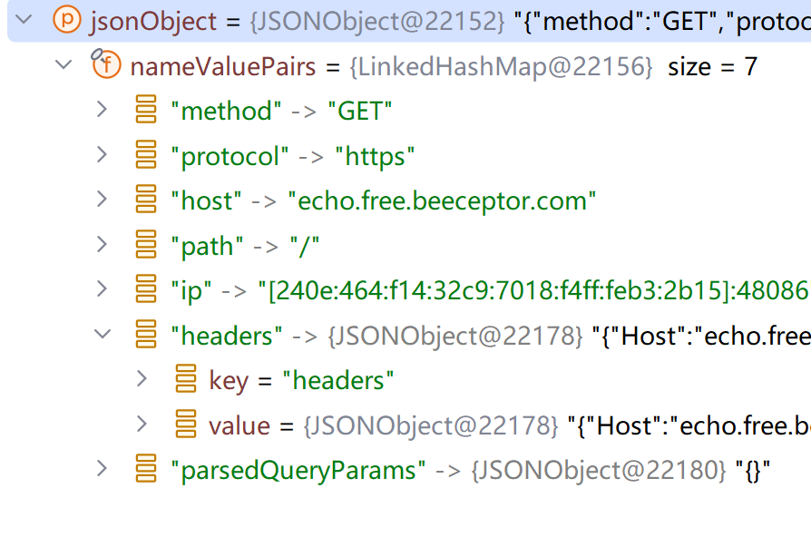

# HTTP

需要权限

```xml
<uses-permission android:name="android.permission.INTERNET" /> 
```

从Android 9.0系统开始，应用程序默认只允许使用HTTPS类型的网络请求，HTTP类型的网络请求因为有安全隐患默认不再被支持

如果需要修改, 在`res/xml`目录下创建`network_config.xml`(即使这么设置了, OkHttp也是不允许明文传输的,故测试略)

```xml
<?xml version="1.0" encoding="utf-8"?>
<network-security-config>
    <!--允许我们以明文方式(Http)在网络上传输数据-->
    <base-config cleartextTrafficPermitted="true">
        <trust-anchors>
            <certificates src="system" />
        </trust-anchors>
    </base-config>
</network-security-config>
```

## HttpURLConnection

### 布局

```xml
<LinearLayout xmlns:android="http://schemas.android.com/apk/res/android"
        android:layout_width="match_parent"
        android:layout_height="match_parent"
        android:orientation="vertical">

    <LinearLayout
            android:orientation="horizontal"
            android:layout_width="match_parent"
            android:layout_height="wrap_content">

        <EditText
                android:id="@+id/urlEdit"
                android:layout_width="0dp"
                android:layout_weight="1"
                android:layout_height="wrap_content"
                android:hint="please input url..."
                android:inputType="textUri" />

        <Button
                android:id="@+id/loadUrl"
                android:layout_width="wrap_content"
                android:layout_height="wrap_content"
                android:text="go" />
    </LinearLayout>

    <ScrollView
            android:layout_width="match_parent"
            android:layout_height="match_parent" >
        <TextView
                android:id="@+id/responseText"
                android:layout_width="match_parent"
                android:layout_height="wrap_content" />
    </ScrollView>
</LinearLayout>
```

ScrollView 允许使用滚动的方式来查看屏幕以外的数据

### MainActivity

```kotlin
class MainActivity : BaseActivity<ActivityMainBinding>(ActivityMainBinding::inflate) {
    override fun onCreate(savedInstanceState: Bundle?) {
        super.onCreate(savedInstanceState)
        binding.run {
            loadUrl.setOnClickListener {
                val urlText = urlEdit.text.toString()
                thread {
                    // 网络处理一定要异步
                    val response = getResponse(URL(urlText))
                    runOnUiThread {
                        // 在主线程(MainActivity)进行UI操作，将结果显示到界面上
                        // 底层就是handler
                        responseText.text = response
                    }
                }
            }
        }
    }

    fun getResponse(url: URL): String {
        val response = StringBuilder()
        val connection = connect(url)
        connection.requestMethod = "GET"
        val inputStream = connection.inputStream
        // 下面对获取到的输入流进行读取
        val reader = BufferedReader(InputStreamReader(inputStream))
        reader.use { r -> r.forEachLine { l -> response.append(l) } }
        connection.disconnect()
        return response.toString()
    }

    private fun connect(url: URL): HttpURLConnection {
        val connection = url.openConnection() as HttpURLConnection
        connection.connectTimeout = 3000 // ms, 3s
        connection.readTimeout = 8000 // ms, 8s
        return connection
    }
}
```

## OkHttp

### 引入库

```kotlin
dependencies {
    implementation("com.squareup.okhttp3:okhttp:4.12.0")
}
```

### 单例工具类

在kotlin中, object不仅仅是静态, 其本质上更类似于单例

```kotlin
object Connection {
    val client = OkHttpClient()

    class HookCallback : Callback { // 使用钩子, 而不是一定要执行
        // 默认给出空方法
        var responseListener: HookCallback.(Call, Response) -> Unit = { _, _ -> }
        var failureListener: HookCallback.(Call, IOException) -> Unit = { _, e -> throw e}

        // 调用
        override fun onResponse(call: Call, response: Response) {
            this.responseListener.invoke(this, call, response)
        }

        override fun onFailure(call: Call, e: IOException) {
            this.failureListener.invoke(this, call, e)
        }
    }

    fun execute(request: Request): Response = client.newCall(request).execute()
    fun enqueue(request: Request, callback: HookCallback): Unit =
        client.newCall(request).enqueue(callback)

    fun putRequest(url: String, bodyMap: Map<String, String>): Request =
        request(url, "PUT", requestBody(bodyMap))

    fun getRequest(url: String): Request =
        request(url, "GET", null)

    fun deleteRequest(url: String): Request =
        request(url, "DELETE", null)

    fun postRequest(url: String, bodyMap: Map<String, String>): Request =
        request(url, "POST", requestBody(bodyMap))

    fun request(url: String, method: String, body: FormBody?): Request =
        Request.Builder().url(url).method(
            method, body
        ).build()

    fun requestBody(bodyMap: Map<String, String>): FormBody =
        FormBody.Builder().addAll(bodyMap).build()

    fun FormBody.Builder.addAll(bodyMap: Map<String, String>): FormBody.Builder {
        bodyMap.forEach(::add)
        return this
    }
}
```

### 使用

```kotlin
class MainActivity : BaseActivity<ActivityMainBinding>(ActivityMainBinding::inflate) {
    override fun onCreate(savedInstanceState: Bundle?) {
        super.onCreate(savedInstanceState)
        binding.run {
            loadUrl.setOnClickListener {
                // 编写网络请求响应逻辑
            }
        }
    }
}
```

阻塞法

```kotlin
val url =  // urlEdit.text.toString()
    "https://echo.free.beeceptor.com/" // 一个在线回声Server, 返回json, 用于测试
val request = Connection.getRequest(url)
thread {
    // 异步执行
    val response = Connection.execute(request)
    val responseData = response.body?.string()
    runOnUiThread {
        responseText.text = responseData
    }
}
```
异步法(监听器)

```kotlin
val url =  // urlEdit.text.toString()
    "https://echo.free.beeceptor.com/" // 一个在线回声Server, 返回json, 用于测试
val request = Connection.getRequest(url)
val callback = Connection.HookCallback()
callback.responseListener = response@{ _, response -> // 监听器
    val responseData = response.body?.string()
    if (responseData == null) {
        return@response
    }
    runOnUiThread {
        responseText.text = responseData
    }
}
Connection.enqueue(request, callback)
```

## JSON

此处略, 可看Java有关文档

此处只介绍org.json包下的一些工具, 构造器有`JSONObject(String)`, `JSONArray(String)`等

获取有`JSONArray.get(Int)`, `JSONObject.get(String)`, `JSONObject.getString(String)` 等



