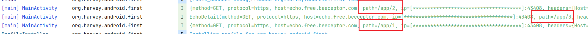
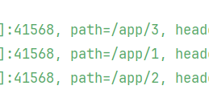

# Retrofit

基于OkHttp实现的网络库, 在以下情况中进行了优化

- 同一款应用程序中所发起的网络请求指向的是同一个服务器域名
- 服务器提供的接口可以根据功能来归类
- 以调用接口的形式对外暴露


## 导入依赖

无需另外的`okHttp`依赖

```kotlin
dependencies {
    implementation("com.squareup.retrofit2:retrofit:2.9.0")
    implementation("com.squareup.retrofit2:converter-gson:2.9.0") // 和 jackson 二选一
    implementation("com.squareup.retrofit2:converter-jackson:2.9.0") // 和 GSON 二选一
}
```

## 使用

### 新的钩子回调

使用了Gson, 就帮我们用泛型替代了json字符串, 于是回调都带有泛型了

```kotlin
import retrofit2.Call
import retrofit2.Response

class HookCallback<T : Any> : retrofit2.Callback<T> { // 使用钩子, 而不是一定要执行
    // 默认给出空方法
    var responseListener: HookCallback<T>.(Call<T>, Response<T>) -> Unit = { _, _ -> }
    var failureListener: HookCallback<T>.(Call<T>, Throwable) -> Unit = { _, e -> throw e }
    override fun onResponse(call: Call<T>, response: Response<T>) {
        responseListener(call, response)
    }

    override fun onFailure(call: Call<T>, t: Throwable) {
        failureListener(call, t)
    }
}
```


### 代理工厂

```kotlin
// Retrofit 对API代理工厂类
val retrofit: Retrofit = Retrofit.Builder().baseUrl("https://echo.free.beeceptor.com")
    .addConverterFactory(GsonConverterFactory.create()/*json 序列化/反序列化 工厂*/)
    .build()
```


### 代理服务

```kotlin
data class EchoDetail(
    val method: String,
    val protocol: String,
    val host: String,
    val ip: String,
    val path: String,
    val headers: Map<String, String>
)

interface EchoService {
    @GET("/app/1")
    fun getAnyData(): Call<Any>

    /**
     * @return [com.google.gson.internal.LinkedTreeMap]
     */
    @GET("/app/2")
    fun getMapData(): Call<Map<String, *>>

    @GET("/app/3")
    fun getDeserializedData(): Call<EchoDetail>
}

// 代理API实例
val echoService: EchoService = retrofit.create(EchoService::class.java)
```


### 使用

```kotlin
class MainActivity : BaseActivity<ActivityMainBinding>(ActivityMainBinding::inflate) {

    private val logger: Logger = this.logger()

    override fun onCreate(savedInstanceState: Bundle?) {
        super.onCreate(savedInstanceState)
        binding.run {
            loadUrl.setOnClickListener {
                // echoService.getData().execute() 阻塞式, 略
                echoService.getAnyData().enqueue(initCallback())
                echoService.getMapData().enqueue(initCallback())
                echoService.getDeserializedData().enqueue(initCallback())
            }
        }
    }

    private fun <T : Any> initCallback(): HookCallback<T> = HookCallback<T>().apply {
        responseListener = { call, res ->
            logger.info(res.body().toString()
        }
    }
}
```


Logcat似乎会对一些隐私信息做加密, 例如URL和IP



而且, **Callback的回调是发生在主线程的**

## URL 参数

Service定义

```kotlin
interface EchoService {

    @GET("/app/{id}")
    fun getData(@Path("id") id: Int): Call<EchoDetail>
}
```

使用

```kotlin
echoService.getData(1).enqueue(initCallback())
echoService.getData(2).enqueue(initCallback())
echoService.getData(3).enqueue(initCallback())
```



## Header声明

```kotlin
interface EchoService {
    /**
     * 静态Headers
     */
    @Headers("User-Agent: okhttp", "Cache-Control: max-age=0")
    @GET("/app")
    fun getData(): Call<EchoDetail>

    /**
     * 动态参数Headers
     */
    @GET("/app")
    fun getData(
        @Header("User-Agent") userAgent: String, @Header("Cache-Control") cacheControl: String
    ): Call<EchoDetail>

}
```

## Interceptor

1. 创建client的Builder
2. 在Builder里面add interceptor
3. build client
4. client注册到retrofit中去

```kotlin
lateinit var authorization: String

val authorizeInterceptor: (Interceptor.Chain) -> Response = interceptor@{ chain ->
    val originalRequest = chain.request()
    if (!::authorization.isInitialized) {
        // 没有完成初始化, 直接过
        return@interceptor chain.proceed(originalRequest)
    }
    // 完成了初始化, 添加到头
    // 如果token不为空，则添加Authorization头
    val requestBuilder = originalRequest.newBuilder()
    requestBuilder.header("Authorization", authorization)
    // 添加完毕之后通过
    chain.proceed(requestBuilder.build())
}


val client: OkHttpClient = OkHttpClient.Builder().addInterceptor(authorizeInterceptor).build()

// Retrofit 对API代理工厂类
val retrofit: Retrofit = Retrofit.Builder().baseUrl("https://echo.free.beeceptor.com")
    .client(client)
    .addConverterFactory(GsonConverterFactory.create()/*json 序列化/反序列化 工厂*/).build()
```

## 工具整理

```kotlin
/**
 * 允许外界设置的选项有[url]和[addInterceptor]
 */
class RetrofitConfig {
    var retrofitInitialized: Boolean = false
    private val clientBuilder: OkHttpClient.Builder = OkHttpClient.Builder()

    fun addInterceptor(interceptor: Interceptor) {
        check(!retrofitInitialized) { 
            "retrofit have been initialized, you can not add interceptor any more!" 
        }
        clientBuilder.addInterceptor(interceptor)
    }

    fun buildClient(): OkHttpClient {
        return clientBuilder.build()
    }

    var url: String = ""
        set(value) {
            check(!retrofitInitialized) { 
                "retrofit have been initialized, you can not set url any more!" 
            }
            field = value
        }
        get() {
            check(field.isNotEmpty()) { 
                "url have not been initialized, it still empty, you can not read it!" 
            }
            return field
        }
}
/**
 * 允许多个不同config的Manager
 */
class RetrofitProxyManager(config: RetrofitConfig) {
    /**
     *  Retrofit 对API代理工厂类
     */
    private val retrofit: Retrofit =
        Retrofit.Builder().baseUrl(config.url).client(config.buildClient())
            .addConverterFactory(GsonConverterFactory.create()).build()


    private val proxyCache: MutableMap<String, Any?> = mutableMapOf()

    /**
     * create里面没有缓存机制, 只能在proxy里面加了
     */
    fun <T> proxy(service: Class<T>): T {
        val name = service.name
        val instance = proxyCache.computeIfAbsent(name) { _ -> retrofit.create(service) }
        @Suppress("UNCHECKED_CAST") return instance as T
    }

    inline fun <reified T : Any> proxy() = proxy(T::class.java)
}


/**
 * 提供给哪些只需要简单获取一个代理工具的情况
 */
object RetrofitProxy {
    val config: RetrofitConfig = RetrofitConfig()
    val manager: RetrofitProxyManager by lazy {
        RetrofitProxyManager(config)
    }
}
```

使用方法

```kotlin
interface EchoService {
    @GET("app")
    fun getData(): Call<Any>
}

class MainActivity : BaseActivity<ActivityMainBinding>(ActivityMainBinding::inflate) {

    private val logger: Logger = this.logger()

    override fun onCreate(savedInstanceState: Bundle?) {
        if(!RetrofitProxy.config.retrofitInitialized){ // 如果还没初始化
            RetrofitProxy.config.url = "https://echo.free.beeceptor.com/"
            RetrofitProxy.config.addInterceptor { chain ->
                logger.info("successful registered")
                chain.proceed(chain.request())
            }
        }
        super.onCreate(savedInstanceState)
        binding.loadUrl.setOnClickListener {
            val proxy = RetrofitProxy.manager.proxy<EchoService>()
            val callback = HookCallback<Any>()
            callback.responseListener = { _, resp ->
                logger.info(resp.body().toString())
            }
            proxy.getData().enqueue(callback)
        }
    }
}
```