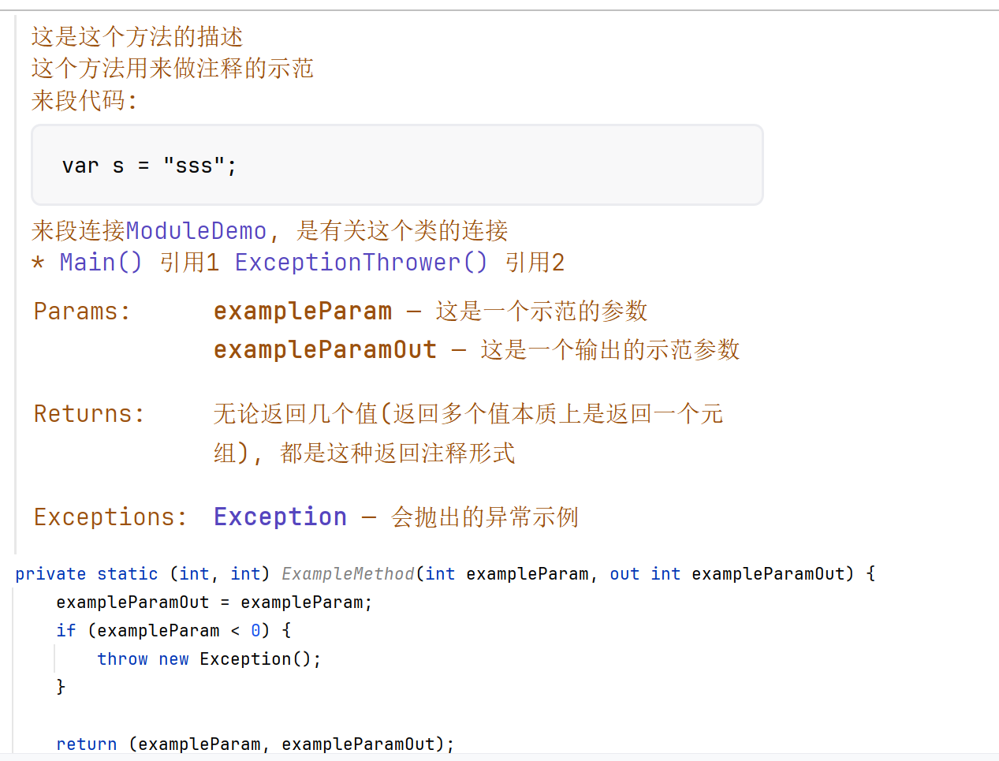

# XML文档注释

-   `///` 单行分隔符

    三斜杠指示的注释可用于文档

    ```csharp
    /// 这是一个类<br/>
    /// 是的
    public static class ModuleDemo {
    }
    ```

    -   C# 库使用此形式
    -   如果分隔符后面有空格，则它不会被显示

-   `/** ... */`

    ```csharp
    /**
     * 这是这个方法的描述<br/>
     * 这个方法用来做注释的示范<br/>
     * 来段代码: <code>var s = "sss";</code>
     * 来段连接<see cref="ModuleDemo"/>, 是有关这个类的连接<br/>
     *
     * <param name="exampleParam">这是一个示范的参数</param>
     * <param name="exampleParamOut">这是一个输出的示范参数</param>
     * <returns>无论返回几个值(返回多个值本质上是返回一个元组), 都是这种返回注释形式</returns>
     * <see cref="ModuleDemo.Main"/> 引用1
     * <see cref="ModuleDemo.ExceptionThrower"/> 引用2
     * <exception cref="Exception">会抛出的异常示例</exception>
     */
    private static (int, int) ExampleMethod(int exampleParam, out int exampleParamOut) {
        exampleParamOut = exampleParam;
        if (exampleParam < 0) {
            throw new Exception();
        }

        return (exampleParam, exampleParamOut);
    }
    ```

    

