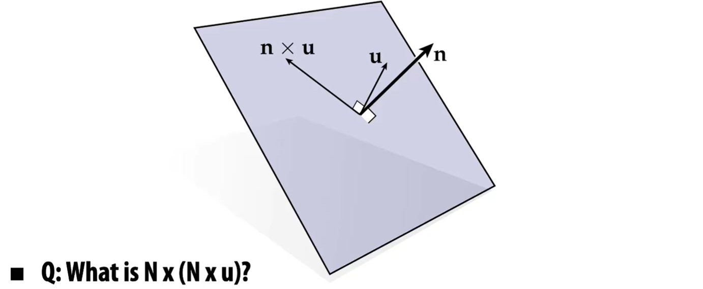
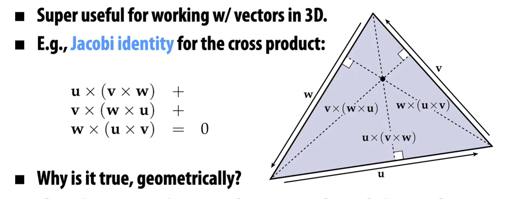
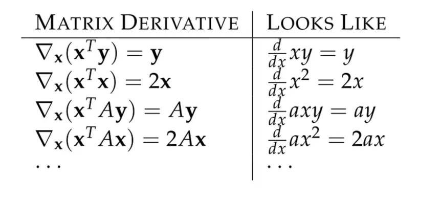
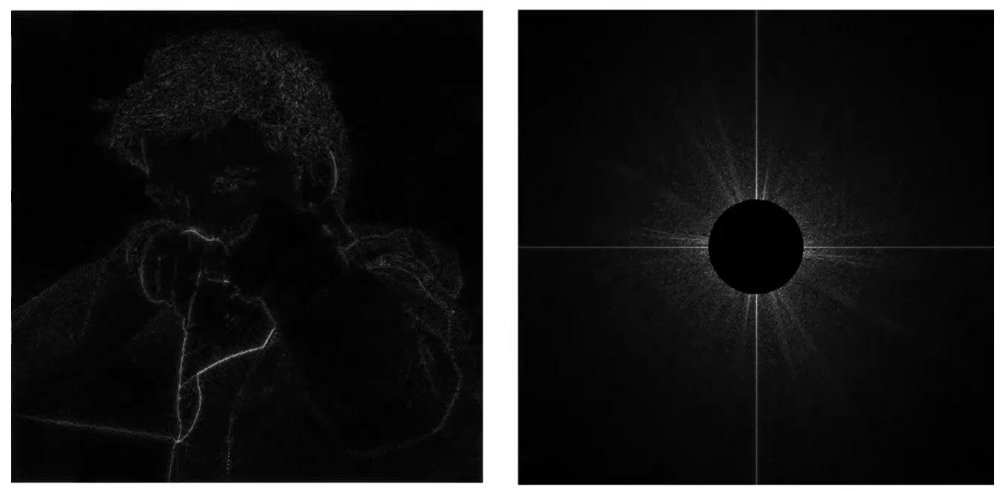
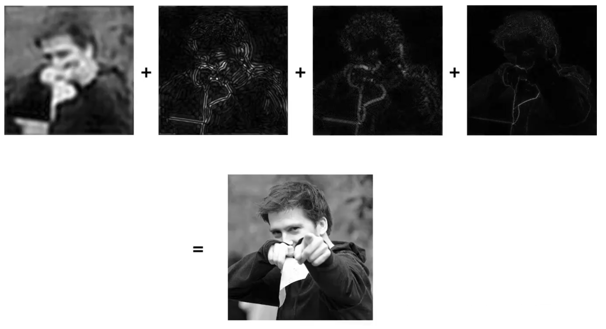
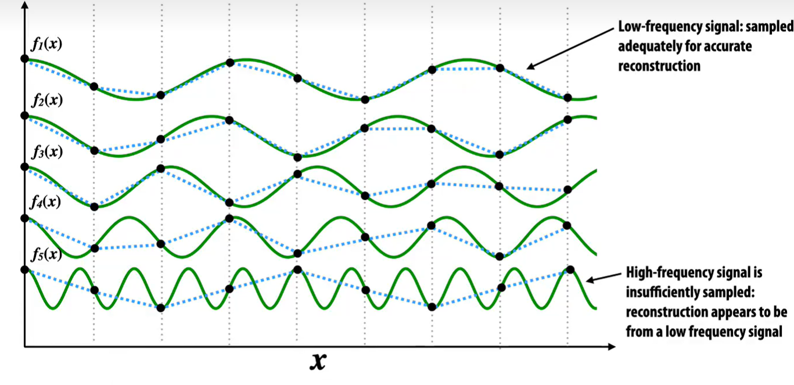
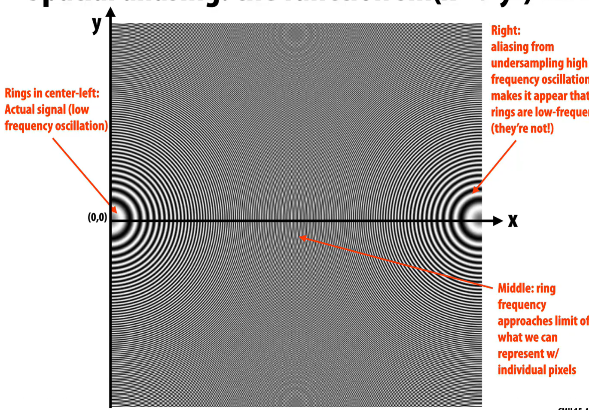
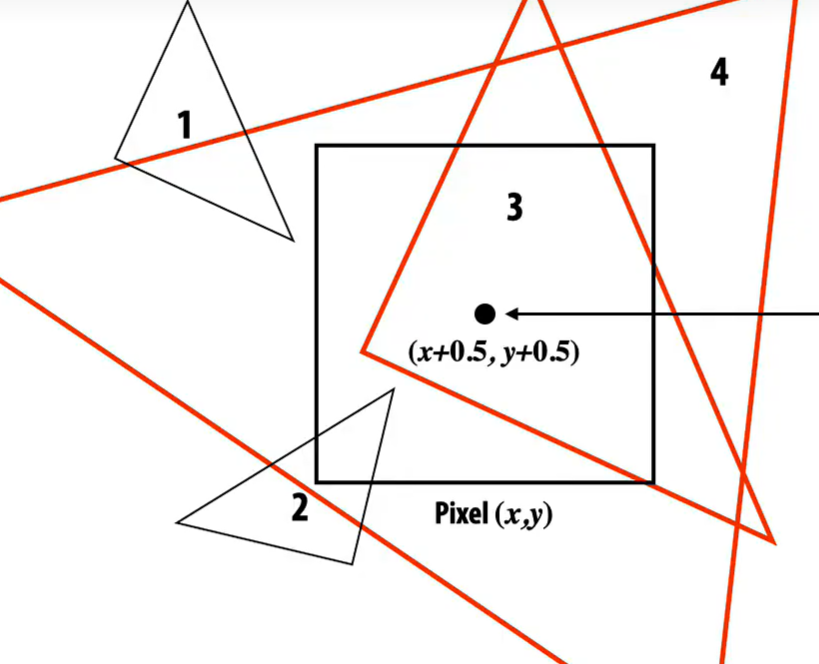

# Vector Space

向量乘积的笛卡尔坐标系求法, 使用Determinant定义
$$
\vec{u} \times \vec{v} := det\left(\begin{array}{ll}
\vec{e_1} & \vec{e_2} & \vec{e_3}\\
u_1 & u_2 & u_3\\
v_1 & v_2 & v_3
\end{array} \right) = \left(\begin{array}{ll}
u_2 v_3 - u_3 v_2 \\
u_1 v_3 - u_3 v_1 \\
u_1 v_2 - u_2 v_1
\end{array} \right)\\
$$

设置一个单位向量 $\vec{n}$,  现将其作为一个平面 $\alpha$ 的法向量, $\vec{u}$ 是平面 $\alpha$ 上的一个向量

求 $\vec{n} \times \vec{u}$ 相当于将 $\vec{u}$ 这个向量在平面 $\alpha$ 上旋转了 $90^{\circ}$

同理可得, 求 $\vec{n} \times (\vec{n} \times \vec{u})$ 相当于将 $\vec{n} \times \vec{u}$ 这个向量在平面 $\alpha$ 上旋转了 $90^{\circ} $, 即将 $\vec{u}$ 这个向量在平面 $\alpha$ 上旋转了 $180^{\circ}$
$$
det\left(\begin{array}{ll}
\vec{u} \\ \vec{v} \\ \vec{w}
\end{array} \right) = 
(\vec{u}\times\vec{v})\cdot\vec{w}=
(\vec{v}\times\vec{w})\cdot\vec{u}=
(\vec{w}\times\vec{u})\cdot\vec{v}
$$
例如$\vec{u}\times\vec{v}$就是底面积, 同时也是u-v平面的法向量, $(\vec{u} \times \vec{v}) \cdot \vec{w}$ 就是求这个菱形的体积

## Jacobi identity

雅可比式在三角形的法向量运算中的使用

$$
\vec{u}\times(\vec{v}\times\vec{w}) +\\
\vec{v}\times(\vec{w}\times\vec{u}) +\\
\vec{w}\times(\vec{u}\times\vec{v}) = 0
$$

## Lagrange's identity

$$
\vec{u}\times(\vec{v}\times\vec{w}) = \vec{v} (\vec{u}\cdot\vec{w})-\vec{w} (\vec{u} \cdot \vec{v})
$$

## Gradients on Matrix

在矩阵上求梯度

例证第一个

## Gradients on Function

对于 $F(f)$ 回归定义
$$
<< \nabla F,u >> := D_uF\\
D_uF := \lim_{\epsilon \to 0} \frac{F(f+\epsilon u)-F(f)}{\epsilon}
$$
对于 $F(f) = <<f,g>>$ 函数内积作为 $F$ 的定义, 其梯度类比可得 $\nabla F = g$

对于$F(f) = ||f||^2$ 函数的范数作为 $F$ 的定义, 其梯度类比可得 $\nabla F = 2f_0$, 证明如下
$$
<<\nabla F(f_0), u>> = \lim_{\epsilon \to 0} \frac {F(f_0+\epsilon u)-F(f_0)} {\epsilon}\\
F(f_0+\epsilon u)= ||f_0+\epsilon u||^2 \\
= ||f_0||^2 + \epsilon^2 ||u||^2 + 2 \epsilon<<f_0,u>>\\
= F(f_0)+\epsilon^2F(u)\\
代入得: <<\nabla F(f_0), u>> = 2<<f_0,u>>
$$

# Sampling

## Why Triangle?

- 三角形可以组成任意图形

  

- 三角形由三个点组成, 三个点总是在一个平面=>便于计算这个单元(三角形单元就构成一个平面)的法线

- 便于利用三个点进行**线性插值**(权重使用重心的概念)

## Sampling

### superposition frequency

复杂信号可以表示为不同频率的简单信号的和

将这个概念扩展到二维图像上

如果只采样低频的数据, 就会获取比较糊的图像

如果只采样中间频率的数据, 就会有一个模糊的轮廓

如果只采样高频率的数据, 就会有一个清晰的轮廓

上述三个频率的采样加起来, 就是全段频率的采样, 同理, 图片加起来也会比较清晰

采样低频率数据+采样较低频率数据+采样较高频率数据+采样超高频率数据

### 高频信号失真

Origin频率高于采样频率太多, 将导致采样结果反而接近低频下的Origin

在相同频率的采样率下, 频率的信号高到一定程度, 就会高度失真

在$f_5(x)$中, 明明源信号是高频的, 但采样得到的信号看起来好像是低频的(蓝色虚线)

 

随着X增大, 源数据频率增高, 发现出现了低频的点, 这就是因为采样频率不足导致的

依据**香农定理**, 需要源数据的最高频率的两倍来采样, 可以完全还原源数据

## Cover

判断一个像素是否被三角形Cover, 看这个Pixel的中心点

- 1 not Covered Pixel
- 2 not Covered Pixel
- 3 Covered Pixel
- 4 Covered Pixel

## Aliasing

## Point In Triangle Test

看一个是否在一个三角形中

### early out

使用**快速退出**, 避免对一些明显不被覆盖的点进行无用的检查

从左到右, 遇到第一个不在三角形内的点, 这一行就可以break了

同理, 也可以依据$P_0 ,P_1, P_2$ 三个点的横坐标, 找到最左边的一个点, 来减少行的开始时对Point的无用检查

# Spatial Transformations

为什么是线性变换

- 容易实现
- 容易求解,也容易进行反向操作
- 线性变换的组合依旧是线性的

## 基础变换

### 旋转

每个点之间的距离不变 
$$
\left(\begin{array}{ll}
\cos{\theta} & -\sin{\theta} & 0\\
\sin{\theta} & \cos{\theta} & 0 \\
0 & 0 & 1
\end{array} \right)\\
rotation
$$
旋转$R$的反操作是其转置 $R^T$ , 即 $R^{-1} = R^T$

### 缩放

$$
\left(\begin{array}{ll}
a & 0 & 0\\
0 & b & 0 \\
0 & 0 & 1
\end{array} \right)\\
scale
$$

当a, b异号, 则发生reflect对称

### 剪切

在某个方向上的距离不变

向 $\vec{e} = (e_1,e_2)$ 方向进行程度为$\vec{u} = (u_1,u_2)$的剪切

其变换矩阵应该为
$$
A_{u,e} = I + \vec{u}\cdot\vec{e}^T
$$

$$
A_{u,e} = \left(\begin{array}{ll}
1 & 0 & 0\\
0 & 1 & 0 \\
0 & 0 & 1
\end{array} \right)+\left(\begin{array}{ll}
u_1 e_1	& u_1 e_2 & 0\\
u_2 e_1 & u_2 e_2 & 0 \\
0 		& 0 	  & 0
\end{array} \right)=\left(\begin{array}{ll}
u_1 e_1 + 1	& u_1 e_2 		& 0\\
u_2 e_1 	& u_2 e_2 + 1   & 0 \\
0 			& 0 	  		& 1
\end{array} \right)\\
Shear
$$

### 平移

向 $\vec{u} = (u_1,u_2)$ 方向平移(三维空间在 $x-y$ 平行的平面上的投影)

$$
\left(\begin{array}{ll}
1 & 0 & u_1\\
0 & 1 & u_2 \\
0 & 0 & 1
\end{array} \right)\\
translation
$$

### 转换复合

$$
(R_0\times S \times R_1 + T(\vec{u})) \times 
\left(\begin{array}{ll}
p_1 \\
p_2 \\
0
\end{array}\right)
$$

- $R_1$ 的变换先起作用, 因为从左往右运算, 左边的矩阵作用在右边的矩阵上

1. $R_1$ 旋转
2. $S$ 缩放
3. $R_0$ 旋转
4. $T$ 平移

## 相机移动

相机移动变换矩阵 $A$ 转换成物体进行变换矩阵为 $A^{-1}$ 的移动
$$
Camera(A) \to Object(A^{-1})
$$

