[TOC]

# Vector Space

向量乘积的笛卡尔坐标系求法, 使用Determinant定义

$$
\vec{u} \times \vec{v} := det\left(\begin{array}{ll}
\vec{e_1} & \vec{e_2} & \vec{e_3}\\
u_1 & u_2 & u_3\\
v_1 & v_2 & v_3
\end{array} \right) = \left(\begin{array}{ll}
u_2 v_3 - u_3 v_2 \\
u_1 v_3 - u_3 v_1 \\
u_1 v_2 - u_2 v_1
\end{array} \right)
$$

设置一个单位向量 $\vec{n}$,  现将其作为一个平面 $\alpha$ 的法向量, $\vec{u}$ 是平面 $\alpha$ 上的一个向量


求 $\vec{n} \times \vec{u}$ 相当于将 $\vec{u}$ 这个向量在平面 $\alpha$ 上旋转了 $90^{\circ}$

同理可得, 求 $\vec{n} \times (\vec{n} \times \vec{u})$ 相当于将 $\vec{n} \times \vec{u}$ 这个向量在平面 $\alpha$ 上旋转了 $90^{\circ} $, 即将 $\vec{u}$ 这个向量在平面 $\alpha$ 上旋转了 $180^{\circ}$
$$
det\left(\begin{array}{ll}
\vec{u} \\ \vec{v} \\ \vec{w}
\end{array} \right) = 
(\vec{u}\times\vec{v})\cdot\vec{w}=
(\vec{v}\times\vec{w})\cdot\vec{u}=
(\vec{w}\times\vec{u})\cdot\vec{v}
$$
例如$\vec{u}\times\vec{v}$就是底面积, 同时也是u-v平面的法向量, $(\vec{u} \times \vec{v}) \cdot \vec{w}$ 就是求这个菱形的体积

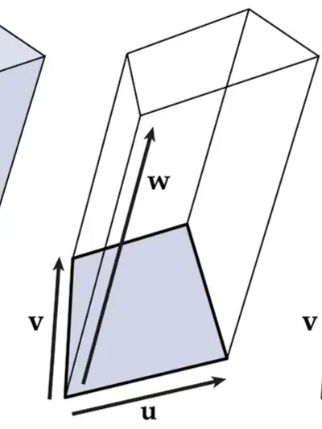

## Jacobi identity

雅可比式在三角形的法向量运算中的使用


$$
\vec{u}\times(\vec{v}\times\vec{w}) +
\vec{v}\times(\vec{w}\times\vec{u}) +
\vec{w}\times(\vec{u}\times\vec{v}) = 0
$$

## Lagrange's identity

$$
\vec{u}\times(\vec{v}\times\vec{w}) = \vec{v} (\vec{u}\cdot\vec{w})-\vec{w} (\vec{u} \cdot \vec{v})
$$

## Gradients on Matrix

在矩阵上求梯度


例证第一个

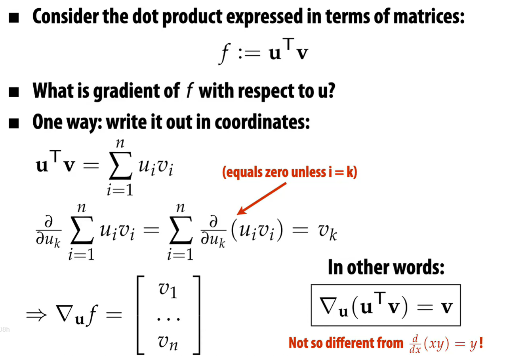

## Gradients on Function

对于 $F(f)$ 回归定义
$$
<< \nabla F,u >> := D_uF
$$
$$

D_uF := \lim_{\epsilon \to 0} \frac{F(f+\epsilon u)-F(f)}{\epsilon}
$$

对于 $F(f) = <<f,g>>$ 函数内积作为 $F$ 的定义, 其梯度类比可得 $\nabla F = g$

对于$F(f) = ||f||^2$ 函数的范数作为 $F$ 的定义, 其梯度类比可得 $\nabla F = 2f_0$, 证明如下
$$
<<\nabla F(f_0), u>> = \lim_{\epsilon \to 0} \frac {F(f_0+\epsilon u)-F(f_0)} {\epsilon}
$$
即
$$
F(f_0+\epsilon u)= ||f_0+\epsilon u||^2 
= ||f_0||^2 + \epsilon^2 ||u||^2 + 2 \epsilon<<f_0,u>>
= F(f_0)+\epsilon^2F(u)
$$

带入得
$$
<<\nabla F(f_0), u>> = 2<<f_0,u>>
$$

# Sampling

采样点和像素点

- 像素点是最终展示在屏幕上的
- 采样点不一定和像素点等同, 比如超采样, 每一个像素点可能对应多个采样点

## Why Triangle?

- 三角形可以组成任意图形

  

- 三角形由三个点组成, 三个点总是在一个平面=>便于计算这个单元(三角形单元就构成一个平面)的法线

- 便于利用三个点进行**线性插值**(权重使用重心的概念)

## Sampling

### superposition frequency

复杂信号可以表示为不同频率的简单信号的和

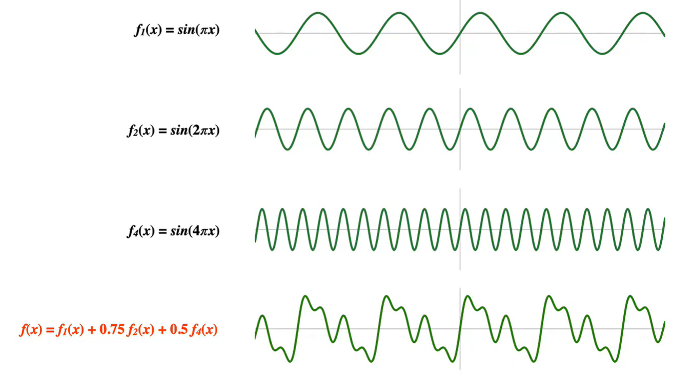

将这个概念扩展到二维图像上

如果只采样低频的数据, 就会获取比较糊的图像

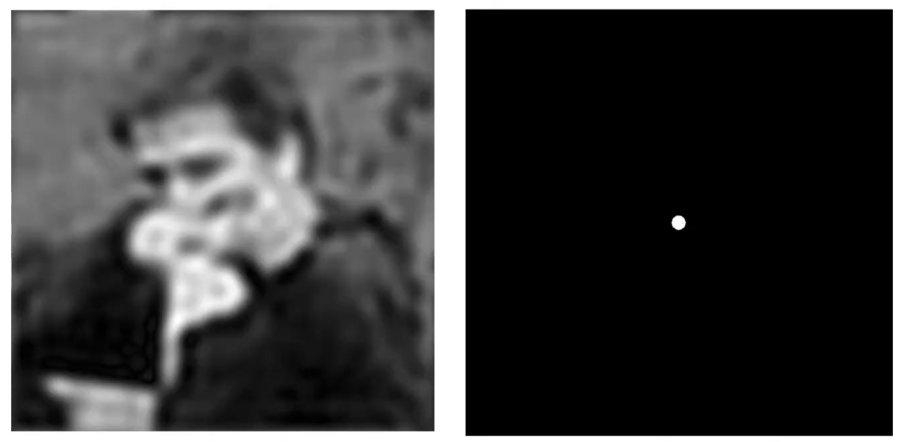

如果只采样中间频率的数据, 就会有一个模糊的轮廓

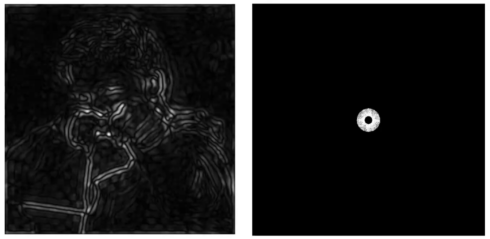

如果只采样高频率的数据, 就会有一个清晰的轮廓


上述三个频率的采样加起来, 就是全段频率的采样, 同理, 图片加起来也会比较清晰


采样低频率数据+采样较低频率数据+采样较高频率数据+采样超高频率数据

### 高频信号失真

Origin频率高于采样频率太多, 将导致采样结果反而接近低频下的Origin


在相同频率的采样率下, 频率的信号高到一定程度, 就会高度失真

在$f_5(x)$中, 明明源信号是高频的, 但采样得到的信号看起来好像是低频的(蓝色虚线)

 

随着X增大, 源数据频率增高, 发现出现了低频的点, 这就是因为采样频率不足导致的

依据**香农定理**, 需要源数据的最高频率的两倍来采样, 可以完全还原源数据

## Cover

判断一个像素是否被三角形Cover, 看这个Pixel的中心点


- 1 not Covered Pixel
- 2 not Covered Pixel
- 3 Covered Pixel
- 4 Covered Pixel

## Point In Triangle Test

看一个是否在一个三角形中

[TODO](向量内积法判断)

## Aliasing

混叠

[TODO](混叠的方法)

### early out

使用**快速退出**, 避免对一些明显不被覆盖的点进行无用的检查

从左到右, 遇到第一个不在三角形内的点, 这一行就可以break了

同理, 也可以依据$P_0 ,P_1, P_2$ 三个点的横坐标, 找到最左边的一个点, 来减少行的开始时对Point的无用检查

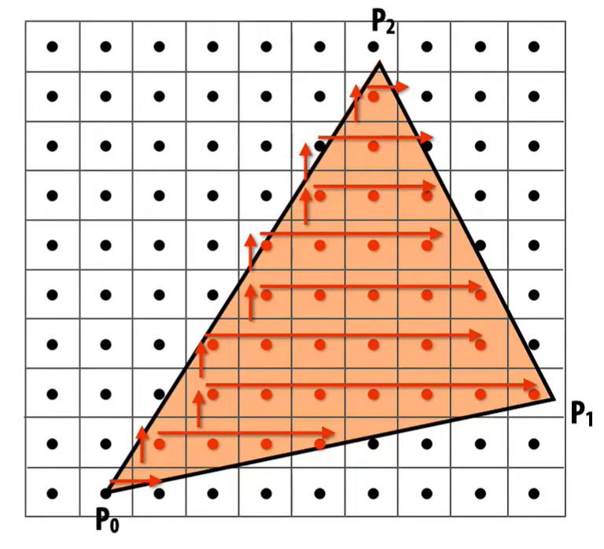

## Depth-buffer/z-buffer

深度缓冲

用于解决遮挡关系

在每个采样点, 除了颜色之外, 还要追踪到目前为止所见的最接近的三角形

1. 遍历所有三角形, 对于某个三角形:
2. 遍历所有像素, 对于某个像素点: 
3. 判断是否在三角形内, 需要被渲染, 如果不是, 进入6, 否则进入4
4. 判断是否在之前被其他三角形渲染, 如果不是, 直接渲染, 进入6, 否则进入5
5. 判断之前的三角形的渲染的深度, 如果旧三角形的更近, 则什么都不做, 否则, 覆盖颜色, 更新深度
6. 进入2

```cpp
draw_sample(x,y,depth,color){
	if(pass_depth_test(depth,z_buffer[x][y])){
		// triangle now is closer
        z_buffer[x][y] = depth;
        color_buffer[x][y] = color
	}else{
		// do nothing
	}
}
```

z-buffer能解决画家算法无法解决的循环遮挡的问题

## Depth-buffer+Supersampling

1. 准备一个$W\cdot H\cdot S \cdot S$ 大小的color数组, 用于存储超采样过程中的像素
2. 准备一个$W\cdot H\cdot S \cdot S$ 大小的float数组, 用于存储z-buffer, 元素初始化为无限远
3. 对于$W\cdot H\cdot S \cdot S$ 的数组进行采样
4. $W\cdot H\cdot S \cdot S$ 的数组取平均映射到$W\cdot H$ 的结果数组上

# Spatial Transformations

为什么是线性变换

- 容易实现
- 容易求解,也容易进行反向操作
- 线性变换的组合依旧是线性的

## 基础变换

### 投影

将2D空间的向量 经过三维的矩阵变换, 再投影到2维的空间上
$$
A \vec{v} \to \vec{m} := A\left(\begin{array}{ll}
v_x \\
v_y \\
1
\end{array} \right) \to \vec{v'} = \left(\begin{array}{ll}
m_x/m_z \\
m_y/m_z
\end{array} \right) 
$$

### 旋转

每个点之间的距离不变 
$$
\left(\begin{array}{ll}
\cos{\theta} & -\sin{\theta} & 0\\
\sin{\theta} & \cos{\theta} & 0 \\
0 & 0 & 1
\end{array} \right)
$$
旋转$R$的反操作是其转置 $R^T$ , 即 $R^{-1} = R^T$

三维空间下的旋转

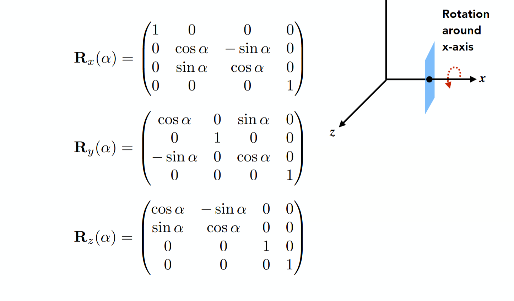

### 缩放

$$
\left(\begin{array}{ll}
a & 0 & 0\\
0 & b & 0 \\
0 & 0 & 1
\end{array} \right)
$$

当a, b异号, 则发生reflect对称

### 剪切

在某个方向上的距离不变

向 $\vec{e} = (e_1,e_2)$ 方向进行程度为$\vec{u} = (u_1,u_2)$的剪切

其变换矩阵应该为
$$
A_{u,e} = I + \vec{u}\cdot\vec{e}^T
$$

$$
A_{u,e} = \left(\begin{array}{ll}
1 & 0 & 0\\
0 & 1 & 0 \\
0 & 0 & 1
\end{array} \right)+\left(\begin{array}{ll}
u_1 e_1	& u_1 e_2 & 0\\
u_2 e_1 & u_2 e_2 & 0 \\
0 		& 0 	  & 0
\end{array} \right)=\left(\begin{array}{ll}
u_1 e_1 + 1	& u_1 e_2 		& 0\\
u_2 e_1 	& u_2 e_2 + 1   & 0 \\
0 			& 0 	  		& 1
\end{array} \right)
$$

### 平移

原理是三维的剪切操作, 投影到二维上

向 $\vec{u} = (u_1,u_2)$ 方向平移(三维空间在 $x-y$ 平行的平面上的投影)

$$
\left(\begin{array}{ll}
1 & 0 & u_1\\
0 & 1 & u_2 \\
0 & 0 & 1
\end{array} \right)
$$

### 转换复合

$$
T \times R_0\times S \times R_1 \times \vec{v}
$$

-  几何上 $R_1$ 的变换先起作用, 因为左边的矩阵作用在右边的矩阵上
- 运算上从左往右运算

1. $R_1$ 旋转
2. $S$ 缩放
3. $R_0$ 旋转
4. $T$ 平移

## 坐标变换管线概览

从几何目标到二维图像平面的一系列转化流程

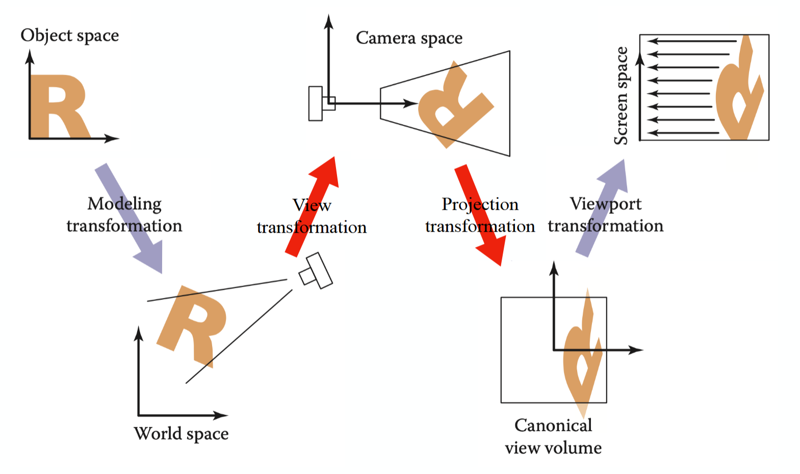

### 空间定义

| 空间名称                  | 简要说明                                                     |
| ------------------------- | ------------------------------------------------------------ |
| **Object Space**          | 模型自身坐标系，定义几何体的原始形状和顶点位置。             |
| **World Space**           | 全局统一坐标系，所有物体置于其中，定义其在场景中的绝对位置和方向。 |
| **Camera Space**          | 以相机（观察者）为原点的坐标系，**视线通常朝向 -Z 轴方向**。 |
| **Canonical View Volume** | 标准化视景体，是一个规则立方体（如 $[-1,1]^3$），用于后续裁剪和统一处理。 |
| **Screen Space**          | 二维屏幕像素坐标系，原点通常在左上角，坐标以像素为单位。     |

### 变换

| 变换名称                      | 简要说明（作用与起点/终点空间）                              |
| ----------------------------- | ------------------------------------------------------------ |
| **Modeling Transformation**   | 将物体从 **Object Space** 变换到 **World Space**，包括缩放、旋转、平移。 |
| **View Transformation**       | 将整个场景从 **World Space** 变换到 **Camera Space**，使相机位于原点并对齐轴向。 |
| **Projection Transformation** | 将 **Camera Space** 中的3D物体投影到2D成像平面，并变换到 **Canonical View Volume**。 |
| **Viewport Transformation**   | 将 **Canonical View Volume** 内的坐标映射到 **Screen Space** 的像素坐标。 |

## 相机

### 相机变换

相机移动变换矩阵 $A$ 转换成物体进行变换矩阵为 $A^{-1}$ 的移动
$$
Camera(A) \to Object(A^{-1})
$$
相机镜头对准的旋转

已知相机的镜头方向单位向量是$\vec{w}$, 希望最终能指向$-z$轴

1. 求出向量 $\vec{w}$ 的正交单位向量 $\vec{u}, \vec{v}$

   1. 随便搞一个差不多一点的向量 $\vec{u_0}$
   2.  $\vec{u_0} $ 减去  $\vec{u_0}$ 在  $\vec{w}$ 方向上的投影向量, 即可获得与  $\vec{w}$ 向量正交的向量  $\vec{u_1}$
   3. 对向量 $\vec{u_1}$ 做归一化得到 $\vec{u}$
   4. 只要求出$\vec{u}$, 使用叉乘 $\vec{w} \times \vec{u}$, 就可以得到 $\vec{v}$

2. 即可获取摄像机的方向旋转到 $-z$ 轴矩阵 $R$
   $$
   R = \left(\begin{array}{ll}
   u_x & v_x & -w_x\\
   u_y & v_y & -w_y \\
   u_z & v_z & -w_z
   \end{array} \right)
   $$

3. 目标是旋转世界坐标轴, 即求矩阵 $R^{-1}$, 由于 $R$ 是正交的, 故 $R^{-1} = R^T$

   证明 $R^{-1} = R^T$ 只需要证明  $R^T R = E$ 即可

4. 即获取到坐标轴变换矩阵 $R_A$ 
   $$
   R_A = \left(\begin{array}{ll}
   u_x & u_y & u_z \\
   v_x & v_y & v_z \\
   -w_x & -w_y & -w_z
   \end{array} \right)
   $$

### 视锥体

习惯上, 我们让相机镜头对准-z轴方向, 以保证**视锥体**的投影在等价的屏幕上

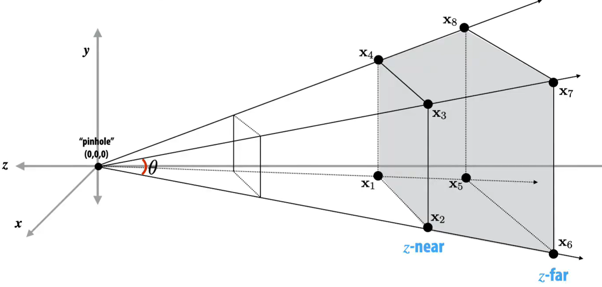

原点是相机镜头, 白板是相机屏幕, 灰色是物体在屏幕上的投影的还原

### 裁剪 Clipping

裁剪就是消除不在这个视锥体内的三角形的过程

如果三角形落在区域外, 就不绘制, 如果落在区域内就绘制, 避免在不需要的三角形上浪费时间

对于只有一部分落在区域内的三角形, 选择将其分为更小的子三角形


我们定义, 剔除比 `z-near` 近, 比 `z-far` 远的物体

这么做是为了 `z-buffer`, z 缓冲这一技术, 由于在计算机上使用浮点数存储三角形信息

如果 `z-near` 过小, 或 `z-far` 过大, 浮点数将会导致精度丢失, 最终导致光栅化时产生肉眼可见的误差


## 视锥体到单位正方体的映射


为什么要这么做?

便于裁切

- 以x轴为例, 本来是运算一个三角形是否在一个斜面之外, 现在只需要查看一个三角形的x轴坐标是否在`(-1,1) `之外

- 只有一部分在视锥体的三角形, 这种特殊情况, 划分为子三角形这一步骤也将简单一些

1. 将视锥体的灰色部分, 一个锥台, 变成一个长方体, 转 **透视投影** 为 **正交投影**

   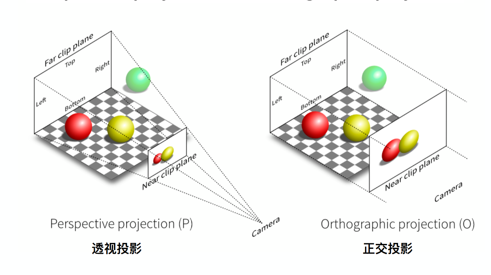

   定义变量

   - **n** : near
   - **f** : far

   我们希望结果满足

   - 近平面不变
   - 非近平面等比例缩小, 比例为 $\frac{n}z$ , 即 $x \to x\cdot \frac{n}z, y \to y\cdot \frac{n}z$
   - 最远景平面距离不变

   $$
   \left(\begin{array}{ll}
   x\\y\\z\\1
   \end{array} \right) \to \left(\begin{array}{ll}
   x\cdot \frac{n}z\\y\cdot\frac{n}z\\?\\1
   \end{array} \right)
   $$

   由于在结果中x和y的位置出现了z, 而线性运算不会达到这种效果, 因此, 这需要最后一步做特殊处理

   最后一步, 向量除以第四维的数值, 表示映射回到三维空间上
   $$
   M\times\left(\begin{array}{ll}
   x\\y\\z\\1
   \end{array} \right) = \left(\begin{array}{ll}
   x\cdot n \\y\cdot n\\? \cdot z \\z
   \end{array} \right) \to \left(\begin{array}{ll}
   x\cdot \frac{n}z\\y\cdot\frac{n}z\\?\\1
   \end{array} \right)
   $$

   变换矩阵如下
   $$
   M = \left(\begin{array}{ll}
   n &  &   &  \\
    & n &   &  \\
    &   & A & B \\
    &   & 1 & 0 
   \end{array} \right)
   $$
   代入得
   $$
   M\times\left(\begin{array}{ll}
   x\\y\\z\\1
   \end{array} \right) = \left(\begin{array}{ll}
   x\cdot n \\y\cdot n\\ A\cdot z + B \\z
   \end{array} \right) \to \left(\begin{array}{ll}
   x\cdot \frac{n}z\\y\cdot\frac{n}z\\A+\frac{B}z\\1
   \end{array} \right)
   $$
   依据条件最远景平面距离不变, 即对于 $F(z) = A+\frac{B}z$ , 有 $F(n)=n$ 且 $F(f)=f$

   则得出 $A= n+f, B=- n \cdot f$

   代入 $M$ 得
   $$
   M = \left(\begin{array}{ll}
   n &  &   &  \\
    & n &   &  \\
    &   & n+f & -n \cdot f \\
    &   & 1 & 0 
   \end{array} \right)
   $$

2. 由于Z指向负轴, 因此需要进行一个$z \to -z $ 的映射
   $$
   R_x \times M \times  \left(\begin{array}{ll}
   x \\ y \\ z \\ 1
   \end{array} \right)
   $$
   第三维和第四维都有 $z$
   $$
   R_x = \left(\begin{array}{ll}
   1&&& \\ 
   &1&& \\ 
   &&-1& \\ 
   &&&-1
   \end{array} \right)
   $$

3. 定义正交容器上八个点有关的参数 

   - **l** : left
   - **r** : right
   - **b** : bottom
   - **t** : top
   - **n** : near
   - **f** : far

4. 平移到原点
   $$
   T = \left(\begin{array}{ll}
   1 &  &   & -\frac{r+l}{2}  \\
    & 1 &   & -\frac{t+b}{2}  \\
    &   & 1 & -\frac{n+f}{2}  \\
    &   &   & 1 
   \end{array} \right)
   $$

5. 使用scale进行归一( 其实是(-1,1), 长度2 )化, 由于是 -z 轴, 所以 n 比 f 大
   $$
   S = \left(\begin{array}{ll}
   \frac2{r-l} &  &   &  \\
    & \frac2{t-b} &   &  \\
    &   & \frac2{n-f} &  \\
    &   &   & 1 
   \end{array} \right)
   $$

6. 对空间中的任意向量 $\vec{v}$ 复合两个操作
   $$
   \vec{v'} = S \times T \times M \times \left(\begin{array}{ll}
   v_x \\
   v_y \\
   v_z \\
   1
   \end{array} \right)
   $$
   对于 $S \times T$, 复合矩阵即
   $$
   S \times T = \left(\begin{array}{ll}
   \frac2{r-l} & 0 & 0 & -\frac{r+l}{r-l}  \\
   0 & \frac2{t-b} & 0 & -\frac{t+b}{t-b}  \\
   0 & 0 & \frac2{n-f} & -\frac{n+f}{n-f}  \\
   0 & 0 & 0 & 1 
   \end{array} \right)
   $$
   定义$M_{ortho}=S \times T$ , $M_{persp\to ortho} = M$, $M_{persp}=M_{ortho}\times M_{persp\to ortho} $

   ==TODO 这里有一个很困惑的点, 各种教材里都没有讲最后一行变化时为什么莫名其妙变成-1了==

   ==我的理解是 $R$ 对称变化, 就是由于Camera面向$-z$的缘故, 但是不确定==

   对于 $M_{persp}$, 复合矩阵即
   $$
   M_{persp}=M_{ortho}\times M_{persp\to ortho} = \left(\begin{array}{ll}
\frac{2n}{r-l} & 0 & \frac{r+l}{r-l} & 0  \\
   0 & \frac{2n}{t-b} & \frac{t+b}{t-b} & 0 \\
   0 & 0 & -\frac{f+n}{f-n} & \frac{-2fn}{f-n}  \\
   0 & 0 & -1 & 0 
   \end{array} \right)
   $$

7. 对于现代计算机的图形渲染, 因此从空间到数组的索引, 也存在一个映射

   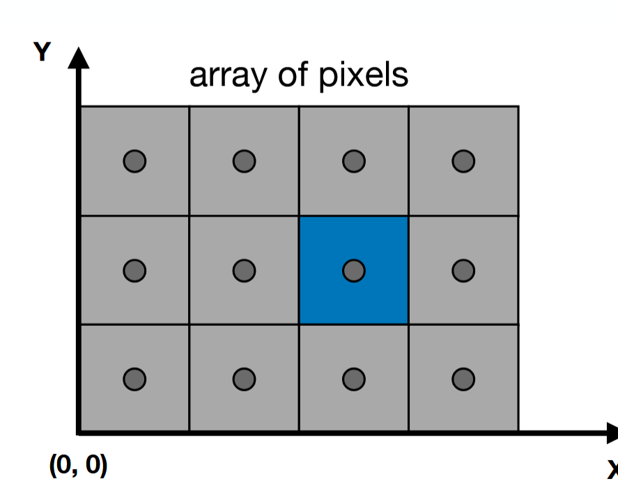

   - 前面正方体的边长是2
   - **w** : width
   - **h** : height

   $$
   V = \left(\begin{array}{ll}
   \frac{w}{2} & 0 & 0 & \frac{w}{2}  \\
   0 & \frac{h}{2} & 0 & \frac{h}{2} \\
   0 & 0 & 1 & 0  \\
   0 & 0 & 0 & 1 
   \end{array} \right)
   $$

# 纹理映射

Texture mapping

1. 重心插值从屏幕样本 $(x,y)$ 计算纹理 $(u,v)$ 坐标

2. 从 $(u,v)$ 坐标上的值, 插值到屏幕的 $(x,y)$ 坐标上

   通过获取屏幕相邻样本的差异, 来近似U, V坐标方向上的变化值

3. 利用插值来估算mip map的等级D

4. 将归一化的纹理图标UV 映射到屏幕的像素位置

## 重心插值

$$
\hat{f}=f_i+\frac{x-x_i}{x_{i+1}-x_i}(f_{i+1}-f_i)
$$


### 平面插值

在平面上进行线性插值

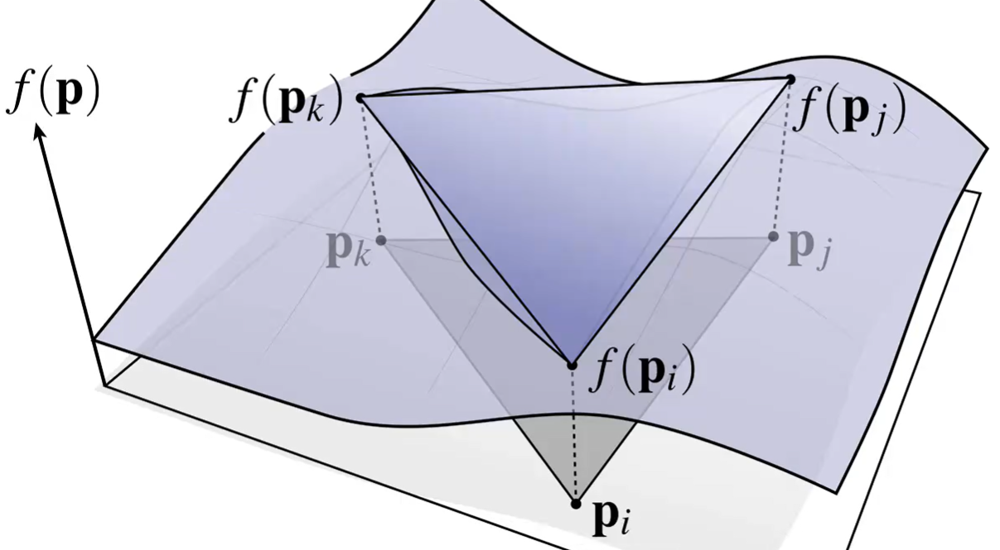

使用解析式法, 如下
$$
\hat{f}(x,y)  = ax+by+c
$$


如果转化思路, 变为比例的概念, 重心<->面积比例<->高

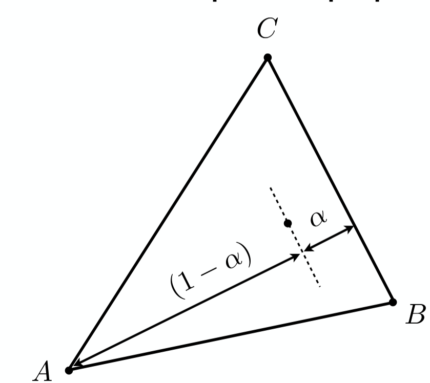

### 投影问题

由于三角形从三维空间投影到了二维平面上, 在二维平面上计算得出的插值仿射函数不等同于原来的三角形的插值仿射函数

造成的问题:


解决方法:


## Texture

纹理映射

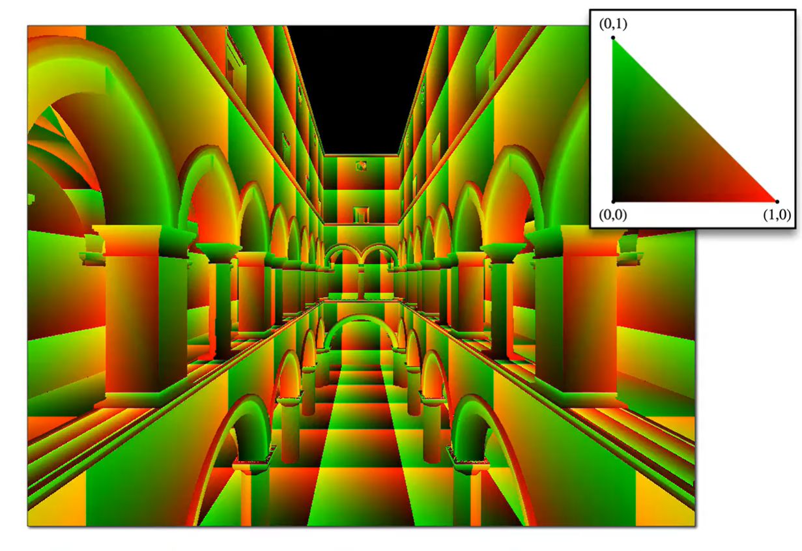

为什么要重复性地(周期性地)贴同一种这种红绿渐变的材质?

将来会贴砖块的贴图, 在进行贴图阶段之前, 使用这种插值的纹理, 进行初步的检查

纹理->3D单元->2D投影

- 放大的情形, 一个纹理的像素会占据好几个结果的像

- 缩小的情形, 一个结果像素中存在好几个纹理的单元

## 双线性插值

放大的情形, 一个纹理的像素会占据好几个结果的像素

问题: 会看见大的色块

解决: 使用双线性插值进行颜色的混合

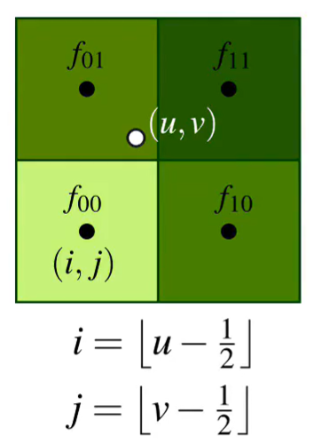

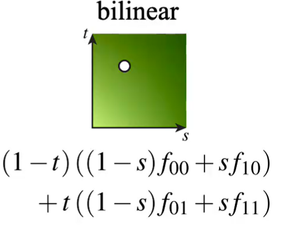

## mipmap

### 预过滤

缩小的情形, 一个结果像素中存在好几个纹理的单元

不考虑运算的效率损耗, 可是使用类似超采样的方法, 对这个结果像素对应的多个目标的纹理单元取平均值

但是包含的目标单元个数可能非常之多

解决方案: 预存储原图片的低分辨率版本(降低分辨率使用Aliasing混叠法), 这个过程称为 **预过滤**

### mipmap

MipMap思路大概如此, 在每个可能的尺度上存储一个预过滤的图像

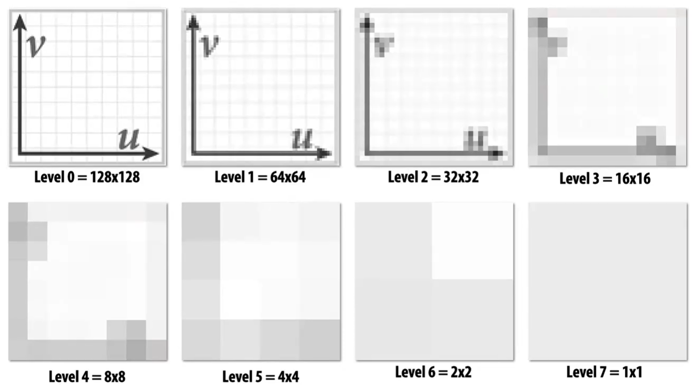

### 选择等级

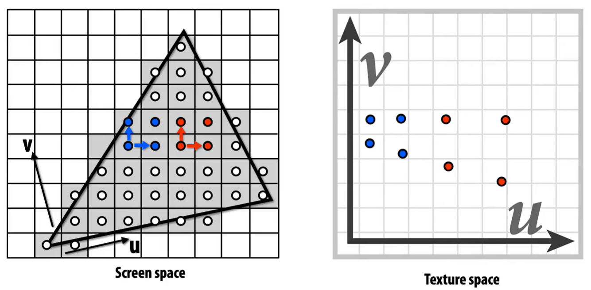

左图是屏幕空间, 右图是纹理空间

要展示蓝色区域, 应当使用更详细的mipmap(由于两个区域大小差不多, 可以直接拿最详细的上)

要展示红色区域, 从纹理空间到屏幕空间, 大小缩小了不少, 因此使用 $level$ 更低的mipmap


上图中, 屏幕空间的 $(u,v)_{0,0}$ 这一块空间, 对应了多大的mipmap纹理空间?
$$
level = Log_2 \sqrt{max(L_x^2,L_y^2)}
$$

$$
L_x^2 = (\frac{du}{dx})^2+(\frac{dv}{dx})^2, L_y^2=(\frac{du}{dy})^2+(\frac{dv}{dy})^2
$$

屏幕空间的 $(u,v)_{0,0}$ 和相邻区域在坐标系 $x-y$ 下的差就是  $dx=1, dy=1$
$$
\frac{du}{dx} = u_{10}-u_{00} ,
\frac{dv}{dx} = v_{10}-v_{00} 
$$

$$

\frac{du}{dy} = u_{01}-u_{00} , 
\frac{dv}{dy} = v_{01}-v_{00} 
$$

### 存储方法

原本一个RGB位图, 存储是$W\cdot H\cdot 3$, 现在, 将RGB摊开了存储, 存储成本并不会增加多少

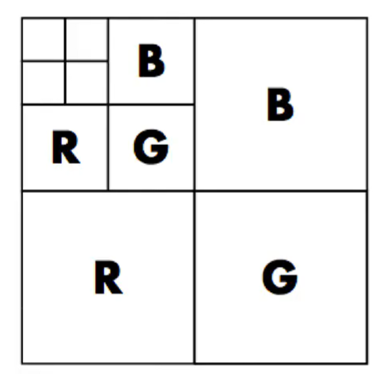

### 三次线性插值

如果两个相邻的屏幕空间如果对应的level A和level B, A 和 B 都是整形, 两者之间存在跳跃, 看起来就会不自然

三次线性插值

对于空间中的任意点 $(u,v,w)$, 其相邻的八个取值点 $f_{000},f_{001},f_{010},f_{011},f_{100},f_{101},f_{110},f_{111},$

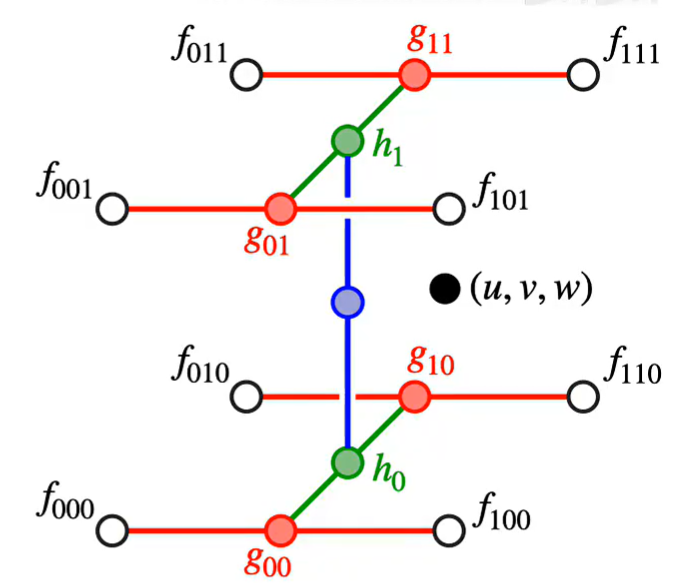

$f$ 相邻取值点之间两两配对, 插值出点 $g$, $g$ 再两两配对, 插值出 $h$, 最终 两个 $h$ 配对, 按比例取得 $(u,v,w)$的插值


对非整型的 $level$ : $D \in R$ , 

1. 取两个相邻的mipmap $\lfloor D \rfloor$ 和 $\lfloor D \rfloor-1$

2. 取权重 $w = D - \lfloor D \rfloor$

3. 在同级mipmap中, 使用双线性插值

4. 在两个mipmap的插值结果之间再次进行插值

### 掠射角-各向异性过滤

对于这种屏幕空间场景, 某一个方向比另一个方向拉长的比例相差过大

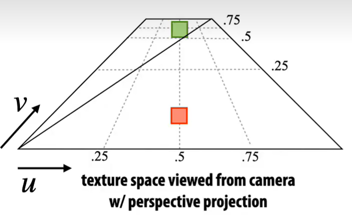

如果采用的取法依旧是正方形, 就不适合了

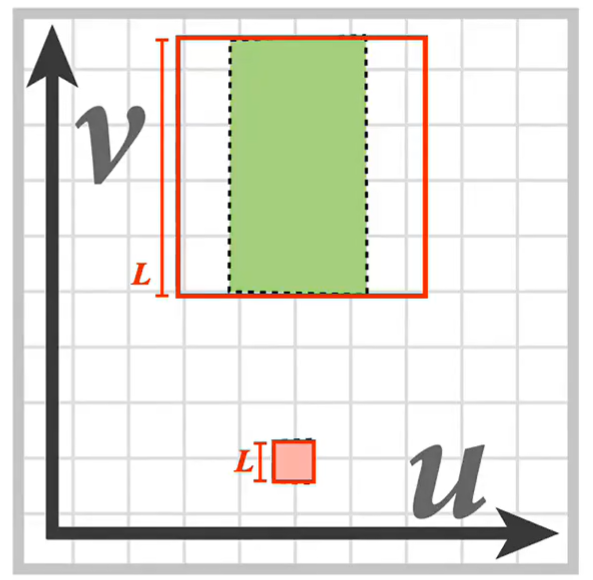

由于纵向拉长, 导致mipmap level 增大, 但是横向却不应该是这么大的 level 最终导致横向上糊成一片

解决方法是别取正方形的, 取多个低level的mipmap组合而成....

# Geometry

显式表示

- 例子
  - 点云
  - 多边形表格
  - 细分曲面
- 使用场景

隐式表示

- 水平集
- 代数曲面
- L系统

## 隐式

### Boolean 融合

构造实体几何, 使用Boolean表达式链接多个简单的几何体, 来描述一个复杂的几何体


### Blobby Surfaces

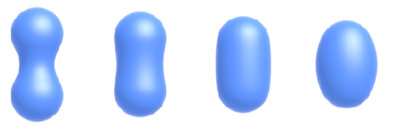

P点的高斯中心
$$
\phi_p(x) := e^{-(x-p)^2}
$$
使用高斯中心之和来表示某两个点的融合
$$
f := \phi_p + \phi_q
$$
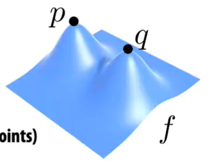

在 $f$ 上, 取不同的高度, 来投影到二维平面上, 查看不同半径的圆的融合

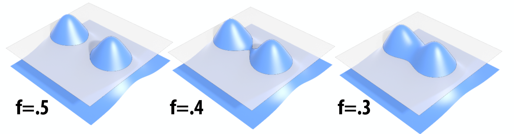

如果想融合两个非圆形的实体, 可以使用距离公式

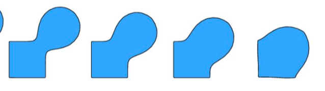

末尾的 $0.5$ 可选择其他合适的值
$$
f(x) := e^{d_1(x)^2}+e^{d_2(x)^2}-0.5
$$

### 水平集

依据解析式对采样点采样, 获取到图像信息

在其中有混叠(aliasing)的问题

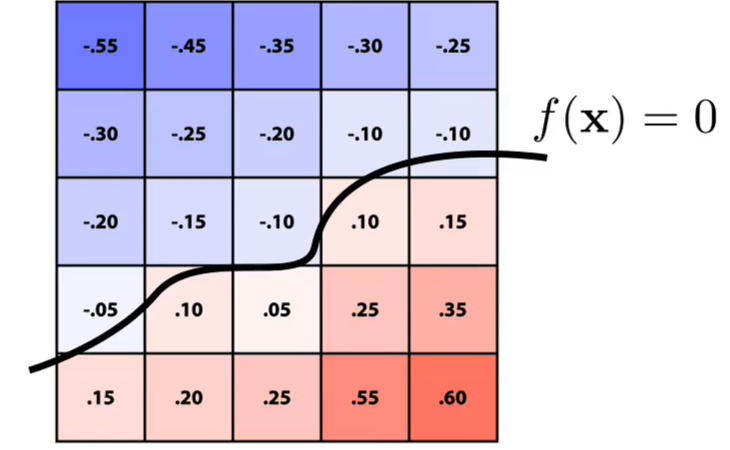

水平集存储数据量的成本也大幅提升, 一般存储表面的一部分信息, 并不存储所有信息, 以此降低计算量和存储压力

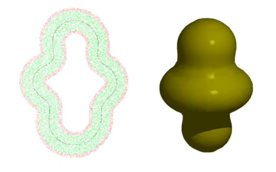

### 使用场景

- 使用场景
  - 测试是否在表面上, 是否在体内, 是否在体外
  - 描述目标占用的空间非常小
  - 容易获取到便面的距离, 可以用于测试是否碰撞
  - 完全精确的描述, 不需要考虑混叠 
  - 采用网格(水平集), 较大的存储成本, 但是能描述比较复杂的目标, 例如流体
- 缺点
  - 难以绘制形状中的所有点
  - 复杂图形的建模困难

## 显式

### 点云

点的集合

可以依据需求,对每个点附带特殊信息, 例如法向量, 颜色

可以表示任何几何体

对点的采样如果足够密集 ( $>>1 \cdot poxel$ ), 则可以达到比较好的效果

如果采集不够密集, 则考虑如何填充空白空间

难以描述点之间的关系, 因此能做到的进一步计算(例如目标的变化) 就及其困难

### 多边形网络

典型就是用足够多的三角形取近似一个复杂的目标几何

相较于点云, 不止存储点, 还存储了点之间的关系(三角形的边)

有助于点知道另一个点在哪里

可以只在需要的地方放置大量细节, 不需要的地方可以简化

例如下面的球壳部分是比较细致的, 柱体部分就用细长的三角形简化

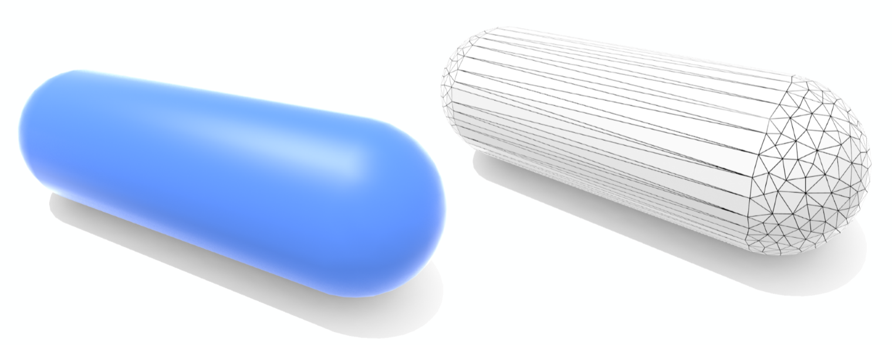

缺点是数据结构变得更加复杂, 需要考虑如何链接, 要考虑各种情况, 特别是特殊的边界情形

使用 $(x,y,z)$ 来描述顶点的位置, 使用 对顶点的引用来描述三角形, 三角形表面的内容可以使用 **重心插值** 来描述

可以理解成**对点云的线性插值**

## Bézier Curve

贝塞尔曲线

### 样条运算与构建

[TODO](贝塞尔曲线的构造)

### 伯恩斯坦基底

一个选取概率的操作
$$
B^n_k(t) := C_n^k t^k(1-t)^{n-k}
$$
使用伯恩斯坦基底可以构造曲线

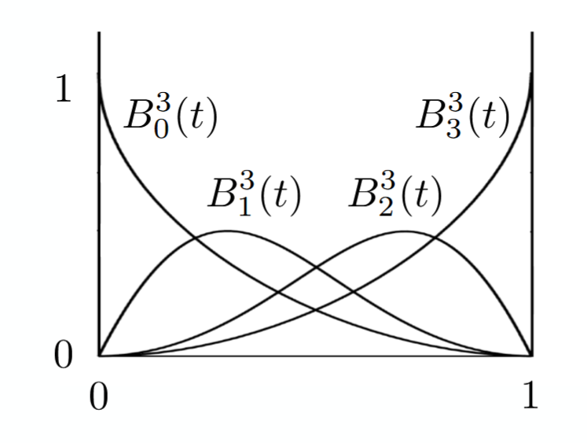

贝塞尔曲线就是使用伯恩斯坦基底构造的曲线

定义控制点$p_k$
$$
\gamma(s) := \sum_{k=0}^{n} B^n_k(s)p_k
$$

- $n=1$: 一条线段

- $n=3$: 三次贝塞尔曲线

  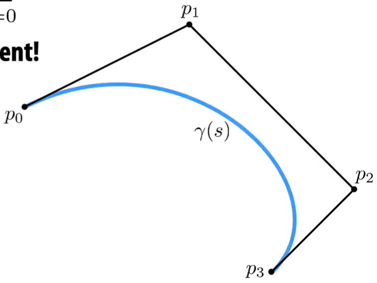

  经过点 $p_0, p_3$

  在端点和线 $p_0p_1, p_2p_3$相切

  包含在控制点的**凸包**中

- $n=k$: 控制点太多, 难以控制

  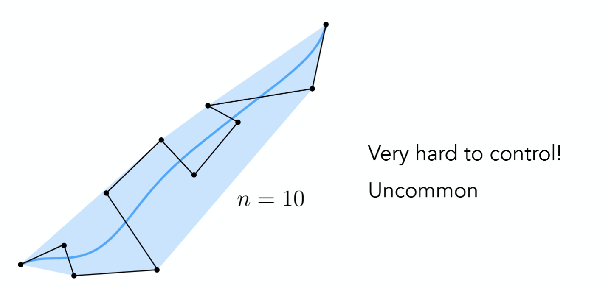

一般偏向于使用多个分段的三次贝塞尔曲线拼接起来

### 构建分段三次贝塞尔曲线/曲面

目标, 连续平滑的曲线

- 线段端点相遇
- 端点切线相遇

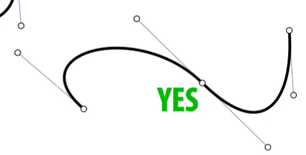

对于曲面构建, 伯恩斯坦基底
$$
B_{i,j}^3 := B_{i}^3 B_{j}^3 
$$
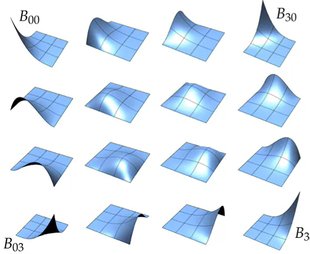

获取贝塞尔曲面片, 定义空间中的控制点 $p_{ij}$
$$
S(u,v) := \sum_{i=0}^3\sum_{j=0}^3B^3_{i,j}(u,v)p_{i,j}
$$

### 细分

可以采用的细分比例是杨辉三角中的 $\frac{1}{4},\frac{2}{4},\frac{1}{4}$

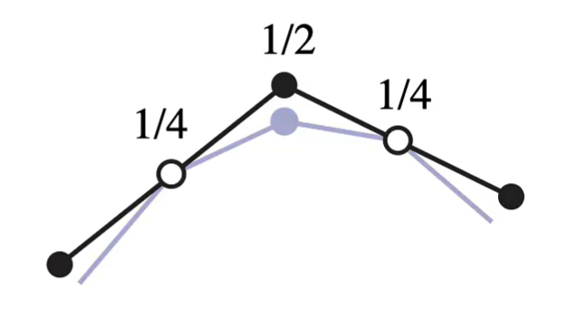

迭代得去做, 就可以极限出一条比较平滑的曲线/曲面

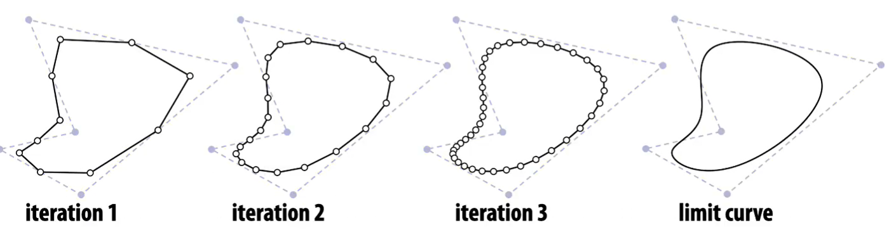

曲面也可以近似

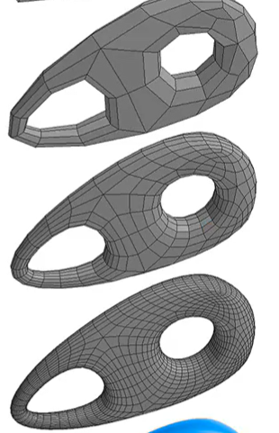

# 网格表示

正方形网格

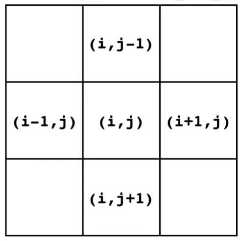

为何计算机上选择正方形作为pixel单元的形状

- 总是有四个单元相邻
- 容易使用索引来对应
- 容易进行平均这种附加操作
- 易于存储

## 表面Surface

- 仅仅是表层, 是边界, 是空心的

- 是流形(Manifold)的, 流形的每一个部分放大后应该趋于平面

  存在一些图形是非流形的

  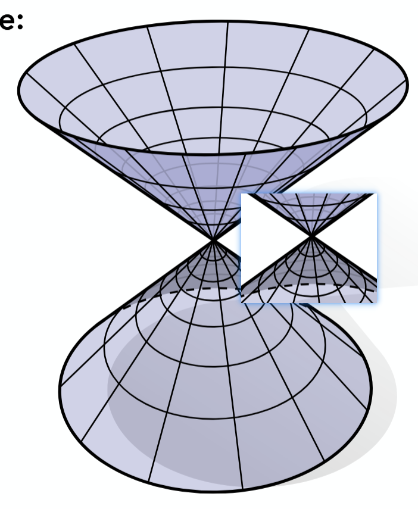

  中间部分无法趋于平面, 下面是其他的例子

  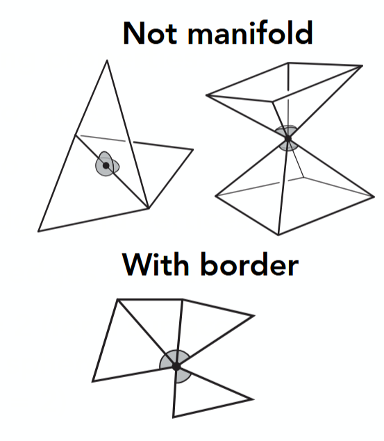

- 流形连通性, 是"扇面" ,而不是鳍

  - 每条边只包含在两个多边形中
  - 汇聚点四周应该以多个扇面的形式存在. 汇聚点周边的图形应该在同一个多边形环/扇里

  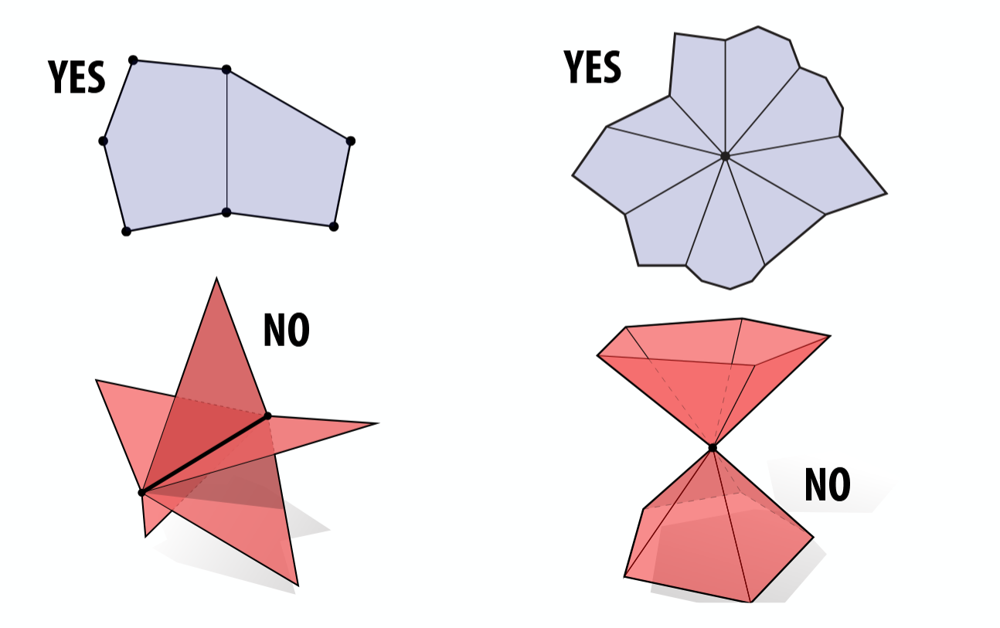

流形保证目标几何体是简单的, 不需要考虑太多的特殊情况

边界Boundary

- 是表面结束的地方
- 每个边界都是闭环的

## 半边三角形网格

polygon mesh的一种

基于链表实现, 便于写操作

半边三角形只能在流形的前提下构建

```cpp
struct Halfedge {
    /**
     * twin->twin == this
     * twin != this
     */
    Halfedge* twin;
    /**
     * this 必是某个 halfedge 的 next
     */
    Halfedge* next;
    Vertex* start;
    Edge* edge;
    Face* face;
};
struct Edge {Halfedge* halfedge;};
struct Face {Halfedge* halfedge;};
struct Vertex {
    Vector3 point;
    Halfedge* halfedge;
};
```

但Halfedge构建时, `twin` 和 `next` 符合要求, 则满足改网络描述的是一个流形

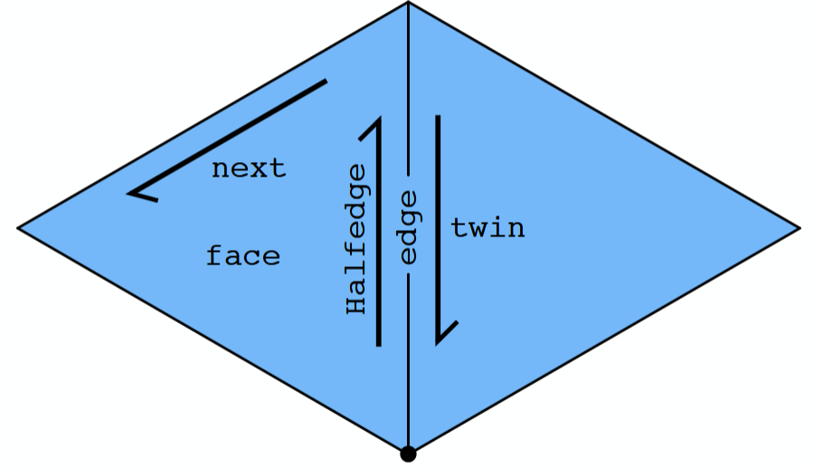

遍历面的所有顶点

```cpp
Halfedge* h = f->halfedge;
do{
    // h->start...
    h = h->next;
}while(h != f->halfedge);
```

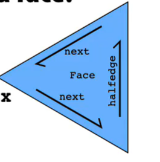

获取 `Halfedge` 的 `end ` `Vertex`

```cpp
Vertex* end = h->twin->start;
```

访问`Vertex`周边所有的`halfedge`

```cpp
Halfedge* h = v->halfedge;
do{
    // Vertex* end = h->twin->start;...
    // h->edge...
    // h->face...
    h = h->twin ->next;
}while(h != v->halfedge);
```

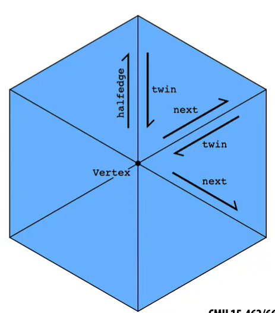

# 数字几何处理

1. scan
2. process
3. print

- **重构** **creconstruction** 例如 point clout->polygon mesh/level set

- **上采样** **Upsampling** 双线性插值

  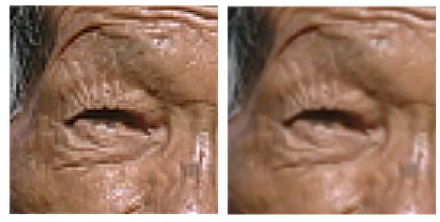

- **下采样** **Downsampling** 迭代的边塌陷算法, 用于希望将一个多变的集合体变得粗糙一些来存储

- **重采样** **Resampling** 用于提高各个元素的质量, 例如在多边形网格中, 如果将每个三角形单元都构建成等边三角形, 可能更有利于进行某些计算

- **滤波** **Filtering** 去除噪声, 强调某些特征, 进行边缘检测

- **压缩** **Compression** 有损压缩和无损压缩 

## Subdivision

细分曲面

用于在网格中进行Upsampling

- 将每个元素重复地分割成更小的部分
- 用相邻顶点位置的加权平均来替换顶点位置
- 新生成的点是规则的, 同时把旧的点的坐标拉向规则
- 目标
  - 插值 or 近似, 是否需要总是经过细分前的所有点(看需求)
  - 极限曲面需要有怎样的连续性($C^1, C^2...$)
  - 在不规则顶点出的表现, 如果出现了非常高阶的顶点怎么办?
- 实现方法
  - 对于四边形网格,  Catmull Cark
  - 对于三角形网格, Loop, Buterrfly, Sqrt

### Loop

极限细分后的曲面曲率在不规则顶点之外将是连续的 $C^2$

1. 每个边取中点, 分割

   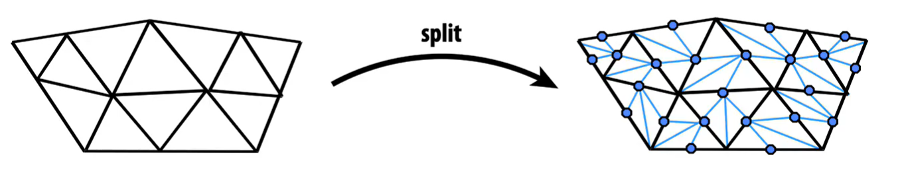

2. 将每一个新边进行翻转

   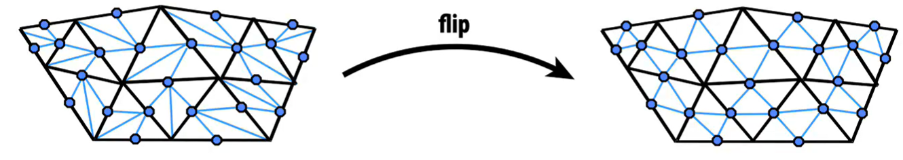

   此时, 每一个原三角形分成四个新三角形

   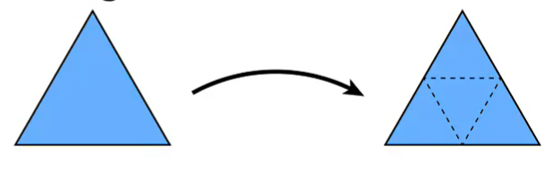

3. 新点的坐标是周围老坐标的加权平均

   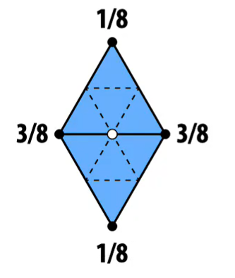
   $$
   p := \sum_i\phi_ip_i
   $$

4. 对于旧点的新位置, 设 $n$ 为点的度数

   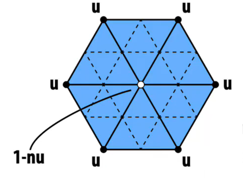

   定义中间量 $u$
   $$
   u := \left\{\begin{align}
     \frac{3}{16} & &n = 3\\
     \frac{3}{8n} & &otherwise
   \end{align}\right.
   $$
   最终计算得旧点的新位置坐标为
   $$
   p'_0 = \sum_{i=1}^n{u \cdot p_i} + (1-n\cdot u) \cdot p_0
   $$

### Catmull Cark

不仅只适用于四边形网格, 对于任意多边形

1. 在其中插入一个点 $m$

   其坐标是周边各个点的加权平均
   $$
   p_m = \frac{1}{n} \sum_ip_i
   $$

2. 每个边取中点, 分割

3. 将每条边的中点和这个点 $m$ 相连

   效果: 利用插入的点将多边形变成多个四边形的组合

   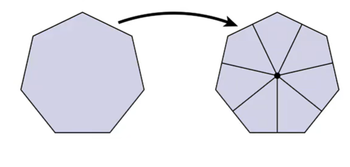

4. 计算顶点的新坐标

   - **n** : 顶点的度数, 即顶点旁边有几条边
   - **Q** : 顶点周围所有的表面上新增加的点(步骤1)的坐标的平均值
   - **R** : 顶点周围所有的边上新增加的点(步骤2)的坐标的平均值
   - **S** : 原始顶点位置

   $$
   Coords  := \frac{Q+2R+(n-3)S}{n}
   $$

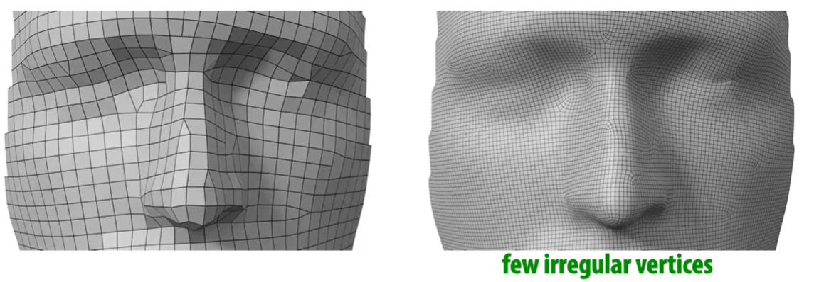

Catmull Cark 也可以用于三角形网格, 但是效果不如Loop

因为Catmull Cark会将三角形网格转化成四边形网格, 而好的三角形网格的度数是6, 这放到四边形网格中是非规则的网格了

四边形网格好的度数是4

## Mesh Simplification

下采样, 简化多边形网格

边坍缩

迭代地坍缩, 使用贪心算法

给每个边赋予一个 $cost$ 值, 表示这条边对表面的改变量

计算出哪个边的 $cost$ 最小, 则删除这条边

使用合并来对网格进行坍缩

1. 找到新点 $m$

   评判影响使用点到平面的距离之和
   $$
   dist_i(x) := < \vec{N} ,  \vec{x}- \vec{p}>
   $$
   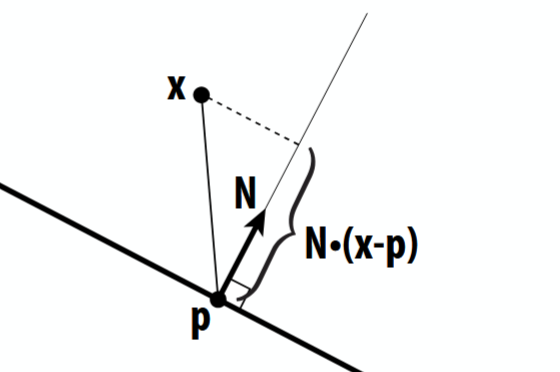
   $$
   dist(x) := \sum_i{< \vec{N_i} ,  \vec{x}- \vec{p}>}
   $$
   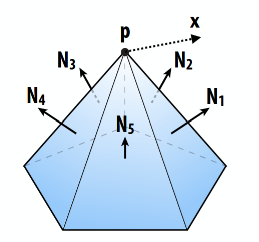

   下面给出运算最小值 $\vec{x}$ 的方法, 证明略(大概就是矩阵正定, 开平方这些)

   1. 设目标坐标 $\vec{x} = (x,y,z)$, 法向量坐标 $\vec{n} = (a,b,c)$, 偏移量 $d := <\vec{n},\vec{p}>$

   2. 在齐次坐标中定义 $\vec{u} = (x,y,z,1), \vec{v} = (a,b,c,d)$ 

   3. 定义矩阵 $K$, $cost = <u,v>^2 = u^T(vv^T)u =: u^TKu$

   4. 再分解 $K$, 定义 $B,\vec{w}$
      $$
      K = \left(\begin{array}{ll}
       a^2&ab&ac&ad\\
       ab&b^2&bc&bd\\
       ac&bc&c^2&cd\\
       ad&bd&dc&d^2
      \end{array} \right) :=\left(\begin{array}{ll}
       B&\vec{w}\\
       \vec{w}^T&d^2
      \end{array} \right)
      $$

   5. 在 $\vec{x}$ 满足下式时, $cost$ 最小
      $$
      \vec{x} = -B^{-1}\vec{w}
      $$

   6. 对于点 $p_i$ 的损失 $K_i$, 边 $e_{ij}$ 的损失 $K_{ij}$
      $$
      K_{ij} = K_i+K_j
      $$

   7. 比较每一个边的 $K_{ij}$, 直到找到最小的

2. $e_{ij}$ 两边的点 $v_i, v_j$ 关联的半边, 都与新点 $m$ 进行关联

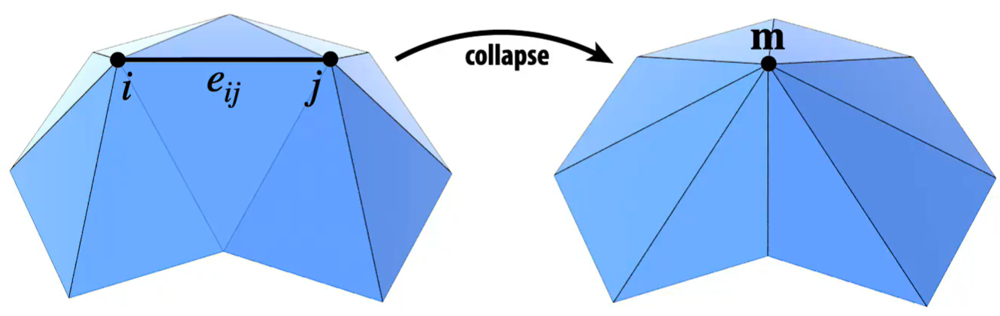

从 $e_{ij}$ 坍缩到 $m$ 时存在问题

如果 $m$ 的位置不够好, 将会导致坍缩之后的三角形不规则

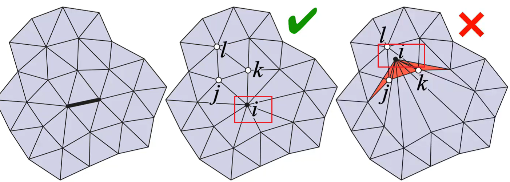

解决方法是如果坍缩之后的 $i$ 导致 $<\vec{N_{ijk}}, \vec{N_{kjl}}>$ 小于0, 则不进行坍缩

## Mesh Regularization

网格正规化

点的位置, 点的位置接近目标集合体的表面不一定就是好的, 希望法线也能和目标几何体的特定部分的法线近似

下面是一个构建网格时表面存在大量锯齿的例子, 这将导致网格估算出来的表面积和实际目标的表面积相差甚远

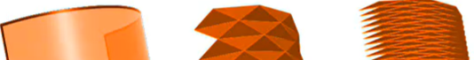

表面的形状接近正边形的(例如等边三角形), 是比较好的单元形状

有助于提高数值精度和稳定性

### Delaunay

存在一种 $Delaunay$ 的特殊网格, 具有一些较好的性质

 $Delaunay$ 即所有三角形表面的外接圆内不存在其他三角形的顶点

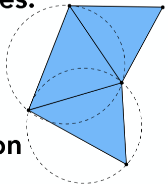

好的Mesh应该拥有规则的**顶点的度** (degree), 有助于并发计算, 

### 度

**顶点的度**, 指接触该顶点的边的数量

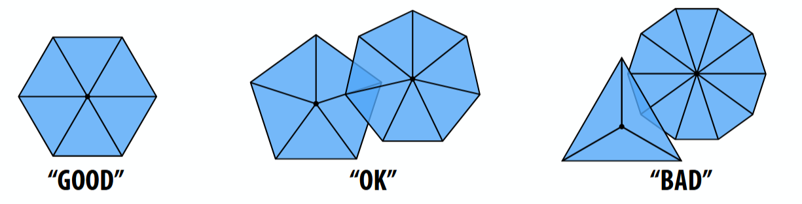

subdivision 时, 过高的degree会导致瑕疵

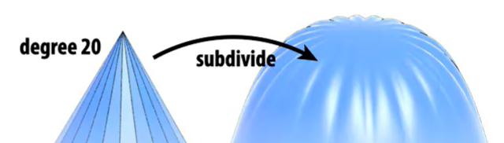

合适的degree可以避免这一点

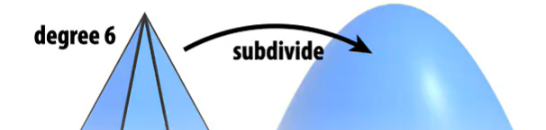

### 翻转优化

使用边翻转来优化度数, 使其接近六

方法是, 如果与6的总偏差减小了, 则进行牌男装

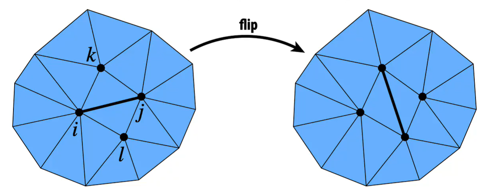

总偏差的计算如下
$$
|d_i - 6|+|d_j - 6|+|d_k - 6|+|d_l - 6|
$$
上图中是从5降到了1, 则进行翻转

### 更接近等边三角形

 $Delaunay$ 不保证三角形是接近正三角形的, 可能满足 $Delaunay$ , 但依旧存在长长的三角形

可以重复地中心化顶点来使三角形根接近等边三角形

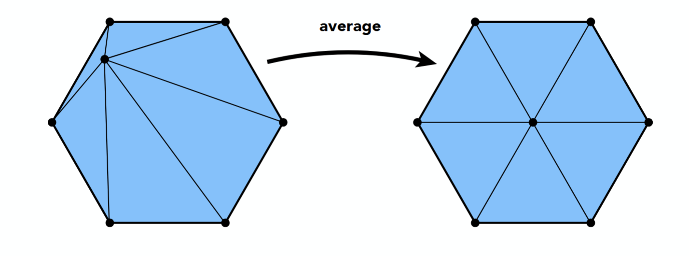

原来位置是 $p$ , 目标位置是 $p'$, 为例保证网格描述的几何体的形状不变,那么在移动时的方向应当移除法线方向上的分量

==TODO 这里提到的法线是哪个面的法线????==

 ### 策略

循环下列操作

- Splite 超过 $\frac{4}3 \cdot mean(edges)$ 长度的边
- Collapse 小于 $\frac{4}5 \cdot mean(edges)$ 长度的边
- Flip 边以接近最佳度数
- 沿切线方向将点进行居中优化

## 信息丢失

如果反复使用upsampling和downsampling, 会导致信号丢失

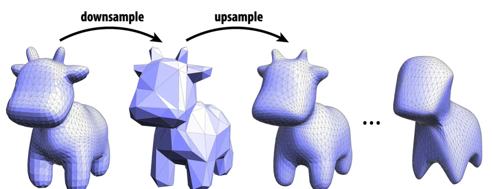

因为upsampling和downsampling的操作是凸包的, 总是先一个更圆滑的方向去逼近

# 辐射度学

> 辐射度, *Radiance*

几何光学撇开光的波动本性, 仅考虑光的 **直线传播**, **独立传播**, **反射/折射**

## 辐射能量

$Radiant$ $Energy$ 光子击中物体表面的次数

单个光子的能量 $Q$
$$
Q = h \frac{c}{\lambda}
$$
其中, 普朗克常量 $h \approx 6.626 \times 10^{-34} J \cdot s$ , 光速 $c \approx 3.00 \times 10^{8} m/s$ , 波长 $\lambda$ 是可变参数, 关系到颜色

## 辐射通量

$Radiant$ $Flux$ 每单位时间, 光子击中表面的次数, 单位 瓦特
$$ { }
\Phi = \lim_{\Delta \to 0} \frac{\Delta Q}{\Delta t} = \frac{dQ}{dt}
$$
对于辐射能量 $Q$
$$
Q = \int_{t_0}^{t_1}{\Phi(t)}dt
$$

## 辐射能量密度

$Radiant$ $Density$ 每单位面积, 光子击中表面的次数

## 辐照度

$Radiant$ $Flux$ $Density$ / $Irradiance$ 每单位面积, 单位时间, 光子击中表面的次数
$$
E(p) = \lim_{\Delta \to 0} \frac{\Delta \Phi(p)}{\Delta A} = \frac{d\Phi(p)}{dA}
$$
其中所照表面面积为 $A$, 应当是直面光线的面积

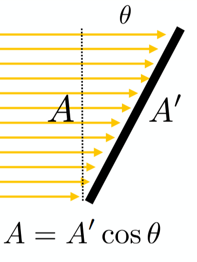
$$
cos(\theta) = \vec{n} \cdot \vec{l}
$$
其中 $\vec{n}$ 是表面的单位法向量, $\vec{l}$ 是法向量起点指向光源的单位方向向量

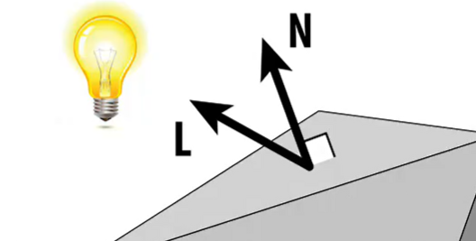

又要考虑到, 如果 $cos(\theta) < 0$, 则不渲染

```cpp
double surfaceColor(Vector3 n, vector3 l){
    return max(0., dot(n,l));
}
```

## 光强

$Intensity$, **光源**发出的光的能量在各方向上的密度(**特定方向**, **单位长度**)

和 $Irradiance$ 的区别在于 $Irradiance$ 描述的是**物体接受**的光

考虑点光源模型

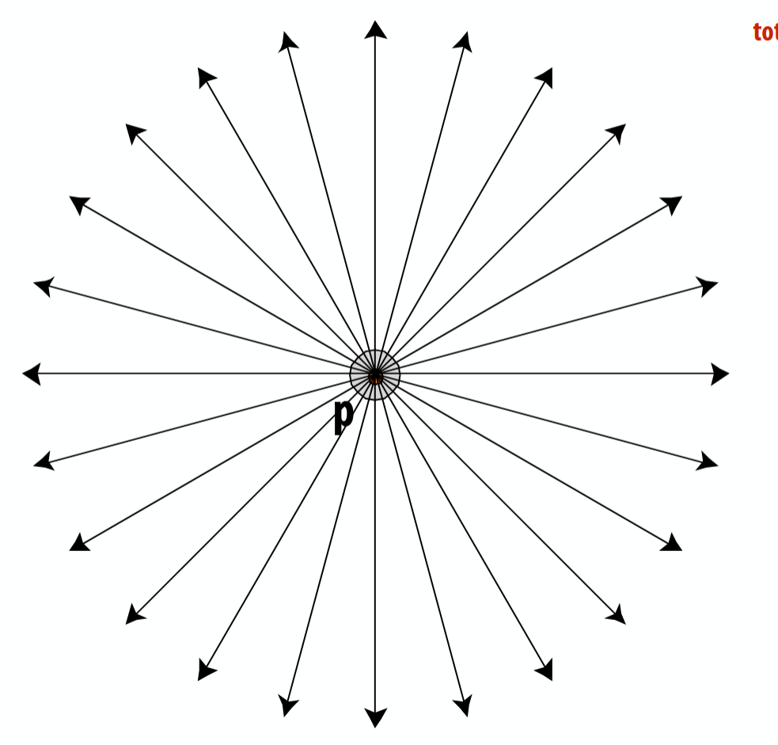

光强和辐射通量之间的关系
$$
\Phi = \int_{S^2} I d \omega = 4 \pi I
$$
得出光强
$$
I = \frac{\Phi}{4\pi}
$$
在某一**特定方向**(角度 $\omega$) 的**单位长度**上的光强
$$
I(\omega) = \frac{d\Phi}{d\omega}
$$
又有 $E = \frac{d\Phi}{dA}$, 得
$$
E = \frac{I(\omega)}{r^2}
$$

## 立体角

### 定义

这里光强的定义使用到了立体角 $\Omega $ (弧度)的概念

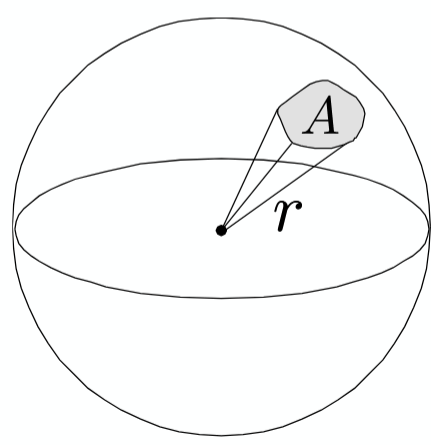

在平面上的角(弧度) $\theta := \frac{l}{r}$, 立体角的定义为:
$$
\Omega := \frac{A}{r^2}
$$
其中 $A$ 是球的**部分表面积**

由定义, 球的立体弧度为 $4\pi$

下图是立体角的一个应用, "两个天体到地球上的投影有多大", 这个问题考虑投影而不考虑天体的远近

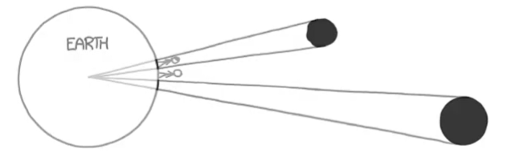

"太阳和月亮在地球上看起来差不多大", 这句话转换成"太阳和月亮的光在地球表面上的人的眼睛上的投影差不多大", 即"两者对于地球的立体弧度差不多大"

### 和平面角的关系

考虑立体角 $\Omega$ 和 $x-y$ 平面上的角 $\phi$, 与 $z$ 轴的夹角 $\theta$ 之间存在的关系

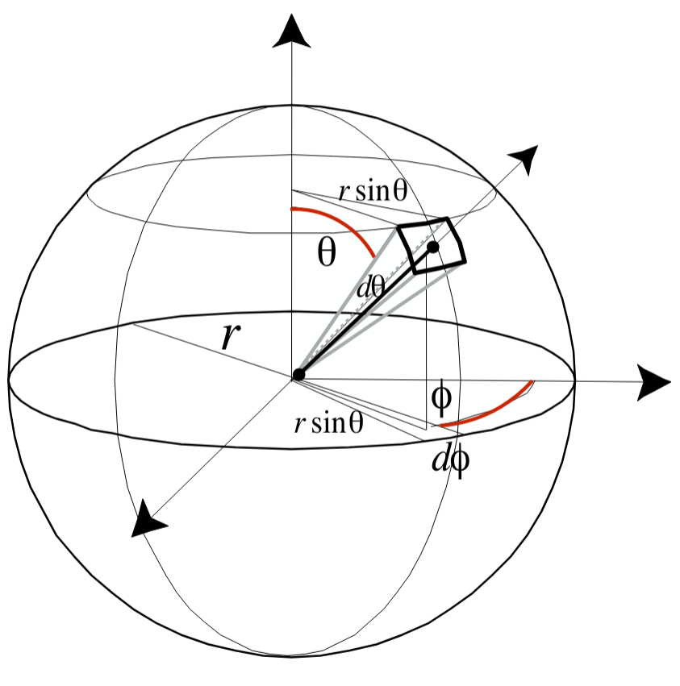

首先从微风的角度上考虑, $dA = (r\cdot d\theta)(rsin(\theta)\cdot d\phi)$, 与 $\omega$ 的定义联立
$$
dA  = \left\{\begin{array}{ll}
r^2 sin(\theta)\cdot d\theta d\phi\\
r^2d\omega
\end{array} \right.
$$
 可得
$$
d\omega = sin(\theta) d\theta d\phi
$$
积分得
$$
\Omega = \int_{S^2} d\omega = \int_0^{\theta_0}\int_0^{\phi_0} sin(\theta) d\theta d\phi
= (1-cos(\theta_0))\phi
$$
==有时, $\omega$ 也会被用作方向向量, 存在符号滥用的现象== 

## 光强和距离的关系

到点光源的距离和**辐照度**之间的关系

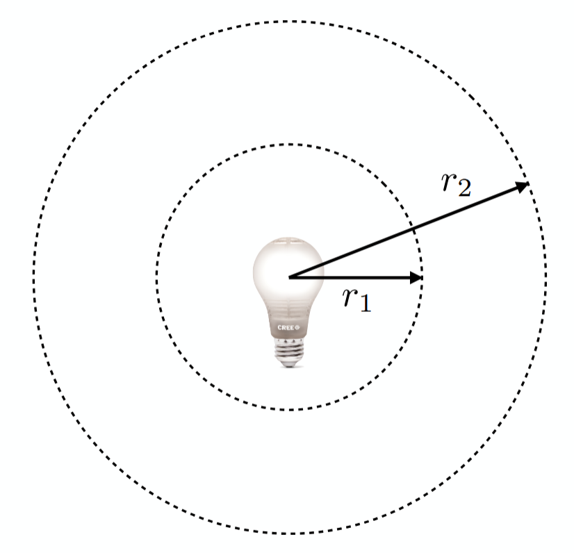
$$
E = \frac{\Phi}{4\pi r^2 } \to \Phi = 4\pi r^2 E
$$
得出关系是**平方反比**的
$$
\frac{E_1}{E_2} = (\frac{r_2}{r_1})^2
$$

## 辐射率

$Radiance$

表示辐射度在立体角上的密度, 单位时间, 单位面积, 单位立体角上的光的能量
$$
L(p,\omega) := \lim_{\Delta\to0}\frac{\Delta E_{\omega}(p)}{\Delta\omega} = \frac{dE_w(p)}{d\omega}
$$
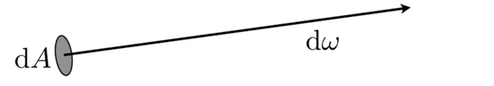

# TODO

| PPT  | Vedio  |
| ---- | ------ |
| 10   | 15     |
| 11   | 16     |
| 12   | 13(no) |
| 13   | 18     |

[TODO](变量名和PPT不匹配)

- CMU
- 校对
- 去图片, 简化

文档处理

1. 删除段落前后的空行
2. 调整字体大小
3. 自定义布局
4. 调整图片大小
   1. 批量[选中](https://zhuanlan.zhihu.com/p/649198144)图片
   2. 批量[调整](https://zhuanlan.zhihu.com/p/42493664)多张图片大小
5. 列表前的序号/`-`[调整](https://support.microsoft.com/zh-cn/office/%E6%9B%B4%E6%94%B9word%E4%B8%AD%E7%9A%84%E9%A1%B9%E7%9B%AE%E7%AC%A6%E5%8F%B7%E7%BC%A9%E8%BF%9B-5ed8b9a0-d44c-4e9a-81b3-47c234e980d3)位置
6. 改变布局为两栏

