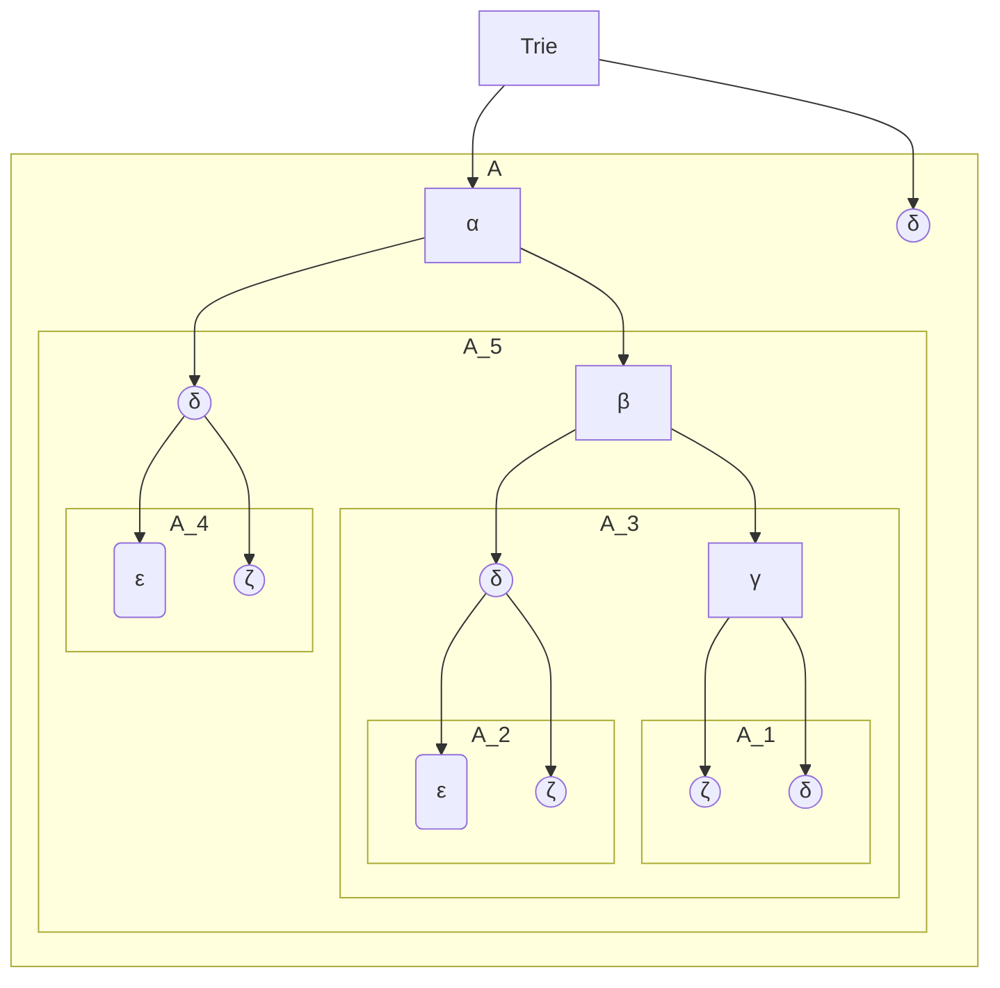

# 文法设计

## 左递归

**左递归**是指文法中存在形如 $A \to A\alpha$ 的产生式，即某个非终结符推导出的句型**以它自身开头**。

下面是一个左递归的文法
$$
\begin{align}
	E &\to\; E+T \;|\;T \\
	T &\to\; T*F \;|\;F \\
	F &\to\; (E) \;|\;id \\
\end{align}
$$

### 左递归的问题

在**自顶向下解析**中，左递归会让解析器试图展开 $A$ 时再次遇到 $A$ 却没有**消耗输入**，导致无限递归，永远无法匹配到终结符。

对于上面的文法, 如果要分析一段语言 $id+id+id$, 文法会如此分析:
$$
\begin{align}
	E &\Rightarrow E+T\\
	  &\Rightarrow E+T+T\\
	  &\Rightarrow E+T+T+T
\end{align}
$$
本来到了最后一步, 解析成 $T+T+T$, 然后在走 $T\to F \to id$ 即可. 但由于 **自顶向下解析** 的规则, 一句文法的第一个产生式总是被优先使用尝试. 这将导致不断向下递归而永不结束

### 消除左递归

1. 取所有关于 $A$ 的产生式并排序为:
   $$
   A \to A\alpha_1 | A\alpha_2 | \dots |A\alpha_m | \beta_1| \beta_2| \dots |\beta_n
   $$

   - 其中 $\beta$ 指不以 $A$ 开头的产生式
   - $\alpha$ 一般非空
   - $A$ 描述的文法产生形如 $\beta_j\alpha_{i_1}\alpha_{i_2}\alpha_{i_3}\dots\alpha_{i_k}$的语言 ( $k \ge 0$ )

2. 引入新的非终结符 $A'$，将原产生式改写为
   $$
   \begin{aligned}
   A &\to \beta_1 A' \mid \beta_2 A' \mid \dots \mid \beta_n A' \\
   A' &\to \alpha_1 A' \mid \alpha_2 A' \mid \dots \mid \alpha_m A' \mid \epsilon
   \end{aligned}
   $$
   新的文法和原文法等价

比如, 上述的例子:
$$
\begin{align}
	E &\to\; E+T \;\mid\;T \\
	T &\to\; T*F \;\mid\;F \\
	F &\to\; (E) \;\mid\;id \\
\end{align}
$$
消除左递归后:
$$
\begin{align}
	&E &\to&\; T\;E' \\
	&E' &\to&\; +\;T\;E'\;\mid\;\epsilon\\
	&T &\to&\; F\;T' \\
	&T' &\to&\; *\;F\;T'\;\mid\;\epsilon\\
	&F &\to&\; (E) \;|\;id \\
\end{align}
$$
这种算法不支持两层以上深度的左递归
$$
\begin{align}
	S &\to\; Aa \;\mid\;b \\
	A &\to\; Ac \;\mid\;Sd \;\mid\; \epsilon \\
\end{align}
$$

### 左递归消除算法

消除左递归和间接左递归

## 左公共因子

$A\to\alpha\beta_1\mid\alpha\beta_2$ 等价于
$$
\begin{align}
	&A  &\to&\;\alpha A'\\
	&A' &\to&\;\beta_1\mid\beta_2\\
\end{align}
$$
比如
$$
\begin{align}
	stmt  &\to \;if \; expr\; then\; stmt\; else\; stmt\\
	&\mid \;if \; expr\; then\; stmt\; \\
\end{align}
$$
可以提取左公共因子
$$
\begin{align}
	stmt  &\to \;if \; expr\; then\; stmt\; rest\\
	rest  &\to else\; stmt\;\mid\;\epsilon \\
\end{align}
$$

### 前缀树 Trie 算法实现

使用**前缀树**来实现对左公共因子的切割和重构
$$
\begin{align}
	A &\to \;\alpha\;\beta\;\gamma\;\zeta\\
	  &\mid \;\alpha\;\beta\;\gamma\;\delta\\
	  &\mid \;\alpha\;\beta\;\delta\\
	  &\mid \;\alpha\;\delta\\
	  &\mid \;\delta\\
	  &\mid \;\alpha\;\beta\;\delta\zeta\\
	  &\mid \;\alpha\;\delta\zeta\\
\end{align}
$$
构建Trie

然后再转化为文法
$$
\begin{align}
    A &\to \;\alpha\;A_5\;\mid\;\delta\\
    A_5 &\to \;\beta\;A_3\;\mid\;\zeta\;A_4\\
    A_4 &\to \;\zeta\;\mid\;\epsilon\\
    A_3 &\to \;\gamma\;A_1\;\mid\;\delta\;A_2\\
    A_2 &\to \;\zeta\;\mid\;\epsilon\\
    A_1 &\to \;\zeta\;\mid\;\delta\\
\end{align}
$$

## 上下文有关文法

对于形式语言 $L = \{ w c w^R \mid w \in \{a,b\}^* \}$ 描述的是 c 前的 **w** 需要反转后放到c后面
$$
\begin{align}
S \rightarrow aSa \mid bSb \mid c
\end{align}
$$
对于形式语言 $L = \{ a^n b^n \mid n \ge 1 \} $
$$
\begin{align}
S \rightarrow aSb \mid ab
\end{align}
$$
对于形式语言 $L = \{ a^n b^n c^m d^m \mid n \ge 1, m \ge 1 \}$
$$
\begin{align}
S &\rightarrow XY \\
X &\rightarrow aXb \mid ab \\
Y &\rightarrow cYd \mid cd
\end{align}
$$
对于形式语言 $L = \{ a^n b^m c^m d^n \mid n \ge 1, m \ge 1 \}$
$$
\begin{align}
S &\rightarrow aSd \mid aAd \\
A &\rightarrow bAc \mid bc
\end{align}
$$

## 