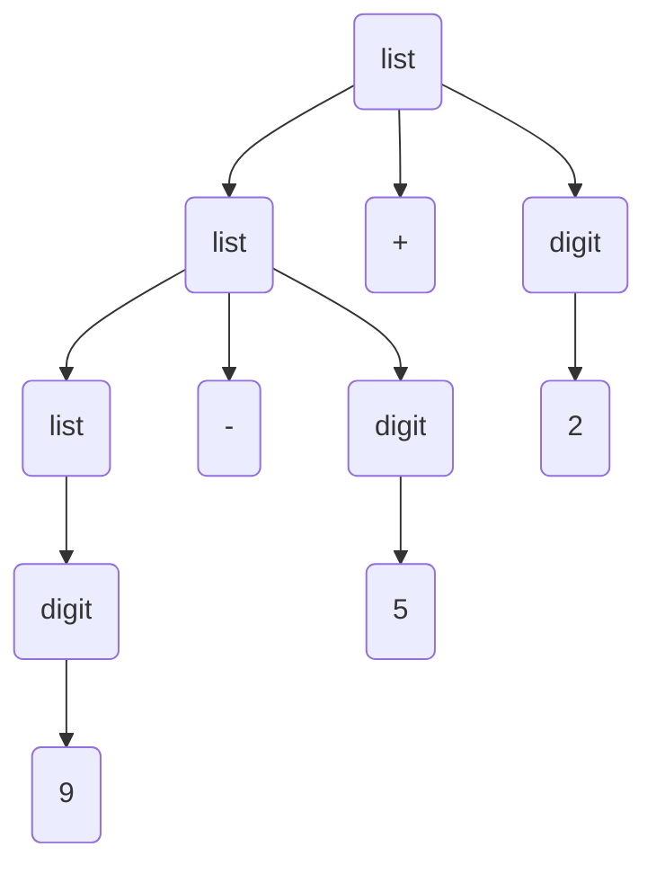
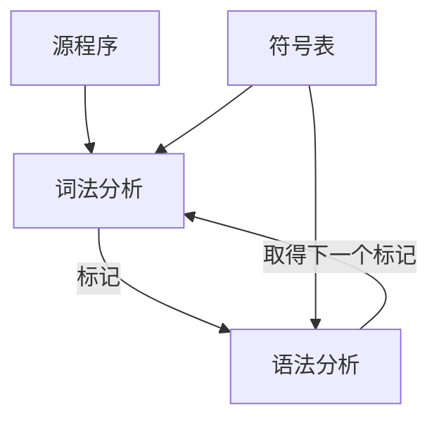

# 结构

## 过程

1. 词法 *lexical* 分析: 字符流改成单词流, 给标识符以编号

2. 语法 *syntax* 分析: 转换成语法树, 使用标识符编号

3. 语义 *semantic* 分析: 查找语义错误(类型计算), 此阶段结束后已经允许中间代码生成

4. 中间代码生成  *intermediate code generator*: 生成中间代码(指令), 中间代码只有最多四个词元

   ```
   temp2 := id3 + temp1
   ```

5. 代码优化

   - 常量计算(包括常量的算术计算和类型转换)
   - 等价指令合并

6. 目标代码生成

   - 目标程序(汇编/机器码/中间码)

all -- 出错处理
all -- 符号表处理

## 符号表

存储**标识符**及其相关属性

# 简单的单遍编译程序

> 一趟式

## 文法

>  Context free Grammer CFG 上下文无关语法 
>
> 用于定义程序语言的语法

- A Set of Token 终结符集

- A Set of Non-terminals 非终结符集

- A Set of Production Rule 产生式, 左边产生右边, 右边反推左边
  $$
  NT \to \{T,NT\}^{*}
  $$

例子
$$
\begin{array} {1}
    list &\to list + digit\\
    list &\to list - digit\\
    list &\to digit\\
    digit &\to 0\mid 1\mid 2\mid 3\mid 4\mid 5\mid 6\mid 7\mid 8\mid 9
\end{array}
$$
比如 $9-5+2$ 就是符合上述 $list$ 文法的
$$
\begin{array} {1}
    list &\to list + digit\\
         &\to list - digit + digit\\
         &\to digit - digit + digit \\
         &\to 9 - 5 + 2
\end{array}
$$
 构成了语法树



递归定义, 自己定义自己

$\epsilon$ 表示空串

### 语法分析树

- 树根用 Start Symbol (开始符号), 来标记
- 叶子节点是 Token 或 $\epsilon$ 表示空串
- 内节点( 非叶子 ) 是Non-Terminial (非终结符)
- 例如 $A \to x1x2...n$, 那么 $A$ 是内节点, $x1x2...n$ 是 $A$ 的儿子, 可以 是 Token|Non-Terminals

文法的二义性

> Two dervations (Parse Trees) for the same token string

是文法太过简单导致的

例如文法如果是
$$
string \to string + string \mid string - string\mid 0\mid 1\mid ...\mid 9
$$
那么 $9-5+2$ 可以被理解成两种形式


用文法规则定义数学运算符的优先级, 例如 $9+5\times2$
$$
\begin{array}{1}
    expr &\to expr + term\mid expr - term\mid term \\
    expr &\to term \times factor \mid term / factor \mid factor \\
    factor &\to digit | (expr) \\
    digit &\to 0\mid 1\mid 2\mid 3\mid 4\mid 5\mid 6\mid 7\mid 8\mid 9
\end{array}
$$
对于简单的编程语言的文法
$$
\begin{array}{1}
    stmt &\to& id\; = \;expression; \\ 
        &|& if(expression)\;stmt  \\
        &|& if(expression)\;stmt\; else\; stmt \\
        &|& while(expression)\; stmt \\
        &|& do \; stmt \; while(expression); \\
        &|& \{stmts\}\\
    stmts &\to& stmts\; stmt\\
    	&|& \epsilon
\end{array}
$$


## 语法指导翻译

> Syntax-Directed Translation

# 词法分析

> lexical analysis



## 单词, 模式, 词素


| 词法单元    | 非正式描述                         | 词素示例         |
| ----------- | ---------------------------------- | ---------------- |
| if          |                                    | if               |
| else        |                                    | else             |
| comparation | 比较运算符                         | <=, !=           |
| id          | 字母开头的字母/数字串              |                  |
| number      | 任何数字常量                       | 1, 3.14, 6.23e23 |
| literal     | 在两个`"`之间, 除以`"`外的任何字符 | `"core dumped"`  |


## 歧义

字符多义, 比如加号, 正号, 前缀加加, 后缀加加. 采用解决方案是最长匹配

token多义, 比如`>>`, 是右移, 也可以是模板语法 `vector<vector<int>>` 的结束. 方案是, 由语法分析器维护当前上下文, 但解析到 `>>`, 发现当前处于**模板**上下文, `>>` 则被拆分为两个`>`, 表示模板结束符

前文无法判断上下文, 只有依靠后文来判断; 比如Fortran语法的特殊性, `DO10I = 1,100`, 即使 `DO10I` 中间没有空格, Fortran 依旧会去判断其是否应该分成 `DO 10 I`; 而在 Fortran中, `DO 10 I = 1, 100`是存在的语法, Fortran是要判断`DO10I` 是标识符还是语句的前半部分, 必须看后文的`=1,100`的这个`,`. 这称为称为 **“最大咬入”与“延迟分词”** 的策略. 现代语言大多不会出现这种情况了, 主要还是依靠空白符来进行分割.

[歧义](./CodeList.md)


双缓冲区

```cpp
switch(*forward++){
    case eof:  // eof 表示缓冲区泊位
        if(forward is at end of first buffer){
            reload second buffer;
            forward = beginning of second buffer;
        }else if(forward is at end of second buffer){
            reload first buffer;
            forward = beginning of first buffer;
        }else{
            /*eof with a buffer marks the end of input*/
            terminate lexical analysis
        }
        break;
    case for other character:
        // ...
}
```


## 单词描述

### 串和语言

概念, 以banana为例

- 前缀: bana, $\epsilon$
- 后缀: nana, $\epsilon$
- 子串: ana, anan, nan
- 子序列: baaa, baan, ann
- 真前缀: 不包括 $\epsilon$ 和 本身(banana) 的前缀

### 定义单词

- 字母表 $\Sigma$, 符号的有限集合
- 串, 来自字母表的符号的有限序列
- 如果 S 是个串. $|S|$ 是S的长度, 特别地, $|\epsilon| = 0$

### 正则表达式

规则的集合, 用于从一个字母表制造符号串的技术

设 $\Sigma$ 是个字母表, $r$ 是一个正则表达式, 那么 $L(r)$ 是由 $r$ 的规则所刻画的语言

递归定义:

1. $\epsilon$ 是个正则表达式, 表示 $\{\epsilon\}$

2. 如果 $a$ 是在 $\Sigma$ 中, $a$ 是正则表达式, 表示 $\{a\}$

3. 设 $r$ 和 $s$ 是正则表达式, 其语言分别是 $L(r)$ 和 $L(s)$

   以下规则, 越往前优先级越高

   1. $ (r)|(s) $ 是正则表达式 $\to L(r) \cap L(S)$

   2. 连接规则:  $(r)(s)$是正则表达式 $\to L(r)L(S)$

      定义 $(r)(r)$ 为 $r^2$, 同理定义 $r^3$, $r^4$, $r^5$.... 

      特别的, $r^0=\{\epsilon\}$

   3.  $r^*$ 是正则表达式 $\to (L(r))^*$, $r^*$ 是闭包, 等价于 $r^0 \cup r^1 \cup r^2 \cup r^3 \cup ...$ 

   4. $(r)$ 是正则表达式 $\to L(r)$

性质

- $r|s=s|r$ 
- $r|(s|t) = (r|s)|t$
- $(r \; s) t = r (s \; t)$ 
- $r(s|t) = r\;s|r\;t$ 以及  $(s|t)r = s\;r|t\;r$
- $r\;\epsilon = r$, $\epsilon \; r = r$
- $r^* = (r|\epsilon )^*$
- $r^{**} = r^*$

使用, 第一个必须是字母的标识符

1. 分别定义 $letter \to A|B|C..|Z|a|b|c|...|z $ 和 $digit \to 0|1|2|3|..|9 \\$
2. 那么 identifier 为 $id\to letter(letter|digit)^*$

简化, 是对一系列的正则表达式的基础运算符简化

- $+$ One or more 
  - $r^*=r^+|\epsilon $ 
  - $r^+=r\;r^*$
- $?$ Zero or One
  - $r? = r|\epsilon $
- $[range]$ set range of characters (replase "$|$")
  - $[0-5]=0|1|2|3|4|5$ 

### 描述token

$$
\begin{array}{1}
	if &\to& if \\
	else &\to& else \\
	then &\to& then \\
	relop &\to& <|>|<=|>=|=|<> \\
	letter &\to& [A-Z]|[a-z] \\
	posdigit &\to& [1-9] \\
	digit &\to& 0| posdigit  \\
	id &\to& letter(letter|digit)* \\
	num &\to& (+|-)?posdigit\;digit^+(.digit^+)?((E|e)(+|-)?digit^+)? \\
\end{array}
$$

## 状态转换图

有穷自动机 FA

- 状态数目有限
- 确定的有穷自动机 DFA
- 不确定的有穷自动机 NFA
- DFA 和 NFA 就是看有无回路, 有回路的是NFA

元素

- 状态 (就是圆圈/节点)
- 转移 (就是箭头/边)

NFA 和 DFA 之间可以进行转换

状态还可以用表格表述

- raws 状态
- columns 转移

### NFA

一个状态上, 同一个char指向两个路径, 此为不确定. DFA 就会避免这种情况

- $S$ 状态的一个集合
- $\Sigma$ 输入字母表的符号
- $Pow(S)$ 状态集, 是$S$的所有子集组成的集合
- $move$ 转移函数
  - move(state,system) -> set of states
  - move: $S \times \Sigma \cup \{\epsilon\} \to Pow(S)$
- 起始状态: 一个状态 $s_0 \in S$, 开始状态, 唯一
- 终止状态: $F\subseteq S$,最终或接受状态的一个集合. 不唯一

正则表达式易于转换为 NFA , 但是 NFA 具备不确定性

DFA 具有确定性, 但过于复杂

NFA 能够转换成 DFA

## 构造DFA

### DFA $\to$ Program

状态转移表

raws 是前一个状态

columns 是输入字符

值是下一个状态


则可编写函数(比如大量的switch-case语句)

### NFA $\to$ Program


```cpp
s = s_0; // 起始状态
c = nextChar();
while(c != eof){
    s = move(s, c);// 转移函数
    c = nextChar();
}
return s in F; // F 是终止状态
```

### NFA $\to$ DFA

设 L 为一个由不确定的有穷自动机接受的集合，则存在一个接受 L 的确定的有穷自动机。

子集法思想

1. 首先定义对状态集合I的有关运算
2. 状态集合 $I$ 的 $\epsilon$ - 闭包, 表示为 $\epsilon - Closure(I)$. Closure: 闭包
3. 状态集合 $I$ 的 a 弧转换, 表示为 $move(I, a)$


1. 计算 $\epsilon-Closure(\{0\})$, 即状态 $\{0\}$ 的 $\epsilon$ 闭包. 即求状态 $\{0\}$ 只从 $\epsilon$ 进行状态转移, 能进入的所有状态. 为$\{0,1,2,4,7\}$
2. 令 $\{0, 1, 2, 6, 8\}=A$ 是 **DFA 的一个新状态**。
3. 计算 $\epsilon-Closure(move(A, a))$ 和 $\epsilon-Closure(move(A, b))$
   - a: 得出 $\epsilon-Closure(\{3, 8\})$, 然后得出 $\{1,2,3,4,6,7,8\}$, 是新状态, 定义为 $B$
   - b: 得出 $\epsilon-Closure(\{5\})$, 然后得出 $\{1,2,4,5,6,7\}$ 是新状态, 定义为 $C$
4.  $B$ 和 $C$ 分别执行 步骤3, 直到没有新的状态产生
   - 所谓没有新的状态产生, 指的是状态集合经过步骤三之后产生的状态集合, 是之前出现过的状态集合. 例如 $B$ 进行步骤 3.a 之后, 计算出状态 $B$

上述状态 $A,B,C$ 是 DFA 中的状态, 转移方式及是  然后可以构成状态转换图

此例中即是存在节点 $A,B,C$ 等, 存在边(状态转移) $A\overset{\text{a}}{\rightarrow}B$ 等, 则可构造完整的状态转换表


状态转移图


### REs $\to$ NFA

存在性与唯一性:

1. 对于 $\Sigma$ 上的 NFA M, 可以构造一个 $\Sigma$ 上的正则 $R$ , 使得 $L(R)=L(M)$
2. 对于 $\Sigma$ 上的正则 $R$, 可以构造一个 $\Sigma$ 上的NFA  M, 使得 $L(M) = L(R)$

NFA $\to$ REs


语法指导: 按正则的语法规则指引构造构成

1. 划分正则的子表达式
   - $\epsilon$
   - $\Sigma$ 中的字母
   - $r|s$
   - $rs$
   - $r^*$
2. 为每个子表达式构造相应的 NFA 片段
3. 得到 NFA 片段 按一定规则拼接成 NFA

片段构造:


以及


对于正则式 $R = st$ 构造NFA


对于正则$R =s|t$ 所构造的NFA(R)如下


对于正则式 $R = s^*$ 构造 NFA 


### DFA 最小化

1. 消除多余状态
2. 合并等价状态

状态 s 和 t 等价的条件

- 一致性条件
- 蔓延性条件

**分割法**

把DFA分成一些不相交的子集，使得任何不同的两子集的状态都是可区别的，而同一子集中的任何两个状态都是等价的。

1. 分成终止状态和非终止状态两个状态集合
2. 对于每一个状态集合, 对于所有的字符, 做状态转移, 从一个状态集合到另一个集合
   - 如果从状态集合转移到状态集合之外, 则分割成两个
   - 如果从状态集合转移到状态集合内, 则保留在一个及内核
3. 对于分割后的所有集合(包括分割的和没分割的), 进入2, 直到没有新的集合分割出来


105 3.7.3 REs->NFA->DFA->最小化


