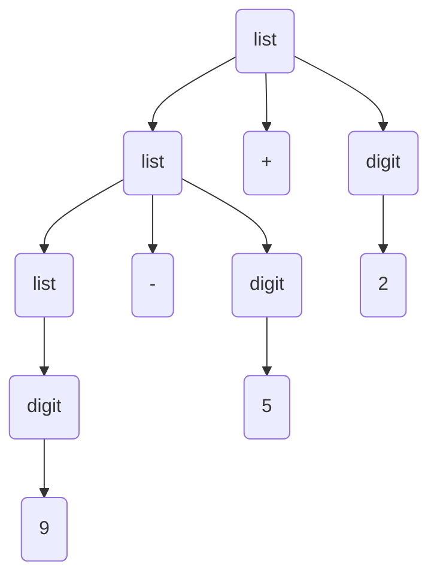

# 结构

## 过程

1. 词法 *lexical* 分析: 字符流改成单词流, 给标识符以编号

2. 语法 *syntax* 分析: 转换成语法树, 使用标识符编号

3. 语义 *semantic* 分析: 查找语义错误(类型计算), 此阶段结束后已经允许中间代码生成

4. 中间代码生成  *intermediate code generator*: 生成中间代码(指令), 中间代码只有最多四个词元

   ```
   temp2 := id3 + temp1
   ```

5. 代码优化

   - 常量计算(包括常量的算术计算和类型转换)
   - 等价指令合并

6. 目标代码生成

   - 目标程序(汇编/机器码/中间码)

all -- 出错处理
all -- 符号表处理

## 符号表

存储**标识符**及其相关属性

# 简单的单遍编译程序

> 一趟式

## 文法

>  Context free Grammer CFG 上下文无关语法 
>
>  用于定义程序语言的语法

- A Set of Token 终结符集

- A Set of Non-terminals 非终结符集

- A Set of Production Rule 产生式, 左边产生右边, 右边反推左边
  $$
  NT \to \{T,NT\}^{*}
  $$

例子
$$
\begin{align}
    list &\to list + digit\\
    list &\to list - digit\\
    list &\to digit\\
    digit &\to 0\mid 1\mid 2\mid 3\mid 4\mid 5\mid 6\mid 7\mid 8\mid 9
\end{align}
$$
比如 $9-5+2$ 就是符合上述 $list$ 文法的
$$
\begin{align}
    list &\to list + digit\\
         &\to list - digit + digit\\
         &\to digit - digit + digit \\
         &\to 9 - 5 + 2
\end{align}
$$
 构成了语法树



递归定义, 自己定义自己

$\epsilon$ 表示空串

### 语法分析树

- 树根用 Start Symbol (开始符号), 来标记
- 叶子节点是 Token 或 $\epsilon$ 表示空串
- 内节点( 非叶子 ) 是Non-Terminial (非终结符)
- 例如 $A \to x1x2...n$, 那么 $A$ 是内节点, $x1x2...n$ 是 $A$ 的儿子, 可以 是 Token|Non-Terminals

文法的二义性

> Two dervations (Parse Trees) for the same token string

是文法太过简单导致的

例如文法如果是
$$
string \to string + string \mid string - string\mid 0\mid 1\mid ...\mid 9
$$
那么 $9-5+2$ 可以被理解成两种形式


用文法规则定义数学运算符的优先级, 例如 $9+5\times2$
$$
\begin{align}
    expr &\to expr + term\mid expr - term\mid term \\
    expr &\to term \times factor \mid term / factor \mid factor \\
    factor &\to digit | (expr) \\
    digit &\to 0\mid 1\mid 2\mid 3\mid 4\mid 5\mid 6\mid 7\mid 8\mid 9
\end{align}
$$
对于简单的编程语言的文法
$$
\begin{align}
    stmt &\to& id\; = \;expression; \\ 
        &|& if(expression)\;stmt  \\
        &|& if(expression)\;stmt\; else\; stmt \\
        &|& while(expression)\; stmt \\
        &|& do \; stmt \; while(expression); \\
        &|& \{stmts\}\\
    stmts &\to& stmts\; stmt\\
    	&|& \epsilon
\end{align}
$$


## 语法指导翻译

> Syntax-Directed Translation

# 