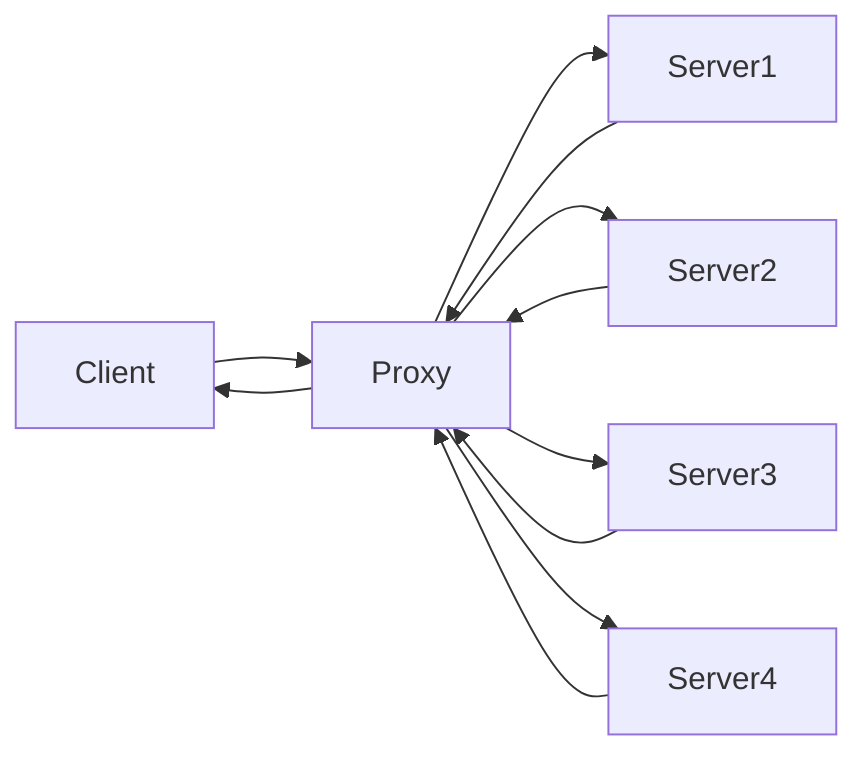

# 反向代理




将服务端隐藏, 使服务端更加安全

将请求分发给服务器, 将低服务端的压力


##`proxy_pass`

```NGINX
server {
    listen 80 ;
    server_name localhost ;
    location /server {
        proxy_pass http://192.168.130.88:80;
       	# localhost/server/index.html -> http://192.168.130.88:80/server/index.html
        # ----------------------------------------------
        # proxy_pass http://192.168.130.88:80/;
        # localhost/server/index.html ->  http://192.168.130.88:80/index.html
    }
} 
```


## `proxy_set_header`

在代理更改请求头信息, 新的请求头信息发送到服务器

`http` `server` `location`

```nginx
server {
    listen 80 ;
    server_name localhost ;
    location /server {
        proxy_pass http://192.168.130.88:80;
        proxy_set_header client_host $host ; # 服务端直接从HOST获取的话, 得到的是代理的HOST
    }
} 
```


## `proxy_redirect`

重置头信息中的`Location`和`Refresh`

`http` `server` `location`

```nginx
server {
    listen 80 ;
    server_name localhost ;
    location /server {
        proxy_pass http://192.168.130.88:80;
        proxy_redirect default | off | redirect replacement ;
    }
} 
```

-   `default`
    -   默认
    -   location中的uri变量作为replacement
-   `off`
-   `redirect replacement`