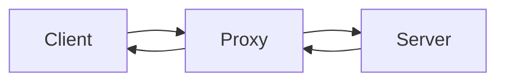

# 正向代理




服务端不会直接和客户端连接(VPN)

## Server

```nginx

```


## Proxy

```Nginx
resolver 8.8.8.8 ; # 设置DSNS的IP用来解析proxy_pass中的域名(只有使用域名才会使用到这个配置)
location / {
    proxy http://$host$request_uri;
}
```


## Client

1.  打开控制面板

2.  网络与Internet

3.  Internet选项

4.  连接

5.  局域网(LAN)设置, 局域网设置

6.  代理服务器

7.  勾选为LAN使用代理服务器(这些设置不用于拨号或VPN连接)

    

    配置`Proxy`的HOST和IP

