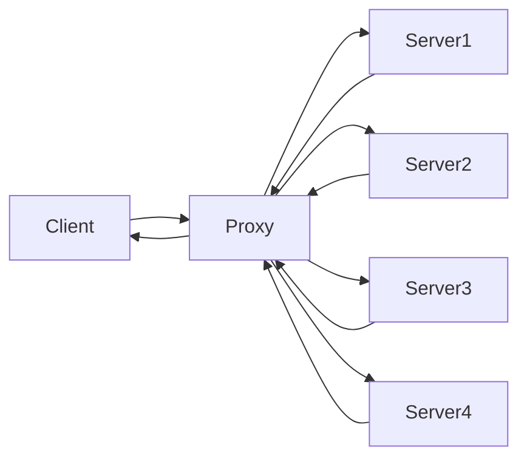

# 概述

## 介绍

-   具有高性能的HTTP和反向代理的WEB服务器, 同时也是一个 POP3/SMTP/IMAP代理服务器
-   C语言开发
-   `Igor Sysoev`开发(因为Nginx版权问题被不[万恶的资本])
-   04.10.4发布

-   Web服务器
-   网页服务器
    -   WebServer
-   HTTP
    -   超文本传输协议
-   POP3
    -   Post Office Protocol 3
    -   邮局协议的第三个版本
-   SMTP
    -   Simple Mail Transfer Protocol
    -   简单邮件传输协议
-   IMAP
    -   Internet Mail Access Protocol
    -   交互式邮件传输协议

##反向代理

### 正向代理

服务端不会直接和客户端连接(VPN)

### 反向代理

将服务端隐藏, 使服务端更加安全

将请求分发给服务器, 将低服务端的压力

## Web服务器

-   Tomcat
    -   Apache
    -   重量级服务器
    -   性能稳定
    -   开源
    -   对静态文件和高并发(200个)的处理较弱
-   Apache
    -   
-   Lighttpd
    -   轻量级, 高性能
    -   欧美居多
-   Google Service
    -   闭源
-   WebLogic 
    -   要钱
-   Webshpere
    -   IBM
    -   要钱
-   IIS
    -   Internet Information Service
    -   基于Windows系统
    -   Microsoft

## Nginx优点

-   速度快, 并发高

    -   使用多进程
    -   IO多路复用

-   配置简单, 扩展性强

    -   有很多模块组成
    -   有很多第三方模块(Open Restry, Tengin [Taobao] )

-   高可靠性

    -   Master进程和Worker进程
    -   通过配置文件指定Worker进程

-   热部署

    -   对外无间断提供服务
    -   在不关闭服务器的情况下对文件进行升级
    -   更新配置文件和更换日志文件等功能

-   成本低, BSD许可证

    -   开源

    -   BSD许可证是开源的许可证

    -   开源许可证: 

        -   GPL
        -   BSD
        -   MIT
        -   Mozila
        -   Apache
        -   LGPL

        张图来解释下：

        

        可以免费地将Nginx应用在商业领域

        而且还可以在项目中直接修改Nginx的源码来定制自己的特殊需求

        

