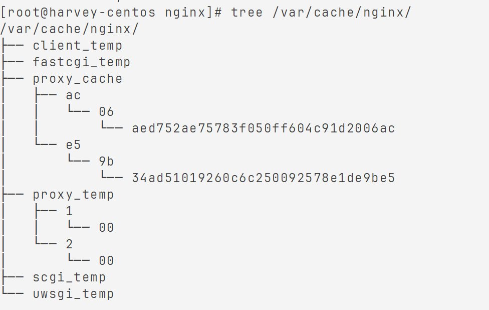

# Nginx缓存配置

使用`ngx_http_proxy_module`

## 开启缓存

### `proxy_cache_path`

`http`

```nginx
proxy_cache_path path [levels=number] keys_zone=zone_name:zone_size [inactive=time]\[max_size=size];
```

-   `path`

    -   `/var/cache/nginx/proxy_cache`, 随意, 对于yum, 这个目录已经有了
    -   不存在, 就创建

-   `levels=number`

    -   设计缓存区目录

    ```nginx
    #14a41b64a234325c523d4243ea532f5e Nginx的MD5使用'32位小写'
    levels=1:2 # 两层目录,第一层一个字母, 第二层两个字母 -> ?/e/f5
    levels=2:1 # 两层目录,第一层二个字母, 第二层一个字母 -> ?/5e/f
    levels=2:1:2 # 三层目录,第一层二个字母, 第二层一个字母, 第三层2个目录 -> ?/5e/f/32
    levels=2:1:1 # 两层目录,第一层二个字母, 第二层一个字母, 第三层1个目录 -> ?/5e/f/2
    # 只能有三层, 长度只能是1或2
    ```

-   `keys_zone=zone_name:zone_size`

    -   设置缓存区名称, 指定大小, 1M大概8000Key

    ```nginx
    keys_zone=my_cache_zone:255m
    ```

-   `inactive=time`

    -   缓存的数据多久没有被访问就被删除

    ```nginx
    inactive=1h
    ```

-   `max_size`

    -   最大的缓存空间
    -   缓存空间被村办, 默认会覆盖缓存事件最长的资源

    ```nginx
    max_size=20g
    ```

-   整体

    ```nginx
    http{
    	proxy_cache_path /var/cache/nginx/proxy_cache keys_zone=my_cache_zone:255m  levels=2:2 inactive=1h max_size=20g;
    }
    ```

### `proxy_cache`

`http`、`server`、`location`  

开启代理缓存

```nginx
proxy_cache zone_name | off;
```

默认关闭

`zone_name` 和 `proxy_cache_path`里配置的`zone_name`对应

### `proxy_cache_key`

`http`、`server`、`location`  

指定key，Nginx会根据key值MD5哈希存缓存。

```nginx
proxy_cache_key key;
```

默认

```nginx
proxy_cache_key $scheme$proxy_host$request_uri;
```

### `proxy_cache_valid`

`http`、`server`、`location`  

对不同返回状态码的URL设置不同的缓存时间

```nginx
proxy_cache_valid [code ...] time;
```

如：

```nginx
proxy_cache_valid 200 302 10m;
proxy_cache_valid 404 1m;
# 为200和302的响应URL设置10分钟缓存，为404的响应URL设置1分钟缓存
proxy_cache_valid any 1m;
# 对所有响应状态码的URL都设置1分钟缓存
# 上面的优先级高, 不会被覆盖
```

### `proxy_cache_min_uses`

`http`、`server`、`location`  

资源被访问多少次后被缓存

```nginx
proxy_cache_min_uses number;
```

**默认值1**

### `proxy_cache_methods`

`http`、`server`、`location`  

设置缓存哪些HTTP请求

```nginx
proxy_cache_methods GET|HEAD|POST;
```

默认值  proxy_cache_methods GET HEAD;        

默认缓存HTTP的GET和HEAD方法，不缓存POST方法。

### 概览

```nginx
http{
	proxy_cache_path /var/cache/nginx/proxy_cache keys_zone=my_cache_zone:255m  levels=2:2 inactive=1h max_size=20g;
    upstream backend{
		server loaclhost:8080;
	}
	server {
		listen       80;
        server_name  localhost;
        location ~(.*) {
        	proxy_cache my_cache_zone;
            proxy_cache_key $scheme$proxy_host$request_uri;
            proxy_cache_min_uses 2;
            proxy_cache_valid 200 5d;
            proxy_cache_valid 400 401 402 403 404 405 406 407 30s;
            proxy_cache_valid any 1m;
            add_header nginx-cache "$upstream_cache_status";
        	proxy_pass http://backend$1;
        }
	}
}
```

300kb, 70ms->50ms



## 清除缓存

```shell
rm -rf /var/cache/nginx/proxy_cache
```

😓

要不添加`ngx_cache_purge`

`ngx_cache_purge-2.3`

这个yum没带

```nginx
location ~/purge(.*) {
	proxy_cache_purge zone_name key;
}
```
```nginx
location ~/purge(.*) {
	proxy_cache_purge my_cache_zone $scheme$proxy_host$1;
}
```

每次增, 删, 改数据的的时候, 都跳转到这里去删除Nginx本地缓存

## 不缓存条件

不适合的数据不缓存

`proxy_no_cache`和`proxy_cache_bypass`即有关指令

其语法皆为, 位置皆为`http`、`server`、`location`

```nginx
proxy_no_cache|proxy_cache_bypass [$cookie_nocache $arg_nocache $arg_comment]; # 三选1+
```

-   `proxy_no_cache`
    -   定义**不将数据进行缓存**的条件。
-   `proxy_cache_bypass`
    -   设置**不从缓存中获取数据**的条件。
-   `$cookie_nocache $arg_nocache $arg_comment`
    -   条件
    -   关系或
    -   只要有一个不为空或不为0就成立, 即不进行缓存
    -   `$cookie_nocache`
        -   当前请求的cookie中键的名称为`nocache`对应的值
    -   `$arg_nocache`
        -   当前请求的参数中属性名为`nocache`对应的属性值
    -   `$arg_comment`
        -   当前请求的参数中属性名为`comment`对应的属性值
-   也可以自定义条件吧?

```nginx
server{
	listen	8081;
	server_name localhost;
	location / {
		if ($request_uri ~/.*\.js$){
           set $nocache 1;
        }
		proxy_no_cache $nocache $cookie_nocache $arg_nocache $arg_comment;
        proxy_cache_bypass $nocache $cookie_nocache $arg_nocache $arg_comment;
	}
}
```

