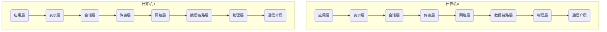

# 负载均衡

[load balancer](https://nginx.org/en/docs/http/load_balancing.html)

## 四/七层负载均衡

### OSI七层模型



第七层指应用层, 低四层指传输层

### 四层负载均衡

基于IP+PORT的负载均衡

高效率的F5负载均衡器, 不能自己拓展


好好好

软件: LVS, Nginx, Hayproxy也能做


### 七层负载均衡

基于虚拟URL或主机IP

Nginx, Hayproxy

### 区别

四层负载均衡数据包在底层进行分发

七层负载均衡数据包在顶端进行分发

四层负载均衡的效率笔七层的小笼包高

四层负载均衡不识别域名, 七层负载均衡识别域名

还有二层, 三层负载均衡

实际开发中, 四层负载均衡LVS, 七层负载均衡Nginx

## 七层负载均衡实现

在反向代理的基础上

把用户的请求根据指定的负载均衡策略分发到一组`upstream`虚拟服务池

### 指令

```nginx
http {
    # http {...} only
    upstream lb_test{
        server localhost:8001;
        server localhost:8002;
        server localhost:8003;
    }
    server {
        listen 80;
        server_name localhost;
        location / {
            proxy_pass http://lb_test;
        }
    }

}
```

```nginx
upstream lb_test{
	server localhost:8001;
	server localhost:8002;
	server localhost:8003;
}
server {
	listen 80;
	server_name localhost;
	location / {
		proxy_pass http://lb_test;
	}
}

server {
    listen   8001;
    server_name localhost;
    default_type text/html;
    location /{
    	return 200 '<h1>8001</h1>';
    }
}
server {
    listen   8002;
    server_name localhost;
    default_type text/html;
    location /{
    	return 200 '<h1>8002</h1>';
    }
}
server {
    listen   8003;
    server_name localhost;
    default_type text/html;
    location /{
    	return 200 '<h1>8003</h1>';
    }
}
```

3,2,1,3,2,1.....
