# 角色

## 组件

### 添加组件

Inspector->AddComponent

### 移除组件


### 物理组件

Inspector->AddComponent->Physicis2D

-   Rigidbody 2D 刚体
-   XX Collider 2D 碰撞体组件
    -   Box Collider 2D 方形碰撞体
    -   Capsule Collider 2D 胶囊碰撞体

-   

#### 物理数值调整

Edit->ProjectSettings->Physics2D->GeneralSettings


-   Gravity 重力
-   Simulation Mode 模拟模式
    -   Fixed Update(默认) 使用0.02秒检测一次
    -   Update
    -   Script

### 碰撞体

#### 胶囊碰撞体

>Capsule Collider 2D 

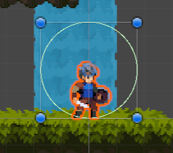


Edit Collider 编辑碰撞体, 长按Alt键, 依照中心轴堆成调整


#### 瓦片碰撞体

>Tilemap Collider 2D 


将多方块合成为同一个碰撞体

1.   添加Composite Collider 2D

2.   勾选Tilemap Collider 2D -> Used By Composite 合成为一体

     

3.   ==注意==会自动添加Rigidbody组件, 为其增加重力

4.   在Rigidbody2D中修改刚体组件的BodyType, 使其为static

     

#### 组合碰撞体

>   Composite Collider 2D

见上, 瓦片碰撞体-组合

#### 碰撞层

对象有物理的有关层设置Inspector->Layer


添加自定义层


在Edit->project settings Physics 2D-> Layer Collision Matrix 勾选表示层与层之间会产生碰撞, 不勾选表示不会碰撞


### 刚体

>   Rigidbody 2D


#### 重力

>   Gravity

-   Gravity Scale 收重力比例

#### 质量

>   Mass

重的物体撞开轻的物体

#### 锁定参数

>   Constraints

Transform ->Rotation 设置人物旋转角度


人物有倾斜, 运行测试

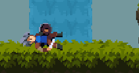

人物躺板板了

不一定是调整参数, 人物可能在撞到啥有碰撞体的东西, 都会躺板板, 例如, 从边角磕下来


也会躺板板

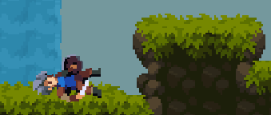

但是2D游戏不希望人物动不动就躺板板

在RigidBody->Constraints->Freeze Rotation 勾选, 锁定旋转


效果: 小伙立正了

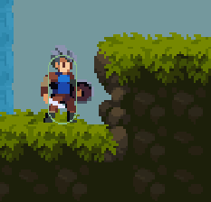

#### 检测关系

>   Collision Detection

-   Discrete 间歇性地
-   Coninuous 持续不断的, 更精准

### 自定义C#脚本组件


在人物的Inspector中AddComponent, 搜索自定义C#脚本文件名, 添加该脚本文件

or拖拽文件到Inspector

```csharp
using System;
using System.Collections;
using System.Collections.Generic;
using UnityEngine;

public class PlayerController : MonoBehaviour {
    /**
     * Start is called before the first frame update
     * 在游戏第一帧时执行的逻辑
     */
    void Start() {
        Console.WriteLine("Start");
    }

    /**
     * Update is called once per frame
     * 游戏运行的每一帧执行的逻辑
     */
    void Update() {
        Console.WriteLine("Update");
    }
}
```


#### 关闭C#脚本自动同步刷新

Unity: Edit->Preference->Assert Pipeline->Auto Refresh-> Disable

Rider: Setting->Language&Frameworks->Unity Engine -> Automatically refresh 取消勾选

手动刷新 Ctrl+R

## 输入系统

-   Edit->ProjectSettings->InputManager 老版本的输入系统

-   新版本的输入系统

    应对switch/xbox/移动端/桌面端等多种平台的手柄/键盘/触摸屏的多种操作方式

### 安装新版本输入系统

>   Input System

1.   Edit->ProjectSettings->Play->OtherSettings

2.   OtherSettings->Configuration->Api CompatibilityLevel*

     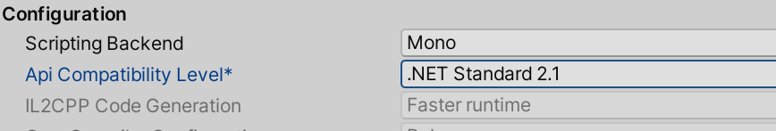

     改为.Net Framework, 使用更多C#特性

3.   右下角Compiling等待编译

     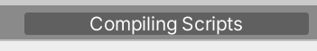

4.   Configuration->Active Input Handling

     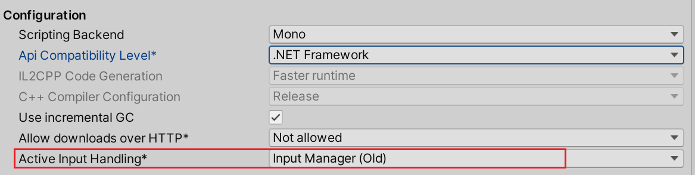

     Input System Package(New)

     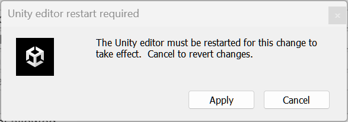

5.   点击Apply自动重启Unity

6.   Windows菜单->Package Manager

7.   Package Manager->Packages: In Project -> Unity Registry

     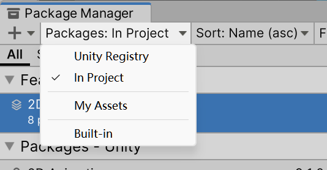

8.   查找Input

     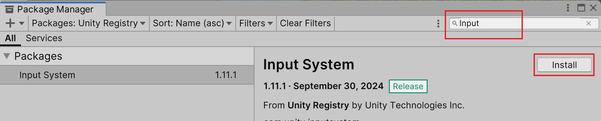

9.   Install Input System

10.   安装完成

      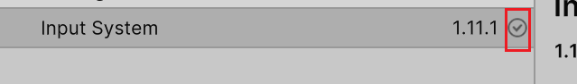

### 创建输入系统


Project->Create->反复点击`↓`箭头->Input Actions

添加或点击EditAsset打开

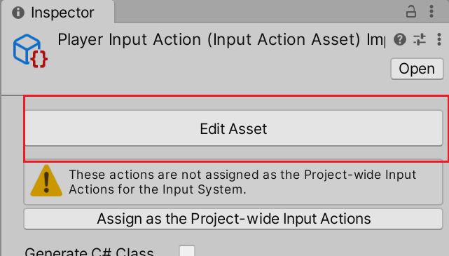


### 按键绑定

添加ActionMap

不同的时机有不同的输入系统

游戏运行一套, 暂停一套, 控制UI一套


-   Action Type

    -   Buttom
    -   Value
    -   PassingThrough

-   特别的, Value

    

    -   Vector 2 二维向量, 纵轴和横轴的移动的输入检测

Actions->+->Add Binding, 一个Binding, 就是同一个操作的不同按键映射, 例如手柄的移动操作和键盘的移动操作, 作为两个不同的Binding加在同一个Movement的Action之下

Actions->+->Add Up\Down\Left\Right Composite

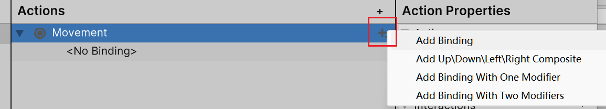

快速创建按键映射


Composite->Mode->DigitalNormalized , 对于键盘, 以值+1/-1表示按键被按下;对于手柄在[-1,1]的单精度浮点连续变化


绑定: 输入`W[Keyboard]`, 指定监听键盘W, 或点击`Listen`按钮, 然后按下按键`W`完成按键指定

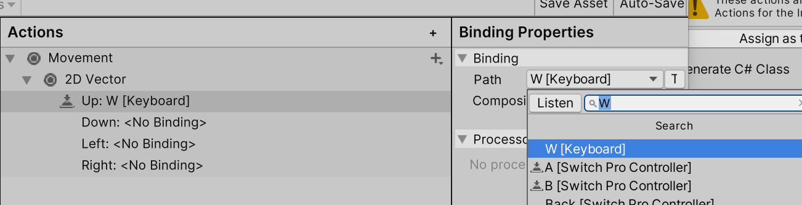

### 增加控制约束

>   Controller Schema


为按键选择约束


### 保存

点击保存

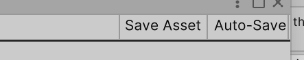

### Player Input自动生成

Untiy自动生成默认的InputAction配置表

选择Player目标->Inspector->Add Component->Player Input->CreateAction

选择文件夹保存Action配置表

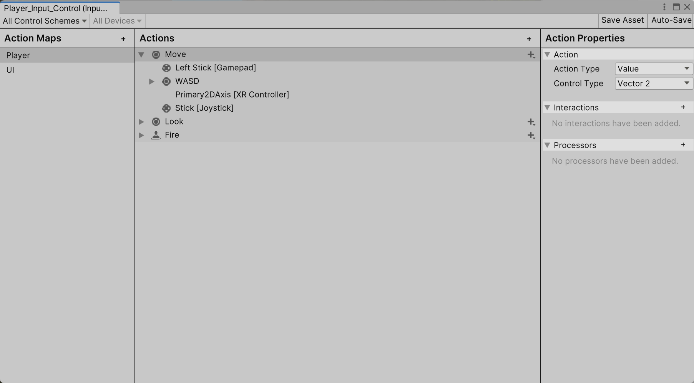

有了默认的设置

### PlayerInput

#### 函数监听执行逻辑

Player Input->Actions->Behavior->Invoke Unity Events


而后可添加各个行为的函数执行逻辑

#### C#脚本执行逻辑

选中inputactions文件, Inspector->Generate C# Class 勾选


Apply, 生成C#代码, 在C#代码的类来访问控制

C#的Console类打印不生效, 使用`Debug.Log("")`在(window->General->Console):


显示

### 使用设备判定

## C#控制角色移动

### 创建PlayerInputControl对象

PlayerController.cs 角色控制脚本

PlayerInputControl.cs 系统生成的C#类控制脚本

```csharp
public class PlayerController : MonoBehaviour {
    private PlayerInputControl _inputControl;

    /**
     * 最早被调用
     */
    private void Awake() {
        if (_inputControl is null) {
            _inputControl = new PlayerInputControl();
        }
    }

    private void OnEnable() {
        _inputControl.Enable();
    }
    private void OnDisable() {
        _inputControl.Disable();
    }
}
```

-   OnEnable调用时机

    

    变成`已被勾选`状态的时候被调用

-   OnDisable

    变成`未被勾选`状态的时候被调用

Awake->OnEnable->Start->Update(循环)

### 读取移动数值

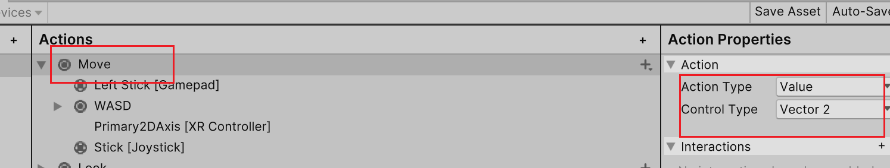

读取一个名为Move的, 类型是Vector2的值

创建一个Vector2类型的**全局**成员变量, 以小驼峰命名

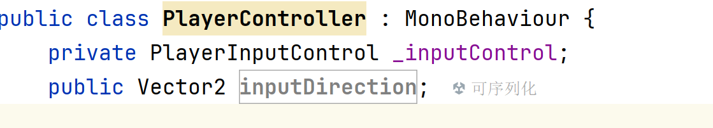

Unity会在图形化窗口显示该成员

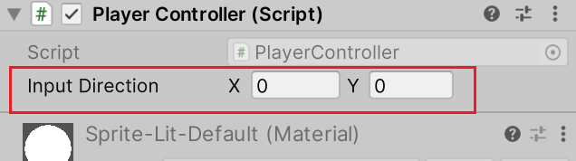

在C#读取该成员

```csharp
private void Update() {
    inputDirection = _inputControl
        .Gameplay // 自己命名的Action Map
        .Move // 自己命名的Action
        .ReadValue<Vector2>();
}
```

运行模式下观察到数值的变化

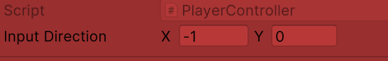

对于键盘, 有

-   W: Y=1
-   S: Y=-1
-   A: X=-1
-   D: X=1

对于手柄, 是[-1,1]之间的小数

### 修改位置数值实现移动

Inspector->Rigidbody->info


-   Position/Rotation 覆盖上面的数值
-   Velocity 速度

#### 获取RigideBody组件对象

获取RIgidbody中的数据, 要先获取RIgidbody组件对象

-   获取RIgidbody对象法一

    ```csharp
    private Rigidbody2D _rigidbody2D;

    private void Awake() {
        // null判断, 是null则赋值
        _inputControl ??= new PlayerInputControl();
        // _rigidbody2D ??= base.GetComponent<Rigidbody2D>();
        // _rigidbody2D ??= ((Component)this).GetComponent<Rigidbody2D>();
        _rigidbody2D ??= GetComponent<Rigidbody2D>();
    }
    ```

    适合在

-   获取RIgidbody对象法二

    在C#脚本中创建字段

    ```csharp
    public Rigidbody2D rb;
    ```

    在unity图形化界面中选择rigidbody的组件对象

    

    优势: 在编辑器(Rider/VS)执行或**游戏执行之前, 直接获取组件的使用权**, 速度更快

    **如果组件中的变量需要在游戏执行前就确定, 则使用该方法**

#### 修改移动数值

```csharp
// 速度
public float walkSpeed;
public float jumpSpeed;
/**
 * 固定更新的值, 无论设备的运算速度,<br/>
 * 总是以固定的时钟来对该方法进行调用<br/>
 * 和物理有关的, 会写在此处
 */
private void FixedUpdate() {
    Move();
}

private void Move() {
    rb.velocity = new Vector2(
        inputDirection.x * walkSpeed * Time.deltaTime /*时间修正, 不同设备获得相同的结果*/,
        rb.velocity.y // Y的值保留不变(否则将导致重力加速度产生的位移被覆盖)
    );
}
```

#### 人物在移动时转身

现在, 像左移动, 其实是倒退, 而不是转向左边然后向左移动

-   法一:

    Inspector->Transform->Scale, 发现其为-1时, 人物发生翻转

-   法二:

    Inspector->SpriteRenderer->Flip 实现快速翻转

    

由于Transform是默认组件, 就不需要`GetComponent` 了, 直接获取成员

```csharp
private void FixedUpdate() {
    Move();
    TurnAround(); // 转身
}
private void TurnAround() {
    var scale = transform.localScale;
    var faceDir = inputDirection.x switch{
        0 => Math.Sign(scale.x),
        > 0 => 1,
        < 0 => -1
    };
    transform.localScale = new Vector3(
        Math.Abs(scale.x) * faceDir,
        scale.y, scale.z);
}
```

### C#字段整理

```csharp
[Header("Components")]
public Rigidbody2D rb;

[Header("Basic Arguments")]
public float walkSpeed;

public float jumpSpeed;
public Vector2 inputDirection;
```


### 跳跃

按键设置成Buttom

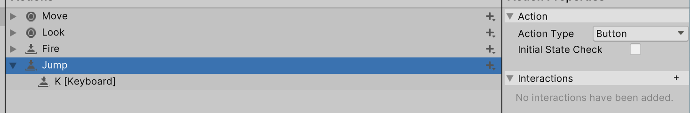

监听按钮, 事件注册

```csharp
private void Awake() {
    // ...
    // _inputControl.Gameplay.Jump.canceled; // 按键松开
    // _inputControl.Gameplay.Jump.performed; // 按键持续按住
    // 事件注册
    _inputControl.Gameplay.Jump.started+= Jump; // 按键按下
}

private void Jump(InputAction.CallbackContext obj) {
    throw new NotImplementedException();
}
```

使用给竖直方向增加速度

```csharp
private void Jump(InputAction.CallbackContext obj) {
    Debug.Log("Jump");
    rb.velocity = new Vector2(rb.velocity.x, rb.velocity.y + jumpSpeed);
}
```

但是, 不会参考角色质量, 使用AddForce, 就会参考人物质量

参考[Rigidbody2D脚本API](https://docs.unity.cn/cn/current/ScriptReference/Rigidbody2D.AddForce.html)

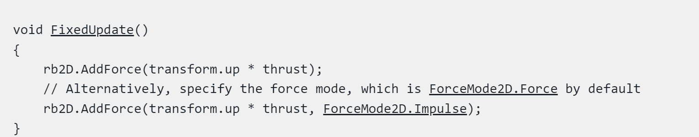

于是

```csharp
private void Jump(InputAction.CallbackContext obj) {
    // 增加一个向上(transform.up)的大小为[jumpForce]的瞬时力(ForceMode2D.Impulse)
    rb.AddForce(transform.up * jumpForce, ForceMode2D.Impulse);
}
```

## 人物周围物体检测

### 问题

人物卡墙(在墙上, 依然有向墙内的速度, 就卡墙上了)


人物不限次数连跳

新创建一个类, 之后的其他角色(怪)也可以复用这套逻辑

### 检测逻辑

检测人物下面是否有方块, 有则表示处于地面状态

检测人物前是否有方块, 有则表示撞到了方块

[检测方法文档](https://docs.unity.cn/cn/2022.2/ScriptReference/Physics2D.html)

| [OverlapCircle](https://docs.unity.cn/cn/2022.2/ScriptReference/Physics2D.OverlapCircle.html) | 检测碰撞体是否位于一个圆形的检测范围内<br>可选的 *layerMask* 可让测试仅检查特定层上的对象(防止反复检测各种对象) |
| ------------------------------------------------------------ | ------------------------------------------------------------ |

-   OverlapCapsule 检测碰撞体是否位于一个胶囊的检测范围内
-   OverlapBox 检测碰撞体是否位于一个方形的检测范围内

### 检测图层


1.   对Land进行Layer创建

     

2.   给land设置Layer

     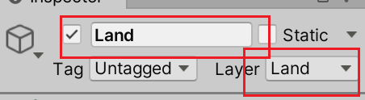

3.   给检查设置Layer

     

### 绘制检测范围

Gizmos

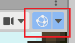

```csharp
public float checkRadius = 0.2f;
public Vector3 checkPositionOffset;

/**
 * 当物体被选中时, 进行绘制
 */
private void OnDrawGizmosSelected() {
    Gizmos.DrawWireSphere(
        transform.position + checkPositionOffset, checkRadius);
    // 画空心球
}
```


### 检测物体代码

```csharp
public class EnvironmentPhysicsCheck : MonoBehaviour {
    [Header("Check Arguments")]
    public LayerMask groundLayer;

    public float checkRadius = 0.1f;
    public Vector3 checkPositionOffset;

    public bool onLand;

    private void Update() {
        onLand = CheckLand();
    }

    private bool CheckLand() {
        return Physics2D.OverlapCircle(PositionAfterOffset(), checkRadius, groundLayer);
        // 检测地面, 就用人物脚底的位置坐检测中心
    }

    /**
     * 当物体被选中时, 进行绘制
     */
    private void OnDrawGizmosSelected() {
        Gizmos.DrawWireSphere(PositionAfterOffset(), checkRadius);
        // 画空心球
    }

    private Vector3 PositionAfterOffset() {
        var scale = transform.localScale;
        var offset = new Vector3(
            checkPositionOffset.x * scale.x,
            checkPositionOffset.y * scale.y,
            checkPositionOffset.z * scale.z
        );
        return transform.position + offset;
    }
}
```

### 跳跃/二段跳限制代码

```csharp
private void FixedUpdate() {
	// ...
    UpdateJumpedInAir();
}
private void UpdateJumpedInAir() {
    if (epc.OnGround) {
        _hasJumpedInTheAir = false;
    }
}

private void Jump(InputAction.CallbackContext obj) {
    if (epc.OnGround) {
        Jump0();
        _hasJumpedInTheAir = false;
    } else if (!_hasJumpedInTheAir) {
        // 空中二段跳
        Jump0();
        _hasJumpedInTheAir = true;
    }

    return;

    void Jump0() {
        // 增加一个向上(transform.up)的大小为[jumpForce]的瞬时力(ForceMode2D.Impulse);
        rb.AddForce(transform.up * jumpForce, ForceMode2D.Impulse);
    }
}
```

## 物理材质


描述物体的粗糙程度

人物贴在墙上不下来就是有摩擦, 就下不来了

给人物一个无摩擦的材质解决这个问题

### 创建自定义物理材质

Project->Create->2D->Physics Material 2D


调整参数


Friction 摩擦系数

### 设置物理材质


人物就会从墙上滑下来

