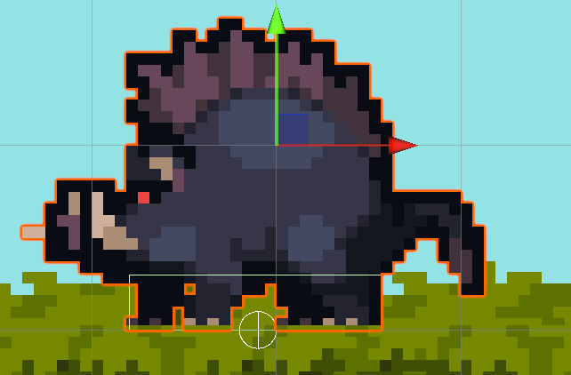
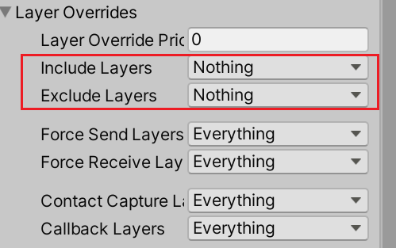
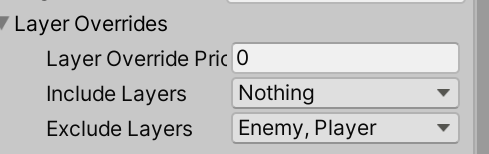
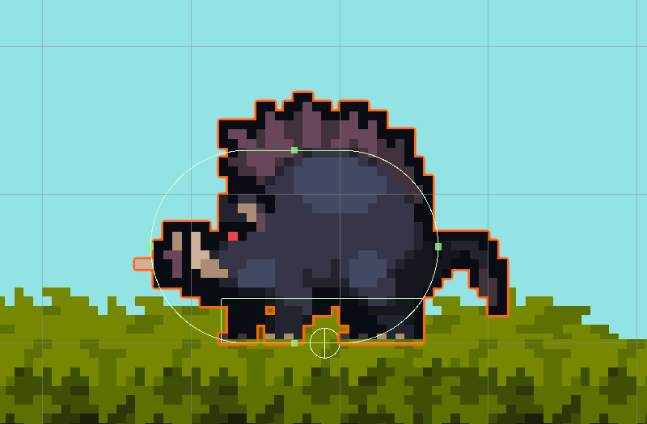
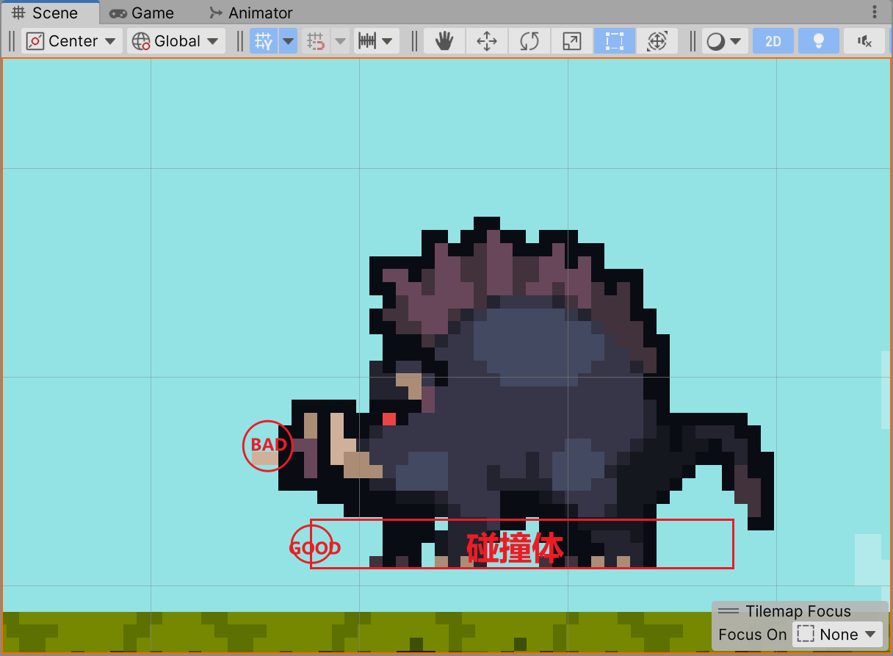
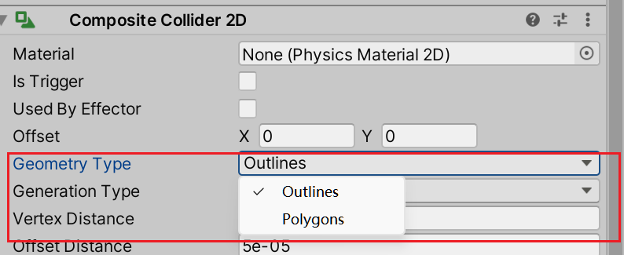
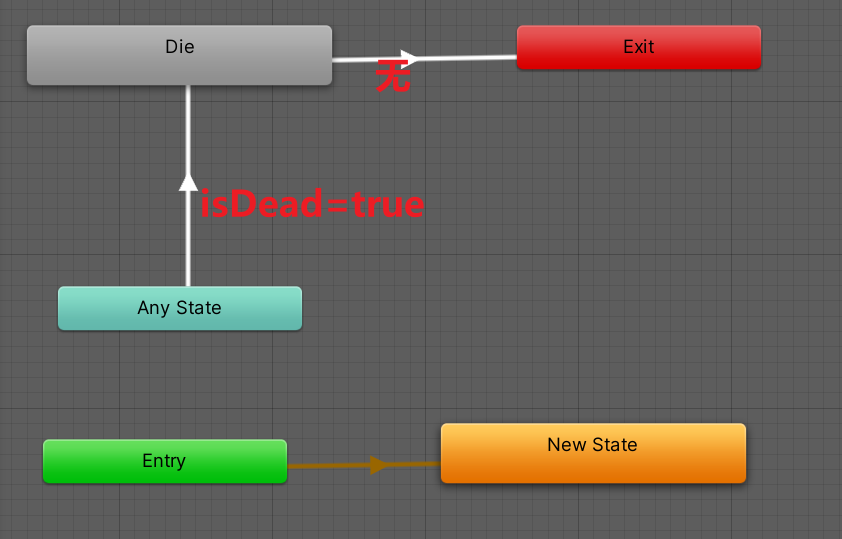
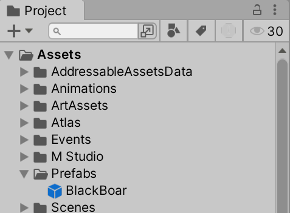

# 敌人

将角色的Inspector->Sprite Renderer->Addtional Settings->Order In Layer 调大, 保证始终在镜头前

用Box做敌人的碰撞体, 将敌人的碰撞体保留在脚部, 只要能让他站在地面就好了



## 改变碰撞图层

不希望角色会撞到敌人, 也不希望两个敌人之间会相撞

敌人->Inspector->Box Collider 2D-> Layer Overrides 图层重载



把Player和敌人本身排除出去

Inspector->右上角Layer->创建Layer

而后给角色设置Layer

然后Exclude Layers



-   **Contact Capture Layers** 与当前层接触的层
-   Include Layer: **Contact Capture Layers** +Include Layer
-   Exclude Layer: **Contact Capture Layers**-Exclude Layer
-   Callback Layer: 

## 触发器

>Trigger

### 创建触发器

再创建一个碰撞体, 用于检测伤害

敌人->Inspector->Capsule Collider 2D-> Is Trigger 勾选, 成为触发器之后, 该碰撞体不再有碰撞的作用

观察发现敌人心宽体胖, 应该适用横向的胶囊

Capsule Collider 2D->Direction 调整成水平胶囊



敌人和敌人互相触碰时不会触发触发器造成伤害, 故碰撞体排除敌人

### 监测触发器

```csharp
private void OnTriggerStay2D(Collider2D other) {
	// other表示另一个被碰撞的对象
    // 如果写在角色这里, 这other就是敌人了
}
```

进行监听

-   两个 GameObjects 都必须包含 Collider 组件
-   其中一个必须启用 Collider.isTrigger，并包含 Rigidbody

## 基本移动逻辑

创建EnimyController类作为基类, 各种具体敌人作为子类, 实现代码复用

## 移动动画

用枚举指定IDLE-WALK-RUNNING的状态

## 撞墙判定

注意, 适用`EnviromentPhysicsCheck`来判定时, 应该将检测范围放在**碰撞体**(不是触发器)附近而不是角色图像最前端



这是为例解决检测范围撞进地里, 导致无法被检测到(检测依据是地的边缘是否和圆面有交集)

也可以通过设置Land->Inspector->CompositeCollider->Geometry Type->Polygons



### 撞墙等待

撞到墙了等待一会儿

逻辑参考Player无敌时间

计时器

```csharp
/**
 * 计时器
 */
public class Timer {
    private float _c;
    public float Interval { get; set; }

    public Timer(float interval = 0) {
        Interval = interval;
    }

    public bool DoTime() {
        _c += Time.deltaTime;
        if (_c >= Interval) {
            _c = 0;
            return true;
        }

        return false;
    }
}
```

## 受伤和死亡

死亡采用逐渐变暗, 最终销毁的方法

动画连接



添加DieBehaviour

```csharp
public class EnemyDieAnimation : StateMachineBehaviour {
    public string attackAreaPath;

    public override void OnStateEnter(
        Animator animator, AnimatorStateInfo stateInfo, int layerIndex) {
        var gameObject = GameObject.Find(attackAreaPath);
        if (gameObject is null) {
            throw new ArgumentException($"Attack Area Path: `{attackAreaPath}` is not found.");
        }
        foreach (Transform tf in gameObject.transform) {
            tf.gameObject.SetActive(false);
        }
    }

    public override void OnStateExit(
        Animator animator, AnimatorStateInfo stateInfo, int layerIndex) {
        animator.gameObject.SetActive(false);
    }
}
```

受伤后敌人转向玩家

## 有限状态机

```csharp
public class PlayerAttackAnimation : StateMachineBehaviour {
    public override void OnStateEnter(
        Animator animator, AnimatorStateInfo stateInfo, int layerIndex) {
        // ...
    }

    public override void OnStateExit(
        Animator animator, AnimatorStateInfo stateInfo, int layerIndex) {
        // ...
    }
}
```

`StateMachineBehaviour` StateMachine 状态机

原理就是继承一个抽象类, 然后实现抽象函数后, 调用子类实现逻辑

### 自定义状态机

就是自定义一个抽象类, 定义了抽象方法(`OnEnter` `OnDistory`, `PhysicsUpddate`,`LogicUpdate`等)后, 用多态调用子类实现

不同的状态(走跑跳攻击无双)继承这个抽象类, 然后作为参数注入到组件

组件调用状态机的方法, 将代码执行的逻辑延迟到状态机身上, 最终实现分层解耦

此处略

## Physics2D.BoxCast

本来用的是计算Player.Transform的位置进行数学上的比较

```csharp
protected bool FaceToPlayer() {
    var playerAtLeft = player.position.x < transform.position.x;
    var faceToLeft = transform.localScale.x > 0;
    return playerAtLeft == faceToLeft;
}
```

使用Physics2D.BoxCast就是将一个碰撞体从当前对象出发, 往特定方向发射, 检测有没有碰到某一物体

用于检测对象的前方有无物体

```csharp
public class ObjectFinder : MonoBehaviour {
    #region 参数

    [Header("Args")]
    public Vector3 centerOffset;

    public LayerMask targetLayer;

    /// 障碍物阻止继续检测
    public LayerMask barrierLayer;

    public Vector3 findSize = Vector3.one;
    public Vector3 direction = Vector3.one;
    public float degree = 0f;
    public float findDistance = 1;

    #endregion

    #region 查找

    public bool Find() {
        RaycastHit2D hitBarrier = Physics2D.BoxCast(
            PositionAfterOffset(),
            findSize, degree, direction, findDistance, barrierLayer
        );
        if (hitBarrier.collider != null) {
            return false;
        }
        return Physics2D.BoxCast(
            PositionAfterOffset(),
            findSize, degree, direction, findDistance, targetLayer
        );
    }

    #endregion

    #region 画图

    private void OnDrawGizmosSelected() {
        var originColor = Gizmos.color;
        Gizmos.color = Color.blue;
        Gizmos.DrawWireCube(PositionAfterOffset(), findSize);
        Gizmos.color = Color.magenta;
        Gizmos.DrawWireCube(PositionAfterOffset() + direction * findDistance, findSize);
        Gizmos.color = originColor;
    }

    private Vector3 PositionAfterOffset() {
        return CommonUtil.PositionAfterOffset(
            transform.position, centerOffset, transform.localScale);
    }

    #endregion
}
```

RaycastHit2D有更多功能, 例如知道和目标的距离, 所以可以将Find的返回值改为RaycastHit2D

```csharp
protected bool FaceToPlayer() {
    Of.direction = FaceToLeft() ? Vector3.left : Vector3.right;
    var find = Of.Find();
    return find;
}
```

## 预制体

>   Prefabs

做好一个敌人, 希望只改一个敌人的配置, 然后赋值这个敌人的配置

将敌人的GameObject拖入projects窗口, 即可创建预制体



然后再Hierarchy窗口拷贝该对象, 那么, 修改一个参数, 其他所有参数都会改变

