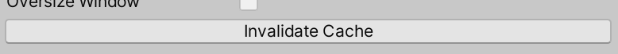

# 摄像头

## 摄像头插件

### 安装插件

window->PacageManager->Unity Registery

搜索`Cinemachine`

### 添加摄像头


Hierarchy->Create->Cinimachine->

-   2DCamera

## 跟随

指定跟随和正在观看


Virtual Camera->Inspector->ChinemachineVirtualCamera

-   Follow 设置成玩家对象
-   Look At 设置成玩家对象

### 参数设置

Game窗口下调整参数


Virtual Camera->Inspector->CinimachineVirtualCamera->Body

-   调整跟随中心点(不在以脚底未中心)

    

-   设置摄像头缓冲值

    

    人物移动不超过这个范围, 摄像头不跟随

    

### 停止跟随

在场景的边缘摄像机停止跟随

VirtualCamera->Inspector->CinemachineVirtualCamera->Extention->AddExtention


-   `CinemachinePixelPerfect` 像素旋转或产生畸变的时候不会出现像素扭曲, 保持单位像素

-   `Cinemachine Confier 2D` 限定摄像机移动范围

    

    1.   创建新对象, 添加组件Polygon Collider 2D , 
    2.   将碰撞体设置为Trigger
    3.   划定边界范围, 即作为摄像头边界

不同的场景之间, 摄像机的边框不同, 如何获取到不同场景的不同边框

1.   为边框设置Tag

     

2.   创建脚本, 用来转换不同场景下的同有Tag Bound的对象

3.   将该脚本挂载在VirtualCamera下

4.   完成场景转换后调用函数清空缓存

     

5.   脚本编写

     ```csharp
     public class CameraController : MonoBehaviour {
         private Cinemachine.CinemachineConfiner2D _cc2d;

         private void Awake() {
             _cc2d = GetComponent<Cinemachine.CinemachineConfiner2D>();
         }

         public void ChangeBounds() {
             var obj = GameObject.FindWithTag("Bound");
             if (obj == null) {
                 return;
             }

             _cc2d.m_BoundingShape2D = obj.GetComponent<Collider2D>(); // 获取碰撞体
             // 用碰撞体的父类作为查找对象, 能找到所有符合条件的子类

             _cc2d.InvalidateCache();
         }

         /// TODO 暂时在游戏开始时执行, 待做成场景切换时执行
         public void Start() {
             ChangeBounds();
         }
     }
     ```

## 振动

在攻击的时候增加振动

1.   Extension->`CinemachineImpulseListener`

     Impulse 瞬时的

     

     此拓展会对任何`CinemachineImpulseSource`的广播信号做出回应

2.   创建振动源

     1.   创建新对象CameraShake

     2.   为其添加组件CinemachineImpulseSource

          

          使用本脚本中定义的`GeneraterImpulse`API方法来链接你的振动事件, 执行瞬间振动(想振动就调用这个API)

     3.   在Play模式下调整Test with Force测试

     4.   Impulse Shape选择振动方式

          

          查看振动方程

          

     5.   调整震动速度, 同时决定方向和大小(矢量叉乘)

          

3.   创建监听事件Assert

     1.   创建SO脚本

          ```csharp
          using UnityEngine;
          using UnityEngine.Events;

          namespace SO {
              [CreateAssetMenu(fileName = "Event/VoidEvent")]
              public class VoidEvent : ScriptableObject {
                  public UnityAction Action;

                  public void Execute() {
                      Action?.Invoke();
                  }
              }
          }
          ```

     2.   创建Assert文件

          

     3.   注册事件

          

     4.   注册事件监听函数

          ```csharp
          public VoidEvent cameraShakeEvent;

          private void OnEnable() {
              // 注册
              cameraShakeEvent.Action += Shake;
          }
          private void OnDisable() {
              // 注销
              cameraShakeEvent.Action -= Shake;
          }
          private void Shake() {
              impulseSource?.GenerateImpulse();
          }
          ```

     5.   添加参数

          

4.   

## MainCamera

MainCamera->CinemachineBrain-> UpdateMethod

-   Smart Update
-   Fix Update, 减小走路移动造成的微小幅度(因人而异)

