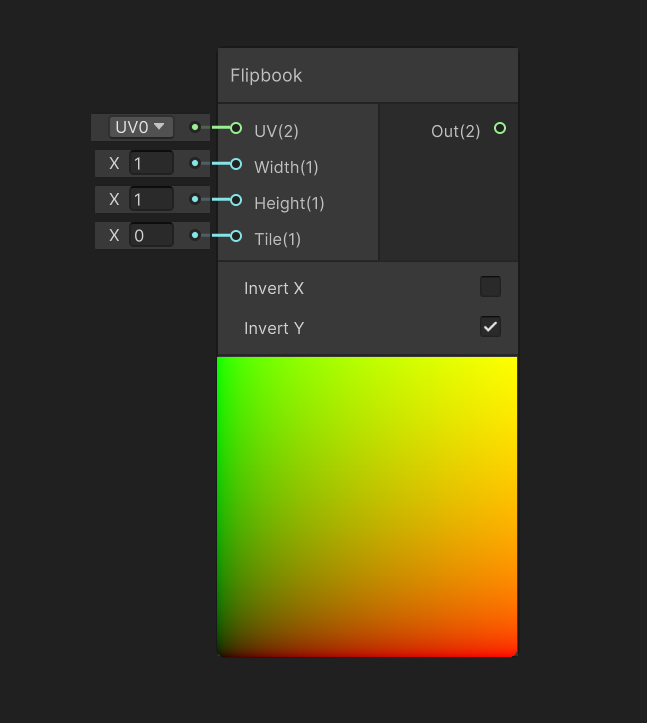
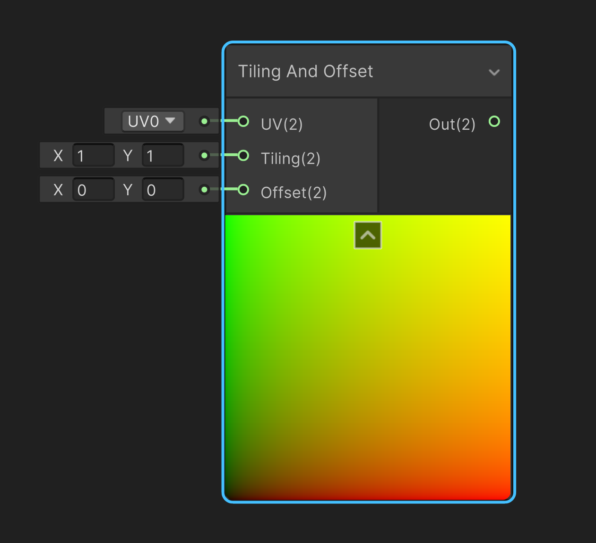
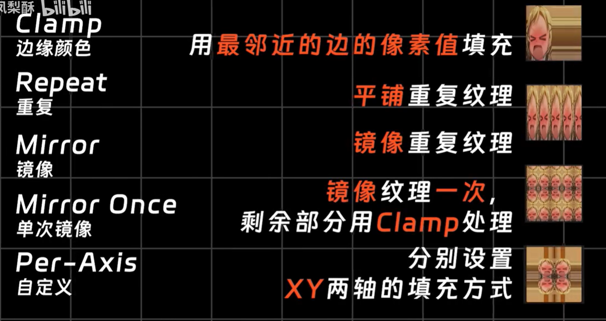
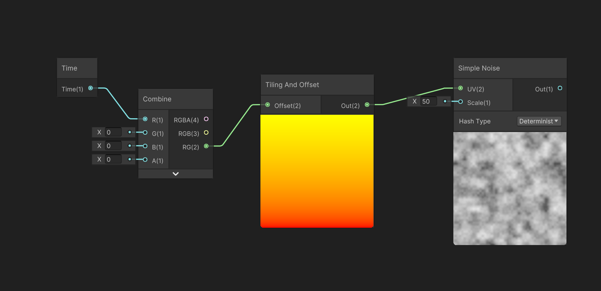

# Flipbook

> 翻页书节点

## 动画

Sprite Editor切割序列帧, Animation和Animator控制动画播放, 此行为占用CPU

而使用Shader Graph实现类似的动画占用GPU

## IO

### 输入

- UV
- U 轴分割树
- V 轴分割树
- 当前序列帧序号

下面的选项分别是`反转X轴`和`反转Y轴`

反转X轴 表示自左向右

反转Y轴 表示自下向上

## Tiling And Offset

平铺和偏移节点通过调整UV映射, 间接影响纹理的外观

- `Tiling` 平铺值
- `Offset` 偏移值

可以通过把时间节点接入偏移值, 从而使纹理保持移动

### Wrap Mode

> 包裹模式

平铺和偏移可能导致信息丢失问题, 例如向左偏移一部分, 最右边产生空白部分

填充UV图空白部分的规则称作包裹模式

对于2D, 但Sprite的UV超过  $[0,1]$, Wrap MOde 规范了超出部分的填充内容

包裹模式可以修改`Inspector`/`Advanced`/`WrapMode`

- `Clamp` 边缘颜色
- `Repeat` 重复
- `Mirror` 镜像
- `Mirrot Once` 单次镜像
- `Per-Axis` 自定义

## 实现动画

Time变量, 作为时间轴

Combine,将一个(或几个)分散的变量转换成一个向量

选取其前二维输入Tilling And Offset, 时间变化, Offset也不断变化

Simple Noise, 生成噪声, 用于展示图像被移动