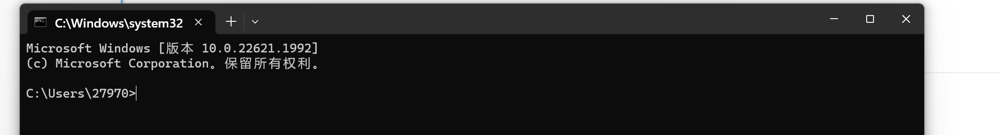
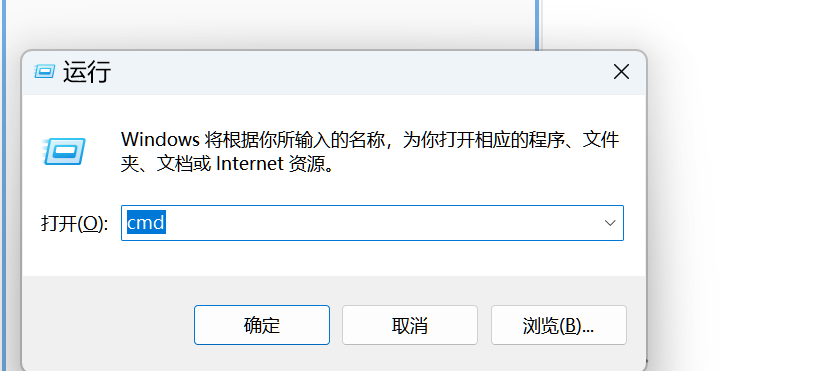
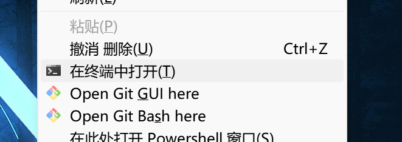
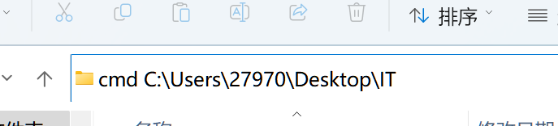
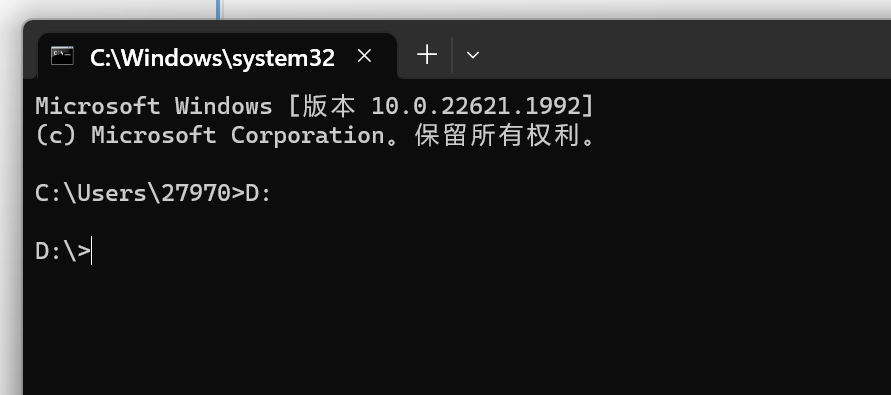
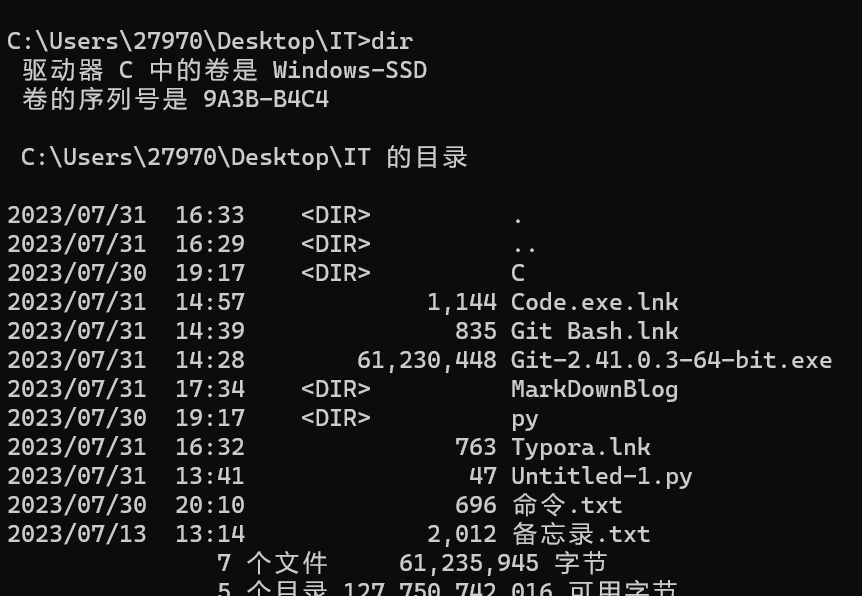
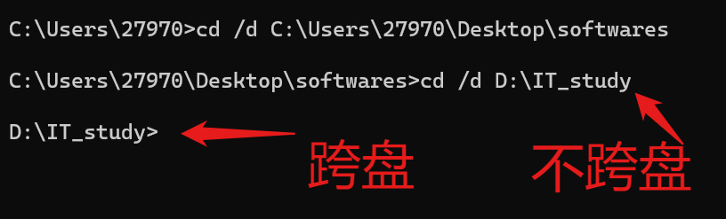
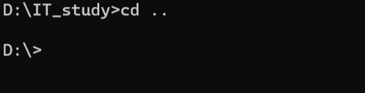
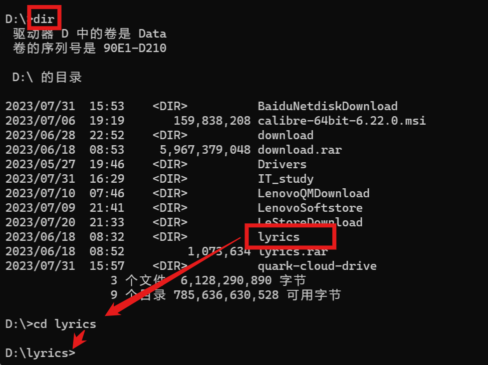

# Dos 命令



## 打开cmd的方式

1. Windows菜单 -> Windows系统 -> 命令提示符

2. Win+R -> 输入“cmd”（**快捷**）

   

3. 在任意文件夹下按住Shift键 -> 按鼠标右键 -> 在此处打开Powershell 窗口（**指向该文件夹**）

   

4. 资源管理器的文件导航中输入：“cmd （*空格*） 需要指向的文件地址”

5. 

### 以管理员方式运行

### 方法

Windows菜单 -> Windows系统 -> 命令提示符（*右键*）-> 更多 -> 以管理员身份运行


### 作用

可以获得命令的最高权限


## 常用的Dos命令

- 注意使用半角字符
- 右键即粘贴，ctrl+v不管用的

### 指向文件切换


```bush
#直接输入盘的位置
D:
```



假设去了一个不存在的盘


```bush
#查看当前目录下的所有文件(directory)
dir
```



```bush
#切换目录(change directory),“/d”是参数，在输入目标路径，*实现跨盘服的切换*
cd /d C:\Users\27970\Desktop\softwares
cd /d D:\IT_study
```



```bush
#返回上一级目录(用的最多)
cd ..
```



```bush
#进入下一级，先用dir看目录
cd 目标文件/文件夹名
```




---

### 清理屏幕与退出


```bush
#清理屏幕（clear screen）
cls
#退出终端
exit
```


### 查看

```bush
#查看电脑IP
ipconfig
```


### 打开（可在指向任意文件下）

```bush
#打开计算器（calculate）
calc
#打开画图工具
mspaint
#新建记事本
notepad
```


### ping命令

```bush
ping www.baidu.com
```


### 文件与文件夹操作

```bush
#创建文件夹（make dirextory）
md 文件名
#创建文件
cd>文件名.后缀
#打开文件（文件夹目录下的）
文件/文件夹名
#删除（delete）文件
del 文件名
#移除目录（remove directory）
rd 文件夹/目录名
```

